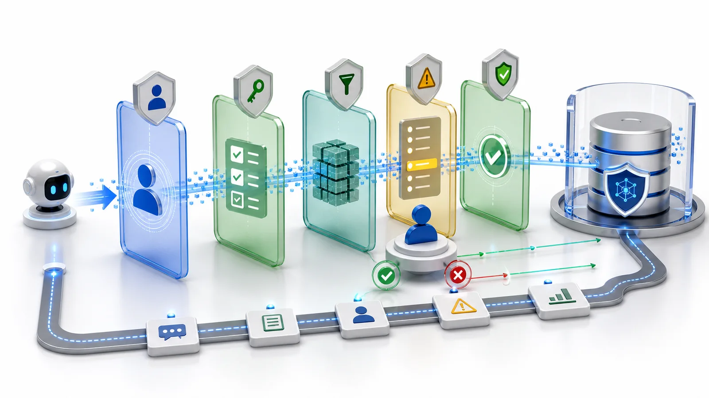

**결론부터 말하면:** 프로덕션에 투입할 수 있는 AI 에이전트는 통제된 사용자처럼 행동해야 한다 — 사용자의 신원을 상속하고, 객체·레코드·필드·작업 단위까지 권한을 적용하며, 실행에 앞서 읽기 전용으로 동작하고, 고위험 작업에는 승인과 롤백을 요구하며, 모든 단계를 기록한다. 통제된 사용자인가, 아니면 그림자 관리자인가.

기업이 AI 에이전트를 검토할 때 보통 첫 질문은 이렇습니다.

> CRM, ERP, 티켓, 계약, 주문 같은 실제 업무 시스템에 연결할 수 있는가?

더 중요한 질문은 이것입니다. 어떤 사용자 신원으로 접근하는가, 무엇을 읽을 수 있는가, 무엇을 바꿀 수 있는가, 문제가 생기면 추적하고 즉시 멈출 수 있는가.

이 답이 없으면 강력한 에이전트는 새로운 보안 사각지대가 됩니다. 여러 시스템의 데이터를 읽고, 도구를 호출하고, 레코드를 수정하면서도 실제 사용자의 직무 권한에는 묶이지 않습니다.

기업용 에이전트의 목적은 AI에 슈퍼 권한을 주는 것이 아니라, 명확한 경계 안에서 사용자를 돕게 하는 것입니다.

## 에이전트는 사용자 신원을 상속해야 합니다

에이전트는 독립적인 만능 계정이나 데이터베이스 관리자 권한으로 실행되어서는 안 됩니다.

로그인한 사용자를 대신해 행동해야 합니다. 영업 담당자가 자신의 고객만 볼 수 있다면 에이전트도 그 고객만 봅니다. 지원 담당자가 자신의 티켓 큐만 처리할 수 있다면 에이전트도 그 큐 안에 있어야 합니다.

이 규칙은 퇴사, 역할 변경, 권한 변경을 에이전트 범위에 즉시 반영하고, 감사 로그를 실제 사용자와 연결합니다.

프롬프트만으로는 충분하지 않습니다. 런타임 권한 시스템이 경계를 강제해야 합니다.

## 권한은 객체, 레코드, 필드, 작업 단위로 필요합니다

“CRM 접근 가능”은 너무 거칩니다.

안전한 에이전트에는 네 가지 경계가 필요합니다.

- 고객, 주문, 티켓, 계약 같은 객체 권한;
- 자신의 고객, 지역 주문, 팀 큐 같은 레코드 권한;
- 계약 금액, 원가, 개인정보, 내부 메모 같은 필드 권한;
- 작업 생성, 상태 변경, 티켓 종료, 견적 발송, 할인 변경, 역할 변경 같은 작업 권한.

많은 AI 프로젝트는 권한 모델이 너무 단순해서 실패합니다. 시스템은 에이전트가 “고객을 조회할 수 있다”는 것만 알고, 모든 고객과 모든 필드와 모든 작업이 허용되는 것은 아니라는 사실을 표현하지 못합니다.

ObjectOS는 업무 객체, 필드, 작업, 권한을 선언형 메타데이터로 설명합니다. 에이전트는 원시 테이블이나 임의 API가 아니라 관리되는 도구를 통해 그 경계 안에서 작동합니다.

## 먼저 읽고, 다음에 제안하고, 마지막에 실행합니다

첫날부터 에이전트가 업무 데이터를 수정하게 하는 것은 보통 좋은 시작점이 아닙니다.

안전한 도입은 세 단계입니다.

**읽기 전용**: SLA 초과 티켓 찾기, 고객 이슈 요약, 지연 위험 주문 목록화. 쓰기는 하지 않습니다.

**제안**: 티켓 승격이나 후속 작업 생성 같은 제안을 만들고 사람이 확인합니다.

**제어된 실행**: 낮은 위험, 명확한 범위, 되돌릴 수 있는 작업만 자동화합니다. 고위험 작업은 승인으로 보냅니다.

이 방식은 기업이 에이전트 범위를 점진적으로 넓힐 수 있게 합니다.

## 위험한 작업에는 승인과 롤백이 필요합니다

삭제, 대량 변경, 금액이나 할인 변경, 외부 메일이나 계약 발송, 역할과 권한 변경, 실제 비용을 발생시키는 외부 서비스 호출은 고위험입니다.

실행 전 시스템은 영향 범위, 이유, 대상 레코드를 보여주고 권한 있는 사람의 승인을 기다려야 합니다.

또한 실행 전후 상태를 기록해야 합니다. 에이전트가 500개 레코드를 바꾸려 하거나 민감 고객을 건드리거나 한도를 넘으면 런타임은 멈추고 사람에게 에스컬레이션해야 합니다.

승인은 AI를 늦추는 장치가 아니라, AI를 운영 환경에 넣기 위한 조건입니다.

## 모든 읽기와 쓰기는 감사 가능해야 합니다

에이전트 활동은 데이터 읽기, 분석, 제안, 도구 호출, 확인 대기, 레코드 변경의 연쇄입니다. 문제가 생겼을 때 “레코드가 바뀌었다”만으로는 부족합니다.

감사는 누가 작업을 시작했는지, 어떤 객체와 레코드를 읽었는지, 어떤 필드가 숨겨졌는지, 어떤 도구를 호출했는지, 무엇을 제안했는지, 누가 승인했는지, 데이터가 어떻게 바뀌었는지를 설명해야 합니다.

감사는 책임 추궁만을 위한 것이 아닙니다. 팀이 에이전트 범위를 안전하게 넓히기 위한 근거입니다.

## 제어된 사용자입니까, 그림자 관리자입니까?

기업용 에이전트 아키텍처는 여섯 질문으로 평가할 수 있습니다.

1. 실제 사용자로 실행되는가?
2. 객체, 레코드, 필드, 작업 권한을 상속하는가?
3. 전체 데이터베이스가 아니라 관리되는 도구로 접근하는가?
4. 읽기, 제안, 실행 단계를 나눌 수 있는가?
5. 위험 작업에 승인, 롤백, 자동 중지가 있는가?
6. 읽기, 제안, 변경이 감사 가능한가?

대부분 아니오라면 기업용 에이전트가 아니라 새로운 보안 사각지대입니다.

## ObjectOS의 관점

ObjectOS는 가치 있는 AI가 업무 시스템 안으로 들어간다는 현실에서 출발합니다.

AI는 고객, 주문, 티켓, 계약, 승인을 읽고 객체 간 관계를 이해하며, 허가된 범위에서 일을 진전시켜야 합니다.

하지만 기업 거버넌스를 우회해서는 안 됩니다.

ObjectOS는 객체, 필드, 워크플로, 권한, 작업을 하나의 메타데이터 계층에 둡니다. 에이전트는 그 계층을 통해 일합니다. AI는 실제 업무에 가까워지지만 모든 단계에는 신원, 경계, 증거가 남습니다.
