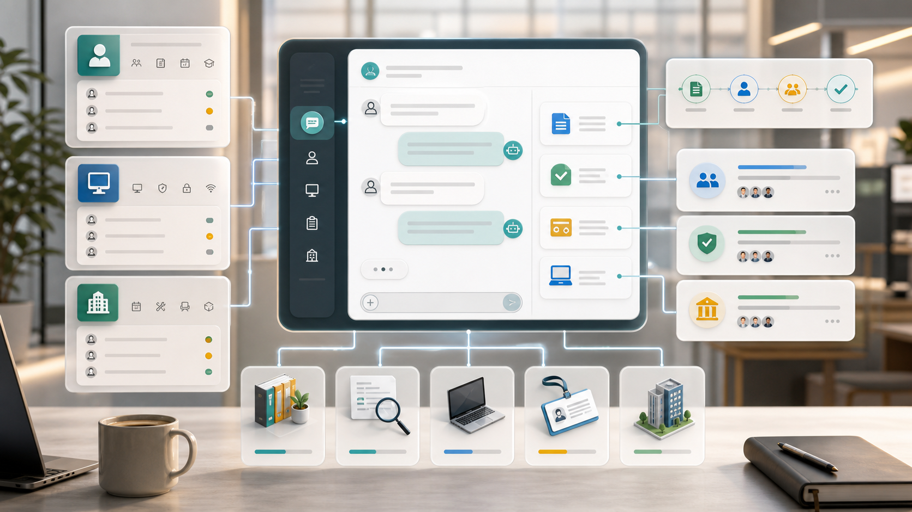

Employees do not think in system categories. They say they need a VPN, a laptop, leave, travel approval, or help with a reimbursement policy. Traditional portals ask them to find the right entry point first.

An AI-native AI enterprise service center starts differently. It treats natural language as both the way the application is built and the way people use it. The builder translates a business request into objects, fields, relationships, views, permissions, workflows, and governed agent tools. The application then lets employees ask questions, update records, generate drafts, and trigger actions in the same language they use at work.

You can start with a request like this:

> Build an AI enterprise service center for HR, IT, admin, and finance services. Employees can ask policy questions, submit requests, and track progress in natural language. AI should identify service type, fill request drafts, create approvals and fulfillment tasks, and respect permissions for access, devices, reimbursements, and employee data.

The point is not that AI produces one screen quickly. The point is that the platform creates a durable business application that can keep changing as the team learns.

## Why This Scenario Is AI-Native

This is not a traditional application with an AI button added later. Employee services is a setting where the work itself contains language, judgment, context, and repeated decisions.

In this scenario, AI matters because:

- employee intent is expressed in natural language;
- service rules depend on role, department, location, and approval authority;
- AI can create requests only through a governed service catalog;

That combination makes the application a good fit for metadata-driven building. The system needs to understand business objects before it can safely generate pages, automation, and agent actions.

## The Metadata the Builder Should Generate

The first output should not be a page mockup. It should be the business model that makes the app runnable. For this AI enterprise service center, the core objects are:

| Object | Purpose |
| --- | --- |
| `service_catalog` | A governed business object used by UI, API, workflows, permissions, and AI tools. |
| `service_request` | A governed business object used by UI, API, workflows, permissions, and AI tools. |
| `knowledge_article` | A governed business object used by UI, API, workflows, permissions, and AI tools. |
| `approval_task` | A governed business object used by UI, API, workflows, permissions, and AI tools. |
| `fulfillment_task` | A governed business object used by UI, API, workflows, permissions, and AI tools. |
| `employee_profile` | A governed business object used by UI, API, workflows, permissions, and AI tools. |

These objects are not just database tables. They define what the AI is allowed to read, what it may suggest, what it can change after confirmation, and what must go through approval. Views, filters, forms, dashboards, and agent tools all come from the same metadata.

## Natural Language Keeps Shaping the App

The first version is never the final version. Business teams should be able to keep changing the application by describing the rule they want, while the platform turns that description into metadata changes.

For example, a shared-services lead might say:

> Production access requests require manager approval, system-owner approval, and a maximum seven-day validity.

The platform should translate that into fields, filters, validation, views, automation, and permissions. Another request might be:

> Office supply requests over 500 require budget-owner confirmation.

Again, the change should not live only in a prompt. It should become part of the application model so UI, API, workflow, and agent behavior stay aligned.

## How People Work Inside the App

The second layer of natural language is the user experience. A employee should be able to ask:

> I just joined. My email, VPN, and finance account do not work. Help me fix this.

A useful answer should not be a generic paragraph. It should use the application model to:

- split the intent into multiple service requests;
- pre-fill employee context and required fields;
- answer policy questions from knowledge articles;
- route approvals and fulfillment tasks to the right teams;

This is where the user experience changes. People do not hunt for fields first. They ask the business question, and the application uses structured metadata to answer, explain, and propose the next action.

## AI Can Execute, But Only Within Boundaries

The more useful the AI becomes, the more explicit the action boundary must be. Some work can be automatic, some should require user confirmation, and high-risk actions must go through approval.

For this AI enterprise service center, low-risk actions can often be automated: summaries, classification, draft generation, internal reminders, candidate risk flags, and reporting. Medium-risk actions should require user confirmation: creating tasks, updating status, routing work, or changing operational records. High-risk actions should require approval: customer-facing commitments, money movement, contract terms, access changes, data export, or audit closure.

That boundary is what makes AI usable in production. The model can reason and suggest, but the runtime decides whether the action is allowed, whether confirmation is required, and how the result is recorded.

## A Practical First Build

A practical first version should be narrow enough to ship and structured enough to grow:

1. build the catalog, knowledge base, requests, approvals, and fulfillment tasks.
2. start with HR, IT, admin, and finance high-volume services.
3. let employees ask in natural language before choosing a form.
4. keep sensitive actions behind permissions and approvals.
5. track status and SLA through the same conversation.

This sequence creates value before full automation. Teams can first validate AI understanding, then add confirmation, then automate the parts that are low-risk and repeatable.

## What ObjectStack Adds

The point is not to hide process. It is to let the system understand the employee first and then execute the right process safely.

ObjectStack is useful here because natural-language building and natural-language operation are backed by the same metadata. Objects define meaning, permissions define access, workflows define execution, and audit records show what AI suggested, what humans confirmed, and what the system finally changed.
