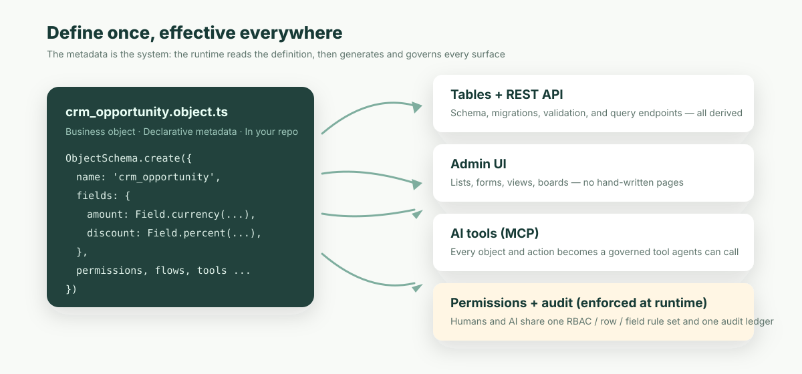

**En resumen:** Palantir demostró que la IA necesita una capa semántica de negocio gobernada para entrar en la empresa, pero esa capa debería ser un protocolo abierto que tú poseas, como Linux, y no quedar encerrada en una plataforma cerrada. Abre la capa de definición; cobra por el runtime.

Empecemos con una historia que probablemente haya visto suceder.

Una empresa lanza un proyecto de «asistente de IA». Primera semana: la demo es deslumbrante. Alguien exporta una copia de los datos de clientes, se la pasa a un modelo, y este realmente puede responder «¿qué cuentas de la región Este tienen riesgo de no renovar?». La dirección lo ve y aprueba de inmediato un piloto más grande.

Mes tres: toca conectar los datos de producción. Entra el equipo de seguridad y hace tres preguntas:

- ¿Qué datos puede ver la IA? Si el comercial A pregunta por el «ranking de rendimiento de toda la empresa», ¿leerá en voz alta las comisiones de los demás?
- Va a ejecutar acciones — cambiar un descuento, enviar un contrato. ¿Con los permisos de quién? Cuando algo salga mal, ¿quién responde?
- Cuando auditoría pregunte «quién aprobó este descuento», ¿dónde está el registro de la parte que hizo la IA?

El equipo del proyecto no tiene respuestas. No por dejadez, sino porque **la arquitectura no contiene ninguna capa capaz de responder esas preguntas**. Los datos están repartidos en una docena de sistemas. Los permisos viven dentro del código de cada aplicación. La regla de «aprobación de descuentos» existe sobre todo en la cabeza de un empleado veterano. La IA está mirando tablas crudas y endpoints crudos, y ninguna inteligencia puede leer las reglas de una empresa de un lugar donde nunca se escribieron.

Mes nueve: el piloto termina en silencio. El modelo no perdió por capacidad. Perdió porque nadie estuvo dispuesto a firmar.

La industria tiene un nombre para lo que faltaba: una **ontología** — una capa semántica estructurada y legible por máquinas que define explícitamente qué objetos de negocio existen, cómo se relacionan, quién puede hacer qué con ellos y dónde queda registrada cada acción.

## Lo que Palantir vio correctamente

La empresa que convirtió la ontología de concepto de investigación en hecho comercial es Palantir. Merece la pena mirar con honestidad por qué tuvo éxito: cuanto más justa la mirada, más afilada la pregunta que viene después.

Palantir Foundry hace dos cosas esenciales. Primero, **integra los datos dispersos de una empresa en una capa de ontología unificada**: clientes, equipos y pedidos dejan de ser docenas de tablas y se convierten en objetos de negocio tipados, con relaciones y propiedades. Segundo, canaliza toda operación de escritura a través de **Actions gobernadas** — cada una validada, con permisos y completamente auditada. A partir de 2023, AIP apuntó esta arquitectura directamente a los grandes modelos de lenguaje: **el LLM nunca toca la base de datos; solo puede invocar herramientas gobernadas expuestas por la capa de ontología.** Los modelos se pueden cambiar. La frontera permanece.

¿Por qué es caro? Porque el problema que resuelve es genuinamente caro. Desenredar veinte años de sistemas heredados acumulados en una ontología limpia exige que los Forward Deployed Engineers de Palantir trabajen sistema por sistema, conciliando conceptos uno a uno: ingeniería intensiva en trabajo humano en el sentido más literal. Sus clientes son gobiernos, defensa, banca y energía, para quienes «cada paso de la IA dentro de los permisos, cada paso registrado» es un requisito duro con presupuesto a la altura. Los contratos empiezan en millones, y los clientes renuevan, porque responde de verdad a las tres preguntas que más le importan a un CISO. Las mismas tres de la historia inicial.

Así que la capitalización de Palantir no demuestra una máquina de ventas. Demuestra un juicio de arquitectura: **para que la IA entre en la empresa, primero tiene que existir una capa semántica de negocio gobernada.** Ese juicio ya no necesita defensa.

Lo que hay que repensar es la siguiente pregunta: ¿qué *forma* debe tener esta capa? Porque algunas cosas están cambiando.

## El software lo escribe cada vez más la IA

El primer cambio es el más visible: las propias aplicaciones las escribe cada vez más la IA.

«Construir un sistema a medida de aprobación de gastos para un equipo de 50 personas» era económicamente absurdo: el coste de desarrollo superaba el dolor. Hoy un agent de IA lo entrega en una tarde. El software de negocio a medida está pasando de bien escaso a producto corriente, y la demanda total va a explotar.

Fíjese en *dónde* explota: en la cola larga. En equipos que jamás aparecerán en la lista de prospectos de ningún proveedor enterprise — sin proceso de compras, sin presupuesto de implantación, sin comités de POC. Simplemente le dicen a un agent «construye algo que funcione» y empiezan a usarlo el mismo día.

Un modelo que funciona con ingenieros desplegados y contratos millonarios no puede llegar estructuralmente a este mercado. No es una crítica; sencillamente son dos mercados distintos. Pero cada sistema de este nuevo mercado **chocará contra las mismas tres preguntas de seguridad del principio** — solo que, cuando ocurra, no habrá ningún ingeniero desplegado al lado.

## El próximo que elige la tecnología es un agent

El segundo cambio es más silencioso pero más profundo: el propio acto de elegir tecnología está pasando de los humanos a la IA.

Pídale hoy a un agent que «construya un sistema de gestión de clientes» y lo más probable es que eche mano de Next.js y Postgres. ¿Por qué? Nadie compró anuncios en su cabeza. Esas tecnologías son **abiertas, están exhaustivamente documentadas y tienen presencia masiva en sus datos de entrenamiento**. El agent ha visto cientos de miles de usos y sabe dónde está cada bache.

Esto crea algo que antes no existía: **para la tecnología orientada a desarrolladores, el texto público del protocolo y el código abierto son ahora el propio canal de distribución.** Cuanto más abierto es un protocolo — cuanto más se discute, cuanto más código hay para aprender —, mejor lo entiende la siguiente generación de modelos y más agents lo eligen por defecto. El bucle se alimenta solo.

Una plataforma cerrada no puede entrar en ese bucle. Su formato de ontología, su semántica de acciones y su modelo de permisos están detrás de muros de documentación y contratos. Los modelos no pueden aprenderlo; los agents no pueden empezar por autoservicio. Puede ser seleccionada por un proceso de compras, pero no puede ser *elegida por un agent*. A medida que más software lo escriben agents, eso deja de ser un problema de marketing. Es **ausencia del canal**.

## Un momento: ¿no han ganado antes las plataformas cerradas?

A estas alturas debería haber surgido una objeción inteligente: lo abierto no siempre gana. La era de la nube la ganó AWS. El móvil lo ganó el iPhone. Ambos cerrados.

La objeción merece una respuesta seria, porque responderla expone el patrón real.

Mire cómo gana dinero AWS: aloja Linux, Kubernetes, Postgres — estándares abiertos de arriba abajo. El iPhone es cerrado, pero cada paquete que envía viaja sobre TCP/IP y HTTP. Vaya más atrás: los proveedores de bases de datos se mataron entre sí mientras SQL, el lenguaje en sí, seguía siendo público; las guerras de orquestación de contenedores terminaron con todos corriendo sobre el mismo formato abierto de imágenes OCI.

El patrón es notablemente consistente: **la «capa de definición» de la que depende todo un ecosistema tiende a acabar abierta — porque nadie se atreve a construir sus activos sobre la gramática de un único proveedor. La «capa de ejecución» puede quedarse cerrada y cobrar — porque ejecutar implica operación continua, rendimiento y responsabilidad, costes reales y recurrentes.** AWS es la mayor prueba de sí mismo: las definiciones pertenecen a la comunidad; ejecutarlas es el negocio.

Una capa semántica de negocio es una capa de definición de manual. De su modelo de objetos, sus reglas de permisos y sus flujos de aprobación dependerán sus aplicaciones, sus agents y sus sistemas de auditoría. Cuantas más cosas dependan de ella, menos debería vivir dentro de la base de datos de la plataforma de un proveedor — y más debería ser archivos en su propio repositorio: legibles, versionados, portables.

Las empresas pasaron veinte años liberando sus **datos** de un sistema cerrado tras otro. No deberían pasar la era de la IA encerrando de nuevo algo aún más fundamental: **la definición del propio negocio**.

## Cómo es esta «definición» en la práctica

Basta de abstracción. Aquí hay un objeto de oportunidad de venta en el protocolo ObjectStack, abreviado de un ejemplo real:

```ts
export const Opportunity = ObjectSchema.create({
  name: 'crm_opportunity',
  label: 'Oportunidad',
  fields: {
    name: Field.text({ label: 'Nombre', required: true }),
    account: Field.lookup('crm_account', { label: 'Cuenta', required: true }),
    amount: Field.currency({ label: 'Importe', min: 0 }),
    probability: Field.percent({ label: 'Probabilidad', defaultValue: 50 }),
    expected_revenue: Field.formula({
      label: 'Ingreso esperado',
      expression: cel`amount * probability / 100`,
    }),
    discount_percent: Field.percent({ label: 'Descuento %', max: 100 }),
  },
});

// Los permisos se declaran igual: ventas puede leer y escribir, nunca borrar
export const SalesUser: Security.PermissionSet = {
  name: 'crm_sales_user',
  objects: {
    crm_opportunity: { allowRead: true, allowCreate: true, allowEdit: true, allowDelete: false },
  },
};
```

La clave no es la sintaxis. La clave es que **estas pocas docenas de líneas son el sistema**. El runtime (ObjectOS) lee esta definición y genera las tablas de la base de datos, la API REST, la interfaz de administración — y las herramientas gobernadas que un agent de IA puede invocar directamente. ¿Los descuentos superiores al 30 % necesitan aprobación de finanzas? Eso es una definición de flujo asociada a este objeto: igual de declarativa, igual de versionada.



De ahí se siguen directamente tres consecuencias:

1. **Las tres preguntas de seguridad del principio obtienen respuestas estructurales.** Qué puede ver la IA — está escrito en el conjunto de permisos. Con qué permisos actúa — actúa como el usuario que ha iniciado sesión, lo aplica el runtime, no se suplica en el prompt. Dónde está el registro de auditoría — humanos y agents escriben en el mismo libro: quién, qué, cuándo, por qué. Cumplimiento lee un solo registro, no dos.
2. **El cambio de negocio se convierte en revisión de código.** ¿La IA quiere añadir un recordatorio de renovación? Lo que envía es un diff de metadatos: qué campos cambian, qué permisos se mueven, todo visible de un vistazo. Y como las definiciones están versionadas, los errores se revierten.
3. **El sistema entero cabe en la ventana de contexto de un agent.** Un módulo enterprise típico se condensa de decenas de miles de líneas de CRUD y pegamento a unos cientos de líneas de declaraciones — lo bastante pequeño para que una IA lea cada dependencia de principio a fin y luego refactorice con seguridad a través de datos, API, interfaz y permisos en un solo cambio. Esa es la línea entre «IA como co-mantenedora» e «IA como autocompletado».

## El protocolo pertenece a la comunidad; el runtime es el negocio

Ahora el argumento se cierra sobre sí mismo.

El juicio de la ontología es correcto — Palantir lo demostró para toda la industria. Pero según el patrón de «definiciones abiertas, runtime de pago», la forma sana de esta capa en la era de la IA es: **el protocolo semántico de negocio pertenece al ecosistema abierto, como Linux — y un runtime gobernado lo ejecuta en su propio entorno.**

Esa es exactamente la división del trabajo entre ObjectStack y ObjectOS:

- **ObjectStack** es el protocolo abierto para describir aplicaciones de negocio (Apache 2.0): objetos, relaciones, permisos, flujos, APIs, interfaz y herramientas de IA, definidos una sola vez. Vive en su repositorio — diffable, portable, legible por cualquier agent — y por tanto vive en la internet pública, dentro de los datos de entrenamiento de todos los modelos futuros.
- **ObjectOS** es el runtime de esas definiciones: lo ejecuta todo en sus servidores, contra su base de datos, aplicando permisos y escribiendo el registro de auditoría en tiempo de ejecución. La gobernanza no está escrita en el prompt; está escrita en el motor de ejecución.

A un lado: un protocolo que cualquier equipo o cualquier agent puede permitirse, entender y llevarse — hoy. Al otro: aquello por lo que las empresas pagan de verdad — hosting, cumplimiento, publicación multi-entorno, alguien que responda de la operación. Las definiciones son suyas. La molestia de ejecutarlas es nuestro negocio.

## Cierre

Aquel piloto de IA que murió en el mes nueve nunca perdió contra la capacidad del modelo. Perdió contra la ausencia de una capa semántica que un equipo de seguridad pudiera firmar. El trabajo de los grandes proveedores ha demostrado cuánto vale esa capa. El siguiente trabajo es conseguir que deje de ser un lujo de las grandes corporaciones.

Si quiere comprobar si algo de esto es real:

```bash
npm i -g @objectstack/cli && os start
```

En cinco minutos, defina su primer objeto de negocio — y vea cómo se convierte en una tabla de base de datos, una API, una interfaz de administración y una herramienta que una IA puede invocar con seguridad. Cada llamada lleva permisos. Cada llamada queda en el libro.
