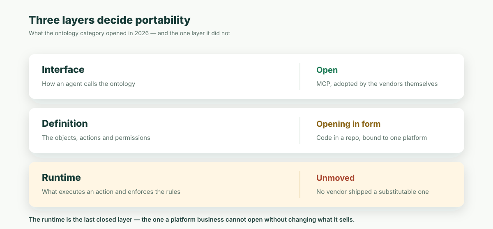

**結論から言うと：** 本記事は 2026 年 6 月に、型付きアプリ定義と、それを実行するランタイムの双方が開かれているべきだと主張しました。その後、業界は自らその一部を手放しています。Palantir の Ontology MCP は 2026 年 6 月 16 日の週に一般提供となり——本記事公開のわずか 4 日後です——ontology のオブジェクトとアクションを、あらゆる agent が開かれたプロトコル経由で呼び出せるようになりました。8 月には、Palantir 自身がオントロジー定義をバージョン管理されたリポジトリへ移し始めています。可搬性を決めるのは 3 つの層——**インターフェース**、**定義**、**ランタイム**——であり、2026 年は 1 つ目を開き、2 つ目を開き始め、3 つ目をそのまま置き去りにしました。ランタイムこそが**最後まで閉じている層**であり、この議論で今なお争う価値があるのはその半分だけです。

まず、あなたもおそらく目撃したことのあるプロセスから始めましょう。

ある企業が「AI アシスタント」プロジェクトを立ち上げます。1 週目、デモは衝撃的でした。顧客データをエクスポートしてモデルに渡すと、「東日本エリアで更新リスクの高い顧客はどこか」に本当に答えられるのです。経営陣はその場でパイロット拡大を決定します。

3 か月目、本番データへの接続が必要になり、セキュリティチームが入ってきて、3 つの質問をします。

- AI はどのデータを見られるのか？営業 A が「全社の業績ランキング」を聞いたら、他人のインセンティブまで答えてしまわないか？
- AI がアクションを実行する——値引きの変更、契約書の送付——のなら、誰の権限で動くのか？問題が起きたら誰の責任か？
- 監査が「この値引きは誰が承認したのか」を調べるとき、AI が関与した部分の記録はどこにあるのか？

プロジェクトチームは答えられません。怠慢ではなく、**アーキテクチャの中に、これらの質問に答えられる層がそもそも存在しない**のです。データは十数個のシステムに散らばり、権限は各アプリのコードの中に書かれ、「値引き承認」のルールはベテラン社員の頭の中にしかない。AI が向き合っているのは生のテーブルと生の API であり、どれほど賢くても、どこにも書かれていない企業のルールを読み取ることはできません。

9 か月目、パイロットは静かに終わります。モデルは能力で負けたのではありません。誰もサインしてくれなかったから負けたのです。

業界には、ここで欠けていたものの名前があります。**Ontology（ビジネスオントロジー）**——どんなビジネスオブジェクトが存在し、互いにどう関係し、誰が何をしてよく、実行されたことがどこに記録されるのかを、構造化された機械可読な形で明示的に定義するセマンティックレイヤーです。

## Palantir が正しかったこと

Ontology を研究上の概念から商業的事実に変えたのは Palantir です。なぜ成功したのかを公平に見ておく価値があります——公平に見るほど、次の問いが鮮明になるからです。

Palantir Foundry の核心は 2 つの動作です。第一に、企業中に散らばったデータを**統一されたオントロジー層に統合する**こと。顧客・設備・注文は何十ものテーブルではなく、型と関係と属性を持つビジネスオブジェクトになります。第二に、すべての書き込み操作を**ガバナンスの効いた Actions に収斂させる**こと。各アクションは検証され、権限が確認され、完全に監査されます。2023 年以降の AIP は、このアーキテクチャを大規模言語モデルに直接向けました。**LLM はデータベースに触れない。オントロジー層が公開するガバナンス済みツールしか呼べない。**モデルは交換可能で、境界は動きません。

なぜ高価なのか？解決している問題が本当に高価だからです。大企業が 20 年かけて溜め込んだレガシーシステムを 1 つのきれいなオントロジーに整理するには、Palantir の常駐エンジニア（Forward Deployed Engineer）がシステムを 1 つずつ紐解き、概念を 1 つずつ突き合わせる必要があります——文字通りの労働集約型エンジニアリングです。顧客は政府、防衛、金融、エネルギー。「AI のすべてのステップが権限の範囲内で、すべて記録される」ことが絶対要件であり、予算もそれに見合う顧客です。契約は数百万ドルからですが、更新され続けます。CISO が最も気にする 3 つの質問——冒頭のあの 3 つ——に本当に答えているからです。

つまり Palantir がはっきり示したのは営業力だけではなく、1 つのアーキテクチャ上の判断です。**AI が企業に入るには、ガバナンスの効いたビジネスセマンティックレイヤーが先に存在しなければならない。**この判断にもう論証は要りません。

考え直すべきは次の問いです。この層は、どんな*形態*で存在すべきか？いくつかのことが変わりつつあるからです。

## ソフトウェアは AI が書くものになりつつある

1 つ目の変化は最も目に見えるものです。アプリケーション自体が、ますます AI によって書かれるようになっています。

「50 人のチームのために経費承認システムをカスタム開発する」は、かつて経済的に成立しませんでした——開発費が痛みを上回るからです。今は AI agent が午後のうちに納品します。カスタム業務ソフトウェアは希少品から日用品になりつつあり、総需要は爆発的に増えます。

その爆発が*どこで*起きるかに注目してください。ロングテールです。どのエンタープライズベンダーの見込み客リストにも決して載らないチーム——調達プロセスも、導入予算も、POC 審査会議もないチーム——で起きます。彼らはただ agent に「動くものを作って」と言い、その日のうちに使い始めます。

常駐エンジニアと数百万ドルの契約で回るモデルは、構造的にこの市場に届きません。批判ではなく、単に 2 つの異なる市場だという話です。しかしこの新しい市場のすべてのシステムが、**冒頭のあの 3 つのセキュリティの質問に同じように衝突します**——ただし衝突したとき、隣に常駐エンジニアはいません。

## 次に技術選定をするのは agent だ

2 つ目の変化はより静かで、より深いものです。技術を選ぶという行為そのものが、人間から AI へ移りつつあります。

今日、agent に「顧客管理システムを作って」と頼めば、高い確率で Next.js と Postgres を選びます。なぜか？誰かが agent の頭の中に広告を出したからではありません。これらの技術が**オープンで、ドキュメントが揃っていて、訓練データの中に大量に存在する**からです。agent は何十万もの使用例を見ており、どこに落とし穴があるかを知っています。

これは以前には存在しなかった事態を生みます。**開発者向け技術にとって、公開されたプロトコルのテキストとオープンソースコードが、流通チャネルそのものになった**のです。プロトコルがオープンであるほど、議論が増え、学べるコードが増え、次世代モデルの理解が深まり、agent はそれをデフォルトで選ぶようになる——自己強化するループです。

閉じたプラットフォームには、そこから抜ける道が二つあります。高くつくほうは、フォーマットそのものを開くこと。モデルが学習し、agent が促されずとも手を伸ばすようになります。安いほうは、フォーマットは閉じたまま**縁の部分だけ開かれたプロトコルを採用する**こと。agent は学習できないままでも、そのプラットフォームを呼び出せるようになります。

本記事は当初、閉じたプラットフォームはこのループに入れない、と書きました。一週間もしないうちに、その言い方は強すぎたことが判明します——既存ベンダーは安いほうの道を選び、そしてそれは機能しました。残るのは、より狭く、より重要な一文です：**agent が呼び出せるインターフェースは、agent が学習できる定義ではない。そしてそのどちらも、持ち運べるランタイムではない。**既存ベンダーがそれに対して何をしたのか、そして何だけをしなかったのかは、以下のとおりです。

## 待って——閉じたプラットフォームが勝った例もあるのでは？

ここまで来ると、賢い反論が出てくるはずです。オープンが常に勝つわけではない。クラウド時代に勝ったのは AWS で、モバイルで勝ったのは iPhone。どちらも閉じている。

この反論は真剣に受け止める価値があります。受け止めきると、本当のパターンが見えてくるからです。

AWS がどうやって稼いでいるかを見てください。ホストしているのは Linux、Kubernetes、Postgres——どこまでもオープンスタンダードです。iPhone は閉じていますが、流れるパケットはすべて TCP/IP と HTTP の上を走ります。さらに遡れば、データベースベンダーは血みどろの競争をしながら、SQL という言語自体は公共のものであり続けました。コンテナオーケストレーション戦争は、全員が同じオープンな OCI イメージフォーマットの上で走る形で終わりました。

パターンは驚くほど一貫しています。**エコシステム全体が依存する可搬な基盤は、定義だけでなく、それを解釈する基礎ランタイムまでオープンになっていきます。** ベンダーはそれでも、ホスティング、アップグレード、セキュリティ、性能、サポート、運用責任という本番運用体験から継続収益を得られます。AWS 自身が最大の証拠です。Linux、Kubernetes、Postgres はオープンなまま、AWS はそれらを確実に運用することに対価を得ています。

ビジネスセマンティックレイヤーはまさにこの基盤です。オブジェクトモデル、権限ルール、承認フロー、そしてそれらを強制するランタイムの意味論は、アプリケーション、agent、監査システムから共同で依存されます。依存が増えるほど、どちらも一社のプラットフォームに閉じるべきではありません。定義は自社リポジトリの読める・バージョン管理できるファイルにし、互換ランタイムはセルフホスト可能で交換可能にする。単一の有償エンジンでしか動かないオープンファイルは、本当には可搬ではありません。

企業は 20 年かけて**データ**を閉じたシステムから解放してきました。AI の時代に、データよりさらに根源的な資産——**ビジネスの定義そのもの**——を、もう一度閉じ込めるべきではありません。

## Ontology MCP はインターフェースを開いた。ランタイムは閉じたままだった

この法則は、ほとんど即座に試されました。そして結果は、当初の予測よりも強い証拠になっています。

本記事の公開から 4 日後、**Palantir の Ontology MCP が Foundry 環境向けに一般提供となりました（2026 年 6 月 16 日の週から）**（[Palantir 公式ドキュメント](https://www.palantir.com/docs/foundry/ontology-mcp/overview)）。オブジェクト型、アクション型、関数が Model Context Protocol のツールへ射影され、MCP 対応の agent であれば、フレームワークごとに接続コードを書かなくても ontology を読み、その業務フローを動かせます。Microsoft も Fabric IQ で同じインターフェースをプレビュー中です。

続く 8 月、Palantir は「オントロジー・アズ・コード」をベータで投入しました。オブジェクト型、リンク、インターフェース、アクションを TypeScript で monorepo に宣言し、そのコード定義こそが唯一の真実の源になります。

この二手を並べて見ると、前節の「基盤はいずれ開かれる」という判断は成り立ちます——ただし、それを書いたときの理由とは別の理由で。基盤は確かに開かれつつある。開かれつつあるのは、**既存ベンダー自身が、自分にとって最も安く済む順序で開いたから**です：

| 層 | それは何か | 2026 年がどこに残したか |
| --- | --- | --- |
| **インターフェース** | agent が ontology をどう呼ぶか | **開かれた。** MCP を、プラットフォーム側が自ら採用 |
| **定義** | オブジェクト、アクション、権限 | **形の上では開きつつある。** コードとしてリポジトリへ。ただし着地先は単一ベンダーの基盤 |
| **ランタイム** | アクションを実行し、規則を強制する層 | **動かず。** よそで走らせられるものを出したベンダーはいない |

3 行目はゆっくり読んでください。議論の全体がそこにあります。

開かれたインターフェースは ontology を**呼び出せる**ものにします。リポジトリに置かれた定義は、それを**読めて、レビューできる**ものにします。しかしそのどちらも、**よそで走らせられる**ものにはしません。定義の可搬性は、システムの可搬性ではありません——オントロジーのコードで満たされた monorepo も、最後は Foundry の環境の上に実体化します。しかもツール面は定義から**射影されたもの**であり、その射影を走らせる側が、ツールが何であるかを決めます。定義ファイルはそれ自体では何も実行しません。

今回の更新が拠って立つ数字はここです。文書化された Palantir の射影規則を中規模のアプリケーションに当てはめると——オブジェクト型 12、アクション型 30、公開関数 6——**開かれたプロトコルを話す 37 個の MCP ツールと、そのどれにも答えられるエンジンがただ 1 台**という姿になります。インターフェースは可搬になりました。依存は 1 ミリも動いていません。



**最も強い反論を、正直に置きます。** チームが可搬性から本当に得たいものの大半は、すでに手に入っています。自分のモデルを読み、diff としてレビューし、どの agent にも向けられる。分析用のセマンティクスなら、2026 年に Apache Incubator へ入った中立仕様で交換もできます。ontology が問いに答えるだけでよいなら、それはもう十分に近い。そこを本記事がごまかすべきではありません。

答えは、そもそも「セマンティックレイヤー」と ontology を分ける線と同じです。それは、何かが実際に**起こらねばならない**瞬間まで成り立ちます。公開されたアクションが実際にレコードを書き換えた瞬間、あなたが本当に気にするもの——権限チェック、トランザクション、閾値を超えたときの承認、監査の 1 行——はすべてエンジンの性質であって、ファイルの性質でも、プロトコルの性質でもありません。文はエクスポートできます。強制はエクスポートできません。

この隙間を**最後まで閉じている層**と呼びましょう。非難ではなく、この分野がどこで止まったかの記述です。9 か月で 3 層のうち 2 層が、しかも多くは自らの勢いで開かれました。3 層目はまったく動かなかった——それは、プラットフォーム事業が「自分が売っているもの」を変えずには開けない、唯一の層だからです。

## この「定義」は実際どんな姿か

抽象論はここまで。ObjectStack の型付きアプリ定義における商談オブジェクトを見てください（実際のサンプルからの抜粋です）。

```ts
export const Opportunity = ObjectSchema.create({
  name: 'crm_opportunity',
  label: '商談',
  fields: {
    name: Field.text({ label: '商談名', required: true }),
    account: Field.lookup('crm_account', { label: '取引先', required: true }),
    amount: Field.currency({ label: '金額', min: 0 }),
    probability: Field.percent({ label: '受注確度', defaultValue: 50 }),
    expected_revenue: Field.formula({
      label: '期待収益',
      expression: cel`amount * probability / 100`,
    }),
    discount_percent: Field.percent({ label: '値引き率', max: 100 }),
  },
});

// 権限も同じく宣言的：営業は読み書きできるが、削除はできない
export const SalesUser: Security.PermissionSet = {
  name: 'crm_sales_user',
  objects: {
    crm_opportunity: { allowRead: true, allowCreate: true, allowEdit: true, allowDelete: false },
  },
};
```

重要なのは構文ではありません。**この数十行がシステムそのものである**ことです。オープンソースの ObjectStack ランタイムがこの定義を読み、データベーステーブル、REST API、管理画面、MCP ツールを導出し、権限と監査を強制します。30% を超える値引きには財務承認が必要？それはこのオブジェクトに紐づくフロー定義であり、同じく宣言的で、同じくバージョン管理されています。ObjectOS は同じアプリの周囲に、ブラウザ内 Build／Ask、チームレビューと承認、マネージドクラウドまたはプライベート展開、SSO、運用、サポートという商用の本番体験を加えますが、定義や実行エンジンを専有依存には戻しません。


ここから 3 つの帰結が直接導かれます。

1. **冒頭の 3 つのセキュリティの質問に、構造的な答えができる。**AI は何を見られるか——権限セットに書いてある。どの権限で動くか——ログインユーザーとして行動し、ObjectStack ランタイムが強制する。プロンプトでお願いするのではない。監査記録はどこか——人間と agent はすべての読み書きを同じ台帳に記録する。誰が、何を、いつ、なぜ。コンプライアンスが見る台帳は 1 冊だけです。
2. **業務変更がコードレビューになる。**AI がシステムに「更新リマインダー」を追加したい？提出されるのはメタデータの diff です。どのフィールドが変わり、どの権限が動いたか、一目で分かります。定義はバージョン管理されているので、間違いはロールバックできます。
3. **システム全体が 1 つの agent のコンテキストウィンドウに収まる。**典型的なエンタープライズモジュールは、数万行の CRUD とグルーコードから数百行の宣言に収斂します——AI がすべての依存関係を端から端まで読み切り、データ・API・画面・権限を横断する安全なリファクタリングを一度の変更でやり切れる大きさです。これが「共同メンテナーとしての AI」と「補完ツールとしての AI」の分水嶺です。

## 定義と可搬なランタイムはコミュニティへ、本番運用はビジネスへ

ここで議論全体が閉じます。

Ontology という判断は正しい——Palantir が業界全体のために証明済みです。本記事を最初に書いた時点では、「定義だけ開き、専有エンジンで課金する」は事前に警告しておく価値のある失敗の形でした。9 か月後、それはもう警告ではありません。自分が売っているもの以外はすべて開いたベンダーたちが、一つひとつ理にかなった判断を重ねて到達した、この分野の着地点の正確な記述です。だからこそ、もう一方の道はむしろ語りやすくなりました。**型付きの業務定義と可搬なガバナンスランタイムをオープンエコシステムに置き、その周囲の本番運用体験を有償にすることです。**

これがまさに ObjectStack と ObjectOS の分業です。

- **ObjectStack** は**オープンなビジネスオントロジー（open business ontology）**です。型付きのアプリ定義と、それを実行するオープンソースランタイム（Apache 2.0）が一体になっています。オブジェクト、関係、権限、フロー、API、UI、AI ツールをリポジトリで一度だけ定義し、ランタイムがデータベース、REST API、画面、MCP サーバーを導出して、すべての呼び出しで権限と監査を強制します。定義もエンジンも diff、セルフホスト、移行が可能です——後者こそ、この分野の他のプレイヤーが閉じたまま残した層です。
- **ObjectOS** は同じ ObjectStack アプリを囲む商用プロダクションプラットフォームです。ブラウザ内 Build／Ask、チームレビューと承認、マネージドクラウドまたはプライベート展開の運用、SSO、企業向け制御、サポートを提供します。Ontology を再び囲い込む閉じた実行エンジンではありません。

片側には、どんなチームや agent でも理解し、セルフホストし、持ち出せるアプリ定義と可搬なランタイム。もう片側には、企業が本当に対価を払う本番体験——共同編集、承認、ホスティング、プライベート展開、SSO、サポート、アップグレード、運用責任があります。アプリと基礎ランタイムはあなたのもの。チームのために確実に運用することがビジネスです。

## おわりに

9 か月目に死んだあの AI パイロットは、モデルの能力に負けたのではありません。セキュリティチームがサインできるセマンティックレイヤーが存在しなかったことに負けたのです。業界で最も高価な会社が、この層の価値を 10 年かけて証明しました。そして 2026 年は、9 か月でもっと狭く、もっと役に立つことを証明しました。**この層のうち、開くのが安く済む部分は、もう開かれた。**インターフェースは公開プロトコルであり、定義はあなたが読めるファイルです。残っているのは、後者を前者に変え、その過程で規則を強制するエンジン——そしてその層では、何も開かれませんでした。

だから 6 月に本記事が投げた問いは、いま、より鋭い形を持っています。「オントロジーは開かれるべきか」ではありません——それはもう決着し、しかもベンダー自身が決着させました。問いはこうです：**最後まで閉じている層が、よりによってあなたの業務規則を実行する層だとして、そのエンジンは誰のものであってほしいですか。**

本当かどうか確かめたければ：

```bash
npm i -g @objectstack/cli && os start
```

5 分後、最初のビジネスオブジェクトを定義してください。オープンな ObjectStack ランタイムがそれをデータベーステーブル、API、管理画面、AI が安全に呼び出せるツールへ変えます。すべての呼び出しが権限を伴い、台帳に記録されます。チームがブラウザ内 Build／Ask、共有レビューと承認、マネージドクラウドまたはプライベート展開、SSO、サポートを必要とするなら、ObjectOS が運用するのは同じ ObjectStack アプリです。専有形式や独占エンジンに置き換えることはありません。
