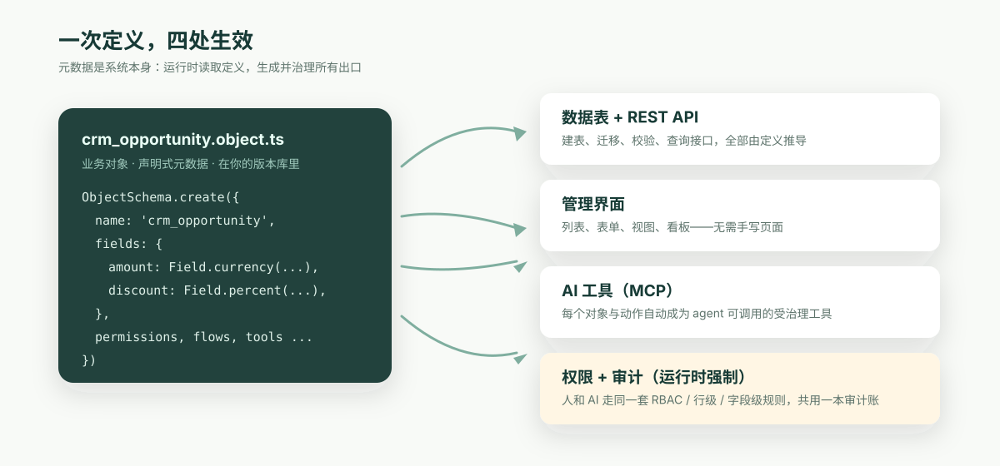

**先给结论**：AI 进企业需要一个受治理的业务语义层；但这一层应该是企业自己拥有的开放类型化应用定义，加上可移植的开源运行时，而不是一份仍只能交给单一厂商引擎执行的“开放文件”。定义与执行底座都开放，收费的是围绕它们的生产运营体验。

先讲一个你大概率亲眼见过的过程。

某家企业立项做“AI 助手”。第一周，演示惊艳：把客户数据导出一份给模型，它真的能回答“华东区哪些客户续约风险高”。高管看完当场拍板扩大试点。

第三个月，要接生产数据了，安全团队进场，问了三个问题：

- AI 能看到哪些数据？销售 A 问“全公司业绩排名”，它会不会把别人的提成也答出来？
- 它要执行动作——改折扣、发合同——权限按什么算？出错了算谁的？
- 审计要查“这笔折扣是谁批的”，AI 参与的那部分，记录在哪？

项目组答不上来。不是态度问题，是**架构里根本没有能回答这些问题的层**。数据散在十几个系统里，权限写在各个应用的代码里，“折扣审批”这个业务规则只存在于某个资深员工的脑子里。AI 面对的是一堆裸表和裸接口，它再聪明，也没有地方去“看懂”这家企业的规则。

第九个月，试点悄悄结束。模型没有输给能力，输给了没有人敢签字。

这件事行业里有一个名字，叫缺一个 **Ontology（业务本体）**：一个结构化、机器可读的语义层，把“这家企业有哪些业务对象、它们之间什么关系、谁能对它们做什么、做了之后记在哪”显式地定义出来。

## Palantir 把这件事做成了可验证的企业架构

把 Ontology 从论文概念变成企业架构实践的代表，是 Palantir。值得认真看一下它为什么成立——看得越公道，后面的问题才越清楚。

Palantir Foundry 的核心动作是两个。第一，把企业散落各处的数据**集成进一个统一的本体层**：客户、设备、订单不再只是几十张表，而是有类型、有关系、有属性的业务对象。第二，把写操作收敛成**受控的 Actions**——每个动作带校验、带权限、带完整审计。AIP 把这套架构直接对准了大模型：**LLM 不直接碰数据库，而是调用本体层暴露出来的受治理工具。** 模型可以换，边界不动。

这套东西为什么贵？因为它解决的问题确实贵。把一家大企业多年积累的系统梳理成一个干净的本体，需要团队一个系统一个系统地啃，一个概念一个概念地对齐——这是实打实的人力密集型工程。政府、国防、金融、能源这类客户，对“AI 每一步都在权限之内、都有记录”的要求是硬性的，也愿意为交付质量、责任边界和长期支持付费。

所以这里真正值得吸取的，不是某家公司的估值故事，而是一个架构判断：**AI 要进入企业，必须先有一个受治理的业务语义层。**

需要重新想的是下一个问题：这一层应该以什么形态存在？因为有几件事正在变。

## 软件正在变成 AI 写的

第一件事最直观：应用本身越来越多是 AI 写出来的。

过去“给 50 人的团队定制一套报销审批系统”在经济上不成立——开发费比痛点贵。现在一个 AI agent 几个小时就能交付一个可用雏形。定制业务软件正在从稀缺品变成更日常的产物，长尾需求会明显增加。

注意这个增长发生在哪：发生在长尾。发生在那些很少出现在企业软件销售名单上的团队里——他们没有采购流程，没有实施预算，不开 POC 评审会。他们只是让 agent “搭一个能用的”，下午就开始用了。

一个靠驻场工程师和百万美元合同运转的模式，结构上够不到这个市场。这不是谁对谁错，是两个市场。但这个新市场里的每一套系统，**同样会撞上开头那三个安全问题**——只是撞上的时候，旁边没有 FDE。

## 下一个做技术选型的，是 agent

第二件事更隐蔽，但影响更深：技术选型这个动作本身，正在从人手里转移到 AI 手里。

今天你让一个 agent “搭一个客户管理系统”，它大概率会选 Next.js 加 Postgres。为什么？不是因为有人给它做了广告，而是因为这些技术**开放、文档完整、大量存在于它的训练数据里**。它见过几十万个用法，知道每个坑怎么绕。

这意味着一件以前不存在的事：**对开发者工具来说，公开的协议文本和开源代码就是分发渠道本身。** 一个协议越开放、越多人讨论、越多代码可学，下一代模型就越懂它，agent 就越倾向于选它——这是一个会自我强化的循环。

封闭平台较难进入这个循环。它的本体定义方式、动作语义、权限模型如果主要留在合同、控制台和私有实现里，模型就学不到足够多的用法，agent 也很难自助起步。它仍然可以被采购流程选中，但更难被一个正在生成应用的 agent 自然选中。当越来越多软件由 agent 来写，这就不只是营销问题，而是**机器可学习性**问题。

## 等等——封闭平台不是也赢过很多次吗？

到这里，一个聪明的反驳应该出现了：开放未必赢。云计算时代赢的是 AWS，移动时代赢的是 iOS，都是封闭的。

这个反例值得认真接，因为接完恰好能看清规律。

看一眼 AWS 是怎么赚钱的：它托管的是 Linux、Kubernetes、Postgres——清一色的开放标准。iPhone 封闭，但它跑的网络是 TCP/IP 和 HTTP。再往前数：数据库厂商杀成红海，SQL 这个语言本身是公共的；容器编排打了三年，最后大家都跑在开放的 OCI 镜像格式上。

规律其实很整齐：**被整个生态依赖的可移植底座最终会走向开放——既包括定义，也包括解释和执行这些定义的基础运行时。** 厂商仍然可以获得持续收入，但卖的是托管运营、升级、安全封装、性能、支持和责任。AWS 自己就是最大的例证：Linux、Kubernetes、Postgres 保持开放，AWS 为可靠运营它们收费。

业务语义层正是这种底座。对象模型、权限规则、审批流程，以及强制执行它们的运行时语义，未来会被应用、agent、审计系统共同依赖。依赖越多，定义与运行时就越不应该只存在于某个供应商的平台里。定义应是你仓库中可读、可版本化的文件，兼容运行时则应可自托管、可替换。只能由一家付费引擎执行的“开放文件”，并不真正可迁移。

企业花了二十年把**数据**从一个个封闭系统里解放出来，不应该在 AI 时代把比数据更核心的资产——**业务的定义本身**——再锁进去一次。

## 这层“定义”长什么样

说了这么多，看一眼实物。下面是 ObjectStack 类型化应用定义里的一个商机对象（节选自真实示例）：

```ts
export const Opportunity = ObjectSchema.create({
  name: 'crm_opportunity',
  label: '商机',
  fields: {
    name: Field.text({ label: '商机名称', required: true }),
    account: Field.lookup('crm_account', { label: '客户', required: true }),
    amount: Field.currency({ label: '金额', min: 0 }),
    probability: Field.percent({ label: '赢单概率', defaultValue: 50 }),
    expected_revenue: Field.formula({
      label: '预期收入',
      expression: cel`amount * probability / 100`,
    }),
    discount_percent: Field.percent({ label: '折扣', max: 100 }),
  },
});

// 权限同样是声明的：销售可读写商机，但不能删除
export const SalesUser: Security.PermissionSet = {
  name: 'crm_sales_user',
  objects: {
    crm_opportunity: { allowRead: true, allowCreate: true, allowEdit: true, allowDelete: false },
  },
};
```

关键不在语法，在于**这几十行就是系统本身**。开源 ObjectStack 运行时读取这份定义，派生数据表、REST API、管理界面、MCP 工具，并强制执行权限与审计。折扣超过 30% 要走财务审批？那是一条挂在这个对象上的流程定义，同样是声明式的，同样在版本库里。ObjectOS 在同一应用外增加商业生产体验——浏览器内 Build 与 Ask、团队审阅和审批、托管云或私有部署运营、SSO 与支持——但不会把定义或执行引擎重新变成专有依赖。



这带来三个直接后果：

1. **开头那三个安全问题，有了结构性的答案。** AI 能看什么——权限集里写着；它执行动作按什么权限算——它以登录用户的身份行动，由 ObjectStack 运行时强制执行，而不是靠提示词约束；审计记录在哪——人和 agent 的每一次读写共用同一本账，谁、什么、何时、为什么，合规团队只看一本。
2. **业务变更变成了代码评审。** AI 要给系统加一个“续约提醒”？它提交的是一份元数据 diff，改了什么字段、动了什么权限，一目了然。出问题可以回滚，因为定义是版本化的。
3. **整个系统装得进一个 agent 的上下文窗口。** 一个典型的企业模块，从几万行 CRUD 和胶水代码收敛成几百行声明——小到 AI 可以完整读懂每一处依赖，然后跨数据、API、界面、权限做一次安全的整体重构。这是“AI 当共同维护者”和“AI 当代码补全”的分界线。

## 定义与可移植运行时归社区，生产运营做生意

现在可以把整个论证收拢了。

Ontology 这个判断是对的，Palantir 已经替行业证明过。但 AI 时代健康的形态不是“定义开放、独家引擎收费”，而是：**类型化业务定义与可移植的治理运行时都属于开放生态；收费产品提供围绕它们的生产运营体验。**

这正是 ObjectStack 和 ObjectOS 的分工：

- **ObjectStack** 是开放、类型化的应用定义与开源运行时（Apache 2.0）。对象、关系、权限、流程、API、UI、AI 工具在你的仓库里一次定义；运行时从中派生数据库、REST API、渲染界面与 MCP 服务，并在每次调用上强制权限与审计。定义和引擎都可 diff、可自托管、可迁移。
- **ObjectOS** 是围绕同一 ObjectStack 应用的商业生产平台。它销售浏览器内 Build 与 Ask、团队审阅和审批、托管云或私有部署运营、SSO、企业控制与支持，而不是一台把业务本体重新锁回厂商手里的封闭执行引擎。

一边是任何团队、任何 agent 都看得懂、可自托管、带得走的应用定义与可移植运行时；另一边是企业真正愿意付费的生产体验：协作编写、审批、托管、私有部署、SSO、支持、升级和运营责任。应用及其基础运行时归你，为团队可靠运营它们才是生意。

## 结语

那个九个月死掉的 AI 试点，死因从来不是模型不够聪明，而是没有一个能让安全团队签字的业务语义层。行业里最贵的公司用十年证明了这一层的价值；接下来的问题，是让它不再是头部企业的奢侈品。

如果你想验证这套东西是不是真的：

```bash
npm i -g @objectstack/cli && os start
```

五分钟后，定义你的第一个业务对象，看开源 ObjectStack 运行时把它变成一张表、一个 API、一个管理界面和一个 AI 可以安全调用的工具。每次调用都带权限，每次调用都记账。如果团队需要浏览器内 Build 与 Ask、共享审阅和审批、托管云或私有部署、SSO 与支持，ObjectOS 运营的仍是同一份 ObjectStack 应用，不会换成专有格式或独家引擎。
