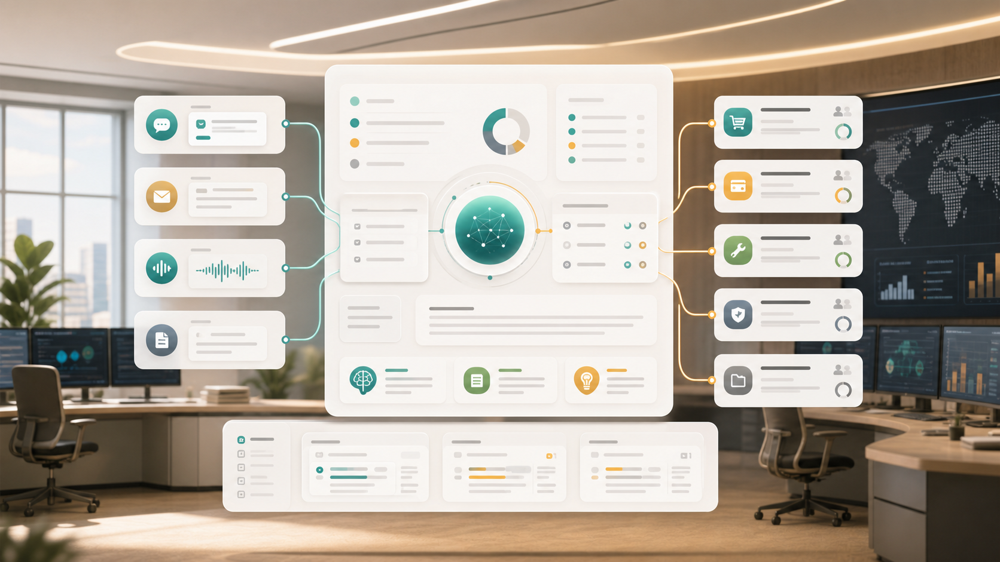

---
# @generated zh-Hant from zh-Hans (s2twp) — edit the zh-Hans file; delete this line to hand-maintain.
title: 讓客服系統自己讀懂客戶問題：搭建一個 AI 工單中樞
description: 客服工單不應該只是把問題排隊。用自然語言生成物件、欄位、佇列、SLA、知識庫和 Agent 工具後，AI 可以在許可權邊界內理解客戶問題、推薦回覆並推動工單流轉。
author: ObjectStack Team
date: 2026-06-05
status: published
topic: app-building
audience: business
solutions:
  - case-management
  - portals
industries: []
cover: ./cover.png
tags:
  - AI工單
  - 客服系統
  - 自然語言搭建
  - 後設資料驅動
---

很多客服系統的問題，不是沒有工單，而是隻有工單。

客戶從線上客服、郵件、微信群、客戶門戶、電話轉寫裡提出問題。系統把它們收進來，生成一條記錄，分配給一個佇列，然後等待人工閱讀、分類、查知識庫、寫回復、判斷是否升級。

這套流程能管理工作量，卻很難理解問題本身。

AI 原生的工單中樞應該反過來設計：先讓系統讀懂客戶問題，再讓工單成為被理解後的業務物件。它不是在傳統工單系統旁邊加一個“AI 總結”按鈕，而是從物件、欄位、檢視、流程、許可權、知識庫和 Agent 工具開始，就把 AI 放進業務執行方式裡。

更關鍵的是，這個應用本身應該能用自然語言搭建。

你不必先畫表、建欄位、寫狀態機，而是對平臺說：

> 幫我搭建一個 AI 客服工單中樞。客戶問題來自郵件、線上客服和客戶門戶；系統要自動識別問題型別、緊急程度和客戶情緒，匹配知識庫，生成回覆建議；企業客戶 2 小時內響應，普通客戶 8 小時內響應，快超時時自動升級給主管；所有 AI 回覆必須由客服確認後傳送。

平臺生成的不是一段孤立程式碼，而是一套可執行、可修改、可審計的應用後設資料。

## 為什麼客服場景天然適合 AI 原生應用

客服工作有幾個特點，正好擊中 AI 的優勢。

第一，輸入高度非結構化。客戶不會按你的欄位說話，他會發一段情緒化的描述、一張截圖、一封長郵件，甚至只說“又壞了”。傳統表單要求客戶先理解系統分類，AI 則可以先理解客戶表達。

第二，判斷依賴上下文。同一句“系統打不開”，對免費試用客戶和年付企業客戶的優先順序不同；對正在上線的客戶和普通諮詢客戶的處理方式也不同。AI 必須結合客戶、合同、歷史工單、SLA 和知識庫一起判斷。

第三，客服動作重複但不能完全自動。分類、摘要、查知識庫、起草回覆可以交給 AI；是否傳送、是否退款、是否承諾交付時間，仍然需要許可權、審批和人工確認。

所以 AI 工單中樞不是“自動聊天機器人”，而是一個能把客戶問題轉成受控業務流程的應用。

## 搭建從一句話開始，但結果必須落到後設資料

自然語言搭建的價值，不是讓 AI 猜一個頁面，而是把業務需求拆成可執行的後設資料。

第一輪生成時，平臺應該至少產出這些物件：

| 物件 | 用來表達什麼 |
| --- | --- |
| `customer` | 客戶、等級、服務計劃、負責人 |
| `case` | 工單主記錄，承載問題、狀態、優先順序、SLA |
| `case_message` | 客戶訊息、客服回覆、內部備註 |
| `knowledge_article` | 知識庫文章、適用產品、版本和置信度 |
| `sla_policy` | 不同客戶等級和問題型別的響應規則 |
| `case_escalation` | 升級記錄、原因、處理人和處理結果 |

同時生成欄位、關係和約束：

- 工單關聯客戶、聯絡人、產品、服務計劃；
- 訊息保留來源渠道、原文、附件和 AI 摘要；
- 問題型別、緊急程度、情緒、語言、影響範圍由 AI 初判，但允許人工改寫；
- SLA 截止時間由客戶等級、問題型別和建立時間自動計算；
- 企業客戶、付款異常客戶、法律風險問題進入更嚴格的許可權和審批。

這就是後設資料驅動和普通 AI 生成頁面的差別。頁面只是入口，真正重要的是業務語義被平臺理解了。

## 應用生成後，繼續用自然語言修改

業務系統從來不是一次性搭完的。客服主管第二天可能會說：

> 給工單增加一個“是否影響上線”的欄位。如果是企業客戶且影響上線，直接進入高優先順序佇列。

平臺應該把這句話轉成三類變更：

- 給 `case` 物件增加布爾欄位 `affects_go_live`；
- 修改優先順序規則：企業客戶且影響上線時預設高優先順序；
- 更新佇列檢視和升級流程，讓這類工單出現在主管看板。

再比如運營團隊說：

> 把退款、賠償、合同承諾這三類回覆設為敏感回覆，必須主管確認後才能傳送。

這不應該只是提示詞變化，而應該落到動作許可權和審批後設資料裡：AI 可以起草敏感回覆，但傳送動作必須走審批；審批前，客戶不可見；審批後，動作和批准人進入審計日誌。

好的 AI Builder 應該像一個懂平臺的應用架構師：它接受自然語言，但輸出的是物件、許可權、檢視、流程、校驗和 Agent 工具。

## 客服使用應用時，也應該是對話式的

AI 原生應用的第二層語言互動，是業務使用者直接用自然語言工作。

客服開啟工單，不應該只看到欄位，而應該能問：

> 這個客戶到底遇到了什麼問題？之前有沒有類似工單？

AI 可以基於當前工單、歷史訊息、知識庫和客戶上下文回答：

- 客戶本次反饋集中在登入失敗；
- 過去 30 天同一客戶出現過 2 次 SSO 配置問題；
- 最近一次解決方案是重新同步身份提供商證書；
- 當前截圖和知識庫中的“證書過期”案例相似；
- 建議先讓客戶確認 IdP 證書有效期，並提供一段回覆草稿。

主管也可以問：

> 今天有哪些快超時的企業客戶工單？按風險從高到低列出來。

系統不只是查表，而是結合 SLA、客戶等級、情緒、歷史投訴、當前處理人負載，生成一個可行動的佇列。

這時應用的核心體驗已經從“人找欄位”變成“人和業務上下文對話”。

## AI 參與業務執行，但不能繞過邊界

客服場景裡，AI 可以做很多事：

- 自動識別語言、產品、問題型別和緊急程度；
- 抽取客戶環境、版本號、錯誤碼和影響範圍；
- 匹配知識庫文章，給出引用依據；
- 生成內部摘要和客戶回覆草稿；
- 建議升級、轉派或合併重複工單；
- 發現情緒風險和合規風險；
- 自動建立待辦、提醒和覆盤記錄。

但這些能力必須被放進受控動作裡。

例如“傳送客戶回覆”應該是一個動作，不是模型自由輸出後直接發郵件。動作需要檢查：

1. 當前使用者是否有許可權回覆該客戶；
2. 回覆是否包含敏感承諾、賠償、價格或合同內容；
3. AI 生成內容是否引用了可公開給客戶的知識；
4. 是否需要主管審批；
5. 傳送後是否寫入訊息記錄和審計日誌。

AI 的能力越強，越需要把動作邊界設計清楚。否則工單中樞會變成一個很會說話、但不受控的入口。

## 一個可落地的搭建順序

如果要快速搭建第一版 AI 工單中樞，不建議一開始追求全自動客服。更穩的順序是：

第一步，接入渠道和工單物件。把郵件、門戶、線上客服訊息統一進入 `case` 和 `case_message`。

第二步，開放只讀 AI 理解。讓 AI 自動摘要、分類、識別情緒和推薦知識庫，但不自動回覆客戶。

第三步，引入客服確認。AI 生成回覆草稿，客服編輯後傳送，系統記錄 AI 參與痕跡。

第四步，配置 SLA 和升級。企業客戶、緊急問題、負面情緒和快超時工單自動進入主管佇列。

第五步，逐步自動化低風險動作。比如自動合併重複工單、自動建立內部待辦、自動提醒處理人。

這條路徑的好處是，每一步都有業務價值，也都有治理邊界。

## ObjectStack 適合搭這類應用的原因

AI 工單中樞表面上是客服應用，底層其實是一個典型的後設資料驅動系統。

它需要物件模型、關係、欄位、許可權、檢視、流程、動作、知識庫、Agent 工具和審計一起工作。任何一層缺失，AI 都很容易停留在外圍。

ObjectStack 的價值在於：業務人員可以用自然語言描述應用，平臺把需求轉成後設資料；應用執行時再用同一套後設資料驅動 UI、API、許可權、自動化和 Agent。

這樣 AI 不是繞過客服系統，而是在客服系統的業務語義和許可權邊界內工作。

真正的 AI 工單中樞，不只是讓客服少寫幾句話。它讓系統第一次有能力持續讀懂客戶問題，並把理解結果變成可追蹤、可審批、可覆盤的業務動作。
