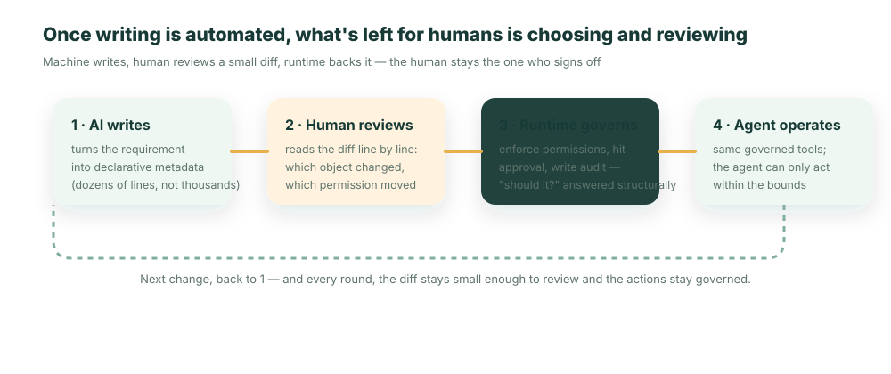

**Vorab das Fazit**: Wenn KI jeden beliebigen Code schreiben kann, ist „schnell sein" kein Vorteil mehr – das kann jeder. Wirklich knapp ist nur eines: ob du dich traust, **diesen Merge-Button zu drücken**. Und ob du dich traust, hängt davon ab, ob das, was die KI dir übergibt, etwas ist, das du prüfen, governen und verantworten kannst.

Schauen wir uns ein Szenario an, das längst täglich passiert.

Eine Entwicklerin bittet ihren Coding-Agent: „Bau mir eine kleine App für Kunden-Rückerstattungen." Eine halbe Stunde später steht eine lauffähige App da: Frontend, Endpunkte, Datenbankmigrationen, Tests – alles vorhanden, CI komplett grün. Sie öffnet den PR und sieht eine Zeile: **`+8.142 −0`**.

Und dann hängt sie fest.

Diese achttausend Zeilen hat nicht sie geschrieben, sie hat keine einzige davon gelesen. In welcher Datei sitzt die Obergrenzen-Prüfung für den Rückerstattungsbetrag? Gibt dieser Endpunkt womöglich auch die Rückerstattungen anderer Leute zurück? Wenn sie ihn ändert – wirkt sich das dann bis in die Kontenabstimmung aus? Sie weiß es nicht – weil es niemand weiß. Grünes CI beweist nur, dass „der Code in sich stimmig läuft", nicht, dass „er das Richtige tut und nur das tut, was erlaubt ist".

Sie hat zwei Optionen, und beide sind schlecht: Entweder beißt sie die Zähne zusammen, tut so, als hätte sie geprüft, und klickt auf Merge – und stellt damit eine Blackbox in Produktion, die niemand versteht. Oder sie liest diese achttausend Zeilen tatsächlich Zeile für Zeile durch – dann hätte sie sie auch gleich selbst schreiben können. Genau das ist der wirklich neue Engpass im KI-Zeitalter: **nicht das Coden, sondern das Mergen.**

## Code zu schreiben wurde zur Massenware, „Vertrauen" nicht

In den letzten zehn Jahren war die knappe Fähigkeit eines Entwicklers: „Ich kriege es hingeschrieben." Diese Fähigkeit ebnet die KI gerade rasant und gründlich ein. Wenn die Grenzkosten, eine App zu erzeugen, gegen null gehen, ist „schnell" niemandes Burggraben mehr – der Agent deiner Konkurrenz ist genauso schnell.

Nach vorne gerückt wird damit etwas anderes, das immer schon da war, bisher aber von den Kosten des Codeschreibens verdeckt wurde: **Irgendjemand muss für diesen Code geradestehen.** Irgendjemand muss beantworten können: „Welche Daten hat er gelesen, welche Aktionen darf er ausführen, wer haftet bei einem Fehler, lässt sich das im Audit nachvollziehen?" Nachdem die KI die Kosten des „Schreibens" auf null gedrückt hat, wird das „Prüfen und Governen" zum teuersten und entscheidendsten Abschnitt des gesamten Ablaufs. **Prüfbarkeit ist der neue Burggraben im Zeitalter der KI-generierten Software** – es geht nicht darum, wer am meisten generiert, sondern darum, wessen generierter Output es sich traut, live zu gehen.

Genau das ist die Kehrseite derselben Sache, die schon [Vibe-Coding-Schulden](/de/blog/vibe-coding-technical-debt-2026/) und [Warum AI-Agent-Piloten vor der Produktion scheitern](/de/blog/why-ai-agent-pilots-fail-four-layers/) beschrieben haben: Vibe Coding lässt jeden Apps generieren, aber wenn sie fertig sind, traut sich niemand, sie live zu schalten – weil niemand sie prüfen und niemand für sie bürgen kann. Der einzige Unterschied: Jene beiden Artikel betrachten es aus der Sicht von Unternehmen und Entscheidern, dieser hier aus deiner Sicht – der Person, deren Finger über dem Merge-Button schwebt.

## Warum „lass eine andere KI prüfen" den Kreis nicht schließt

Der naheliegendste Einwand: Wenn KI schreiben kann, dann lass doch einfach eine KI reviewen? Code-Review-Agents, automatische Security-Scans – das gibt es heute alles.

Dieser Weg fängt einen Teil ab, aber er schließt nicht den einen wirklich brisanten Kreis.

Zurück zu jenem `GET /api/refunds`. Es gibt die Rückerstattungen aller Leute zurück – und kommt dennoch durch fast jede automatische Prüfung: keine Syntaxfehler, keine Null-Pointer, Tests vorhanden (die Tests hat derselbe Agent geschrieben, naturgemäß testet er nur „Rückerstattung lässt sich abrufen", nicht „darf man die Rückerstattungen anderer überhaupt abrufen"). Worin KI-Reviews glänzen, ist die Frage, ob **der Code in sich stimmig** ist: keine Bugs, keine bekannten Schwachstellenmuster, einheitlicher Stil. Drei Fragen **außerhalb des Codes** können sie nicht beantworten: **Darf** dieser Code diese Tabelle überhaupt lesen? **Darf** diese Aktion dieses Geld überhaupt bewegen? Ist das die Geschäftsregel, die wir **wollen**?

Diese Antworten stehen nicht im Code – sie stecken im Berechtigungsmodell, in den Freigabe-Policies, in der fachlichen Absicht. **Zwei KIs, die sich gegenseitig zunicken, sind keine Governance.** Diese eine Antwort, die Auditoren, Juristen und Security-Teams verlangen – „wer hat autorisiert, wer haftet" –, kann auch ein noch so kluges Review-Modell nicht unterschreiben. „KI prüft KI" spart also die Kraft, die ein Mensch fürs Codelesen aufwenden müsste, aber es spart nicht das **„Darf-man-das"-Urteil, das zwingend ein Mensch fällen muss**. Damit dreht sich das Problem zurück zum Anfang: Der Mensch muss prüfen können. Aber achttausend Zeilen kann ein Mensch nicht durcharbeiten.

## Der Ausweg: Das, was die KI dir übergibt, so klein machen, dass du es prüfen kannst

Dass du achttausend Zeilen nicht durcharbeiten kannst und dass dieses System in einem halben Jahr verrottet, haben **dieselbe Ursache** – niemand versteht diesen Klumpen Implementierung wirklich (genau das sind die „Verständnisschulden" aus [jenem Artikel](/de/blog/vibe-coding-technical-debt-2026/)).

Also tauschen wir die **Form** dessen aus, was die KI liefert: Sie soll keine Implementierung generieren, sondern eine **Deklaration**. Bei derselben Rückerstattungs-App sollte die KI dir keine achttausend Zeilen Code übergeben, sondern einen Metadaten-Diff wie diesen:

```diff
+ object: support_refund
+   amount: currency (min 0)
+ permission: support_agent
-   allowDelete: true        # die erste Agent-Fassung hat zu viel gewährt
+   allowDelete: false       # beim Review zurückgenommen: Support darf Rückerstattungen nicht löschen
+ flow: refund_amount > 500 → erfordert Finanz-Freigabe
```

Diese gut ein Dutzend Zeilen kannst du Zeile für Zeile verstehen, in fünf Minuten reviewen und mit einem Klick zurückrollen. Entscheidender noch sind die letzten paar Stellen: Das Review ist nicht länger „schaffe ich es, das zu Ende zu lesen", sondern wird zu **„stimmt diese Berechtigung, ist dieser Freigabe-Schwellenwert sinnvoll"** – eine fachliche Frage, die du wirklich beurteilen kannst und auch beurteilen solltest. Jenes lecke `GET /api/refunds` taucht hier gar nicht erst auf: Die Leseberechtigung von `support_refund` ist als „gemäß den Rechten des Aufrufers" deklariert, die Runtime erzwingt das entsprechend, und der Pfad zur Rechteüberschreitung ist von der Quelle her geschlossen.

Und wo ist die Implementierung geblieben? Die Implementierung gehört zur immer wieder auditierten, offenen **ObjectStack Runtime**, die alle Apps gemeinsam nutzen – sie wird nicht für jede App neu generiert. Das „Darf-man-das" – darf gelesen, darf gelöscht, ist eine Freigabe nötig – erzwingt die Runtime zur Ausführungszeit und nicht irgendwo in achttausend Zeilen vergraben auf gut Glück.

## Ein Kreislauf, der sich wirklich schließt

Zeichnet man das Ganze als Ablauf, ergibt sich ein Kreislauf, in dem der Mensch durchgängig anwesend ist, aber nicht von der Codemenge überrollt wird:



Achte auf Schritt ④: Weil die fachliche Definition selbst bereits Objekte und Berechtigungen deklariert, projiziert die Runtime sie auf eine Reihe **governter Werkzeuge** – und so hat derselbe Agent diese App nicht nur „geschrieben", sondern kann sie anschließend auch **innerhalb derselben Berechtigungsgrenzen** bedienen (Rückerstattungen abfragen, Rückerstattungen auslösen), jeder Schritt mit Identität versehen und protokolliert. Schreiben und Nutzen teilen sich dieselbe Governance.

## Erst mal ein Eimer kaltes Wasser

Dieser Ansatz hat Grenzen, und die müssen klar benannt werden.

Erstens: **Nicht alles lässt sich in Metadaten verwandeln.** Ein brandneuer Echtzeit-Algorithmus, eine einzigartige Rendering-Pipeline – das braucht weiterhin echten Code, und es braucht weiterhin jemanden, der die Zähne zusammenbeißt und genau diesen Teil reviewt. Metadaten helfen dir da nicht, und sie mit Gewalt überzustülpen richtet eher Schaden an. Wozu sie taugen, sind jene 90 % im Unternehmen immer wieder neu gebauter Business-Systeme.

Zweitens: **Vertrauen wird verschoben, nicht ausgelöscht.** Du reviewst nicht mehr die Implementierung jeder einzelnen App, aber du setzt dein Vertrauen auf jene Runtime – und die muss einmal gründlich geprüft und dauerhaft gepflegt werden. Aber rechne mal nach: Beim klassischen Vorgehen musst du jedes Mal, wenn die KI eine App generiert, einem neuen Klumpen Code aufs Neue vertrauen; beim Metadaten-Vorgehen **prüfst du die Runtime einmal**, und danach erbt jede daraus abgeleitete App automatisch dieselben verifizierten Berechtigungen und dasselbe Audit. **Einmal prüfen schlägt tausendmal prüfen.** Das ist ein deutlich besserer Handel – aber es ist ein Handel, keine Magie.

## Schlusswort

Dass KI Code schreiben kann, macht Entwickler nicht arbeitslos, aber es **verschiebt den Posten, den ein Entwickler am dringendsten hüten muss**: von „kann ich es hinschreiben" zu „traue ich mich, für das geradezustehen, was die KI hingeschrieben hat".

Und ob du dich traust zu unterschreiben, hängt fast vollständig davon ab, was die KI dir vorgelegt hat – achttausend Zeilen Implementierung, die du nicht zu Ende liest, oder ein paar Dutzend Zeilen Deklaration, die du prüfen und die Runtime governen kann. **Lass deinen Agent nicht einen Haufen Code schreiben – lass ihn ein Ziel generieren, das du prüfen kannst und das die Runtime trägt.**

```bash
npm i -g @objectstack/cli && os start
```

Gib deinem Coding-Agent ein deklaratives, governbares Ziel vor statt eines bloßen „Bau mir mal ein CRUD" – und schau dann, ob der Diff des nächsten PRs endlich klein genug ist, dass du dich traust, auf Merge zu klicken.
