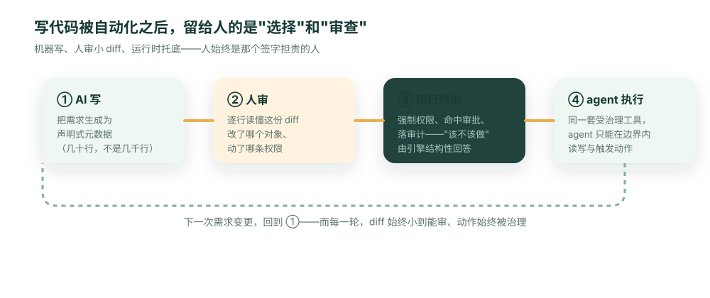

**先给结论**：当 AI 能写出任何代码，"写得快"就不再是优势——人人都有。真正稀缺的，是你**敢不敢点下那个 Merge 按钮**。而你敢不敢，取决于 AI 交给你的东西，是不是你能审、能治、能担责的。

先看一个已经天天在发生的场景。

一位工程师让编码 agent "搭一个客服退款的小应用"。半小时后，一个能跑的应用出现了：前端、接口、数据库迁移、测试，一应俱全，CI 全绿。她打开 PR，看到一行字：**`+8,142 −0`**。

然后她卡住了。

这八千行不是她写的，她一行都没读过。退款金额的上限校验在哪个文件？这个接口会不会把别人的退款记录也返回？改了它会不会连带影响对账？她不知道——因为没人知道。CI 绿，只证明"代码自洽地跑起来了"，不证明"它做的是对的事、且只做了被允许的事"。

她有两个选择，而且都很糟：要么硬着头皮假装审过、点下 Merge——把一个没人理解的黑箱放进生产；要么真的去逐行读这八千行——那她还不如自己写。这就是 AI 时代真正的新瓶颈：**不是写代码，是点 Merge。**

## 写代码被商品化了，"信任"没有

过去十年，工程师的稀缺能力是"能把它写出来"。这个能力正在被 AI 迅速、彻底地抹平。当生成一个应用的边际成本趋近于零，"快"就不再是任何人的护城河——你的竞争对手的 agent 也一样快。

被推到前台的，是另一件一直都在、但以前被写代码的成本掩盖的事：**有人得为这段代码负责。** 得有人能回答"它读了哪些数据、能做哪些动作、出错算谁的、审计查得到吗"。在 AI 把"写"的成本砍到零之后，"审与治"就成了整个流程里最贵、也最关键的一段。**可审查性，是 AI 写代码时代的新护城河**——不是谁生成得多，而是谁生成的东西敢上线。

这正是 [2026 技术债之年](/zh-Hans/blog/vibe-coding-technical-debt-2026/) 和 [88% 试点失败](/zh-Hans/blog/why-ai-agent-pilots-fail-four-layers/) 两篇讲过的同一件事的另一面：vibe coding 让人人都能生成应用，但生成完没人敢上线——因为没人能审、没人能担保。区别只在于，那两篇是从企业和决策者视角看，这篇是从你——那个手指悬在 Merge 按钮上的人——的视角看。

## "让另一个 AI 去审"为什么闭不了环

最自然的反驳是：既然 AI 能写，那让 AI 来 review 不就行了？代码评审 agent、自动安全扫描，现在都有。

这条路能挡住一部分，但闭不了那个真正要命的环。

回到那个 `GET /api/refunds`。它返回了所有人的退款记录——可它能通过几乎所有自动检查：语法没错、没有空指针、有测试（测试也是同一个 agent 写的，自然只测了"能查到退款"，不会去测"该不该查到别人的退款"）。AI 评审擅长的是**代码对不对它自己**：有没有 bug、符不符合已知漏洞模式、风格一不一致。它回答不了三个**代码之外**的问题：这段代码**该不该**读这张表？这个动作**该不该**动这笔钱？这是不是我们**想要**的业务规则？

这些答案不在代码里——它们在权限模型、在审批策略、在业务意图里。**两个 AI 互相点头，不等于治理。** 审计员、法务、安全团队要的那个"谁授权、谁担责"的答案，一个再聪明的评审模型也签不了字。所以"让 AI 审 AI"省掉的是人读代码的体力，省不掉那个**必须由人来做的"该不该"判断**。问题绕回原点：人得能审。可八千行，人审不动。

## 出路：把 AI 要交给你的东西，缩小到你审得动

你审不动八千行，和这套系统半年后会烂掉，是**同一个原因**——没人真正理解那一坨实现（这就是[那篇](/zh-Hans/blog/vibe-coding-technical-debt-2026/)讲的"理解债"）。

那就换掉 AI 交付的**形态**：不让它生成实现，让它生成**声明**。同一个退款应用，AI 该交给你的不是八千行代码，而是这样一份元数据 diff：

```diff
+ object: support_refund
+   amount: currency (min 0)
+ permission: support_agent
-   allowDelete: true        # agent 生成的初版给多了
+   allowDelete: false       # 审查时收回：客服不能删退款
+ flow: refund_amount > 500 → 需财务审批
```

这十几行，你能逐行读懂、能在五分钟内评审、能一键回滚。更关键的是最后那几处：审查不再是"我读得完吗"，而变成了**"这条权限对不对、这个审批阈值合不合理"**——一个你真正能判断、也该由你判断的业务问题。那个会泄露的 `GET /api/refunds` 在这里压根不会出现：`support_refund` 的读取权限被声明为"按调用者权限"，运行时据此强制，越权那条路从源头就被关上了。

而实现去哪了？实现属于一个被反复审计、所有应用共用的**运行时**（ObjectOS），不是每个应用各生成一份。"该不该做"——能不能读、能不能删、要不要审批——由运行时在执行时强制，而不是埋在八千行里靠运气。

## 一个能真正闭合的循环

把这件事画成流程，就是一个人始终在场、但不被代码量淹没的闭环：



注意第④步：因为业务定义本身就声明了对象与权限，运行时会把它投影成一组**受治理的工具**——于是同一个 agent 不只"写"了这个应用，之后还能在**同样的权限边界内**去操作它（查退款、发起退款），每一步都带身份、都留痕。写和用，共用一套治理。

## 先泼一盆冷水

这套打法有边界，得说清楚。

第一，**不是所有东西都能变成元数据**。一个全新的实时算法、一套独特的渲染管线，仍然需要真正的代码，也仍然需要有人硬着头皮 review 那部分——元数据帮不了你，硬套反而误事。它擅长的是企业里那 90% 反复重建的业务系统。

第二，**信任被转移了，不是被消灭了**。你不再逐个 review 每个应用的实现，但你把信任押在了那个运行时上——它得被认真审一次、被持续维护。但算一下这笔账：传统做法下，AI 每生成一个应用，你就得重新信任一坨新代码；元数据做法下，你**审一次运行时**，之后它派生出的每个应用都自动继承同一套被验证过的权限与审计。**审一次，胜过审一千次。** 这是个划算得多的交易，但它是一笔交易，不是魔法。

## 结语

AI 会写代码这件事，不会让工程师失业，但会**改变工程师最该把守的关口**：从"我能不能写出来"，变成"我敢不敢为 AI 写出来的东西签字"。

而你敢不敢签字，几乎完全取决于 AI 把什么放到了你面前——是八千行你读不完的实现，还是几十行你能审、运行时能治的声明。**别让你的 agent 去写一堆代码，让它去生成一个你审得动、运行时托得住的目标。**

```bash
npm i -g @objectstack/cli && os start
```

给你的编码 agent 指一个声明式、可治理的目标，而不是一句"帮我写个 CRUD"——然后看看下一个 PR 的 diff，是不是终于小到你敢点 Merge。
