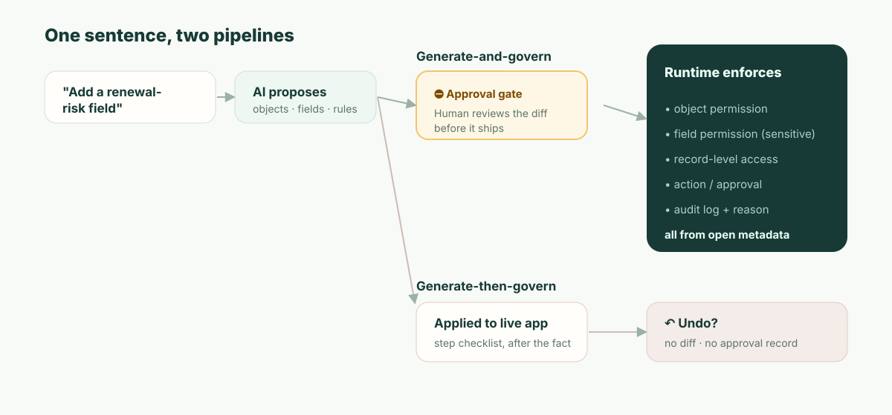

**TL;DR:** AI 네이티브 플랫폼으로서 Airtable의 재출시는 진짜다. Omni는 일회용 코드가 아니라 운영에서 검증된 컴포넌트로 앱을 조립한다. 격차는 역량이 아니라 통제다. Omni는 운영 앱에 대한 변경을 *실행 취소 버튼*과 *탐지적(detective)* 감사 로그로 배포한다(통제가 바뀌었다는 사실을 바뀐 *뒤에* 알게 된다). 반면 규제 대상 기록 시스템에는 *예방적(preventive)* 통제가 필요하다. 즉 배포되기 *전에* 승인되는 검토된 diff, 그리고 뷰가 아니라 객체·필드·액션에 대해 런타임이 강제하는 권한이다. 여기에 배포 위치와 데이터 주권 요건을 더하면, 기록 시스템으로서의 평가는 기능 비교만으로 끝나지 않는다.

어느 화요일에서 시작하자. 데모가 아니라 바로 여기서 실제로 발목을 잡기 때문이다.

레비뉴 옵스 매니저가 Omni를 열고 입력한다. *"Customers에 갱신 위험 필드를 추가하고, 고위험 계정을 보드에 올리고, 매주 월요일에 CSM에게 리마인드해 줘."* Omni는 그것을 멋지게 해낸다. 필드가 나타나고, 보드가 렌더링되고, 자동화가 실행된다. "위험"을 계산하기 위해 Omni는 해당 계정의 ARR을 가져온다. 그리고 갱신을 챙기는 사람들에게 보드를 유용하게 만들기 위해, 새 필드를 **CSM 역할**이 볼 수 있는 뷰에 노출한다. 모두가 만족한다. 매니저는 화면을 닫고 다음 일로 넘어간다.

6주 뒤, 보안팀과 함께 앉은 SOC 2 감사인이 단 하나를 묻는다. *"고객 ARR은 기밀입니다. 이 뷰는 ARR에서 파생된 필드를 CSM 역할에 노출합니다. 누가, 언제 그것을 승인했습니까?"*

그리고 솔직한 답은 이렇다. 아무도 승인하지 않았다. 애초에 승인 단계가 없었기 때문이다. AI가 어느 화요일에 접근 제어 결정을 내렸고, 그것은 즉시 운영에 반영되었으며, 무언가 일어났다는 주된 기록은 사후 활동 항목뿐이다 — 누군가 들여다볼 생각을 한다면 말이다. 이것이 이 글의 전부다. 아래의 모든 내용은, 왜 이 격차가 구조적인 것이며 단순한 체크박스 하나의 문제가 아닌지를 설명한다.

## 당신의 감사인이 이미 쓰는 구분: 예방적 vs 탐지적

먼저 Airtable에 정확하게 정당한 평가를 주자. 여기서 막연한 비판은 무가치하기 때문이다. Omni는 정말로 바이브 코딩이 아니다. CEO Howie Liu의 "운영에서 검증된 컴포넌트 부품함에서 조립한다"는 표현은 옳은 아키텍처이며, 프롬프트마다 깨지기 쉬운 코드를 재생성하는 방식을 능가한다. Airtable Enterprise에는 진짜 통제가 있다. Enterprise Hub, 감사 로그, 조직 단위 역할과 슈퍼 관리자 역할, EKM/DLP, 필드와 레코드 수준의 권한 통제 같은 것들이다. 진지한 Airtable 관리자는 "거버넌스가 없다"는 게으른 주장을 읽으면 당신을 더 이상 신뢰하지 않는다. 그러니 그건 쓰지 말자.

대신 정확한 쪽을 쓰자. 보안과 감사 프레임워크는 통제를 두 종류로 나누며, 당신의 감사인은 그 구분에 따라 산다.

- **탐지적(detective)** 통제는 무언가가 일어난 *뒤에* 그것이 일어났다고 알려준다. 감사 로그가 대표적인 예다. 이것은 필요하며, Airtable은 그것을 갖추고 있다.
- **예방적(preventive)** 통제는 인가되지 않은 일이 *애초에* 일어나지 않게 막는다. 민감한 변경에 대한 승인 게이트가 대표적인 예다.

실행 취소는 *둘 다 아니다*. 그것은 통제가 아니라, 변경이 이미 운영에 반영된 뒤에 실행되는 개인적 편의이며, 한 사람이 알아채는 것에 의존하고, *누가 그 변경을 수용 가능하다고 판단했는지*에 대한 기록을 남기지 않는다 — 남는 것은 되돌려졌다는 사실뿐이다. SOC 2의 변경 관리 기준(CC8.1)과 모든 진지한 변경 프로세스가 존재하는 이유는 바로, 민감한 변경에 대해서는 탐지적인 것만으로는 충분하지 않기 때문이다. ARR이 노출되었음을 *발견할* 수 있어서는 안 된다. 결재 없이 노출되는 것을 *막았어야* 한다.

같은 사실을 감사인이 실제로 적용할 프레임워크에 대응시키면 다음과 같다.

| | 오늘의 Omni | 기록 시스템에 필요한 것 |
| --- | --- | --- |
| 통제가 작용하는 시점 | 변경이 운영에 반영된 후 (탐지적) | 변경이 배포되기 전 (예방적) |
| 사람의 점검 지점 | 실행 취소 / 버전 기록 | 정확히 무엇이 바뀌는지의 diff를 승인 |
| 생성되는 기록 | "수행한 단계" + 바뀌었다는 로그 | 누가, 왜 이 특정 변경을 승인했는가 |
| "누가 이걸 허용했나?"에 대한 답 | 로그에서 재구성, 어쩌면 | 변경에 결부된, 이름이 명시된 승인자 |
| 실패 양상 | 누군가 제때 알아채야 한다 | 변경은 승인 없이는 운영에 나갈 수 없다 |

그래서 "Omni는 계획과 체크리스트를 보여주고, 실행 취소할 수 있다"로는 격차가 메워지지 않는다. 계획은 미리보기이지 승인이 아니다. 체크리스트는 영수증이지 통제가 아니다. 실행 취소는 후회 버튼이다. 셋 중 어느 것도 ARR 노출 시나리오가 요구한 예방적 점검 지점이 아니다.



## "diff를 검토한다"가 실제로 무엇을 뜻하는가 — 주장이 아니라 보여주기

"검토된 diff"라는 표현은 말하기도 쉽고 흘려보내기도 쉽다. 그러니 구체적인 것을 보이겠다. AI가 거버넌스 대상 앱에 대한 변경을 제안할 때, 사람이 승인하는 산출물은 그 *결과*를 읽을 수 있게 해야 한다 — 요청의 산문이 아니라, 실제 메타데이터 델타다.

```diff
  object: Customer
+ field: renewal_risk
+   type: enum[low, medium, high]
+   derived_from: account.arr
+   sensitivity: confidential        # ARR 소스에서 상속됨
+ permission: field.renewal_risk
+   read:  [RevOps, AccountExec]
+   edit:  [RevOps]
!   read:  CSM  ← 새 보드 뷰가 요청함 — 승인하시겠습니까? (ARR 파생 데이터를 노출합니다)
+ view: "Renewal risk board"  exposes: [account, renewal_risk]
+ automation: notify_csm_weekly
  change #4827 · proposed by Omni · approved_by: __________ · reason: __________
```

도입부 장면의 매니저에게 이것이 무엇을 가져다주는지 읽어보라. 이 필드는 ARR에서 내려왔기 때문에 `confidential`로 표시된다 — 자동으로다. 민감도는 데이터의 속성이지, 사람이 태그하기를 기억해야 하는 무엇이 아니기 때문이다. 그리고 정작 중요했던 한 줄 — 보드 뷰가 CSM에게 ARR 파생 데이터에 대한 읽기 권한을 부여하려 한다 — 이, 무엇도 배포되기 전에, 그 자체로 *하나의 결정으로서* 전면에 드러난다. 매니저(또는 그의 보안 파트너)는 의도적으로 승인하거나, 하지 않는다. 어느 쪽이든, 변경 #4827에는 이제 이름과 이유가 결부되어 있다. 6주 뒤 감사인이 물을 때, 답은 존재한다 — *변경의 순간에 그 질문이 강제되었기 때문이다.*

이것이 "AI가 그것을 만들 수 있다"와 "AI의 변경이 거버넌스 가능하다"의 차이다. 모델을 덜 신뢰하자는 이야기가 아니다. 변경이 이미 일어난 사건이 아니라 검토 가능한 객체라는 이야기다.

## 그 수치: 인가되지 않은 노출까지의 평균 시간

자기 조직에 대해 계산할 수 있는 수치가 있다. 추상을 구체로 만들어 주기 때문이다. 이를 **인가되지 않은 노출까지의 평균 시간(mean time to unauthorized exposure, MTUE)**이라 부르자. AI 변경이 넘지 말아야 할 선을 넘는 순간부터, 그것이 운영에서 사라지기까지 얼마나 걸리는가.

- **예방적** 게이트가 있으면 MTUE는 **구조상 0**이다. 선을 넘는 변경은 결코 운영에 나가지 않고, 승인 단계에서 대기한다. 노출 창은 존재하지 않는다.
- **실행 취소 + 탐지적 로그**의 경우, MTUE는 *탐지까지의 시간*이며, 이것은 정직하게 값을 매겨야 한다. 최선의 경우, 동료가 그날 오후에 알아챈다. 현실적인 경우, 그것은 누군가 그 뷰를 감사할 때, 또는 분기별 접근 검토가 돌 때, 또는 — 시나리오처럼 — 외부 감사인이 먼저 찾아낼 때다. 다른 시스템으로 동기화되는 데이터(Airtable의 HyperDB 기본값은 24시간마다 한 번 동기화)에서는, 어떤 사람이 들여다보기 전에 노출이 전파될 수 있다.

당신 자신의 접근 검토 주기를 대입해 보라. 민감 권한을 분기마다 검토한다면, 조용한 설정 오류에 대한 실행 취소 기반 MTUE는 *몇 주에서 한 분기*로 측정된다. 예방적 모델이 이 수치를 0으로 만드는 것은 더 똑똑해서가 아니라, 점검 지점을 변경의 뒤가 아니라 앞으로 옮기기 때문이다. 프롬프트로 MTUE = 0에 도달할 수는 없다. 그것은 사람이 루프의 *언제*에 들어가는가라는, 아키텍처상의 속성이다.

## "하지만 우리는 이미 Airtable Enterprise를 쓰고 있고 보안팀도 승인했다"

이것이 실제 독자의 입장이니 정면으로 마주하자. 그렇다 — 그리고 당신의 보안팀이 승인한 것은 Airtable의 *접근 모델과 인프라*였다. SSO, 암호화, 감사 로깅, 권한 계층 말이다. 그것들은 진짜이고, 그 승인은 합리적이었다.

그것은 거의 확실히 Omni가 그 접근 모델에 변경을 써넣게 되기 *이전*의 일이다. 당신의 보안팀이 십중팔구 받지 못한 질문은 좁고, 답할 수 있는 것이다. **"AI가 '누가 무엇을 볼 수 있는지'를 바꿀 때, 그 변경이 운영에 나가기 전에 무엇이 그것을 검토하는가 — 그리고 이름이 명시된 승인은 어디에 있는가?"** 이 문장을 다음 벤더 미팅에 가져가라. 돌아오는 답 — "실행 취소할 수 있습니다" / "감사 로그에 있습니다" / "Omni가 계획을 보여줍니다" — 이, 당신이 예방적/탐지적 선의 어느 쪽에 서 있는지를 정확히 알려줄 것이다. 그것을 위해 우리의 의견은 필요 없다. 필요한 것은 이 질문이다.

## 이 논의가 적용되지 *않는* 곳

지적 정직성을 위해 말한다. 이런 글의 실패 양상은 트레이드오프가 공짜인 척하는 것이기 때문이다. 예방적 모델에는 실제 비용이 있다. **마찰**이다. 모든 민감한 변경에 승인 게이트를 두는 것은, 내부 트래커를 반복하는 3인 팀에게는 정확히 잘못된 사용성이다. 그들에게는 실행 취소가 *바로* 올바른 설계이고, 테이블 UX는 진짜 즐거움이며, Airtable의 템플릿 생태계와 첫 앱까지의 시간은 더 무거운 어떤 것보다 — 우리를 포함해 — 앞서 있다. 우리는 첫 앱까지의 속도에서 Airtable을 능가할 생각이 없으며, 그렇지 않은 척하는 것은 반대 방향의 같은 부정직이다.

예방적 모델이 본전을 뽑는 것은, 검토되지 않은 변경 하나의 비용이 변경을 검토하는 비용을 초과할 때뿐이다 — 즉 기밀 데이터가 있고, 진짜 권한 모델이 있고, 언젠가 그것을 감사할 누군가가 있을 때다. 그것이 그 선이다. 그 아래에서는 Airtable이 실력으로 이긴다. 그 위에서는 실행 취소 격차가 평가를 끝내는 것이며, 그것도 기능을 비교하기 전에 끝낸다.

그리고 위의 모든 것과 별개이지만, 일부 구매자에게는 똑같이 결정적인 하나가 더 있다. **Airtable은 자체 호스팅을 하지 않으며, 하지 않겠다고 말했다.** 당신의 런타임이 데이터와 규제 당국이 요구하는 곳 — 주권, 에어갭, 소재지 — 에 있어야 한다면, 거버넌스가 아무리 정교해도 도움이 되지 않는다. 플랫폼이 당신이 필요로 하는 곳에 존재할 수 없기 때문이다. 그런 부류의 구매자에게는 비교가 첫 요건에서 끝난다.

## ObjectStack의 입장

ObjectStack은 그 선 위의 세계를 위해, 오직 그 세계만을 위해 만들어졌다. 애플리케이션 코어는 **열려 있고 읽을 수 있는 메타데이터** — 객체, 필드, 관계, 권한, 액션 — 이며, 그래서 AI 변경은 위에 보인 검토 가능한 diff가 된다. 즉 사람이 배포 전에 승인하는 *예방적* 점검 지점이며, 결과(이 뷰는 CSM에게 ARR 파생 데이터를 노출한다)가 하나의 결정으로 전면에 드러나고 이름이 명시된 승인자에 묶인다. 권한은 **런타임이 객체·레코드·필드·액션에 대해** 강제하므로, 뷰를 편집함으로써 조용히 재배치될 수 없다. 그것은 **자체 호스팅 가능**하며, 당신의 비즈니스를 또 하나의 클라우드로 동기화하는 대신 **당신이 이미 운영 중인 CRM/ERP/DB에 연결한다.**

이 제안은 "Airtable만큼 쉽다"가 아니다 — 설계상 그렇지 않다. 승인 단계가 곧 제품이기 때문이다. 제안은 이것이다. Airtable을 읽기 쉽게 만드는 테이블-그리고-채팅 경험을 유지하되, 그 아래에 예방적 통제와 런타임 권한 모델과 당신 자신의 인프라를 두라 — 그래서 "화요일에 누가 ARR 노출을 승인했나"에 대한 답이, 검색이 아니라 이름이 되도록.
