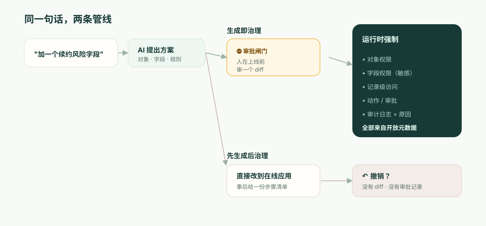

---
# @generated zh-Hant from zh-Hans (s2twp) — edit the zh-Hans file; delete this line to hand-maintain.
title: "Airtable Omni 與受治理 AI 應用平臺：為什麼審閱 diff 比撤銷更重要"
description: "Airtable Omni 把自然語言和表格式應用結合得很強。記錄系統真正要比較的，不是能不能生成應用，而是 AI 改動許可權、欄位和流程時，是否能在上線前形成可審閱的 diff。"
author: ObjectStack Team
date: 2026-06-24
status: published
topic: app-building
audience: business
solutions: []
industries: []
cover: ./cover.svg
tags:
  - Airtable
  - Airtable Omni
---

**TL;DR：** Airtable 作為 AI 原生應用平臺的推進是真實的：Omni 用經生產驗證的元件來組裝應用，而不是每次提示都生成一次性程式碼。差距不在“能不能生成”，而在“改動如何被批准”。撤銷、活動記錄和審計日誌屬於變更後的檢測能力；受監管的記錄系統還需要釋出前的預防型控制：一份說明欄位、許可權、檢視、自動化影響的可審閱 diff，以及由執行時在物件、欄位和動作層強制執行的許可權。若你的要求還包括執行時主權和自託管，平臺形態本身也會提前改變評估結論。

從一個星期二說起，因為真正咬到你的地方在這裡，而不是在演示裡。

一位收入運營經理開啟 Omni，輸入：*"給 Customers 加一個續約風險欄位，把高風險客戶放到一個看板上，並每週一提醒 CSM。"* Omni 漂亮地完成了。欄位出現了，看板渲染出來了，自動化觸發了。為計算"風險"，它從客戶的 ARR 中取數。為了讓看板對那些追續約的人有用，它把這個新欄位暴露在一個 **CSM 角色**能看到的視圖裡。皆大歡喜。經理點開別處，去忙下一件事。

六週後，一位與你的安全團隊坐在一起的 SOC 2 審計師只問了一個問題：*"客戶 ARR 是機密的。這個檢視把一個由 ARR 派生的欄位暴露給了 CSM 角色。誰批准的，什麼時候批准的？"*

而誠實的答案是：沒人批准，因為流程裡沒有批准這一步。某個 AI 在一個星期二做了一個訪問控制決策，它即刻上線，而事後能看到的主要證據，只是一條活動記錄——如果有人想得起來去看的話。這就是整篇文章。下面的所有內容，都是在解釋為什麼這個缺口是結構性的，而不是 Airtable 下個季度就會補上的某項缺失功能。

## 你的審計師早已在用的區分：預防型 vs 檢測型

先精確地把該給 Airtable 的肯定給足，因為含糊的批評在這裡一文不值。Omni 確實不是氛圍程式設計（vibe coding）——CEO Howie Liu"從一個裝著經生產驗證元件的零件箱裡組裝"的說法，是正確的架構，勝過每次提示都重新生成脆弱程式碼。Airtable Enterprise 有真正的控制：Enterprise Hub、審計日誌（介面內 1 萬條事件，通過 API 更多）、組織單元角色與超級管理員角色、EKM/DLP，以及 2025 年那套能觸及欄位與記錄級別的高階許可權控制。一個認真的 Airtable 管理員讀到"它沒有治理"這種偷懶的論調，就會不再信任你。所以別寫那一種。

寫精確的那一種。安全與審計框架把控制分為兩類，而你的審計師正是依這個區分行事：

- **檢測型（detective）**控制在某件事發生*之後*告訴你它發生了。審計日誌就是典型例子。它是必要的，而 Airtable 有它。
- **預防型（preventive）**控制*根本*不讓未經授權的事情發生。對敏感變更設一道審批閘門就是典型例子。

撤銷*兩者都不是*。它不是一種控制，而是一種個人便利，它在變更已經上線之後才執行，依賴某個人去注意到，而且不留下*誰判斷這個變更可以接受*的記錄——只留下它被回退了。SOC 2 的變更管理準則（CC8.1）以及一切認真的變更流程之所以存在，恰恰是因為對敏感變更而言，只有檢測型是不夠的。你不該是去*發現* ARR 被暴露了；你必須是已經阻止了它在未經簽字的情況下被暴露。

把同一個事實對映到審計師真正會套用的框架上，就是下面這樣：

| | 今天的 Omni | 記錄系統需要的 |
| --- | --- | --- |
| 控制起作用的時點 | 在變更上線之後（檢測型） | 在變更釋出之前（預防型） |
| 人工檢查點 | 撤銷 / 版本歷史 | 批准一份精確描述改了什麼的 diff |
| 產生的記錄 | "已執行的步驟" + 它變過的日誌 | 誰批准了這個具體變更，以及為什麼 |
| 對"誰允許的？"的回答 | 從日誌裡重建，也許吧 | 具名審批人，附在該變更上 |
| 失敗模式 | 得有人及時注意到 | 未經批准的變更無法上線 |

這就是為什麼"Omni 會展示一個計劃和一份清單，而且你可以撤銷"並不能單獨填上這個缺口。計劃是預覽，不等於批准；清單是回執，不等於控制；撤銷是事後補救。它們都重要，但 ARR 暴露場景還需要釋出前的預防型檢查點。



## "審閱 diff"究竟是什麼意思——展示出來，而非空口斷言

"經審閱的 diff"這個說法既好說出口，也好被揮手打發掉，所以這裡給出具體的東西。當一個 AI 對一個受治理的應用提出變更時，人去批准的那個產物，應當讓*後果*變得可讀——不是請求的那段散文，而是真正的後設資料增量：

```diff
  object: Customer
+ field: renewal_risk
+   type: enum[low, medium, high]
+   derived_from: account.arr
+   sensitivity: confidential        # 繼承自 ARR 來源
+ permission: field.renewal_risk
+   read:  [RevOps, AccountExec]
+   edit:  [RevOps]
!   read:  CSM  ← 由新的看板檢視請求 — 批准嗎？（會暴露由 ARR 派生的資料）
+ view: "Renewal risk board"  exposes: [account, renewal_risk]
+ automation: notify_csm_weekly
  change #4827 · proposed by Omni · approved_by: __________ · reason: __________
```

讀一讀這給開篇那位經理帶來了什麼。這個欄位被標記為 `confidential`，因為它衍生自 ARR——是自動標的，因為敏感度是資料的屬性，而不是某個人需要記得去打的標籤。而那唯一要緊的一行——看板檢視想授予 CSM 對 ARR 派生資料的讀取許可權——被*當作一個決策*單獨凸顯出來，在任何東西釋出之前。經理（或她的安全搭檔）要麼是有意去批准它，要麼不批。無論哪種，變更 #4827 現在都附上了一個名字和一個理由。當審計師在六週後來問，答案存在——*因為在變更的那一刻，這個問題就被強制提出來了。*

這就是"AI 能造出來"和"AI 的變更是可治理的"之間的區別。這無關乎少信任模型幾分。這關乎變更是一個可審閱的物件，而不是一樁已經發生了的事件。

## 那個數字：你的"未授權暴露平均時間"

這裡有一個你可以為自己組織算出來的量，因為它把抽象變成了具體。把它叫作**未授權暴露平均時間（mean time to unauthorized exposure，MTUE）**：從一個 AI 變更越過一條它不該越過的線那一刻起，到它不再處於線上為止，要多久？

- 有了**預防型**閘門，MTUE **在構造上就是零**。那個越線的變更從不上線；它停在審批這一步等待。不存在暴露視窗。
- 用**撤銷 + 一份檢測型日誌**，MTUE 就是*檢測所需的時間*——而你應該誠實地給它定價。最好的情況，某個同事當天下午就注意到了。現實的情況，是在有人審計那個檢視時，或季度訪問複核執行時，或——如場景裡那樣——外部審計師先發現了它。對那些會同步到其他系統的資料（Airtable 的 HyperDB 預設是每 24 小時同步一次），在任何人去看之前，暴露就可能已經擴散。

代入你自己的訪問複核節奏。如果你每季度複核一次敏感許可權，那麼對一個悄無聲息的錯配，你那基於撤銷的 MTUE 要以*數週到一個季度*來計量。預防型模型把這個數字變成零，靠的不是更聰明，而是把檢查點挪到了變更之前而非之後。你無法靠提示把 MTUE 提到 0；它是關於人*在何時*進入迴路的一種架構性質。

## "可我們已經在用 Airtable Enterprise，而且安全團隊已經批過了"

這是真實讀者的立場，所以正面回應它。是的——而你的安全團隊當初批的，是 Airtable 的*訪問模型與基礎設施*：SSO、加密、審計日誌、那幾層許可權。這些是真的，那次批准也是合理的。

它幾乎可以肯定早於 Omni 開始往那個訪問模型裡寫變更。你的安全團隊極可能從未被問到的那個問題，既具體又可回答：**"當 AI 改動誰能看到什麼時，是什麼在它上線之前審閱了這個變更——具名的批准又在哪裡？"** 把這句話帶到你下一次的供應商溝通裡。你拿回來的答案——"你可以撤銷它"/"它在審計日誌裡"/"Omni 會展示一個計劃"——會精確地告訴你，你正站在預防型/檢測型那條線的哪一側。為此你不需要我們的意見；你需要的是這個問題。

## 這套論證*不*適用的地方

為了智識上的誠實——因為這類文章的失敗模式，就是假裝這個取捨是免費的。預防型模型有真實的代價：**摩擦。**對每一個敏感變更都設一道審批閘門，對一個在內部追蹤表上迭代的三人小隊來說，恰恰是錯誤的人機工學。對他們而言，撤銷*才是*正確的設計，表格的使用體驗是真正的愉悅，而 Airtable 的模板生態和"做出第一個應用"的時間，領先於任何更重的東西——包括我們。我們不會在"做出第一個應用"的速度上去超過 Airtable，假裝能超過，會是反方向上同樣的不誠實。

預防型模型只有在一個未經審閱的變更的代價超過審閱變更的代價時才划得來——也就是說，當存在機密資料、一個真正的許可權模型，以及一個終將去審計它的人時。這就是那條線。線之下，Airtable 憑實力取勝。線之上，撤銷缺口才是那個終結評估的東西，而且它在功能比較之前就把評估終結了。

還有一條，獨立於以上所有，並且對某些買家同樣重要：Airtable 是託管平臺，而不是可由客戶完整自託管的執行時。如果你的執行時必須存在於你的資料和監管要求所在之處——主權、隔離、特定駐留地——那麼再好的協作體驗也不能替代部署形態本身。對這一類買家而言，比較會先從執行邊界開始，而不是從功能清單開始。

## ObjectStack 的立場

ObjectStack 是為那條線之上的世界而造的，且只為那個世界。應用核心是**開放、可讀的後設資料**——物件、欄位、關係、許可權、動作——因此一個 AI 變更就是上面展示的那份可審閱的 diff：一個由人在釋出前批准的*預防型*檢查點，其後果（這個檢視會把 ARR 派生資料暴露給 CSM）被當作一個決策凸顯出來，並繫結到一位具名審批人。許可權由**執行時在物件、記錄、欄位和動作上**強制執行，因此無法靠編輯一個檢視就被悄悄重排。它**可自託管**，並且它**接入你已經在執行的 CRM/ERP/資料庫**，而不是把你的業務再同步進一朵雲裡。

這套主張不是"像 Airtable 一樣簡單"——它有意不是，因為審批這一步本身就是產品。它是這樣的：保留那種讓 Airtable 易讀的"表格加聊天"體驗，在它底下放上一個預防型控制、一個執行時許可權模型，以及你自己的基礎設施——這樣，對"星期二是誰批准暴露 ARR 的"這個問題的回答，就是一個名字，而不是一次搜尋。
