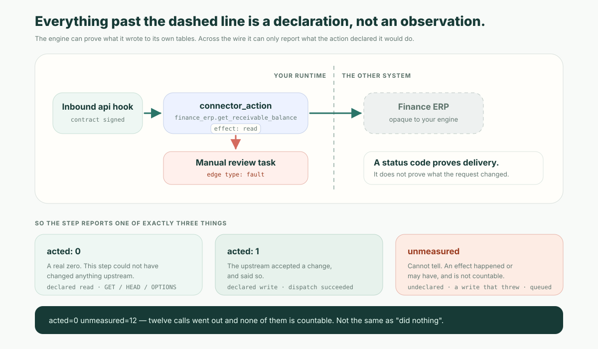

**The short version:** a cross-system flow is not hard because it touches five systems. It is hard because the instant a step leaves your runtime, you lose the ability to observe it. Your engine can prove what it wrote to its own tables; it cannot prove what the ERP did with the request. Reliability across systems is therefore not "connect more APIs" — it is a discipline for the half you cannot see: declare what each outbound call is meant to do, design its failure path before its happy path, and never let a step you could not measure be reported as a step that did nothing.

That last clause is the one teams skip, and it is the one that turns a broken integration into an invisible one.



## The unmeasured effect

Name the gap, because you will need to point at it in a design review.

An **unmeasured effect** is a step that reached another system and cannot prove what it did there. It is not a failure and it is not a success. It is the honest third answer, and an engine that refuses to give it will give you a wrong one instead.

Here is why it matters more than it sounds. A renewal flow selects twelve accounts, calls the finance system for each one, and finishes green. Someone asks how many receivable checks actually ran. If the platform cannot observe the other side of the wire, it has three options: claim twelve (overstating a lookup that changed nothing), claim zero (understating twelve real writes), or say "twelve calls went out, and I cannot count what they did." Only the third is true, and only the third keeps the useful alarm working.

ObjectStack's automation engine makes each step report one of exactly those three answers, and the choice is driven by what the integration **declared** upstream — because nothing on the calling side can observe it:

| What the step reports | What it means | When you get it |
| --- | --- | --- |
| `acted: 0` | A real zero. This step could not have changed anything. | A connector action declared `effect: 'read'`; an HTTP node using `GET` / `HEAD` / `OPTIONS`. |
| `acted: 1` | The upstream accepted a change. | A connector action declared `effect: 'write'` that succeeded; a mutating HTTP request that returned successfully. |
| `unmeasured` | Cannot tell. An effect happened or may have happened, and it is not countable. | The action declared no `effect`; a declared write that **threw**; a durable call that was enqueued but not yet delivered. |

The failure row is the interesting one. A connector handler that throws may still have reached the upstream — the request could have been applied and the response lost. So a failed *write* falls back to uncountable rather than to zero. A failed *read* is the one failure that still answers cleanly: it could not have mutated anything either way.

Every terminal run then logs one flat, greppable line:

```
[automation] run flow=renewal_check run=r_8f21 status=success \
  selected=12 acted=0 skipped=0 unmeasured=12 gate=cond_receivable->notify:4
```

`unmeasured` is printed only when it is non-zero, precisely because its presence is the thing a reader must not miss: `acted=0` next to `unmeasured=12` means "cannot tell", not "did nothing". That distinction is what keeps the operator's broken-sweep alert — *selected > 0 and acted = 0 and unmeasured = 0* — from firing on every healthy integration while still firing on the flow that quietly stopped doing its job.

The design rule generalizes past any one product. **In a cross-system process, the platform's job is not to guess what happened remotely. It is to make the uncertainty countable.**

## Two directions, two completely different failure models

Before any of that, get the arrow right, because the vocabulary costs people days and the two directions fail in opposite ways.

In ObjectStack, a **webhook** in the metadata sense is **outbound**: a declared subscription that pushes to an external URL when records change, on `create`, `update`, `delete`, `bulk_update` or `bulk_delete`. It is how the platform tells other systems something happened.

An external system telling *the platform* something happened is a different mechanism — an `api` flow, which the engine arms as an inbound hook at `POST /api/v1/automation/hooks/:flowName/:hookId`. That endpoint validates and enqueues; it never runs the flow in-band. The [trigger model piece](/en/blog/automation-trigger-model/) covers its status codes, its rotatable `hookId` and its HMAC signing in detail.

What matters *here* is that the two directions hand you opposite problems:

- **Outbound, you own the budget.** You control how many times a delivery is retried, how long it backs off, and what happens when it gives up. You also own the consequence: every retry is another chance to apply the same change twice at the far end.
- **Inbound, you own none of it.** The sender decides how often to retry, and you cannot make it stop. Delivery is at-least-once. Idempotency is not a nicety on the inbound side; it is the only defence you have, which is why an `x-idempotency-key` header passes through to the queue's dedup window and why an inbound flow must be authored to tolerate seeing the same event twice.

Teams that model both directions as "webhooks" end up writing one set of assumptions and applying it to both. The duplicate approval created by a re-sent callback, and the customer record updated by a retry that should have been suppressed, are the same mistake pointed two ways.

## Three ways a call leaves a flow

Cross-system steps are not interchangeable. The choice between them is a choice about *when you find out it failed*.

**Inline HTTP.** An `http` node with a URL, a method, headers, a body and a per-request `timeoutMs`. The flow blocks on it, and the outcome is terminal by the time the step returns — which is exactly why this path can report a measured `acted`. Use it when the next node needs the response.

**Durable HTTP.** The same node with `durable: true`. The call is enqueued onto the messaging outbox with retry and dead-lettering instead of being fetched inline, and the flow does not block on it. The step reports `unmeasuredEffect`, not success, because what came back was the id of a `pending` row — the dispatcher decides the real outcome afterwards, and that outcome includes giving up entirely. Use it for fire-and-forget notifications to systems whose availability you do not control.

**Connector action.** A `connector_action` node dispatches a named action on a registered connector — Slack, a REST service, a CRM — rather than a raw URL. This is the node that carries the `effect` declaration, and it fails in a way worth knowing: if no plugin has registered a handler for that connector, the **step** fails with a clear error rather than the flow failing to register. A connector that is registered but degraded says so specifically, and says that recovery is automatic, instead of returning a generic wiring hint.

That last behaviour is a deliberate design position: a missing integration should degrade one step, not prevent a process from being deployed at all.

## The retry budget you inherit

Here is the number to hold on to. When an outbound delivery goes through the durable outbox, the retry schedule is **fixed at five attempts — roughly 1 second, 10 seconds, 1 minute, 10 minutes, then 1 hour, each with ±20% jitter — after which the row is dead-lettered** rather than retried forever.

Fixed means fixed: it is not configurable per webhook. That is a real constraint, and it was chosen for a specific reason. An earlier version of the spec let authors declare a `retryPolicy` on a webhook, and the delivery path never read it. A retry budget that silently does not exist is strictly worse than one you cannot change, so the key was removed rather than left as decoration. If you need a different schedule, that is a platform-level conversation, not a per-webhook checkbox — and you should know which of those two you are having.

There are three retry budgets in play in a cross-system flow, and confusing them is the most common source of "we configured retries and it retried once":

| Where | What it governs | Watch out for |
| --- | --- | --- |
| Flow node `errorHandling` | Re-running a failed node inside one run. `strategy: 'retry'` requires `maxRetries >= 1`. | It governs **one synchronous dispatch**. A durable pause — an approval, a screen, a wait — ends the retry-governed segment, so a failure after the run resumes is not retried. |
| Connector `retryConfig` | The connector's own HTTP attempts, with exponential backoff. Retryable status codes default to `408, 429, 500, 502, 503, 504`. | Spelled `maxAttempts`, and it **includes** the first attempt. |
| Messaging outbox | Delivery of outbound webhooks and durable HTTP calls. | The fixed five-step schedule above, then a dead-letter row. |

The off-by-one in that table is worth a line of its own, because it is exactly the kind of thing an AI writing your flow gets wrong silently: **`maxAttempts` (connector) includes the first attempt; `maxRetries` (flow node) counts the ones after it.** Copying a number from one to the other runs one attempt fewer than you asked for. Write `maxRetries: maxAttempts - 1`.

Note also why `maxRetries` defaults to 0 and is *refused* rather than defaulted when you ask for retries: a node retry re-runs the work, side effects included. Nobody should have that number picked for them.

## Design the failure path before the happy path

The failure modes that hurt in cross-system automation are almost never "the other system was down." They are partial: the internal record updated but the external task did not; the API returned a duplicate-request error for something that had, in fact, succeeded; a field validation changed upstream and the process stalls mid-way.

A cross-system flow is ready for production when it answers these before it runs:

1. **Which failures route where.** In a governed flow this is a drawn edge, not a setting: an edge with `type: 'fault'` from the failing node to the handler node. There is no "fallback node" property to fill in — that key was removed, because the engine never read it, and a fallback configured there did not exist.
2. **Which errors are retryable and which are terminal.** A 429 and a 400 deserve different treatment; the connector default list encodes that, and you should read it rather than inherit it silently.
3. **How duplicate execution is prevented.** Not "will this be delivered twice" — it will — but what makes the second delivery harmless.
4. **What compensation looks like.** There is no distributed transaction across your CRM, your ERP and your contract system, and no platform can give you one. Compensation is a modelled branch that undoes or flags the internal half, not a rollback you can switch on.
5. **Who is told, and what task is created.** A dead-lettered delivery that nobody is assigned to is an outage with a paper trail.

Business-side, none of this is engineering detail. The customer does not care why the API failed; they care whether anyone caught it.

## What this does not solve

Four honest limits, because integration layers are where platforms most often over-promise.

**There is no outbound rate limiting.** The platform's rate limiter throttles inbound requests *to* it; nothing throttles the calls a connector makes *out*. `retryConfig.retryableStatusCodes` includes `429` and a circuit breaker is available for cascading-failure containment, but neither is a throttle. Until an outbound limiter exists, rate-limit at the connector provider or an upstream gateway — and be suspicious of any platform whose integration page advertises "comprehensive rate limiting" without saying which direction.

**Connector field mapping moves values; it does not transform them.** A mapping takes a source field to a target field with a data type and a sync mode. It does not compute a value. The `transform` key that used to sit there was removed because no runtime ever executed any of its five strategies — value conversion belongs on a surface that actually runs it, such as the import mapping.

**A declared connector is a catalog entry, not a runtime.** You can declare `connectors:` in metadata and they register for discovery and documentation, but declarative entries carry no execution binding. Dispatch requires a plugin registering the connector with a handler per action. The engine warns at boot about declared connectors whose actions have no runtime registration, and a deliberate catalog-only entry is marked `enabled: false` to silence that warning. Assuming otherwise means shipping a flow that looks connected and fails per step.

**Data synchronization is not process execution.** Keeping an order status consistent between the ERP and your platform tells you what happened. Deciding, when that status turns abnormal, which customer tier and SLA apply, who owns it, and what escalates — that is the flow. Sync is a prerequisite; it is not the automation.

## What it looks like as metadata an agent can write

The reason to care about all of this in a metadata format rather than a script is that the failure design becomes reviewable. Here is a renewal check reduced to its cross-system skeleton:

```yaml
name: renewal_receivable_check
label: Renewal — receivable check
type: api                    # inbound: contract system posts here
status: active
runAs: user
nodes:
  - id: fetch_receivable
    type: connector_action
    label: Look up receivable balance
    connectorConfig:
      connectorId: finance_erp
      actionId: get_receivable_balance   # declared effect: read
      input: { accountId: "{record.accountId}" }
  - id: gate
    type: decision
    label: Receivable abnormal?
  - id: create_task
    type: create_record
    label: Create implementation task
  - id: finance_review
    type: approval
    label: Finance confirmation
  - id: manual_fallback
    type: create_record
    label: Create manual review task
edges:
  - { id: e1, source: fetch_receivable, target: gate }
  - { id: e2, source: gate, target: finance_review, type: conditional }
  - { id: e3, source: gate, target: create_task, type: default }
  - { id: e4, source: fetch_receivable, target: manual_fallback, type: fault }
errorHandling:
  strategy: retry
  maxRetries: 2
```

Read `e4` first. It is the whole argument in one line: when the finance system cannot be reached, the process does not stall and does not silently continue — it creates a task a human owns. That edge is visible in a diff, visible in the flow diagram, and enforced by the engine. In a script, the same decision is a `try` block somewhere on line 340, and the reviewer's honest answer to "what happens if finance is down?" is "let me read it again."

This is also why the format matters more than the generation. An agent can write this flow in seconds. What decides whether it is safe is whether the runtime refuses the shapes that look right and do nothing — a retired key, an unroutable trigger spelling, `strategy: 'retry'` with no retry count. A contract that rejects at authoring time is worth more to an AI-written system than any amount of prompt guidance, because the rejection arrives at the moment the mistake is cheap.

## How to evaluate an integration layer

Five questions that separate governed cross-system automation from an API list with a nice icon set:

1. When an outbound call fails, **where does the process go** — and can I see that path without reading code?
2. Can the run record tell me the difference between *changed nothing* and *cannot tell what it changed*?
3. What is the retry schedule, who owns it, and what happens after the last attempt?
4. Which [declared integration keys are actually enforced](/en/glossary/declared-vs-enforced/), and which are decoration? Ask for one example of a key the vendor removed because nothing read it. The answer is revealing either way.
5. Does an unreachable third-party system degrade one step, or block a deployment?

## Where ObjectOS differs

ObjectOS Automation does not try to wrap every API in a button. It tries to make a call that leaves the runtime carry the same governance as a call that stays inside it: a declared effect, a drawn failure path, a durable delivery record, an identity the run executes under, and one run summary that will not overstate what it did.

This piece is one of four around the [automation engine hub](/en/blog/objectos-automation-engine/), which covers how a flow decides, waits, and proves what it changed. The [trigger model](/en/blog/automation-trigger-model/) covers the entry points — including the inbound endpoint sketched above.

If you would rather test this than read about it: point your coding agent at the ObjectStack rule file and the flow specification, describe one cross-system process from your own business in a paragraph, and read the metadata that comes back. Look at the fault edges first. Whether a process can run across five systems is the easy half; whether you can tell what it did in each of them, and who catches it when it breaks, is the half you are actually buying.
