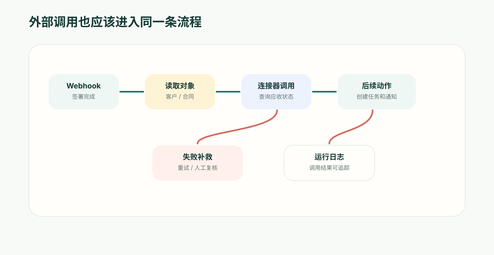

**先给结论**：可靠的自动化引擎，不是多接几个 API，而是把外部调用、失败、重试和补偿都当成流程里的受治理节点——连接器是业务能力，不是接口清单，跨系统流程才不会变成脚本堆。动手之前先把方向摆正：在 ObjectStack 里，Webhook 是**出站**的，负责把平台内发生的事推给外部系统；外部系统要把事件送进来，走的是另一条入口。两个方向的失败模式几乎相反，用同一个词概括它们，是跨系统集成最贵的一次口误。

最容易失控的自动化，往往不是因为流程太复杂，而是因为它跨了太多系统。

CRM 改了状态，ERP 要查应收，合同系统要确认签署，通知服务要提醒负责人。每一步都能用脚本或一次 HTTP 调用接起来，但几个月后，团队常常只剩一个问题：这条流程到底是谁在控制？

一个客户续约流程可能要查 CRM 里的客户和商机，读取合同系统里的到期日，调用财务系统确认应收状态，再把任务分派到客户成功团队。一个采购流程可能要连接供应商库、ERP、合同系统、邮件服务和审批系统。一个工单流程也可能从客户门户进入，再流转到客服、研发、知识库和通知渠道。

所以，自动化引擎如果只能在本系统里改字段、发通知，它能解决的只是局部效率问题。真正的业务自动化必须跨系统运行。

但跨系统不是简单地“多接几个 API”。关键在于：外部调用也要成为流程的一部分，有输入、有输出、有错误处理、有权限边界、有日志，业务人员能看懂，管理员能治理。

## 跨系统流程为什么容易失控

很多企业一开始会用脚本或集成工具把系统串起来：

- CRM 状态变化后调用合同系统；
- ERP 更新后通知采购；
- 表单提交后向外部服务推一条 Webhook；
- 外部风控服务返回结果后更新客户记录。

这些连接能跑起来，但问题往往出现在三个月后。

某个接口超时了，流程是否重试？外部系统返回半成功，内部记录是否回滚？同一条消息被投递了两次，业务动作是否会重复执行？供应商 API 字段改名，流程是否静默失败？管理员要查一条记录为什么被更新，能不能看到完整调用链？

如果这些逻辑散落在脚本、Webhook 配置、后台任务和第三方工具里，业务流程就会变成“能跑但难管”的集成拼图。

自动化引擎要解决的不是能不能调 API，而是能不能把跨系统调用纳入业务流程治理。

## 出站还是入站：一个词，两套相反的失败模式

在往下谈治理之前，先把箭头的方向定下来。这个词一旦用反，后面每条结论都会跟着错，而它在很多团队里恰恰是反的。

在 ObjectStack 里，Webhook 是出站的。你为某个对象声明一条订阅，当记录被创建、更新或删除时，平台把这条变化推送到你指定的外部地址；你可以配置一个共享密钥，平台会用它对请求体签名。批量更新和批量删除是两类单独的订阅事件，因为它们送出的内容本来就不一样——没有具体记录，只有对象和命中条数。总之，Webhook 是平台告诉外部系统“这里发生了什么”的方式，不是外部系统告诉平台的方式。

外部系统要把事件送进平台，用的是另一套机制：把流程声明成 api 类型，引擎会为它挂出一条专属的入站地址，路径形如 /api/v1/automation/hooks/流程名/钩子标识。这条地址只做两件事——校验签名、放进队列，然后回一个“已接收”；它从不在这次请求里把流程跑完。密钥按流程配置，钩子标识可以轮换，等于在不改流程名的前提下作废旧地址。入口模型本身，[触发模型那篇](/zh-Hans/blog/automation-trigger-model/)单独讲过。

方向之所以值钱，是因为两个方向交给你的问题几乎相反。

出站这一侧，重投预算是你的。投递失败后平台按固定节奏重投，你知道它什么时候放弃，也要为后果负责：每一次重投，都是对方把同一件事再做一遍的机会。平台能给的帮助是一个稳定的锚点——同一条投递的每次重投都带同一个投递编号（请求头 X-Objectstack-Delivery），接收方按它去重，就不会重复入账。

入站这一侧，重投预算不是你的。对方决定重发几次，你没有办法让它停下来，投递是“至少一次”的。所以幂等不是锦上添花，而是唯一的防线：请求上的 x-idempotency-key 会进入队列的去重判定，而流程本身也必须写成“同一个事件看见两次也不出错”。

把两个方向都叫“Webhook”，最后就是拿一套假设去套两种机制。被对方重发的那一次通知创建了两条审批，和被平台重投的那一次推送让对方多记了一笔账，是同一个错误的两个方向。

还有一条和方向无关、却同样常被跳过：不管哪一侧，它们都只适合承担边界事件，不适合承担业务逻辑。谁审批、改哪个字段、通知谁，这些决定应该留在平台内的流程里。这样，某条业务记录为什么进入高风险状态，不需要去翻外部服务日志和脚本，只要看这条流程的触发事件、判断节点和动作日志。

## 外部调用应该是流程节点

在更成熟的自动化设计里，连接器动作、出站推送、HTTP 请求和外部服务调用都应该被建模为流程节点。

这意味着它们不再是流程之外的黑盒，而是和审批、判断、等待、数据更新一样，成为可编排的步骤：

- 调用前可以读取当前业务对象；
- 调用时可以使用受控参数；
- 返回结果可以写入流程变量；
- 成功后进入下一步；
- 失败后进入补救分支；
- 超时后可以重试或升级；
- 每次调用都留下日志。

例如供应商准入流程中，自动化可以先创建供应商记录，再调用外部工商信息服务，接着调用制裁名单检查，最后根据结果决定是否进入采购经理复核。

如果这些外部调用只是脚本，业务人员很难知道发生了什么；如果它们是流程节点，流程图就能清楚表达“这个判断来自哪个系统，失败后会怎么处理”。

## 连接器不是接口清单，而是业务能力

很多平台把连接器做成 API 列表：创建客户、查询订单、发送邮件、更新工单。

这还不够。

业务人员真正关心的不是接口名字，而是这个连接器动作在流程里能表达什么业务能力。例如：

- 从 ERP 查询客户应收余额；
- 在合同系统创建续约审批；
- 向客服系统创建升级工单；
- 从供应商平台同步资质状态；
- 向通知服务发送内部提醒；
- 调用外部评分服务生成风险等级。

好的自动化引擎应该把连接器动作描述成可理解、可配置、可审计的业务节点。每个节点需要说明输入、输出、失败模式、是否会修改外部数据、是否需要凭证、是否可以重试。

这样，业务流程设计者不需要理解底层 API，却能理解流程做了什么。

但“业务能力”有一个前提，常常被漏掉：**在元数据里声明一个连接器，得到的是一条目录条目，不是一个可以调用的能力。**

平台里其实有两份名册：

- 流程节点真正能派发到的，只有插件在运行时注册的连接器——注册时要为它声明的每一个动作交出一个处理器；
- 你在应用元数据里声明的连接器，登记的是供发现、文档和市场使用的描述符。它不会进入运行时的那份名册，因为写在那里的动作没有任何执行绑定。

这不是文档细节。自动化服务在启动时会警告：某个声明的连接器动作找不到同名的运行时注册；如果这条目录条目本来就只用于陈列，把它标记为未启用即可消音。而假设“声明即接通”的后果是，你交付了一条看起来接好了的流程，然后在每一步上失败。

对 AI 写出来的应用，这一条尤其要紧。生成一段连接器声明很容易，声明背后有没有人实现处理器，是评审时必须问出口的那句话——差别不在元数据长什么样，而在运行时认不认它。

## 跨系统流程必须设计失败路径

跨系统自动化最常见的事故，不是系统完全不可用，而是部分失败。

比如：

- 内部记录已经更新，但外部系统创建任务失败；
- 外部系统响应慢，流程不知道该等还是重试；
- API 返回重复请求错误，但业务上其实已经成功；
- 出站推送重投成功了，可对方第一次就已经处理，同一笔变更被记了两遍；
- 入站事件被对方重发，导致同一审批被创建两次；
- 外部系统字段校验失败，流程卡在中间。

因此，自动化引擎必须支持失败路径，而不是只画成功路径。

这里有一个值得记住的数字。出站投递走的是平台共享的发件箱，重投节奏是固定的七档——大约 1 秒、10 秒、1 分钟、10 分钟、1 小时、6 小时、24 小时，每档带上下 20% 的抖动，用尽之后这条投递进死信，而不是无限重试。从第一次失败到进死信，前后大约 31 小时。

固定就是固定：它不按单条 Webhook 配置。这是一条真实的约束，也是一次有意的取舍——规范里曾经允许作者在 Webhook 上声明自己的重试策略，而投递路径从来没有读过它。一个悄悄不存在的重试预算，比一个改不了的重试预算更危险，所以那个字段被删掉了，而不是留着当装饰。

这个数字直接决定两件业务上的事：一条投递可能在一天多之后才彻底失败，所以“对方没收到”不会当场暴露；以及，进了死信却没有指派给任何人的投递，就是一次有记录、无人认领的事故。

一条可靠的跨系统流程应该提前定义：

- 哪些外部调用可以重试；
- 重试几次后进入人工处理；
- 哪些错误可以忽略；
- 哪些错误必须阻断流程；
- 如何防止重复执行副作用；
- 失败时通知谁；
- 是否需要创建补救任务。

业务上，失败路径不是工程细节，而是运营责任。客户不会关心 API 为什么失败，只会关心流程有没有人接住。

## 数据同步和流程执行要分清

跨系统场景里还有一个常见误区：把数据同步当成业务流程。

数据同步解决的是“信息保持一致”；业务流程解决的是“工作如何推进”。二者有关联，但不能混为一谈。

例如 ERP 的订单状态同步到 ObjectOS，这只是数据更新。自动化引擎真正要做的是：当订单状态变为异常时，判断客户级别、金额、责任团队和 SLA，然后创建处理任务、通知负责人、必要时升级审批。

如果只做同步，系统知道发生了什么；如果有自动化流程，系统才知道接下来该做什么。

这也是 ObjectOS 这类平台的价值：把外部数据接进来后，不只是展示，而是让它进入对象、权限、流程和动作体系。

## 对业务应用搭建的意义

当你用平台搭一个跨系统流程时，不应该从“我要调用哪些接口”开始，而应该从业务问题开始：

> 当合同签署完成后，自动检查客户应收、生成实施任务、通知客户成功团队；如果应收异常，先进入财务确认。

这句话可以拆成：

- 入站事件：合同系统通知“签署完成”；
- 内部对象：客户、合同、项目、任务；
- 外部查询：财务系统应收状态；
- 判断条件：应收是否异常；
- 人工节点：财务确认；
- 后续动作：创建实施任务、通知客户成功；
- 失败路径：财务系统不可用时创建人工复核任务。

自动化引擎把这些元素放进一条流程：入站地址是入口，连接器动作和出站推送是其中的节点。

## ObjectOS 的差异

ObjectOS Automation 的重点不是把每个 API 都包装成按钮，而是让跨系统调用进入可治理的业务流程。

业务对象提供上下文，运行时注册的连接器提供外部能力，入站地址承接边界事件，出站 Webhook 把结果推回外部系统，流程节点表达判断和动作，运行日志记录每一步。这样，跨系统自动化不再是看不见的集成脚本，而是业务应用的一部分。

对企业来说，跨系统流程能不能跑只是第一步。更重要的是：跑错了能不能发现，失败了有没有补救，改流程时能不能看懂影响，审计时能不能解释。

这才是自动化引擎应该承担的责任。
