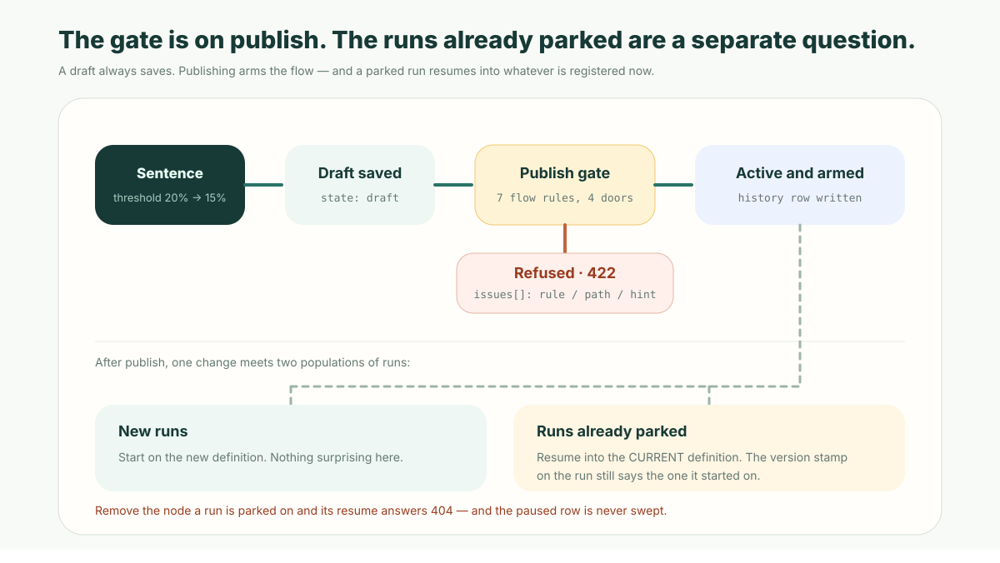

**The short version:** natural language is a change *request*, not a release. Say "drop the discount approval threshold to 15% and add finance above 30%" and a good platform does four things before anything runs differently: it turns the sentence into a diff a business owner can read, refuses the change if it can prove the new flow cannot work, records who published what, and keeps the version you were on. The generation is the cheap half. What decides whether business users are allowed near a live process is everything after it — and the part almost nobody asks about is what happens to the runs that were *already in flight* when you pressed publish.

## The sentence, and the eleven lines it has to become

Here is the request, in the form it actually arrives:

> Lower the big-discount approval threshold from 20% to 15%, and anything over 30% also needs finance to confirm.

Twelve seconds to say. In a scripted automation platform it becomes a code change somebody has to read. In ObjectOS the flow *is* a declaration, so the same request becomes a diff:

```diff
  nodes: [
    { id: 'by_amount', type: 'decision', label: 'How big is the discount?' },
    { id: 'manager_signoff', type: 'approval', label: 'Manager approves',
      config: { approvers: [{ type: 'manager' }], behavior: 'first_response' } },
+   { id: 'finance_signoff', type: 'approval', label: 'Finance confirms a deep discount',
+     config: { approvers: [{ type: 'position', value: 'finance_controller' }],
+               behavior: 'first_response', lockRecord: true } },
  ],
  edges: [
-   { id: 'e2', source: 'by_amount', target: 'manager_signoff', type: 'conditional',
-     condition: 'record.discount_pct > 20', label: 'needs approval' },
+   { id: 'e2', source: 'by_amount', target: 'manager_signoff', type: 'conditional',
+     condition: 'record.discount_pct > 15', label: 'needs approval' },
+   { id: 'e5', source: 'manager_signoff', target: 'finance_signoff', type: 'conditional',
+     condition: 'record.discount_pct > 30', label: 'deep discount' },
+   { id: 'e6', source: 'finance_signoff', target: 'fulfil', label: 'approve' },
  ],
```

That is the whole change. A sales director who has never opened a workflow designer can read it and answer the two questions that matter: is 15% the number we agreed, and is `finance_controller` the position we meant. Neither question is about software.

This is what **review AI generated code** looks like when the AI's output is a business process rather than an implementation. You are not reading what the model wrote in order to check its craftsmanship; you are reading a policy, in eleven lines, and signing your name to it. The [case for making AI hand you a small declaration instead of a large implementation](/en/blog/ai-wrote-your-app-dare-to-merge/) is the general form of this argument. A flow is where it gets tested hardest, because a flow keeps running after you stop looking at it.

## Ambiguity is why the sentence is not the change

The reason a platform must never execute the sentence directly is not distrust of the model. It is that business language under-specifies, and the gaps are invisible until they are expensive:

- "Large customer" — by contract value, by account tier, or by strategic designation?
- "Escalate quickly" — one hour, four hours, or same day?
- "Send it to the owner" — the record owner, their department head, or the regional manager?
- "Finance confirms" — notify finance, or block the process until finance acts?

Only the last one changes the shape of the graph, and it is the one a fluent sentence hides best. A change plan you can read resolves all four before anything is armed. The [general conversational-iteration loop](/en/blog/conversational-app-iteration/) — plan, confirm, apply — covers fields, views and permissions the same way; the rest of this article is about the part of that loop that is specific to flows, where the artifact you are changing has live instances inside it.

## Four doors, one rule table

A change plan is worth nothing if the platform will publish whatever the human clicks through. So the interesting question is where the checking lives.

ObjectStack keeps 42 author-time rules in a single registry. Sixteen of them are wired to the **runtime publish gate** — the door reached by Studio's designer, by the REST `/meta` item API, and by an MCP agent authoring metadata directly. Seven of those judge a flow:

| Rule | What it refuses to publish |
| --- | --- |
| `validateStackExpressions` | A predicate that does not parse, or a `record.<field>` that resolves to no field |
| `validateFlowTriggerReadiness` | A trigger token that routes nowhere — the flow would be armed and wired to nothing |
| `validateApprovalApprovers` | An approver that can never resolve to a person |
| `validateEmptyCombinators` | A literal empty filter (`$and: []`, `$or: []`, `{}`) on a CRUD node |
| `validatePresetComparands` | A date-range preset name used as a bare ordering comparand |
| `validateReferenceIntegrity` | A template path, a written field, or an object name that does not exist |
| `lintFlowPatterns` | Branch routing that is inert — a decision branch no edge claims, an edge that is both default and conditional, a data flow with no identity to run as |

The same seven run from `os validate`, `os build` and `os lint`. That is the property worth copying: **one rule table, four doors.** A rule deleted from the table stops being enforced everywhere in the same commit, and — more to the point — a tenant editing a flow in a browser cannot get a weaker check than an engineer running the CLI. Before that gate existed, the write path ran a schema parse and nothing else, and the schema is perfectly happy with a broken approver expression: `approver.value` is a string, and `record.owner ==` is a string.

The gate's own note on why this mattered enough to build is the sentence to take away: the runtime write path is the door **AI authors use**, and metadata written by a model is exactly the metadata most likely to be subtly wrong.



Three details make it usable rather than merely strict:

1. **It gates publish, not typing.** The refusal fires only on a write into `state: 'active'`. A draft save always passes — a draft is allowed to be half-finished, and gating one would make the editing loop unusable.
2. **It judges your change, not your tenant.** The gate evaluates differentially: it runs the rules on the existing registry, then again with your item grafted in, and only findings your write *added* are attributable to you. Without that subtraction, an old row that violates a rule written after it would block every future save in the org.
3. **A refusal is legible.** It comes back as a 422 carrying `issues[]`, each with the `rule`, the `path`, the `message` and a `hint`. Advisory findings ride the same response without blocking. An agent that gets that envelope back can fix the flow and retry; an agent that gets a generic 400 guesses.

There is one escape hatch, `OS_ALLOW_UNLINTED_METADATA_WRITES=1`, for re-saving rows written before a rule existed. It downgrades the refusal to a loud log rather than silence — the violation becomes tolerated, never invisible.

The bar for putting a rule on that gate is narrow and worth stating, because "validate more" is not automatically better: a rule blocks a publish only when **no reading of the metadata does what it says, on every run**. A shape that is usually a mistake but has one legitimate reading stays a warning. An unfiltered bulk delete, for instance, only warns — the engine grants "bulk intent, no predicate" deliberately — even though it will empty the object on every run. Failing a customer's publish on something you cannot prove is wrong buys a worse problem than the one it solves.

## Two things are called draft, and only one of them stops the flow

This is the trap that catches teams who assume they can publish carefully.

`sys_metadata.state` is the lifecycle of the *stored definition*: `draft`, `active`, `archived`, `deprecated`. Publishing means writing `active`, and that is the verb the gate watches.

`flow.status` is the lifecycle of the *flow*: `draft`, `active`, `obsolete`, `invalid`. Only `obsolete` and `invalid` unbind a flow from its trigger.

So a flow published at `status: 'draft'` **is armed and will fire.** "Ship it as a draft first and watch it" is not a thing you can do by setting that field; the flow's own draft status is a note about intent, not a safety catch. There is an authoring warning for exactly this ambiguity, and the honest way to stage a change is `obsolete`, a condition that matches nothing, or a separate flow — never `status: 'draft'`. The [trigger model article](/en/blog/automation-trigger-model/) covers the rest of what arms and unarms a flow.

## The runs already in flight: the mixed-version run

Here is the part the marketing pages skip, and the assumption almost everyone brings to it is wrong.

The intuition is that flows behave like a deployed app version: runs that started under version 4 finish under version 4, new runs get version 5, and the two never mix. It is a reasonable thing to expect. It is not what happens.

Every run row records the flow version it started on. But when a parked run resumes — an approval that has been sitting for a week, a wait on a supplier document — the engine looks up **the flow definition that is registered right now**, finds the node the run stopped at, and traverses onward from there. Everything downstream of the pause point is the new version. The run's stamp still says 4.

Call it the **mixed-version run**: a run whose first half executed one definition, whose second half executed another, and whose version field records only where it started. That field is a start stamp, not a provenance record, and reading it as "this run ran version 4" is how a post-incident review reaches a confident wrong answer.

Two consequences follow, and they are the operational core of governing flow changes:

**Your edit reaches the approvals that are already pending.** Two hundred discount approvals parked at `manager_signoff` will, when their approver clicks Approve, continue into whatever comes after that node *today*. Add a finance step after the manager approval and those two hundred in-flight requests get it too. Sometimes that is precisely what you want — a policy tightened on Tuesday should apply to Tuesday's queue. Sometimes it is a compliance problem. Either way it is a decision, and it has to be made deliberately, before publish, not discovered afterwards.

**Delete the node a run is parked on and the run is finished — permanently.** The resume finds no node with that id, and returns the same terminal "this pause is gone for good" answer as a run that never existed: a 404, with an error naming which of the two it was. The paused row is not cleaned up either. Suspended rows are live resumable state, so they are exempt from the age sweep that prunes terminal history; the row sits in the table forever, holding a business process that can never continue. Nobody gets an alert, because from the engine's point of view nothing failed. The [resume-side view of this refusal](/en/blog/automation-pause-resume-approvals/) covers what the door does; this is what the *publisher* owes it.

The discipline that follows is unglamorous and works:

- **Add before you remove.** Introduce the new node, route to it, publish. Remove the old one in a later change, once nothing is parked there.
- **Drain, then delete.** Before removing or renaming any node that can pause — `approval`, `wait`, `screen`, `subflow`, `map` — list the paused runs for that flow and check what they are sitting on. A paused run is queryable by status; ask before you publish, not after.
- **Retire a flow in two steps.** Set `status: 'obsolete'` to stop new runs, let the parked ones finish, and delete the definition after that. Deregistering a flow with runs inside it strands every one of them.
- **Treat "does this reach in-flight runs?" as a review question**, on the same footing as "is 15% the right number". It has a different answer for a threshold change than for an added approval step.

None of this is an ObjectStack quirk; it is what happens whenever a long-running process meets an evolving definition. What a platform owes you is to be explicit about which way it resolves, so you can design around it. Resuming into the current definition is a defensible choice — the alternative, pinning every parked run to a snapshot, means a bug fix never reaches the runs that need it most. The failure is not the choice. The failure is not knowing which one you bought.

## The change itself is a record

The last property that separates a governed change from a fast one is that the change is a first-class object.

Every metadata write appends a row to `sys_metadata_history`, which is never mutated after insertion. Each row carries the version in that item's lineage, a per-organization monotonic sequence number, the full JSON snapshot, a checksum plus the previous checksum, the operation (`create`, `update`, `publish`, `revert`, `delete`), an optional change note, the producer (`studio`, `fs`, `api`, …), when it happened, and who did it.

Two details in that shape are worth stealing:

- **`recorded_by` is NULL for a system-initiated write**, not the string `'system'`. It is a foreign key to a user, and a sentinel string in a foreign key is a value no join can resolve — a made-up actor that reads like a real one. NULL is the honest answer to "which person did this," and it stays answerable.
- **An update whose checksum matches the previous version writes no row.** Republishing an unchanged body is not a change, so the history does not fill with events that assert one.

That log is what makes rollback a lookup rather than an archaeology project, and it is why `revert` is one of the operations in the vocabulary rather than a special case bolted on later.

## What this does not do

Four limits, plainly, because the gaps are where teams get hurt:

- **`os diff` compares flows by name, not by content.** It gives you object-level diffs down to the field — added, removed, type changed, and whether that is breaking — but for flows, views, agents and apps it reports additions and removals only. A threshold moving from 20% to 15% does not appear in it. The [reviewable diff](/en/glossary/reviewable-diff/) for a flow change is the diff of the definition itself, which is why the definition being a small file in your repository matters more than any diff tool.
- **The engine's in-process version history is not your [audit trail](/en/glossary/audit-trail/).** The automation engine keeps definitions it has registered in memory and can roll back to one; that is an operational convenience within a process lifetime. `sys_metadata_history` is the durable record. Do not confuse them.
- **There is no in-flight migration.** You cannot move parked runs onto a new version, and you cannot pin them to the old one. Add-then-remove is the mitigation, not a feature.
- **Validation is not correctness.** Every gate above answers "can this flow run and mean what it says." None of them knows whether 15% is the right threshold, whether finance wanted this work, or whether the approval you removed was the one an auditor cares about. A platform that proves a flow is well-formed has done its half. The other half is a person with authority reading eleven lines.

## Five questions for any platform that lets business users change flows by talking to it

1. After the sentence, what exactly do I approve — a summary of the change, or the change?
2. What is checked before publish, and does the browser get the same checks as the CLI?
3. What happens to runs already in flight? Get the specific answer, and ask what happens if the change deletes a node one of them is parked on.
4. Can I see who published which version, when, and roll back to the previous one without a support ticket?
5. Is the flow's status a safety catch, or a label? Ask what fires and what does not.

Question 3 is the one that separates products. Everyone has an answer to 1 and 2.

## Point your agent at the declaration

The reason to care about all of this now is that the flow edit increasingly comes from an agent, not a person in a designer. That changes what the change layer owes you. A model writing a business process produces plausible-looking metadata at speed, and plausible-looking is precisely the failure mode a human reviewer is worst at catching by reading prose.

The defense is structural, and it is the same one either way: make the artifact small enough to read, refuse at authoring time the shapes that provably cannot work, record who published what, and be explicit about which runs a change reaches. Point your coding agent at the [ObjectStack spec](https://github.com/objectstack-ai/objectstack) and the flow schemas, describe a change to a process you actually run, and look at what comes back. If it is a diff you can review over coffee, natural language just became a safe way to change a business process. If it is a pull request nobody can read, it did not — no matter how good the sentence was.

For the runtime underneath all of this — how a flow decides, waits, and proves what it did — start at [the automation engine overview](/en/blog/objectos-automation-engine/).
