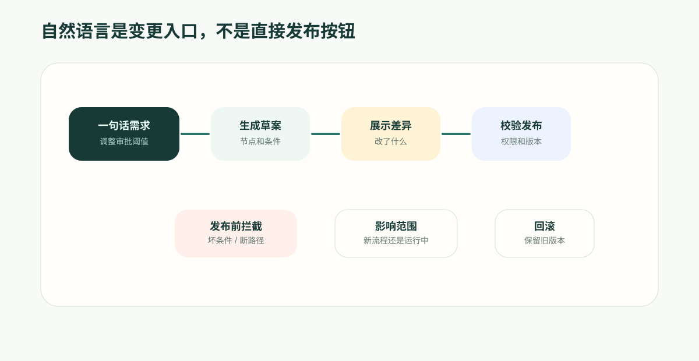

**先给结论**：自然语言可以降低改流程的门槛，但不能让流程直接上线。可靠的引擎要把每次变更变成可审查、可校验、可发布和可回滚的流程元数据；校验比生成更重要。

“把 20% 折扣审批改成 15%，超过 30% 再加财务确认。”

这句话业务人员说起来只要几秒钟，但如果平台直接改完上线，风险也会在几秒钟内进入生产流程。

业务流程从来不是一次搭好就不变。

折扣审批阈值会调整，客服升级规则会变化，采购复核条件会增加，合同流转要加入新的法务节点，报销政策每个季度都可能更新。

如果每次变化都要找开发排期，业务会嫌慢；如果每次变化都让业务人员直接改脚本，系统会失控。自然语言改流程看起来是一个很好的答案：业务人员说出变化，平台自动修改流程。

但这里真正的难点不在“听懂一句话”，而在“改完之后可不可靠”。

自动化引擎必须承接可治理的变更：能展示改了什么，能校验是否正确，能让人审查和发布，能保留版本，必要时能回滚。

## 业务想要的是快，组织需要的是稳

业务人员提出的修改通常很直接：

> 把大额折扣审批阈值从 20% 调到 15%，超过 30% 的还要加财务确认。

> 工单如果 4 小时没有响应，就升级给团队主管；VIP 客户 1 小时就升级。

> 供应商资质过期前 30 天提醒采购负责人，过期后自动暂停新订单。

这些需求不复杂，但如果流程系统不支持快速变更，它们会变成大量沟通成本。

自然语言交互可以大幅降低修改门槛。业务人员不需要在复杂画布里找节点，也不需要理解条件表达式。他只要描述变化，平台就能建议修改。

但企业不能只追求“改得快”。流程一旦发布，就会影响客户、费用、合同、审批和数据。越是容易改，越需要治理。

## 自然语言不能直接等于发布

一个危险的设计是：用户说一句话，系统马上改流程并上线。

这在演示里很顺，在真实业务里风险很高。因为自然语言可能有歧义：

- “大客户”是按合同金额、客户等级，还是行业战略客户？
- “尽快升级”是 1 小时、4 小时，还是当天？
- “发给负责人”是记录 owner、部门负责人，还是区域经理？
- “财务确认”是通知财务，还是创建审批任务？

平台应该把自然语言理解为变更请求，而不是最终发布指令。

正确的过程应该是：

1. 解析用户意图；
2. 找到要修改的流程；
3. 生成变更草案；
4. 展示新增、删除、修改的节点和条件；
5. 校验流程结构；
6. 由有权限的人确认发布；
7. 保留版本和审计。

这样，自然语言带来速度，流程治理保证稳定。

## 变更必须落到流程元数据

如果自然语言改流程只是改 prompt，问题很快会出现。

业务人员说“VIP 客户 1 小时升级”，系统把这句话加进提示词里。下一次模型可能照做，也可能忘记；流程图里看不到这个规则，审计也查不到谁改了什么。

更可靠的做法，是把变更落到流程元数据。

例如“VIP 客户 1 小时升级”应该变成：

- 一个条件分支：客户等级为 VIP；
- 一个等待节点：1 小时；
- 一个检查节点：是否已响应；
- 一个升级动作：通知主管或创建升级任务；
- 一条日志：由谁在什么时候发布了规则。

这样，业务规则不再停留在对话里，而是进入自动化引擎可以执行、显示、校验和审计的结构。

## 平台要能解释“改了什么”

自然语言改流程最需要的产品能力，不是一个漂亮的输入框，而是变更解释。

业务人员说完一句话后，平台应该能用人能看懂的方式反馈：

- 新增了哪个条件；
- 改了哪个阈值；
- 新增了哪个审批人；
- 哪个通知对象发生变化；
- 是否影响已有运行中的流程；
- 哪些异常路径没有覆盖；
- 哪些权限需要管理员确认。

如果平台只能说“已完成修改”，业务就很难放心。

一个可治理的自动化引擎应该把变更变成 diff：流程图层面的 diff、条件层面的 diff、动作层面的 diff、权限层面的 diff。

这也是元数据驱动的价值。因为流程是结构化的，平台才能比较前后差异，而不是让人去读脚本。

## 校验比生成更重要

自然语言生成流程很有吸引力，但自动化引擎真正重要的能力是校验。

它需要检查：

- 流程有没有起点和终点；
- 分支是否能到达；
- 条件是否能被计算；
- 等待节点之后是否有继续路径；
- 审批拒绝后是否有处理分支；
- 外部调用失败后是否有补救；
- 动作参数是否完整；
- 当前用户是否有权发布这个变更。

业务人员不应该靠肉眼发现这些问题。平台要在发布前拦住它们。

这也是为什么“自然语言改流程”不能等同于“AI 直接写脚本”。脚本能生成，但平台很难知道它是否符合业务流程结构；元数据流程可以被校验。

## 运行中的流程如何处理

流程变更还有一个常被忽略的问题：已经在运行中的流程怎么办？

例如有 200 个折扣审批正在等待经理确认。此时业务把规则改了：超过 30% 还要财务审批。那些已经跑到一半的审批是否适用新规则？

企业平台需要清楚定义：

- 新版本只影响新触发的流程；
- 已运行流程继续使用旧版本；
- 某些流程可以手动迁移到新版本；
- 关键变更需要管理员确认影响范围；
- 历史运行记录保留当时的流程版本。

否则，同一条审批为什么有的走财务、有的不走财务，就很难解释。

自动化引擎的版本能力，决定了自然语言变更能否进入生产环境。

## 适合自然语言修改的流程场景

不是所有流程都应该一开始就交给自然语言修改。更适合先落地的是规则清楚、边界明确、业务频繁调整的场景：

- 审批阈值调整；
- SLA 升级时间调整；
- 通知对象变化；
- 新增复核节点；
- 根据客户等级增加分支；
- 外部调用失败后的补救任务；
- 定时提醒周期变化；
- 工单、报销、采购、合同等流程的条件细化。

这些修改频率高，但结构相对清楚。让业务人员用自然语言提出变更，再由平台生成草案和 diff，可以显著减少沟通成本。

## ObjectOS 的差异

ObjectOS 适合承接自然语言改流程，不是因为它把 AI 放在输入框里，而是因为流程本身是元数据。

自然语言可以生成变更建议，Automation 引擎负责把建议落到节点、连接、条件、等待、审批和动作上。平台可以校验结构，展示差异，要求有权限的人发布，并保留版本和运行记录。

这让“业务人员用自然语言改流程”不再是危险的魔法，而是一种受治理的协作方式。

未来的企业自动化不应该每次变化都等开发，也不应该让流程隐藏在脚本里。它应该让业务语言进入平台，但最终沉淀为可执行、可审查、可追踪的流程资产。
