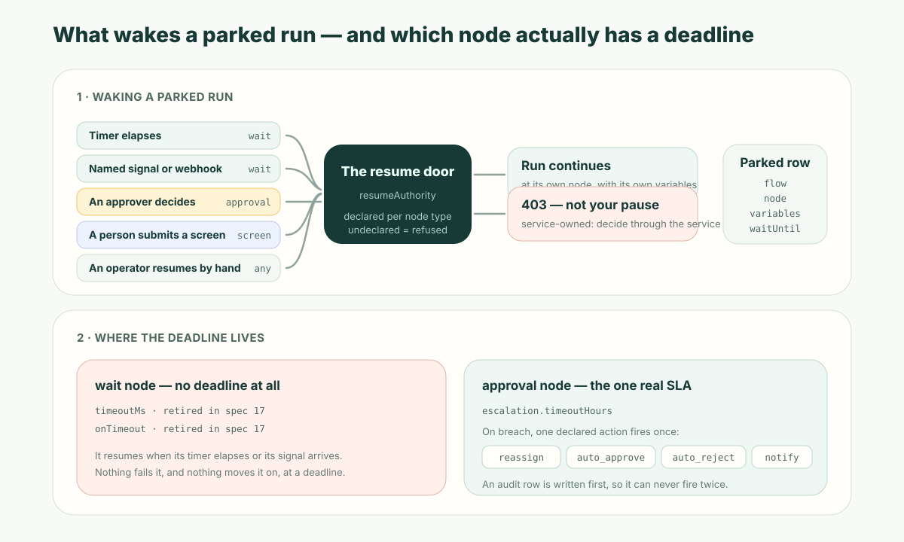

**The bottom line first:** pausing a workflow is the easy half — anything can stop. Resuming is where long-running processes are won or lost. The run has to come back **at the node it parked on**, with the variables it had, inside a flow definition that may have been edited underneath it — and it has to **refuse a caller who is not entitled to end the wait**. That last point is the one nobody demos. On the ObjectStack automation runtime, six node types can pause; four leave the generic resume route open, two close it, and a node type that declares nothing at all is refused by default. The pause is not the design decision. The door out of it is.

## A Friday Restart Is the Only Test That Matters

A supplier onboarding flow starts on a Monday. It checks the tax registration, opens an approval for the finance controller, and then waits for the supplier to upload an insurance certificate. Nothing happens for six days, because nothing is supposed to happen for six days.

On Friday the platform is restarted for a patch.

That restart is the entire test of whether you have a workflow engine or a task runner. A task runner had the whole thing in memory: a callback, a `setTimeout`, a closure holding the tax check's result. All three are gone, and the failure is silent — the process comes back healthy, the dashboard is green, and one supplier onboarding simply never happens again. Nobody finds out until the supplier calls in November.

The reason this failure is so common is that the demo never reaches it. Demos run in one process, in one sitting, in under a minute. Every property that makes a long-running approval workflow work — durable state, re-armed timers, an authorized resume — is invisible in exactly the conditions under which software gets bought.

## Pause Is Not Stop, and It Is Not Free

Stopping means the run is over. Pausing means the run is alive and holding a place in a business process — which means something has to be **written down**.

At minimum, a durable pause has to persist four things:

| What is parked | Why it has to survive the process |
| --- | --- |
| The flow and the **node** it stopped on | Otherwise resuming means restarting, which re-sends notifications and re-creates tasks |
| The **variables** produced so far | The tax check ran on Monday; nobody wants it re-run — or worse, silently skipped |
| The **wake deadline**, if there is one | A timer living only in memory is a timer that a restart deletes |
| The **correlation** it is waiting on | So an inbound callback can be matched to *this* run and *this* node |

ObjectStack persists all four to a durable run row before the pause is taken, and the ordering is the load-bearing part: the wake deadline is written as node output **before** the run is snapshotted, not after. That is what makes a cold boot recoverable. On start-up the runtime walks the suspended runs and does one of three things per row: a deadline that has already passed is **resumed immediately**; a deadline still in the future gets its one-shot wake-up job **re-armed**; a row with no deadline at all (an approval, a screen, a signal wait) is **skipped untouched**, because a clock was never what was going to wake it.

There is a matching teardown that is just as important and half as obvious. When a run leaves a wait node by *any* route — an external resume, a cancellation, a parent flow failing — the wake-up job is dropped. Without that, a wait cut short on Tuesday still fires on Thursday and pokes a run that finished two days ago.



## The Resume Door: Who Is Allowed to End the Wait?

Here is the idea worth taking away, and it is the one that low-code marketing content never raises. **Every durable pause opens a door into the middle of a running business process.** Call it the **resume door**. Whoever can push a paused run forward can move that process past the control that stopped it — which means a paused approval is not just a state, it is an *attack surface* and a *segregation-of-duties question*.

Ask it concretely: your discount approval is parked waiting for the VP. Your automation platform exposes an API to resume a paused run. Can a support engineer with API access resume it? If the answer is yes, the approval gate is decorative.

ObjectStack answers this by making every pausable node type declare who may resume it, and by counting the answer as part of the node's contract rather than as deployment configuration. On the current runtime:

| Pausable node | What it waits for | Generic resume route |
| --- | --- | --- |
| `wait` | A timer or a named signal | **Open** — an external producer is *meant* to resume it |
| `screen` | A person filling in a form | **Open** — that is the screen runner's own door |
| `subflow` | A child flow to finish | **Open** |
| `map` | A fan-out to converge | **Open** |
| `approval` | A decision | **Closed** — 403 |
| `approval_revise` | A send-back to come back | **Closed** — 403 |

Six pausable node types; four open, two closed, and **zero undeclared** — because an undeclared one would be refused too. That default is the whole point: a node type that says nothing about who may resume it gets a 403 on the generic route, so opening the door is something a node has to *opt into by name*, not something it inherits by forgetting.

For the two closed ones, the run continues only through the approvals service — which resolves the approver slate, authorizes the decision, and writes the audit row **before** the flow moves. There is no path where the process advances past an approval without a recorded decision, because the transport-level door answers 403 and the only other way through goes past the recorder. This is the same shape as the permission argument in [how AI agents stay inside enterprise permission boundaries](/en/blog/ai-agent-business-data-security-boundaries/): a control that lives in the caller is advice; a control that lives in the runtime is a control.

## A `wait` Node Has No Deadline — and Saying So Is the Feature

This is where almost every article about workflow pause and resume quietly cheats, so let us not.

A `wait` node in ObjectStack has **no timeout**. Not a weak one, not a default one — none. Two keys used to claim otherwise, `timeoutMs` and `onTimeout`, and both were retired in spec 17 rather than left standing as a promise the runtime does not keep. The reason each was retired is worth reading, because it is a small lesson in how declared-but-unenforced settings mislead people:

- **`timeoutMs`** said "maximum wait time." Its only reader used it as the timer *duration* when no duration was set. So it did something — just not the thing its name promised. An author who set it thought they had bought a deadline; what they had actually bought was a different wait length.
- **`onTimeout`** had **zero** readers anywhere. Setting it to `fail` or `continue` changed nothing at all, and the shipped showcase app set it on every wait node — a declared default that no code ever consulted.

The spec's own note on the retirement states the position plainly: real timeout semantics — resume the run at a deadline and either fail the node or continue past it — *"remain unimplemented."* If they are wanted, they should be built to a requirement rather than retrofitted onto two keys that happened to be declared.

**What does exist is a deadline on the `approval` node**, and only there. It is a per-node SLA, not a global timer service:

| Escalation setting | What it does |
| --- | --- |
| `timeoutHours` | Hours from request creation before the SLA is breached |
| `action` | One of `reassign`, `auto_approve`, `auto_reject`, `notify` |
| `escalateTo` | A user id, or a position machine name expanded to its current holders |
| `notifySubmitter` | Also tell the person who submitted it |

A sweep finds pending requests past their deadline and escalates each **at most once, ever** — the escalation audit row is written first and is itself the idempotency marker, so a sweep that runs twice, or a process that crashes mid-escalation, cannot double-fire.

So the honest architectural sentence, the one to actually design against, is: **the pause has no clock; the approval does.** If a step must be time-bounded, model it as an approval with an SLA, or drive the deadline from outside the flow and resume the run yourself. What you must not do is write `wait` and *assume* a deadline — because the run will wait patiently, correctly, and forever.

```ts
import { defineFlow } from '@objectstack/spec';

export const SupplierOnboarding = defineFlow({
  name: 'supplier_onboarding',
  label: 'Supplier Onboarding',
  type: 'autolaunched',
  status: 'active',
  nodes: [
    {
      id: 'start',
      type: 'start',
      label: 'On Supplier Created',
      config: { objectName: 'supplier', triggerType: 'record-after-insert' },
    },
    // A wait: resumes on its named signal. There is no deadline here,
    // and the flow is honest about that.
    {
      id: 'await_insurance_doc',
      type: 'wait',
      label: 'Wait for insurance certificate',
      waitEventConfig: { eventType: 'signal', signalName: 'supplier_docs_received' },
    },
    // An approval: the only node in this flow that carries a clock.
    {
      id: 'finance_sign_off',
      type: 'approval',
      label: 'Finance sign-off',
      config: {
        approvers: [{ type: 'position', value: 'finance_controller' }],
        behavior: 'unanimous',
        lockRecord: true,
        onEmptyApprovers: 'admin_rescue',
        maxRevisions: 3,
        escalation: {
          enabled: true,
          timeoutHours: 48,
          action: 'reassign',
          escalateTo: 'approvals_supervisor',
          notifySubmitter: true,
        },
      },
    },
    { id: 'onboarded', type: 'end', label: 'Onboarded' },
    { id: 'declined', type: 'end', label: 'Declined' },
  ],
  edges: [
    { id: 'e1', source: 'start', target: 'await_insurance_doc' },
    { id: 'e2', source: 'await_insurance_doc', target: 'finance_sign_off' },
    { id: 'e3', source: 'finance_sign_off', target: 'onboarded', label: 'approve' },
    { id: 'e4', source: 'finance_sign_off', target: 'declined', label: 'reject' },
  ],
});
```

Two defaults in that block are worth naming, because they are the deadlocks that long-running approvals actually die of. `onEmptyApprovers: 'admin_rescue'` is what happens when the approver slate resolves to *nobody* — an unstaffed position, an empty field, a departed manager. The default opens the request anyway, warns loudly, and lets a privileged admin take it over; the alternatives are to fail the run or to wave the record through, and waving it through is opt-in precisely because it is the option that silently defeats the gate. And `maxRevisions: 3` bounds the send-back loop, so a request cannot orbit "please revise" forever — exceed the budget and the run resumes down the `reject` edge instead.

## The Refusals Nobody Puts in a Demo

The resume route is where a long-running workflow meets reality, so the interesting part of its contract is not the success case — it is the list of ways it says no, and whether each *no* is distinguishable. On ObjectStack these come back as distinct statuses rather than as a `200` carrying `success: false`, which would read as "your resume ran and the flow failed":

| Refusal | Status | What actually happened |
| --- | --- | --- |
| `PERMISSION_DENIED` | 403 | This pause is service-owned — go through the approvals service |
| `INVALID_SCREEN_INPUT` | 400 | The submission violated the paused screen's declared fields |
| `INVALID_SIGNAL` | 400 | The signal tried to write the engine's reserved variable namespace |
| `RUN_NOT_FOUND` | 404 | No such suspension — unresumable for good |
| `RESUME_IN_PROGRESS` | 409 | A concurrent resume already holds this run |
| `STORE_UNAVAILABLE` | 503 | The durable store is unreadable, so existence is *unknown* — retry |

The last two rows are the ones that separate a real durable engine from a demo. **409** exists because two callbacks arriving in the same second must not both push the run forward. And **503 is not 404** — an unreachable store must never be reported as "no such run," because "it does not exist" is terminal and sends an operator hunting for a run that is sitting safely in a database nobody can currently read.

`RUN_NOT_FOUND` also covers a case that only shows up in systems that stay up for months: **you edited the flow while a run was parked in it.** The flow was deregistered, or the very node the run parked on was edited away underneath it. Nothing ran and nothing will; the engine says which of the two it was. That is an unavoidable consequence of long-running processes meeting an evolving definition, and the only responsible thing a platform can do is name it instead of resuming into a shape the run was never designed for.

## Seeing a Run That Is Deliberately Doing Nothing

Most stuck processes are not failed. They are waiting — on an approver who is on leave, on an external system that never called back, on a supplier who never uploaded anything. The operational question is not "did it error?" but "what is it waiting for, and since when?"

That requires listing runs **by status**, including paused, and it requires that list to survive a restart. ObjectStack merges three sources for its runs view — durable paused rows, durable terminal history, and the current process's in-memory log — and resolves conflicts with a precedence rule worth stealing: **the paused row loses to any terminal evidence for the same run.** Deleting a paused row on completion is best-effort, so a finished run can leave one behind; letting it win would report a completed run as still waiting. Later evidence beats earlier evidence, always.

## Where This Still Falls Short

Being useful about this means saying what it does *not* do:

- **No deadline on `wait`, as above.** If you need "escalate after three days of no documents," you need an approval node or an external scheduler. There is no honest way to spell it on a plain wait.
- **Auto-resume needs a job service.** Deploy without one and a timer wait still pauses durably — it just never wakes on its own, and says so in the log. It is a degradation, not a crash, but you have to read the warning.
- **Run history is bounded, not archival.** It is an operations view with a retention posture, not your compliance record. Approval decisions live in the approval audit rows; do not confuse the two.
- **Escalation is per approval node.** There is no global SLA engine, no cross-flow queue dashboard. Weighted voting and approval-matrix governance are not in the open runtime.

## A Checklist for Any Automation Platform

Steal this regardless of what you end up buying. Six questions, and the fourth is the one vendors are least ready for:

1. **Restart the process while a run is waiting.** Does it resume afterwards — on its own, without an operator?
2. **Resume it twice at the same instant.** Does the second call get refused, or do you get two of everything?
3. **Break the state store, then ask about a paused run.** Do you get "unknown, retry," or a confident "does not exist"?
4. **Who can call resume?** Get the specific answer for the *approval* node, not the generic one. If the API can push an approval forward without recording a decision, the gate is decorative.
5. **Edit a flow that has runs parked inside it.** Does the platform tell you, or does it resume into a shape that no longer exists?
6. **Ask where the deadline lives.** If the answer is "you can set a timeout on the wait step," ask what the code does when it fires — and ask to see the line that reads it.

## Point Your Agent at the Declaration

The reason any of this matters more now than it did three years ago is that an AI is increasingly the one writing the flow. An agent that emits `waitEventConfig` with a `timeout` key it invented, or that wires an approval whose resume door it never considered, produces something that passes review by looking reasonable — and long-running workflows are the worst possible place for "looks reasonable," because the failure surfaces weeks later and silently.

The defense is not a better prompt. It is a schema that **rejects the invented key at authoring time** and tells the author what to write instead, so the wrong flow never becomes a running flow. Point your agent at the ObjectStack spec and the node schemas, and let the definition — not the reviewer's memory — be the thing that catches it.

Pause and resume is the line between a task runner and a business process runtime. Every platform will tell you it can wait. Ask the second question: **who is allowed to stop the waiting, and what does the runtime do when the wrong one asks?**
