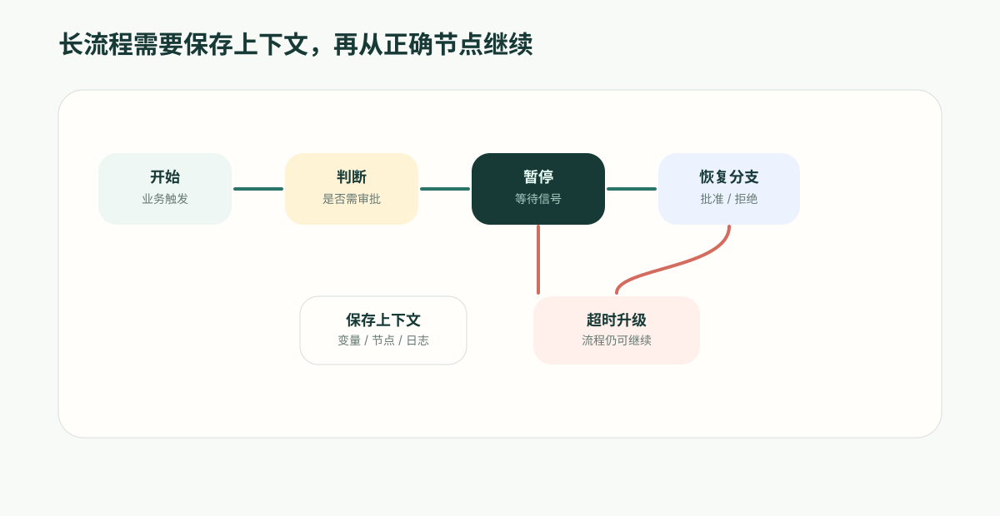

---
# @generated zh-Hant from zh-Hans (s2twp) — edit the zh-Hans file; delete this line to hand-maintain.
title: 審批與暫停恢復：自動化引擎為什麼必須會等待
description: 企業流程經常要等人審批、等使用者補材料、等時間到達或等外部結果。自動化引擎只有支援暫停和恢復，才能把這些等待放進同一條完整流程。
author: ObjectStack Team
date: 2026-06-05T11:30:00+08:00
status: published
topic: app-building
audience: business
solutions: []
industries: []
cover: ./cover.svg
tags: []
---

**先給結論**：審批不該是另一套系統。自動化引擎只有會“暫停和恢復”（等人、等材料、等時間、等外部回撥），才能把審批、等待和真實業務流程合成一條，而不是割裂成孤島。

很多流程不是“觸發後立刻做完”，而是“做到一半，等人、等時間、等外部結果”。

如果自動化引擎不會等待，審批就會被拆到另一套系統裡；如果它不會恢復，流程後半段就只能靠腳本、回撥和人工補救拼起來。

很多自動化工具擅長做短任務：觸發後馬上執行幾個動作，然後結束。

但企業流程很少這麼簡單。它經常需要等人審批、等使用者補充材料、等三天後檢查結果、等外部系統回撥。流程不是幾秒鐘跑完，而是可能持續數小時、數天甚至數週。

這就是為什麼自動化引擎必須支援暫停和恢復。

如果沒有這個能力，審批就會被做成另一套系統，等待會被做成定時任務，外部回撥會被做成 Webhook 腳本。業務流程被切成很多段，系統能跑，但很難看成一條完整鏈路。

## 審批為什麼不應該獨立成孤島

很多企業系統裡，審批是獨立模組：業務系統發起審批，審批系統處理人同意或拒絕，再回調業務系統更新狀態。

這能工作，但會帶來割裂。

業務人員想知道一條折扣申請為什麼被拒絕，需要同時看商機記錄、審批記錄、通知記錄和後臺日誌。管理員想修改流程，也要分開改自動化規則和審批規則。

更好的方式是把審批作為流程中的一個節點。

例如折扣審批流程可以是：

1. 商機折扣超過閾值；
2. 自動檢查金額、客戶等級和利潤率；
3. 暫停，等待銷售經理審批；
4. 如果折扣更高，再暫停等待財務審批；
5. 通過後生成正式報價；
6. 拒絕後退回銷售並記錄原因。

審批不是另一個系統裡的黑盒，而是這條流程中會暫停的步驟。

## 暫停不是停止

暫停和停止不同。

停止意味著流程結束；暫停意味著流程還活著，只是在等待一個訊號。

這個訊號可能來自：

- 經理批准或拒絕；
- 使用者提交補充表單；
- 三天等待時間到達；
- 外部系統返回處理結果；
- 管理員手動恢復；
- 另一個流程完成。

自動化引擎暫停時，需要儲存當前上下文：流程執行到哪個節點、已經產生了哪些變數、前面哪些步驟成功、等待哪個人或哪個事件、恢復後應該走哪條分支。

沒有這些上下文，恢復就會變成“重新跑一遍”，容易造成重複通知、重複建立任務、重複呼叫外部系統。

## 為什麼暫停恢復是企業流程分水嶺

是否支援暫停恢復，決定了自動化引擎能不能承載真正的業務流程。

短任務自動化只需要執行器；長流程自動化需要狀態管理。

例如：

- 報銷複核要等待員工補充發票；
- 合同審批要等待法務修改條款；
- 供應商准入要等待外部資質結果；
- 客服升級要等待研發確認原因；
- 專案變更要等待多個負責人意見。

這些都不是“立即執行”。它們需要在等待期間保留業務狀態，等訊號回來後繼續。

如果平臺不支援暫停恢復，就會讓每個模組自己儲存狀態。最後系統裡會出現很多半流程：審批表裡一段、定時任務裡一段、業務物件裡一段、腳本裡一段。

## 審批通過和拒絕應該進入不同分支

審批節點不只是“等待一下”。

它的結果會決定流程分支。

例如：

- 經理批准：繼續財務審批；
- 經理拒絕：退回銷售並要求補充說明；
- 財務批准：生成正式報價；
- 財務拒絕：標記為需重新定價；
- 超時未處理：升級給上級。

這要求自動化引擎把審批結果作為結構化訊號，而不是一段文字備註。

當審批結果回到流程裡，後續動作才能根據 approve、reject、timeout 等分支穩定執行。業務人員也能在流程圖上看見不同結果會走向哪裡。

## 等待時間也是一種暫停

暫停不只發生在人工審批。

很多業務規則都和時間有關：

- 提交報價後 3 天未回覆，提醒銷售；
- 工單 4 小時未響應，升級主管；
- 合同到期前 30 天建立續約任務；
- 供應商資料提交後 7 天未稽核，通知採購經理。

如果等待時間只靠定時任務掃描，很容易變成另一套邏輯。更好的方式是：流程走到等待節點，記錄等待到什麼時候；時間到後，流程從等待節點繼續執行。

這樣，時間驅動的動作也在同一條流程裡，而不是藏在後臺任務裡。

## 外部回撥也需要恢復流程

跨系統流程常常需要等待外部結果。

例如：

- 電子簽約完成後繼續開戶；
- 支付成功後啟動實施；
- 外部風控返回後進入複核；
- 物流異常確認後通知客戶。

這些場景裡，外部系統回撥不是重新觸發一條新流程，而是恢復原來的流程。只有這樣，平臺才能知道它等待的是哪一條業務記錄、哪個節點、哪個外部請求。

這能避免一個常見問題：回撥到了，但系統不知道它屬於哪條流程，只能靠查表和猜狀態來處理。

## 暫停期間也要有可見性

很多流程不是失敗了，而是卡住了。

審批人在休假，外部系統沒返回，客戶沒有補充材料，等待節點時間還沒到。業務人員需要知道流程停在哪裡。

一個好的自動化引擎應該能展示：

- 當前等待的節點；
- 等待物件是誰或什麼事件；
- 已等待多久；
- 是否快要超時；
- 超時後會走哪個分支；
- 誰可以手動干預。

這讓流程從“後臺自動化”變成“可運營流程”。運營團隊可以發現瓶頸，管理員可以最佳化節點，管理者可以看到流程效率。

## ObjectOS 的差異

ObjectOS Automation 把審批、等待和外部訊號視為流程能力，而不是外圍外掛。

當流程執行到需要人或時間的節點時，它可以暫停；當審批結果、時間或外部事件回來時，它可以從正確上下文繼續。通過、拒絕、超時和失敗都能進入不同分支，並留下執行記錄。

這讓審批不再是另一套系統，等待不再是散落的定時任務，外部回撥也不再是孤立腳本。

對企業來說，這一點非常關鍵。真正的業務自動化不是讓系統在幾秒鐘內做完所有事，而是讓系統在幾天、幾周的業務週期裡，始終知道流程在哪裡、等誰、下一步做什麼。

暫停和恢復，是自動化引擎從任務執行器走向業務流程執行時的分界線。
