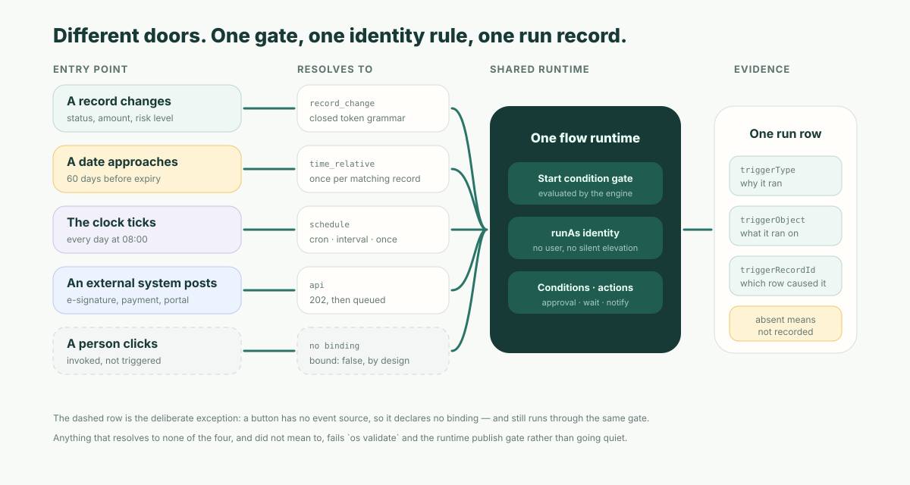

Where a process starts — a record change, a clock, a date field, a button, an inbound HTTP post — is the cheap decision. The expensive one is what sits immediately behind it. Five entry points that each carry their own copy of the business rules are five sets of rules to keep in sync, and they drift within a quarter. A mature automation engine makes the entry point a thin binding and everything after it shared: one condition gate, one action vocabulary, one identity rule, one run record. ObjectStack routes exactly four trigger types plus one deliberate non-trigger, and refuses at build time the fifth thing people write by accident.

That fifth thing deserves a name.

## The unbound flow

A team ships `renewal_notice`. Studio lists it. The metadata API serves it. The build passes. Its status is `active`. It has never run once.

The start node says `triggerType: 'onCreate'` — a spelling no part of the engine routes anywhere. Nothing failed, so nothing was logged. There are no error rows, because there are no rows: the flow was never wired to an event source at all. Everyone who looks at it sees a published, active automation, and every one of those observations is true.

Call it the **unbound flow**: declared, deployed, listed, and connected to nothing. It is the trigger-layer twin of the bug everyone already instruments for — a flow that throws — except it emits no failures, no runs, and no logs, so the usual monitoring has nothing to notice. The platform's own logging rule puts this class of degradation at `error` severity for exactly that reason: persisted state and runtime state disagree while the outside keeps looking healthy.

The direct answer is a runtime status surface. `GET /api/v1/automation/_status` reports, per registered flow, four facts that together settle the question:

| Field | What it answers |
| --- | --- |
| `enabled` | Is the flow armed at all? A disabled flow stays registered and never runs. |
| `bound` | Is a trigger actually wired to it? |
| `triggerType` | Which binding was declared, if any. |
| `object` | Which object the trigger binds to, for object-bound types. |

`bound: false` is the answer that surface exists for, and it has exactly two causes. Either the flow declares no trigger — a manual or screen flow, which is correct and expected — or its declared trigger type has no registered trigger. `triggerType` is what separates the two. Without that field you can see that a flow is dead but not why, which is the difference between a status page and a diagnosis.



## Automation trigger types: what the engine actually resolves

The binding is not declared at the top of the flow. It lives on the start node's `config`, and the engine derives the trigger type from it with a fixed chain of checks. The order is a contract, not an implementation detail:

| # | The engine checks | Resolves to |
| --- | --- | --- |
| 1 | `config.triggerType` is a string beginning `record-` | `record_change` |
| 2 | `config.triggerType` is an array containing a `record-` token | `record_change` — deliberately, so it is refused loudly |
| 3 | `config.timeRelative` is an object | `time_relative` |
| 4 | `config.schedule` is set, or the flow declares `type: 'schedule'` | `schedule` |
| 5 | the flow declares `type: 'api'`, or `config.triggerType` is `'api'` | `api` |
| — | none of the above | no binding — a manual or screen flow |

Row 2 is worth reading twice. An unsupported array form is routed to the record-change trigger *precisely so that it fails* — the trigger names the flow and refuses it at bind time. Left to fall through the chain it would resolve to nothing at all and become a silent manual flow, which is the outcome the whole table exists to prevent.

Check 3 sits before check 4 deliberately. A time-relative flow *also* carries a `schedule` — that is its sweep cadence — so without the precedence it would bind to the plain schedule trigger and fire once with no record instead of once per matching record. A subtle wrong-but-green outcome, prevented by four lines of ordering.

One property of that chain is worth stating plainly, because it decides how strictly the platform can police the trigger layer: it is a private sequence of literal string and type tests with no registry lookup in it. Triggers are registered by *resolved* type, so a plugin can supply a new implementation of `record_change` or `api`, but **no package can teach the engine a new authored token**. That is why an off-grammar token is provably dead rather than possibly-fixable-by-installing-something — and why the build gate later in this article can call it an error with a straight face.

### Record change: let the data state move the process

The most common entry point, and the one with a closed grammar:

```
record-(before|after)-(create|insert|update|delete|write)
```

`write` is the create-or-update union — it binds `afterInsert` *and* `afterUpdate`, so "created or updated" is one flow rather than two copies of the same definition. Exactly one of the two hooks fires per mutation, since a write is an insert or an update, never both.

What makes a record-change trigger a business rule rather than a firehose is the condition on the same `config`. It is bare CEL, and it can read the previous row:

```ts
{
  id: 'start',
  type: 'start',
  label: 'On Announcement Retitled',
  config: {
    objectName: 'showcase_announcement',
    triggerType: 'record-after-update',
    condition: 'title != previous.title',
  },
}
```

`previous.*` is what lets a business person say "when risk goes from medium to high" instead of "every time a customer record is saved". The state-entry rule people actually want — fire on the transition, not on every save while the value stays put — is one expression: `status == "done" && previous.status != "done"`.

Two traps here are worth memorising, because both are silent:

- **Do not wrap conditions in template braces.** Conditions are bare CEL, so a field reference is written `record.amount`, not the `{amount}` form used for interpolation elsewhere. Braces parse as a CEL map literal and the expression fails.
- **Multi-event arrays are not supported.** `['record-after-create', 'record-after-delete']` binds nothing. Use a single `record-after-write` for created-or-updated; for any other combination, author one flow per event.

Flows whose own actions write the record they watch would loop forever, so the engine breaks re-entry: the same flow cannot re-fire for the same record while a prior execution is still in flight. The ordering there is also a contract — the start condition is evaluated *before* the re-entrancy breaker, so "this flow fires only when its condition is true" stays true on the dispatch the flow's own write causes.

### Time-relative: the trigger most teams hand-roll and get wrong

"Alert 60 days before the contract ends" looks like a record-change rule, and writing it as one is the single most common trigger bug in enterprise automation:

```ts
// The anti-pattern. Do not ship this.
condition: 'end_date == daysFromNow(60)'
```

That predicate is only evaluated when the record *happens to change*. It fires if and only if somebody edits that contract on exactly the right day — which, unattended, is almost never. The flow tests clean, demos fine, and quietly never alerts anyone.

The robust version used to be a hand-written scheduled sweep with a date-range query, re-implemented by every team that needed renewal alerts, document expiry, or overdue purchase orders. ObjectStack makes it declarative instead. A `timeRelative` descriptor on the start node sweeps an object and launches the flow **once per matching record**, with that record in context, so `record.*` references and the start condition work exactly as they do for record-change flows:

```ts
config: {
  timeRelative: {
    object: 'contracts',
    dateField: 'end_date',
    offsetDays: [60, 30, 7],
    filter: { status: 'active' },
  },
  schedule: { type: 'cron', expression: '0 8 * * *' },
}
```

Exactly one windowing mode must be set:

| Mode | Meaning | Typical use |
| --- | --- | --- |
| `offsetDays: [60, 30, 7]` | fires on the day the date field is exactly that many days out | T-minus reminders |
| `withinDays: 30` | fires every day the record stays inside the upcoming window | "expiring soon" |
| `withinDays: -14` | bounded lookback into the past | overdue sweeps that stop nagging |
| `withinDays: 0` | due today | day-of actions |

The negative range is bounded on purpose: an unbounded "past due" window means a record from four years ago re-alerts forever. Omit the cadence and the sweep runs daily at 08:00 UTC — daily is the point of the feature, so "never" would be the wrong default. Each sweep is capped (1,000 records unless you raise it) and logs when it clamps.

### Schedule: time-driven responsibility, with an honest vocabulary

A plain scheduled flow declares `type: 'schedule'` and a descriptor with three forms: `cron` with an `expression` and an optional `timezone`, `interval` with `intervalMs`, or `once` with an ISO timestamp.

That is the entire vocabulary, and it is worth saying what is *not* in it. There is no holiday calendar and no catch-up for a window the platform was down for. "Skip public holidays" is a condition you write inside the flow, not a knob you set on the trigger. Teams that assume otherwise discover it on the first bank holiday.

### Inbound HTTP: the webhook, pointed in the right direction

This is where vocabulary costs people days, so be precise about which way the arrow points.

In ObjectStack, a **webhook** in the metadata sense is *outbound*: a declared subscription that pushes to an external URL when records change, on `create`, `update`, `delete`, `bulk_update`, or `bulk_delete`. It is how the platform tells other systems something happened.

An external system telling *the platform* something happened is a different mechanism: an `api` flow. The engine arms it as an inbound hook and the trigger mounts an endpoint:

```
POST /api/v1/automation/hooks/:flowName/:hookId
  404  unknown flow or wrong hookId
  401  missing or bad HMAC signature (when the flow declares a secret)
  400  non-JSON body
  202  { accepted, messageId } — queued; a consumer executes the flow
```

Three properties of that endpoint are load-bearing:

1. **It validates and enqueues; it never runs the flow in-band.** Inbound HTTP is the first event source whose rate you do not control, and a slow flow may neither drop inbound events nor block the sender. Delivery is at-least-once, so an inbound flow must be authored idempotently — an `x-idempotency-key` header passes through to the queue's dedup window.
2. **`hookId` is a rotatable path token.** Rotate it to revoke old URLs without renaming the flow or touching subscribers' configuration elsewhere.
3. **`secret` enables HMAC-SHA256 over the raw body**, sent as `sha256=<hex>` in an `x-objectstack-signature` header — the GitHub and Stripe convention. Omit it and the endpoint accepts unsigned posts; the trigger warns about that at arm time rather than pretending it is fine.

The JSON payload becomes the flow's trigger record, so the authoring surface is the same one record-change flows use. That is the whole point of an entry point being thin: a contract-signing callback and a status change on an opportunity reach identical downstream logic.

An inbound event should not decide the business action either way. Contract signed does not mean "start implementation" — it means "evaluate whether implementation starts", which may depend on outstanding invoices, resource availability, or special terms. The webhook brings the fact; the flow makes the decision.

### The button: the entry point with no trigger, on purpose

A person clicking "Submit for discount approval" is not an event source, and ObjectStack does not pretend otherwise: manual flows resolve to no binding at all. They are invoked, not triggered — an action declared with `type: 'flow'` and `target` set to the flow name, invocable from a record page, a list, or an agent through MCP.

Being unbound does not mean being ungoverned. Action-level `requiredPermissions` are enforced with a 403 on the platform action route and mirrored as a UI hide, so the button is a permission boundary the other four entry points do not have. And because the run goes through the same engine, everything after the click — validation, approval routing, record locking, notification, audit — is the same machinery a scheduled sweep uses. A button that calls hidden logic instead is the fastest way to end up with two versions of one rule.

This is also why `triggerType` sits next to `bound` in the status report: `bound: false` on a manual flow is the declared shape, not a defect.

## Event-driven vs. scheduled: which miss can you live with?

The honest framing is not which style is more modern. Both miss things, in opposite directions:

| Style | Fires | Misses |
| --- | --- | --- |
| Event-driven (`record_change`) | when the fact changes | anything that becomes true without a write |
| Scheduled (`schedule`) | on cadence, regardless | a window the platform was down for — no replay |
| Sweep (`time_relative`) | once per matching record | records beyond the per-sweep cap |
| Inbound (`api`) | on the sender's schedule | nothing — but it may fire twice |

The date-based rule is the one that catches teams out: it becomes true without anyone touching the record, so an event-driven trigger never sees it, and hand-rolling it as a scheduled range query is a chore every team repeats. That is precisely why the sweep exists as its own trigger type rather than as a documented pattern. When a platform lacks it, teams rebuild it badly, one contract-renewal cron job at a time.

## One gate, every entry point

Here is the mechanism that makes "unify the rules behind the entry point" concrete rather than aspirational.

The start node's `condition` is evaluated by **the engine, not by the trigger**. Record-change, schedule, time-relative, inbound API, and a direct manual `execute()` all pass through the same predicate evaluator. A run whose gate closes is not an error — it returns a skipped result with `reason: 'condition_not_met'`, which is a different thing from a failure and is recorded as such.

If each trigger owned its own gate, "the same rule" would mean five implementations of it, and the drift would show up first as an inconsistency nobody can reproduce: the button path approves what the scheduled path rejects. One evaluator is a small architectural decision with an outsized governance payoff.

## Who is the flow when nobody clicked?

Multi-entry designs always hit the identity question, and most platforms answer it by quietly running everything with full access.

ObjectStack declares it. `runAs` defaults to `'user'` — the triggering user, with row-level security respected. A run whose trigger supplied **no** user has nothing to scope to, so its data operations are refused rather than silently elevated:

| Entry point | Carries a trigger user |
| --- | --- |
| Record change from a person's write | yes |
| Record change from a service or plugin write | no |
| Schedule | no |
| Time-relative sweep | no |
| Inbound API post | no |
| Button or manual invocation | yes |

So three of the four trigger types — plus a very common record-change case — need `runAs: 'system'` declared beside `nodes` and `edges`. The refusal is the feature: elevation is a sentence someone wrote in the flow definition and a reviewer can see in the diff, not an accident of which entry point happened to fire.

One related trap, since it surprises everyone once: a write marked as a system write does *not* suppress trigger dispatch. Only an explicit skip-triggers instruction does. Background writes fire record-change flows exactly like human ones — they simply arrive with no user attached.

## "Why did this run?" needs a durable answer

Trigger attribution belongs on the run record, not only in a log buffer. Each run row carries `triggerType`, `triggerObject`, and `triggerRecordId` as columns, so a scheduled run, an inbound webhook intake, and a record change stay distinguishable after the process restarts — which is exactly when someone is asking.

One reading rule comes with it: rows written before those columns existed have none, and **absent must read as "not recorded", never as "no trigger"**. A history surface that renders a missing value as an assertion invents facts about old runs.

## Make it hard for an agent to get it wrong

Most of these flows are now drafted by an AI agent from a sentence of business intent. That changes what a trigger layer owes you: not just a runtime that behaves, but a build gate that refuses the shapes which would never fire — because a plausible-looking wrong token is precisely what a model produces, and "it never ran" is not feedback a model receives.

The rule family exists because of a real evaluation on 2026-07-17 in which a record-change flow silently never fired. It runs from `os validate` and again at the runtime publish gate:

| Finding | What it catches | Severity |
| --- | --- | --- |
| `flow-trigger-unroutable` | a `record_change` flow whose `triggerType` routes nowhere — off-grammar, or missing | error |
| `flow-trigger-unknown-event` | a token outside the closed `record-…` grammar | error |
| `flow-time-relative-descriptor-invalid` | a `timeRelative` descriptor that does not parse | error |
| `flow-time-relative-descriptor-unroutable` | a `timeRelative` that is not an object at all, such as `timeRelative: 'daily'` | error |
| `flow-trigger-unknown-object` | a start node targeting an object this stack does not define | warning |
| `flow-draft-status-ambiguous` | an auto-triggered flow left at `status: 'draft'` | warning |

The line between error and warning is not how bad the outcome is — every finding above describes a flow that does not run. It is whether *this stack* is enough to know that. An unknown object name might be defined by another installed package the rule cannot see, so it advises. An off-grammar trigger token cannot be repaired by installing anything, because the authored-token-to-trigger-type map is that hardcoded chain with no registry lookup, so it gates.

Two smaller surprises fall out of the same table, and both are worth knowing before they cost you an afternoon. Draft flows **do** fire — only `obsolete` and `invalid` unbind a flow — which is why the draft rule flags ambiguity of intent rather than a dead flow. And a mis-spelled key inside a descriptor used to bind a sweep that ran daily, matched with the author's narrowing filter discarded, and reported itself as configured; closing those descriptors against unknown keys is what turned that into a refusal that names the key and the fix.

## What the trigger layer does not solve

Being honest about the edges is more useful than a feature list:

- **No holiday calendar, no missed-window replay.** Cron, interval, once, plus a timezone for cron. Anything else is logic you write.
- **No multi-event unions.** One event per flow, or `record-after-write` for created-or-updated.
- **Sweeps are capped.** A widened window quietly does less work than you expect; the clamp log is the only signal, so read it.
- **At-least-once inbound delivery.** Idempotent authoring is your responsibility.
- **Binding is not correctness.** A perfectly bound flow can fire on schedule for months and still change nothing useful. Whether a *firing* run did any work is a different question, answered by the run summary rather than the trigger layer.

## Where ObjectOS differs

The value is not a longer list of triggers. Every automation product has a long list.

The value is that the list is **closed** — four resolved trigger types plus one declared non-trigger — and that everything behind it is single: one resolution chain, one condition evaluator shared with manual invocation, one identity rule that refuses rather than elevates, one run row with the trigger stamped on it, and one build gate that fails the flows which would never fire. Entry points multiply as the business grows. The governed part does not.

The most valuable thing you can hand an agent writing these flows is that grammar itself: the trigger tokens, the descriptor shapes, and a validator that refuses the near-misses. Point it at the [ObjectStack spec](https://github.com/objectstack-ai/objectstack), let it draft the flow, and read the one diff that comes back — the start node's `config` is usually the only part worth arguing about. If you are earlier than that, [how a requirement becomes reviewable metadata](/en/blog/from-requirement-to-app/) is the step before this one.
