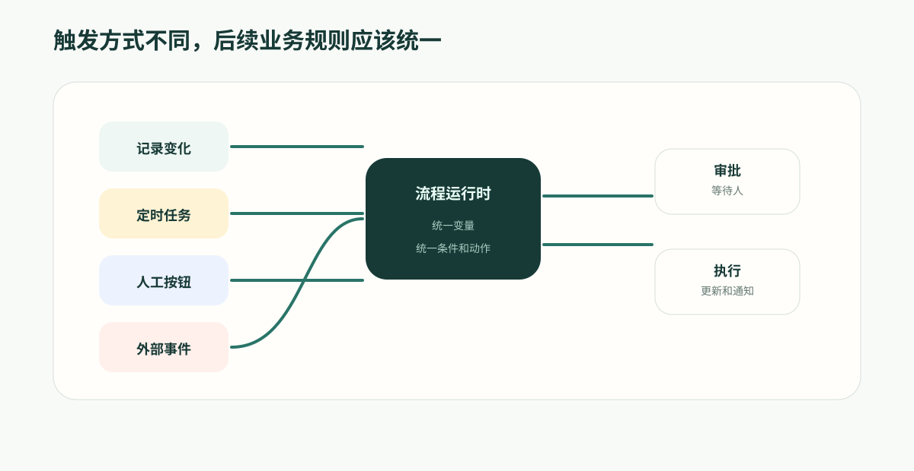

---
# @generated zh-Hant from zh-Hans (s2twp) — edit the zh-Hans file; delete this line to hand-maintain.
title: 自動化觸發模型：資料變化、定時、按鈕和 API 如何進入同一流程
description: 流程可以由記錄變化、定時計劃、人工按鈕或外部系統的入站呼叫觸發；ObjectStack 的 Webhook 指向相反方向，是出站推送。成熟的自動化引擎要統一入口後的業務規則，避免同一流程在多個地方重複實現。
author: ObjectStack Team
date: 2026-06-05T11:40:00+08:00
status: published
topic: app-building
audience: business
solutions: []
industries: []
cover: ./cover.svg
tags:
  - ObjectOS
  - 自動化引擎
  - 觸發器
  - 業務流程
---

**先給結論**：流程從哪觸發（資料變化、定時、人工按鈕、外部系統的入站呼叫）不是問題，邏輯分散才是。成熟的引擎統一入口之後的業務規則，讓多入口匯進同一套可治理的流程。

同一個客戶續約流程，可能從三個地方開始：系統定時檢查合同到期，客戶成功經理手動發起，客戶在門戶提交續約請求。

入口不同並不可怕。真正可怕的是，每個入口後面都藏著一套自己的業務邏輯。

一條業務流程從哪裡開始？

有時是記錄變化：商機階段變為已贏單，客戶風險等級升高，工單狀態超過 SLA。

有時是時間到了：每天早上生成逾期清單，每月最後一天檢查合同到期，每週彙總專案風險。

有時是人主動觸發：銷售點選“提交折扣審批”，客服點選“升級工單”，財務點選“發起複核”。

有時是外部事件：合同簽署平臺回撥，支付系統通知狀態變化，客戶門戶提交表單。

如果這些入口各自維護一套邏輯，系統很快會變得難以解釋。自動化引擎真正需要統一的，不只是“觸發器列表”，而是觸發後的業務執行模型。



## 多入口不是問題，邏輯分散才是問題

企業流程天然有很多入口。

一個客戶續約流程，可能由系統在合同到期前 60 天自動觸發，也可能由客戶成功經理手動發起，還可能由客戶在門戶提交續約請求觸發。

這三個入口不同，但後續業務邏輯可能高度相似：

- 查客戶和合同；
- 判斷客戶等級和金額；
- 分配負責人；
- 建立續約任務；
- 必要時進入審批；
- 記錄執行日誌。

如果每個入口都單獨寫邏輯，就會出現規則漂移：定時任務走一套判斷，按鈕走另一套判斷，外部表單又走第三套判斷。

統一觸發模型的價值，是讓不同入口進入同一個流程執行時。觸發方式可以不同，但判斷、動作、許可權和日誌應該一致。

## 記錄變化觸發：讓資料狀態推動流程

記錄變化是最常見的觸發方式。

例如：

- 工單優先順序變為高；
- 商機金額超過審批閾值；
- 供應商資質狀態變為過期；
- 報銷狀態變為待複核；
- 客戶健康分下降到風險區間。

這類觸發的核心問題是：不是每次儲存記錄都應該跑流程。平臺需要判斷“什麼變化真正有業務意義”。

一條成熟的記錄變化觸發，應該能表達：

- 監聽哪個物件；
- 關注建立、更新還是刪除；
- 哪些欄位變化才觸發；
- 新舊值滿足什麼條件；
- 是否只在第一次進入某個狀態時觸發；
- 觸發後把當前記錄作為流程上下文。

這樣，業務人員可以說“當客戶風險從中變成高時觸發”，而不是“每次客戶記錄更新都跑一遍”。

## 定時觸發：處理時間驅動的業務責任

很多責任不是由使用者操作觸發，而是由時間觸發。

例如：

- 每天檢查逾期工單；
- 每週生成高風險客戶清單；
- 每月提醒預算負責人複核費用；
- 合同到期前 90 天建立續約任務；
- 供應商資質過期前 30 天通知採購。

定時觸發看起來簡單，最貴的坑是把“業務上想要的東西”當成觸發器上的開關。

平臺真正認識的排程詞彙只有三種形態，寫在流程起始節點的 `schedule` 上：

- `cron`：一個 cron 表示式（`expression`），可選 `timezone`，不寫預設 UTC；
- `interval`：固定間隔 `intervalMs`，單位毫秒；
- `once`：一個 ISO 時間點 `at`，只跑一次。

這就是全部。下面這些經常被當成“定時任務的設定項”，平臺並沒有對應的開關：

- **節假日是否跳過**——沒有節假日日曆。要跳過，就在流程裡寫成條件判斷。
- **漏跑後是否補跑**——平臺停機錯過的視窗不會重放，恢復後從下一個正常時間點繼續。
- **重複執行是否會建立重複任務**——去重是流程自己的冪等邏輯。
- **結果是否要彙總給負責人**——那是流程裡的一個動作。

這一條值得說明白，因為它的失敗是靜默的：假設平臺會替你跳過節假日，第一個法定假日不會報錯，只會照常發出一批不該發的通知。

所以定時觸發的價值不在觸發器本身，而在觸發之後：它和其他入口一樣進入自動化引擎，共用同一套上下文、條件、動作、日誌和失敗處理。

## 人工觸發：按鈕背後也應該是流程

很多業務流程不是自動開始，而是由人判斷後發起。

例如銷售覺得折扣需要審批，點選“提交折扣審批”；客服覺得工單需要研發介入，點選“升級”；財務發現報銷有疑問，點選“發起複核”。

這些按鈕不應該只是前端事件。它們背後也應該進入自動化流程。

原因很簡單：人工觸發之後，系統仍然需要判斷、流轉、等待、通知和記錄。

一個“提交折扣審批”動作可能要：

- 校驗折扣、金額和必填材料；
- 判斷是否需要經理或財務審批；
- 鎖定報價欄位；
- 建立審批任務；
- 等待審批結果；
- 根據通過或拒絕更新商機狀態；
- 留下完整審計。

如果按鈕只調用一段隱藏邏輯，後續就很難治理。把人工觸發也納入同一套自動化引擎，業務動作才會長期一致。

## 外部系統觸發：入站是 API 觸發，Webhook 指向相反方向

這裡最容易被詞彙坑到，所以先把箭頭的方向說清楚。

在 ObjectStack 裡，**Webhook 是出站的**：它是一條宣告式訂閱，記錄發生 `create`、`update`、`delete`、`bulk_update`、`bulk_delete` 時，由平臺把資料推送到外部 URL，可用 `secret` 做 HMAC 簽名。它是平臺告訴別的系統“我這裡發生了什麼”。

**外部系統告訴平臺“我那裡發生了什麼”，是另一套機制：`api` 流程觸發。** 引擎為 `type: 'api'` 的流程裝載一個入站鉤子，掛在一個端點上：

```
POST /api/v1/automation/hooks/:flowName/:hookId
  404  流程不存在，或 hookId 不對
  401  缺少或錯誤的 HMAC 簽名（當流程配置了 secret）
  400  請求體不是 JSON 物件
  202  { accepted, messageId } —— 已入隊，由消費者執行流程
```

客戶在門戶提交資料，電子簽約完成，支付狀態改變，物流異常，外部風控結果返回——這些進入平臺的路徑都是 `api` 觸發。把它們叫成“Webhook 入口”，會讓人去找一個並不存在的入站接收器物件。這不是兩套機制，是同一套：入站只有這一條路。

這個端點有三點是承重的：

1. **只校驗和入隊，從不在請求裡內聯執行流程。** 入站 HTTP 是第一個速率不由你控制的事件源，慢流程既不能丟事件，也不能把傳送方堵住。投遞是至少一次的，所以入站流程必須寫成冪等的——`x-idempotency-key` 請求頭會傳到佇列的去重視窗。
2. **`hookId` 是可輪換的路徑令牌。** 輪換它就能作廢舊 URL，不必改流程名，也不必動其他地方的配置。
3. **`secret` 開啟 HMAC-SHA256 校驗**：對原始請求體計算，以 `sha256=<hex>` 放在 `x-objectstack-signature` 請求頭裡，就是 GitHub 和 Stripe 的那套約定。不設 secret，端點會接受未簽名的請求；觸發器在裝載時打一條告警，而不是假裝沒事。

JSON 請求體直接成為流程的觸發記錄，`$record`、`record.*` 和裸欄位引用都能解析——和記錄變化流程完全相同的編寫方式。這正是入口應該做薄的意義：一個簽約回撥和一次商機狀態變化，落到的是同一段下游邏輯。

外部系統可以啟動流程，但不能繞過流程治理。入站觸發和其他入口一樣：

- 使用明確輸入引數；
- 通過簽名或憑證驗證；
- 進入同一套流程版本；
- 使用同一套動作和審批；
- 留下觸發來源和 trace。

事件本身也不應該直接決定業務動作。合同簽署完成不等於“馬上啟動實施”，而是“評估是否啟動實施”——還要看客戶是否有未結清款項、實施資源是否可用、合同是否包含特殊條款。外部事件帶來事實，自動化引擎承接業務決策。

這樣，自動化引擎就成為企業流程的統一入口，而不是每個系統自己實現一段流程邏輯。

## 統一觸發後的最大收益：複用

當觸發方式統一後，流程可以被複用。

同一條“客戶續約準備流程”可以由定時任務觸發，也可以由客戶成功經理手動觸發，還可以由客戶門戶請求觸發。不同入口傳入不同上下文，但後續判斷和動作儘量複用。

這會減少大量重複建設：

- 不需要為按鈕寫一套審批邏輯；
- 不需要為定時任務再寫一套提醒邏輯；
- 不需要為入站呼叫再寫一套更新邏輯；
- 不需要為外部系統單獨維護審計。

業務變化時，也只需要調整流程本身，而不是在多個入口裡同步改規則。

## ObjectOS 的差異

ObjectOS Automation 的價值，不是提供很多零散觸發器，而是把不同觸發方式帶入同一條業務執行時。

記錄變化、定時計劃、人工動作和外部系統的入站呼叫都可以成為流程入口。入口之後，流程使用統一的條件、變數、動作、審批、等待、錯誤處理和日誌。

這讓企業自動化更容易治理。

當業務問“為什麼這條流程被觸發”，平臺可以回答觸發來源；當業務問“不同入口是否執行同一套規則”，平臺可以展示流程版本；當管理員要修改規則，也不需要到處找指令碼。

自動化引擎真正統一的不是事件，而是事件之後的業務執行方式。
