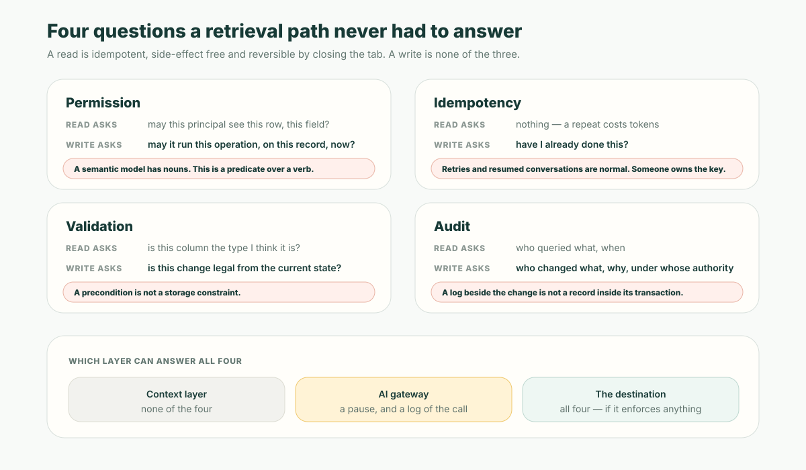

**Short answer:** the claim is right and the fixes are half a system. Context really is the binding constraint on enterprise AI — two of the largest data platforms built their June 2026 keynotes around that idea, two weeks apart. But everything shipped under the word *context* — semantic views, catalogs, glossaries, metrics, ontologies — improves what an agent can **read**. When the agent changes state, none of that meaning is binding on the write. The write runs on **borrowed enforcement**: the only rules applied to it are whatever the destination system happens to enforce on its own. Where the destination is a mature system of record, borrowing works fine. Where it is a table, a folder, or an app your agent scaffolded last week, there is nothing to borrow.

## Two keynotes, two weeks apart, one claim

Snowflake opened Summit 26 in San Francisco on June 1, 2026 with a keynote from CEO Sridhar Ramaswamy. Two weeks later Databricks opened Data + AI Summit at Moscone, where CEO Ali Ghodsi built the opening keynote around four words: context, control, cost, choice. Both arrived at the same position from the main stage — frontier models are no longer the scarce input, your business context is — and both shipped a product line named for it. Snowflake put a governed semantic layer inside its catalog and called the result Horizon Context. Databricks announced Genie Ontology, a continuously learned context layer feeding its agent products.

A note on sourcing, because it decides how much weight those two sentences can carry. The paragraph above characterises the framing of each keynote and uses each vendor's own product names; it deliberately quotes neither, because a stage line relayed through a conference recap is not a source. Everything after this point is therefore stated as *what the product does* — checkable against the vendors' own documentation — rather than *what someone said on stage*, which is the version that mutates every time it is retold.

Why simultaneously? Not coincidence, and not entirely conviction either. Two things are true at once and it is worth holding both:

- **It is correct.** Model capability stopped being a differentiator the moment your competitor could rent the same weights by the hour. What does not transfer is your definitions, your permissions, your history of decisions. That is a real observation about where the remaining advantage sits.
- **It is also the single most favourable claim a data-platform vendor could make.** "The model is a commodity, the substrate is the moat" reframes the AI budget as a data-platform budget. Noticing that does not make the claim false. It does mean you should check what was actually built underneath it, which is the rest of this piece.

## Three different things are being called "context"

The word travelled faster than its definition. By July it was attached to at least three unrelated artifacts, and they have different failure modes.

**The context window.** A runtime budget — what fits in the prompt for this call. Purely mechanical, and the thing most engineers mean by the word.

**Declared context.** A semantic model somebody authored and governs: entity definitions, metrics, a glossary, certified relationships, all versioned as objects in a catalog. Snowflake's Horizon Context is the clearest expression of this shape — business definitions promoted to governed catalog objects so every tool, dashboard and agent resolves the same "revenue".

**Inferred context.** A knowledge graph learned continuously from the exhaust of the business — dashboards, queries, lineage, table descriptions, plus tickets, chats, documents and mail through dozens of connectors — with the resulting knowledge ranked by authority and usage. Databricks' Genie Ontology is the clearest expression of this shape.

Both are legitimate. They are not substitutes, and the difference decides what you can do with them:

| | Declared context | Inferred context | The context window |
| --- | --- | --- | --- |
| What it is | Definitions someone wrote | A graph learned from artifacts | A prompt budget |
| When it is wrong | A definition is wrong | A ranking is wrong | Something got truncated |
| Who owns the mistake | The author | Nobody in particular | Nobody |
| How you fix it | Edit it; review the diff | Add signals and re-crawl; hope | Re-chunk |
| Can a build check it? | Yes | Not meaningfully | No |

Inferred context is the more impressive engineering and the better answer to "why is this dashboard the authoritative one". It is also, structurally, an estimate. You evaluate it the way you evaluate a search ranker: statistically, in aggregate, after the fact.

That is survivable for reads. It is disqualifying for writes, for one reason that the rest of this article turns on: **a rule you intend to enforce has to be declared.** You cannot enforce an inferred rule. You can only be influenced by one.

## The read/write asymmetry nobody priced in

Grounding and actions get discussed as two halves of one problem. They are not symmetric, and the industry priced them as though they were. Start with what actually happens on each path.

A **read** is: a question, a context layer that supplies meaning, a query executed under row-level and field-level policy, an answer. One layer you own, enforcement in the query itself, and the worst case is a wrong answer that a human notices.

A **write** is not that shape. And to be exact about the state of the art: both vendors did ship write paths in 2026. Snowflake's managed agents connect to enterprise systems to trigger actions and update records. Databricks' Genie agents write back through MCP connectors, governed by Unity AI Gateway policies authored as SQL functions, with approval gates — before a coding agent pushes to GitHub, for instance — and every model and tool call captured to system tables.

That is real governance and it should not be strawmanned. But read what it governs. It governs **the call**: which tool may be invoked, by whom, with what payload, with what pause and what log line. It does not govern **the operation**: what must be true before the change is legal, what must happen alongside it, and what must be recorded with it. Those live in the destination.

Here is the count, using a table this site has published before. [The ObjectOS action-tools piece](/en/blog/objectos-action-tools/) enumerated the seven steps a real CRM enforces every time a human clicks "convert lead", and showed that a hand-written `convert_lead` tool reproduces exactly one of them — the record writes — while silently dropping six. Take those same seven steps and ask a different question: which layer in a 2026 context-plus-gateway stack can supply each one?

| # | What the button enforces for a human | Context layer | AI gateway | Destination system |
| --- | --- | --- | --- | --- |
| 1 | May this user convert *this* lead | No | Allow/deny the tool | Yes |
| 2 | Required fields complete *for this operation* | No | Payload shape, at best | Yes |
| 3 | An existing duplicate account | Can inform | No | Yes |
| 4 | Contact, account and opportunity, atomically | No | No | Yes |
| 5 | Downstream assignment rules | No | No | Yes |
| 6 | The business audit entry | No | Logs the call | Yes |
| 7 | Owner confirmation where policy says so | No | Can force a pause | Yes — and decides *when* |

**One column has a yes in every row, and it is neither of the two you bought.** The context layer enforces none of the seven. The gateway enforces a version of two. All seven are ultimately supplied by the destination.

That is what borrowed enforcement means, and why it deserves a name: the write half of your agent architecture is governed by rules you did not write, cannot inspect from the agent side, and did not choose when you chose the context layer. It works exactly as well as the destination does. Point the same agent at Salesforce and at a Delta table, and the governance of the write differs by everything, while the diagram on the slide looks identical.

The action-tools piece named the related failure mode — an agent's tools written *beside* your business logic instead of *from* it, drifting in one direction — **the second write path**. Borrowed enforcement sits one layer above that: even when nobody hand-writes a tool, routing writes through connectors means every guarantee is the destination's, and most teams have never enumerated which of their destinations have any.

## Four questions a retrieval path never has to answer

The asymmetry is not a gap in anyone's roadmap. It follows from a property of reads: **a read is idempotent, side-effect free, and reversible by closing the tab.** A write is none of the three. Four questions fall out of that difference, and a retrieval path has never had to answer any of them.



**Permission.** A read asks: may this principal *see* this row, this field? That is a predicate over data, which is exactly why row-level security and field masking work and why they generalise so well. A write asks: may this principal perform *this operation*, on *this record*, *right now*? That is a predicate over a verb — and a semantic model is a vocabulary of nouns. It has entities, metrics, terms and relationships. There is nowhere in it to put "may convert". [Where those checks actually run](/en/blog/objectos-agent-permission-boundaries/) is a separate architecture with its own enforcement points.

**Idempotency.** Repeat a read and you have spent tokens. Repeat a write and you have issued a second refund. Nothing in a context layer holds the answer to "have I already done this?", because retrieval never needed one. Meanwhile agent runtimes retry on timeouts, re-plan after a truncated response, and run the same step twice when a conversation is resumed — the normal case, not the edge case. Someone has to own the deduplication key, and it is not the semantic model.

**Validation.** A semantic layer knows the shape of stored data: types, nullability, allowed values, lineage. An operation's preconditions are a different category. "The amount is within the approver's limit." "A lead with an unresolved duplicate cannot be converted." "A contract term change requires legal sign-off first." None of those is a storage constraint, and a column definition will never imply one.

**Audit.** A gateway log says a tool was called with a payload at a timestamp — genuinely useful for debugging and incident review. An audit record says who changed what, why, and under whose authority, and it belongs in the same transaction as the change so it cannot exist without it. Those are two different artifacts and only one of them survives contact with an auditor; if you are working to a regime with [runtime evidence requirements](/en/blog/eu-ai-act-runtime-audit/), the distinction is the whole compliance case.

## Read-only really is the whole job, often

The honest version of this argument has to concede a lot, because for a large share of enterprise AI running in production today, read-only is not a limitation — it is the entire scope of work, and doing it well is hard.

Self-serve analytics that returns the same number as the finance team's. Policy and benefits Q&A. Contract clause search. Diagnosing a ticket against six years of resolved ones. Sales research briefs. Every one of those is bounded by whether the model can find and trust the right context, and for every one of them the layers described above are precisely the right investment. Complaining that a semantic layer does not govern writes, in that world, is complaining that a bridge does not fly.

Three further concessions worth making plainly:

- **Read-only is a defensible architecture, not a lack of ambition.** Its failure mode is a wrong answer that a human catches; the write path's failure mode is wrong state that quarter-end close discovers. Teams that deliberately stayed read-only for a year while they built evaluation discipline usually made the right call.
- **Much of what gets called an "agent write" is a draft.** A proposed reply, a suggested classification, a filled-in form waiting for a click. That is a read system with a good handoff, and it is frequently the correct design rather than a stepping stone.
- **Borrowing works when there is something to borrow.** If your write destinations are mature systems of record whose operations already enforce permission, validation, atomicity and audit, then routing an agent through them is not a compromise — it is the right answer, and rebuilding those rules would be the mistake.

The narrower claim this article defends is this: the *value case* being sold — agents that close the loop instead of handing work back — is a write case, and the layer being sold as its enabler governs the read. That gap is not a scandal. It is a line item that has not been priced.

## What a context layer needs before an agent can be trusted to write

Five properties an enterprise AI context layer would need, in roughly the order you would have to acquire them. All five are answerable by reading definitions, which is the point — a property you can only assess by running the system is not one you can review before shipping.

1. **Verbs, declared.** The layer must be able to name operations, not only entities, metrics and terms. If your context model cannot express "convert lead" as a first-class object, it can never govern one. This is the property that separates a semantic layer from an application definition, and almost nothing marketed as a context layer has it.
2. **Preconditions attached to the verb, not to the table.** The rule that decides whether this operation may run now travels with the operation, and is enforced by whatever executes it — not restated in a prompt, a gateway policy and a UI predicate that will disagree within two quarters.
3. **One definition, two callers.** The operation the agent invokes is the same object the human's button invokes. Not an equivalent one. If there are two artifacts, they are already drifting, and the drift is invisible from both ends.
4. **An identity that narrows.** The write executes as the person in the conversation, or as a named agent principal with strictly less authority — never a service account that can do everything, with the scoping done afterwards in the tool's code.
5. **A commit-time record.** The audit entry is written inside the same transaction as the change, so a change without a record is not a possible state. A log emitted next to the call is observability; it is not the same guarantee.

There is a fast way to find out where you stand, and it is more useful than an architecture review. **Take the newest destination in your agent's write path — the one added most recently, which is probably a table, a folder, or a service somebody stood up this quarter rather than a twenty-year-old system of record — and ask what that destination enforces on its own.** Whatever the answer is, that is the governance on that write. Nothing upstream added to it.

## What this argument does not establish

**It does not say the context work was wrong.** Grounding is the constraint its vendors said it was, and a governed semantic layer is the correct fix for it. Both product lines described here do what they claim.

**It does not say a gateway is theatre.** Requiring approval before an agent pushes code, blocking regulated payloads at the boundary, and capturing every tool call to a queryable table are real controls that catch real incidents. They are just controls on the call.

**It does not make the agent's judgment right.** A correctly-invoked operation can still be the wrong operation. Everything above constrains which writes are possible and what they enforce; none of it decides whether this was the moment to run one. That limit is general to governed tooling and [the MCP piece argues it in full](/en/blog/mcp-governed-tool-layer/).

**And it does not settle who should own the definitions.** Whether your verbs live in a vendor's platform or in a repository you control is a separate argument, made [here](/en/blog/enterprise-ontology-race-open-vs-closed/), with real trade-offs in both directions.

## Where this leaves the definition layer

If a rule has to be declared to be enforced, and all five properties above are declarations, then the artifact that governs an agent's writes is not a semantic model of your data. It is a definition of your application: objects, permissions, and the operations that may be performed on them, with the preconditions and the confirmation policy and the audit attached to the operation itself.

That is the bet ObjectStack makes. The typed metadata is an **open business ontology** — a versioned definition you keep in your own repository under Apache 2.0 — and it carries verbs. An Action is one object that produces both the button a person clicks and the tool an agent calls, so permission, validation, transaction and audit are enforced once, for both. Exposing one to an agent is a few lines of metadata that default to off. [The action-tools piece](/en/blog/objectos-action-tools/) walks through what that costs to author and what it buys.

The reason to care is not elegance. It is that the application is increasingly written by an AI, and the only durable check on that is whether a human can [review AI generated code](/en/blog/ai-wrote-your-app-dare-to-merge/) as a small diff before it ships. An inferred context layer offers nothing to review. A declared operation is a few lines someone signs.

So the useful next step is not a migration. Point your coding agent at the [ObjectStack spec](https://github.com/objectstack-ai/objectstack) and have it declare one operation your team already performs by hand, with its permissions, its precondition and its confirmation policy attached. What comes back is the review surface this whole article is arguing for — small enough to read in a minute, and the same object the button would use.

```bash
npm i -g @objectstack/cli && os start
```

Context was the right diagnosis. The industry then built a very good read model and called it a treatment. The half that changes your business is still governed by whatever happens to sit at the far end of the connector — and if you have not gone and looked at what that is, you do not know what your agent is allowed to do.
