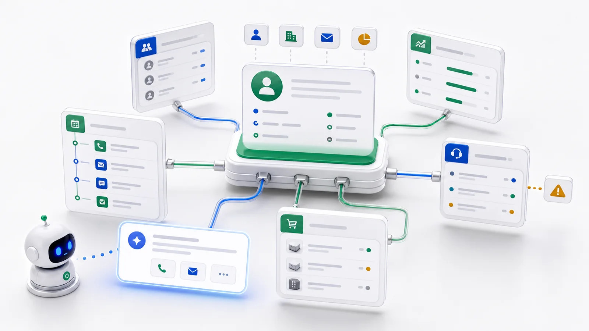

Si une entreprise ne devait connecter qu'un seul système à l'AI en premier, je commencerais par le CRM.

La raison est simple : le CRM est proche du revenu.

Qui est le client, qui possède la relation, où en est l'opportunité, le devis a-t-il été envoyé, que s'est-il passé lors du dernier échange, quels comptes refroidissent, quels deals semblent prometteurs mais n'avancent pas ? Ces questions reviennent chaque jour et consomment beaucoup de temps de management.

Dans beaucoup d'entreprises, le CRM reste une boîte de dossiers. Les commerciaux saisissent des notes, les managers exportent des rapports en fin de mois, puis la direction demande : « Que se passe-t-il avec ce compte ? » Tout le monde retourne alors aux données, interroge le responsable et reconstruit une feuille de calcul.

Si l'AI doit entrer dans les opérations réelles, le CRM est l'un des points d'entrée les plus naturels.

## Ne commencez pas par “l'AI qui vend”. Commencez par l'AI qui comprend les clients.

Quand on entend “AI plus CRM”, on pense vite aux e-mails automatiques, aux appels automatiques et à la vente automatique. C'est trop tôt.

La première étape utile consiste plutôt à répondre aux questions métier :

- Que s'est-il passé récemment avec ce client ?
- Pourquoi cette opportunité est-elle bloquée ?
- Quels comptes n'ont pas été touchés depuis longtemps ?
- Quels deals importants risquent de glisser ?
- Quels clients le manager doit-il revoir la semaine prochaine ?

Ces questions paraissent simples, mais la réponse est dispersée entre comptes, contacts, opportunités, activités, devis, contrats, tickets et notes.

Un humain peut recoller les morceaux, lentement. Si l'AI relie ces objets sous les mêmes permissions que l'utilisateur, elle devient un assistant concret de pilotage commercial.

## Un exemple concret

Demandez :

> « Montre-moi toutes les opportunités de plus de 200 000 dollars ce trimestre qui n'ont pas été mises à jour depuis deux semaines. »

Une AI connectée au CRM ne devrait pas exiger un export Excel. Elle doit comprendre ce qu'est une opportunité : montant, étape, date de clôture prévue, responsable, compte et dernière activité. Elle doit comprendre les filtres : ce trimestre, plus de 200 000, aucune mise à jour en deux semaines. Et elle doit résumer le risque :

- Deals importants sans activité récente.
- Opportunités proches de la clôture mais encore en étape précoce.
- Comptes avec tickets support ouverts.
- Enregistrements sans prochaine étape claire.

À ce moment-là, l'AI n'est plus une boîte de chat. C'est une couche d'analyse métier au-dessus du CRM.

## Pourquoi beaucoup de CRM ne sont pas prêts

Le blocage n'est généralement pas le modèle, mais le CRM.

**Les données sont dispersées.** Comptes, contacts, opportunités, notes, fichiers, tickets, contrats et activités vivent séparément. Les humains connaissent les relations ; l'AI ne les connaît que si elles sont modélisées.

**Les permissions sont floues.** Les commerciaux voient leurs comptes, les managers leur région, les dirigeants tout le pipeline. Si l'AI se connecte en admin, ce n'est pas de l'intelligence, c'est une escalade de privilèges.

**La sémantique manque.** Dans la base, les champs peuvent s'appeler `acct_id`, `opp_stage` ou `last_touch_at`. Les équipes comprennent le sens ; l'AI a besoin d'une structure métier.

La clé n'est donc pas de “donner la base au modèle”, mais de décrire clairement les concepts CRM importants.

## Étape 1 : modéliser les objets CRM essentiels

Il n'est pas nécessaire de modéliser tout le CRM le premier jour. Commencez par cinq objets : Account, Contact, Opportunity, Activity et Task. Pour un contexte plus complexe, ajoutez Quote, Contract, Case et Payment.

Ces objets doivent porter le sens métier : labels, types, règles obligatoires, significations des options, relations, droits de lecture et d'édition, champs non exposés à l'AI et actions demandant une validation humaine.

L'AI ne voit alors plus une pile de tables, mais une carte métier.

## Étape 2 : commencer en read-only

La première étape la plus sûre est read-only. L'AI peut interroger clients, opportunités et activités, mais ne peut pas modifier les enregistrements. L'équipe valide ainsi la valeur sans risque d'écriture.

Les premiers usages sont simples : résumé de compte, inspection du pipeline, rapport hebdomadaire, signaux de churn, préparation de rendez-vous. Rien n'exige d'écrire dans le CRM, mais le travail des managers et des opérations commerciales diminue.

## Étape 3 : suggérer avant d'agir

Après l'analyse read-only, il ne faut pas laisser l'AI éditer librement. Il faut lui faire suggérer : créer une tâche de suivi, marquer une opportunité à risque, rappeler au responsable de mettre à jour la prochaine étape, ajouter un client à une séquence de renouvellement, envoyer une liste d'exceptions.

Au début, un humain confirme. Quand les patterns sont stables, certaines actions à faible risque peuvent être automatisées.

## Étape 4 : connecter le CRM au reste du métier

Le CRM est rarement toute la vérité. Le support peut montrer des plaintes répétées, l'ERP un risque d'inventaire, la finance des factures impayées. Si l'AI ne lit que le CRM, elle voit une image partielle.

La vraie valeur arrive quand l'AI comprend le client à travers CRM, support, ERP, finance et contrats. Elle a besoin d'une couche métier qui comprend objets, relations et permissions.

## Cinq questions avant un projet CRM AI

1. Quelles questions de management commercial voulons-nous que l'AI réponde ?
2. Quels objets sont nécessaires ?
3. Quels champs sont sensibles ?
4. La phase un doit-elle être read-only ou créer des tâches ?
5. Que peuvent voir commerciaux, managers et dirigeants ?

Ces réponses comptent plus que le choix du modèle.

## L'approche ObjectOS

ObjectOS ne demande pas de remplacer le CRM. Le chemin réaliste consiste à connecter la base ou l'API existante, modéliser les tables clés comme objets et laisser l'AI accéder aux données métier via ces objets et permissions.

Les données restent en place. Le CRM continue de fonctionner. Les permissions ne sont pas contournées. Vous commencez en read-only, puis suggestions, puis automatisation. Chaque étape est auditée.

La valeur de l'AI dans le CRM n'est pas seulement de remplir moins de champs. Elle est d'aider le management à comprendre l'état réel des clients et des opportunités à temps pour agir.
