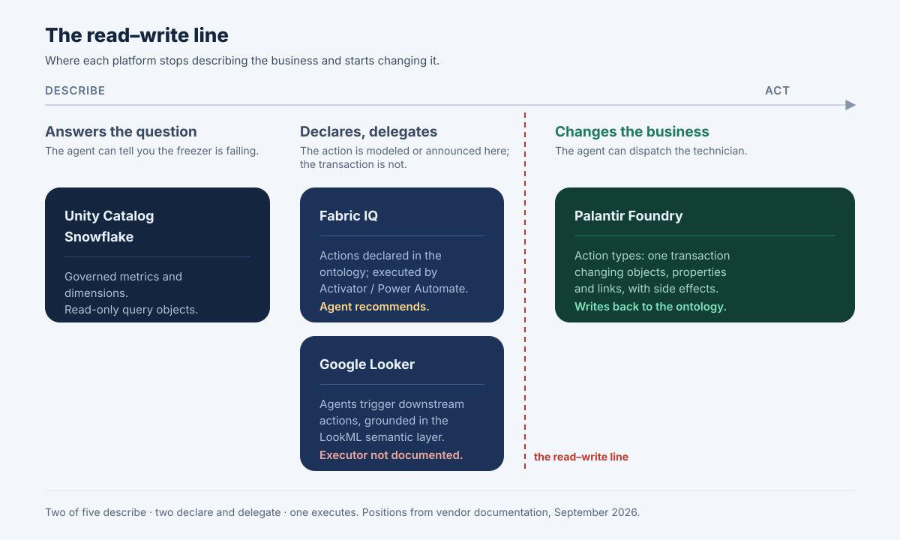

**The short version:** all four platforms model business objects and the relationships between them. Only two model **actions** — the operations that change the business, not just describe it. Only one of those executes actions as a transaction inside the ontology itself. That single row is the difference between a semantic layer your agent can *read* and an ontology your agent can *act* in, and it is the row most comparison posts get wrong.

Call it **the read–write line**: the point where a platform stops describing your business and starts changing it. Every cell below is sourced to the vendor's own documentation or announcement. Of the 24 cells in the main table, 23 could be confirmed from a vendor source; the one that could not is marked *Unverified* rather than guessed.

This post is the table. The argument about *who should own* this layer — and why fragmentation, not lock-in, is the expensive failure — is a separate piece: [Open vs. Closed Enterprise Ontologies](/en/blog/enterprise-ontology-race-open-vs-closed/).

## 1. What each vendor actually shipped, and when

The category did not arrive at once. It arrived across nine months, from three different starting positions — a data platform, a lakehouse, a warehouse — plus the incumbent that has had an ontology for years and spent 2026 doing something else with it.

| Platform | What shipped | When | Status today |
| --- | --- | --- | --- |
| **Microsoft Fabric IQ** | Ontology item + agent workload | Ignite 2025, Nov 18–21 | Public preview |
| **Databricks Unity Catalog** | Business Semantics, metric views | Data + AI Summit, Jun 2026 | GA |
| **Snowflake** | Semantic View Autopilot | Feb 3, 2026 | GA |
| **Palantir Foundry** | SuperRepo: Ontology-as-code | Week of Aug 3, 2026 | Beta |

Three notes that change how you read that table.

**Microsoft entered highest up the stack.** Fabric IQ is a full workload, not a feature: Ontology, Graph, Data Agent and Operations Agent as separate items. The Ontology item "defines core business entities, relationships, properties, rules, and actions" and is authored with no-code visual tools so business experts can build the model without waiting on data engineers. It is still in public preview, and Microsoft has not announced a GA date.

**Snowflake and Databricks entered from analytics, and both bet on automation over authoring.** Snowflake's Semantic View Autopilot autogenerates semantic views from your existing query history and BI assets — its stated premise is that your semantics are *already* defined in the SQL people run and the dashboards they trust, so modeling becomes curation rather than authoring. Databricks made Business Semantics GA and is open sourcing the core metric-view implementation into Apache Spark.

**Palantir did not ship an ontology in 2026 — it already had one.** What it shipped is the thing the other three are converging toward: SuperRepo, a single monorepo holding Ontology definitions, functions and the React application, developed and deployed as one versioned artifact. Object types, links, interfaces and actions are declared in TypeScript, and those code definitions are the source of truth. Hold that thought for section 5; it is the most uncomfortable fact in this post.

## 2. The comparison table

Five capabilities, four platforms. Cells are deliberately terse so this reads on a phone; the sourcing for each is in section 7.

| Capability | Fabric IQ | Unity Catalog | Snowflake | Palantir Foundry |
| --- | --- | --- | --- | --- |
| **Business objects** | Entity types | Metric views | Logical tables | Object types |
| **Relationships** | Typed, graph view | Joins in the view | Joins on shared keys | Link types |
| **Actions** | Declared, delegated | Read-only by design | Read-only by design | Native, transactional |
| **Permissions** | Item-level sharing | Inherited from UC | Public/private fields | Object + dynamic |
| **Agent interface** | Ontology MCP (preview) | Genie, AI/BI | Cortex Analyst, MCP | Ontology MCP, OSDK |
| **Definition portable** | *Unverified* | Spark OSS, OSI | YAML spec | Git repo, Foundry-bound |

**On the two "read-only by design" cells.** This is a positive claim, not an absence claim. Databricks documents metric views as read-only query objects — creating one "does not process or write any data. Only the query text is registered to the metastore." Snowflake semantic views are queried by putting a `SEMANTIC_VIEW` clause in a `FROM` clause. Neither product is *missing* actions; neither is trying to have them. They are semantic layers over a warehouse, and a warehouse semantic layer that wrote back to operational systems would be a different product.

**On the *Unverified* cell.** I could not confirm from Microsoft's own documentation whether a Fabric IQ Ontology item's definition can be exported as a file you hold and version yourself. The MCP endpoint exposes the ontology to agents, and Azure AI Search knowledge sources reference it by `workspaceId` and `ontologyId` — but a pointer is not the definition. If Microsoft ships or documents an export path, this cell changes and the lock-in profile in section 4 changes with it.

## 3. Where each one stops — the read–write line



**Unity Catalog and Snowflake stop at the answer.** A metric view or a semantic view gives an agent one governed definition of "revenue" so that the dashboard, the notebook and the agent all return the same number. That is a genuinely hard problem and both solved it well. The agent can then tell you the freezer is failing. It cannot dispatch the technician.

**Fabric IQ declares actions but delegates execution.** The ontology models actions as operations on entities — the documentation's own examples are "reroute aircraft, schedule repair, notify pilot" — and every action is connected to the workflow in an operational system that executes it. In practice you configure an action with Activator and a Power Automate flow, and the Operations Agent *recommends* actions rather than committing them. So the action is real and it is modeled in the ontology; the transaction, the retry semantics and the audit trail live in whatever the action is wired to.

**Palantir executes actions inside the ontology.** An action type is "the definition of a set of changes or edits to objects, property values, and links that a user can take at once", including side-effect behaviors on submission, and an action is "a single transaction that changes the properties of one or more objects." Palantir's own framing splits the ontology into semantic elements (objects, properties, links) and kinetic elements (actions, functions, dynamic security). Edits land in the object type's writeback dataset. This is the mature implementation of the thing the other three are approaching from different sides, and pretending otherwise would make this table useless.

**So the honest score on actions is 2–2, not 3–1.** The lazy version of this post says "only Palantir has actions." That is wrong: Fabric IQ models them too. The accurate version is that four platforms sit at three different places on the read–write line — two describe, one declares and delegates, one executes — and which one you need depends entirely on whether an agent reading your ontology is expected to *do* anything.

## 4. Lock-in profile

Lock-in is not one thing. Three questions separate the platforms, and the answers are less one-sided than the category's reputation suggests.

| Question | Fabric IQ | Unity Catalog | Snowflake | Palantir |
| --- | --- | --- | --- | --- |
| Definition in a file you hold | *Unverified* | Yes (Spark OSS) | Yes (YAML) | Yes (monorepo) |
| Runs off the vendor | No | Spark OSS path | No | No |
| In an open standard body | Not named | Named member | Co-founder | Not named |

**The honest counterweight: this category is standardizing, and quickly.** Snowflake co-founded the Open Semantic Interchange with Salesforce, dbt Labs, BlackRock and RelationalAI in September 2025 — a vendor-neutral, Apache-2.0 spec for exchanging semantic models (metrics, dimensions, relationships) between platforms. Spec v0.1 was finalized in January 2026. In July 2026 the initiative entered the Apache Incubator as **Apache Ossie**, with 50+ member organizations including Databricks, Oracle and Collibra. Databricks is separately open sourcing the metric-view implementation into Apache Spark.

That matters for anyone arguing that a closed platform is definitionally a trap. Two of the four are actively moving their definition format toward a neutral standard body. If Ossie succeeds, "my metrics are portable" stops being a differentiator for anyone.

Two limits worth stating just as plainly. First, Ossie covers **analytical** semantics — metrics, dimensions, relationships. Actions and permissions, the two rows where these platforms differ most, are not in scope, so the read–write line is exactly where portability currently stops. Second, portability of the definition is not portability of the system: a Snowflake semantic view exported as YAML still needs a Snowflake to run against, and a SuperRepo still materializes onto a Foundry enrollment.

## 5. Which to pick, by starting position

Nobody picks one of these on features. You pick the one that matches where your data and your engineers already are.

**Your business already runs on Microsoft 365 and OneLake.** Fabric IQ, and the fact that it is still in preview is the main cost. You get the highest-level model of the four, authored by business experts rather than engineers, and actions that reach Power Automate. Watch the export question before you model your entire company in it.

**Your analytics team lives in Databricks.** Unity Catalog Business Semantics. It is GA, the permission model is the one your team already administers, Genie is grounded in it, and the open-sourcing into Spark gives you the strongest portability story of the four. Do not expect it to operate anything.

**Your warehouse is Snowflake and you have years of query history.** Semantic View Autopilot is the only product here that bootstraps the model from what your organization already does, instead of asking a committee to define "revenue" from scratch. If your obstacle is the six-month modeling project rather than the technology, this is the strongest answer on the list — and it is a genuine capability gap for everyone else, including the approach at the end of this post.

**You need agents that act, with a transaction and an audit trail.** Palantir Foundry, and it is not close. The kinetic half of the ontology is a decade of engineering and none of the other three have shipped an equivalent.

**None of the above, or more than one of the above.** That is the case the four platforms handle worst, because each is strongest inside its own estate — and it is the case the companion post is about.

## 6. Where an open business ontology fits — and where it does not

Full disclosure: we build one, so read this section as the interested party's answer rather than a neutral verdict.

[ObjectStack](https://github.com/objectstack-ai/objectstack) is an **open business ontology**: objects, relationships, permissions, flows and actions as typed metadata in your own repository, Apache-2.0, with a runtime that derives the database, REST API, UI and MCP server from it and enforces permissions and audit on every call. On the read–write line, it sits with Palantir: actions are permission-checked server operations, and every exposed action doubles as a governed MCP tool.

```ts
import { ObjectSchema, Field } from '@objectstack/spec/data';

export const Ticket = ObjectSchema.create({
  name: 'support_desk_ticket',
  label: 'Ticket',
  sharingModel: 'private',
  fields: {
    subject: Field.text({ label: 'Subject', required: true }),
    status: Field.select({
      label: 'Status',
      required: true,
      options: [
        { label: 'Open', value: 'open', default: true },
        { label: 'Resolved', value: 'resolved' },
      ],
    }),
  },
});
```

Now the part that belongs in an honest comparison. **Three of the four beat this approach on something real:**

- **Snowflake beats it on cold start.** Semantic View Autopilot reads your query history and drafts the model. There is no equivalent here — you and your agent author the definition. If your problem is that nobody can agree on "revenue," Snowflake's answer is better than ours.
- **Databricks and Snowflake beat it on analytical semantics.** Metric views and semantic views carry aggregation semantics — facts, dimensions, metrics, semi-additive rules — over warehouse-scale data. An application ontology models objects and operations, not a metrics layer, and it is not a substitute for one.
- **Palantir beats it on modeling depth and accountability.** A decade of ontology engineering, forward-deployed engineers who will sit with your team, and one vendor on the phone when it breaks. An open format gives you the file; it does not give you someone to call.
- **Fabric IQ beats it on who can author.** Business experts building the model in a no-code visual tool is a different and broader distribution than "your coding agent writes typed metadata in a repo."

What is different here is narrower than "better": the definition is an ordinary file in your repository under an open license, the runtime that enforces it is self-hostable, and both halves — semantic *and* kinetic — are in the same portable artifact rather than split across a portable spec and a proprietary execution engine. Whether that is worth more than modeling depth, autogeneration or ecosystem integration is a judgment about your starting position, not a fact this table can settle.

## 7. Sources

Every claim above traces to one of these.

- **Microsoft Fabric IQ** — [What is Fabric IQ?](https://learn.microsoft.com/en-us/fabric/iq/overview) · [What Is Ontology (Preview)?](https://learn.microsoft.com/en-us/fabric/iq/ontology/overview) · [Introducing Fabric IQ](https://blog.fabric.microsoft.com/en-us/blog/introducing-fabric-iq-the-semantic-foundation-for-enterprise-ai) · [Use Ontology MCP Server](https://learn.microsoft.com/en-us/fabric/iq/ontology/how-to-use-ontology-mcp-server) · [Create an Operations Agent](https://learn.microsoft.com/en-us/fabric/iq/ontology/how-to-create-operations-agent)
- **Databricks Unity Catalog** — [GA and open sourcing of Business Semantics](https://www.databricks.com/blog/redefining-semantics-data-layer-future-bi-and-ai) · [Unity Catalog semantics](https://docs.databricks.com/aws/en/uc-semantics/) · [Metric views](https://docs.databricks.com/aws/en/uc-semantics/metric-views/) · [Manage metric views](https://docs.databricks.com/aws/en/uc-semantics/metric-views/manage)
- **Snowflake** — [Semantic View Autopilot GA press release](https://www.snowflake.com/en/news/press-releases/snowflake-delivers-semantic-view-autopilot-as-the-foundation-for-trusted-scalable-enterprise-ready-AI/) · [Semantic View Autopilot docs](https://docs.snowflake.com/en/user-guide/views-semantic/autopilot) · [Overview of semantic views](https://docs.snowflake.com/en/user-guide/views-semantic/overview) · [CREATE SEMANTIC VIEW](https://docs.snowflake.com/en/sql-reference/sql/create-semantic-view) · [Snowflake-managed MCP server](https://docs.snowflake.com/en/user-guide/snowflake-cortex/cortex-agents-mcp)
- **Palantir Foundry** — [Ontology overview](https://www.palantir.com/docs/foundry/ontology/overview) · [Action types](https://www.palantir.com/docs/foundry/action-types/overview) · [The Ontology system](https://www.palantir.com/docs/foundry/architecture-center/ontology-system) · [SuperRepo](https://www.palantir.com/docs/foundry/superrepo/overview) · [August 2026 announcements](https://www.palantir.com/docs/foundry/announcements/2026-08)
- **Open Semantic Interchange / Apache Ossie** — [OSI announcement](https://www.snowflake.com/en/blog/open-semantic-interchange-ai-standard/) · [Ossie enters the Apache Incubator](https://ossie.apache.org/updates/ossie-enters-apache-incubator/)

Vendor documentation moves. Where a cell is time-sensitive — Fabric IQ's preview status, the *Unverified* export cell, Ossie's incubation — check the source before you quote this table in a decision document.

## Closing

The useful question in 2026 is not "which ontology is best." It is **where on the read–write line do you need to be**, because that single answer eliminates two of the four platforms immediately. If your agents only need to answer questions about the business, the two warehouse-native semantic layers are cheaper, GA today, and standardizing fast. If your agents need to change the business, the field narrows to platforms that model actions — and then the real question is who holds the definition when your vendor mix changes.

```bash
npm create objectstack@latest my-app
```

Model one object, point your coding agent at it, and `git commit` the definition. Whatever you decide about the four platforms above, knowing what the definition looks like as a file you own makes the lock-in column much easier to read.
