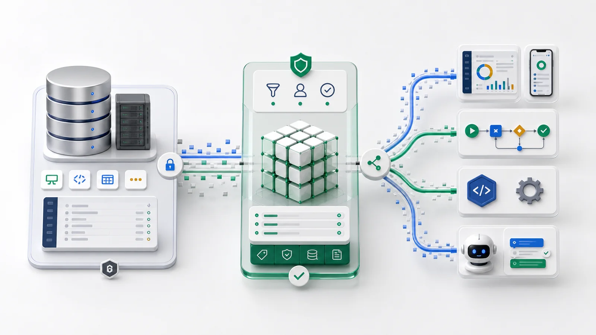

Muchas propuestas para “añadir AI al negocio” esconden una reconstrucción: mover datos a una nueva plataforma, rehacer workflows, volver a entrenar al equipo y esperar que la migración salga bien. Esa es la parte que nadie quiere. El sistema de registro, CRM, ERP, tickets o back office propio, ya funciona y ya contiene los datos.

ObjectOS toma la postura contraria. **No migras. Conectas.**

## La idea en una frase

Apunta ObjectOS a tu base de datos existente, describe las tablas importantes como objetos y cada agente de AI, flow, API y dashboard trabaja de inmediato sobre esos datos, enrutado al sistema correcto y gobernado por los mismos permisos que ya tienen tus usuarios.

La aplicación original no cambia. Las filas no se mueven. ObjectOS se convierte en una capa AI-native y consciente de permisos sobre lo que ya operas.

## Un ejemplo concreto

Imagina un equipo comercial que trabaja sobre un CRM en Postgres con 40 tablas: cuentas, contactos, oportunidades, líneas y actividades. Hay años de datos reales y una aplicación de producción usada todos los días. La dirección quiere preguntar en lenguaje natural:

> “¿Qué oportunidades enterprise se salieron de Q2 y quién las lleva?”

La respuesta de reconstrucción es un proyecto de seis meses. Con ObjectOS puedes empezar en una tarde:

1. Conectar la base CRM como datasource **solo lectura**.
2. Pedir a un agente de código que modele las tablas relevantes como objetos.
3. Hacer preguntas y conectar la primera automatización.

Nadie toca el CRM. Los vendedores no lo notan. Obtienes una capa AI-native sobre las mismas filas.



## Cómo funciona hoy

### 1. Conecta la base como datasource

Un datasource es una conexión con nombre: Postgres, MySQL, MongoDB o SQLite. Las credenciales vienen del entorno y no se escriben en el código. Si quieres analizar primero, usa una réplica o un usuario de base solo lectura.

```ts
import type { Datasource } from '@objectstack/spec';

export const BusinessDb: Datasource = {
  name: 'business_primary',
  label: 'Business System (Postgres)',
  driver: 'postgres',
  config: {
    connection: {
      host: process.env.BIZ_DB_HOST,
      user: process.env.BIZ_DB_USER,
      password: process.env.BIZ_DB_PASSWORD,
      database: process.env.BIZ_DB_NAME,
    },
  },
  pool: { min: 1, max: 10 },
  active: true,
};
```

### 2. Modela tablas como objetos con un agente de código

No hace falta escribir un objeto por tabla a mano. Un agente como Claude Code puede leer el schema conectado, inspeccionar columnas, tipos y claves foráneas, y generar el primer borrador.

> “Conéctate a `business_primary`. Para `accounts`, `contacts`, `opportunities` y `line_items`, genera un archivo `src/objects/<name>.object.ts` con `ObjectSchema.create`. Mapea columnas SQL a `Field.*`, convierte claves foráneas en `Field.lookup(...)` y añade `datasource: 'business_primary'`.”

El resultado es código fuente normal que tú posees y commiteas. Puedes quitar columnas que no deben exponerse a AI, añadir etiquetas, validaciones y permisos, y dejarlo listo para producción.

### 3. Vincula objetos al datasource

Cada objeto puede declarar `datasource`, o puedes definir una regla para todo un namespace:

```ts
datasourceMapping: [
  { namespace: 'biz', datasource: 'business_primary' },
  { default: true,    datasource: 'default' },
]
```

Las decisiones de residencia de datos quedan en un solo lugar.

### 4. Deja que AI trabaje

Cuando una tabla es un objeto, la capa de AI puede usarla. Las herramientas `list_objects`, `describe_object`, `query_records`, `aggregate_data` y el agente de data-chat pasan por ObjectQL, que enruta cada objeto a su datasource y empuja filtros, ordenaciones y agregaciones a la base cuando el driver lo permite.

Cuando alguien pregunta por oportunidades que se salieron de Q2, el agente no copia toda la tabla al prompt. Compila una consulta ObjectQL sobre `biz_opportunity`, con `WHERE` sobre etapa y fecha de cierre, un join al owner y ejecución en Postgres. Y lo hace **como el usuario conectado**. Si un vendedor no puede ver otra región, el agente tampoco.

## Por qué es seguro

- **AI actúa como el usuario, nunca por encima.** Los permisos de objeto, registro y campo se aplican en runtime.
- **Solo lectura si quieres.** Conecta mediante usuarios o conexiones read-only.
- **Todo queda auditado.** Lecturas, escrituras y escaladas registran quién, qué, cuándo y por qué.
- **Los datos se quedan en tu red.** ObjectOS corre en tu entorno.

## Reconstruir vs. conectar

| | Reconstruir en una plataforma nueva | Conectar con ObjectOS |
|---|---|---|
| **Tiempo al primer valor** | Meses | Una tarde |
| **Riesgo para el sistema de registro** | Alto | Ninguno |
| **Dónde viven los datos** | Se mueven | Se quedan igual |
| **Modelado** | Reimplementar a mano | El agente genera desde el schema real |
| **Permisos** | Reconstruidos | Heredados |
| **Reversibilidad** | Difícil | Desconectar el datasource |

## Qué obtienes el primer día

- Análisis en lenguaje natural sobre datos vivos.
- Automatización gobernada y auditada.
- API y Console generadas desde los mismos metadatos.
- Un único modelo de permisos para humanos y AI.

## Entregado y en camino

Este flujo funciona **hoy** con datasources, routing por objeto, pushdown de ObjectQL y la capa de agentes. Una federación más turn-key, con importación de schema, binding a schemas externos y compuertas de seguridad para escritura, está en diseño en [ADR-0015](https://github.com/objectstack-ai/framework/blob/main/docs/adr/0015-external-datasource-federation.md).

## Preguntas frecuentes

**¿Debo modelar todas las tablas?** No. Solo las que AI y la automatización necesitan tocar.

**¿Escribirá en producción?** Solo si lo permites. Con conexión read-only, no puede escribir.

**¿Mis datos van a un proveedor de modelos?** ObjectOS corre en tu entorno; tú decides proveedor y alcance.

**¿Y si cambia el schema?** Ejecuta de nuevo el agente de código y regenera o revisa el diff de los objetos afectados.

Si ya tienes una base de datos de negocio, estás cerca. Conéctala, modela algunas tablas y hazle una pregunta a tus datos.
