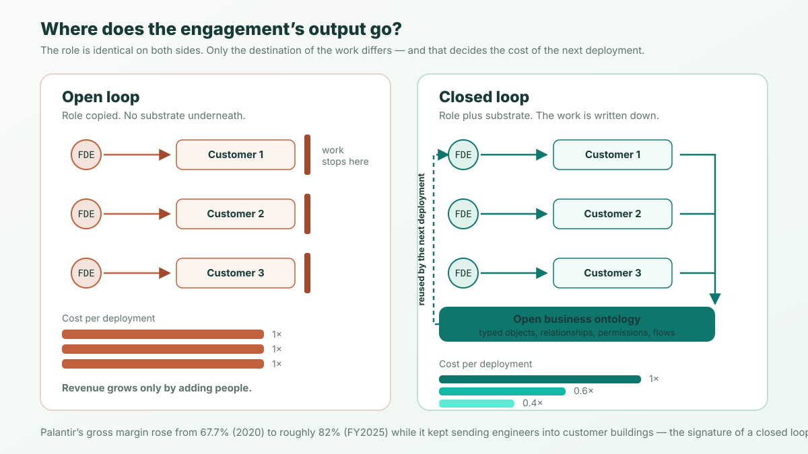

**The short version:** in 2026 OpenAI, Microsoft, Anthropic and Salesforce all stood up forward-deployed organisations, and almost every word written about it has been celebratory. Here is the uncomfortable arithmetic. Palantir — the company everyone is copying — reported **$4.475B of revenue on 4,429 employees** in FY2025: about **$1.01M of revenue per employee**. Accenture, the reference consultancy, reported **$69.7B on roughly 779,000 people**: about **$89K per employee**. Both businesses embed engineers inside customers and make software work on the customer's messy data. The ~11x gap is not the role. It is what the role's output *writes into*. Copy the role without the substrate and you have built a consultancy carrying a software company's cost base.

## 1. The 2026 numbers, and who produced them

The forward-deployed wave is real, but the statistics circulating about it are not all the same quality, and a contrarian argument built on the weak ones deserves to lose. So, plainly, here is where each number that gets quoted actually comes from:

| Claim in circulation | Where it actually comes from | What it is evidence of |
|---|---|---|
| FDE job postings up **1,165% year over year** | Live Data Technologies, relayed by [Paraform](https://www.paraform.com/blog/forward-deployed-engineer-demand-quadrupled), a recruiting marketplace that sells FDE hiring | Postings, not filled roles. The firms publishing the growth number are in the business of that growth. |
| **Salesforce is building a team of 1,000 FDEs** | Salesforce's own [blog](https://www.salesforce.com/blog/forward-deployed-engineer/) | A company statement of intent. Not an audited disclosure, and not a headcount. |
| **100+ YC companies** hiring FDEs | Not traceable to a primary source | Cut from this article. The nearest real census is a vendor's. |
| **OpenAI raised over $4B** for a majority-owned deployment subsidiary (May 2026), acquiring Tomoro and ~150 engineers | [OpenAI's own announcement](https://openai.com/index/openai-launches-the-deployment-company/) | Capital actually committed. Checkable. |
| **Microsoft Frontier: $2.5B and 6,000 employees** (July 2026) | Microsoft, reported by [CNBC](https://www.cnbc.com/2026/07/02/microsoft-commits-2point5-billion-6000-employees-ai-implementation-unit.html) and [TechCrunch](https://techcrunch.com/2026/07/02/microsoft-launches-its-own-ai-deployment-company-with-2-5-billion-commitment/) | Capital and headcount actually committed. Checkable. |

Notice the shape of that table. The numbers describing the *wave* are strong — billions of dollars and thousands of people are genuinely moving. The numbers describing the *outcome* do not exist yet, because none of these organisations is old enough to have one. Every FDE org launched in 2026 currently looks identical to every other: engineers going into buildings. The difference shows up in year three, in the financial statements.

Which is why the rest of this article is built on the two sets of numbers that have been audited.

## 2. Two numbers you can check

| FY2025 | Palantir | Accenture |
|---|---|---|
| Revenue | **$4.475B** | **$69.7B** |
| Employees | **4,429** (as of Dec 31, 2025) | **~779,000** (as of Aug 31, 2025) |
| Revenue per employee | **~$1.01M** | **~$89K** |
| Gross margin | **~82%** | **31.9%** |

Both figures are whole-company, from each company's FY2025 annual filing, so the comparison is coarse — Accenture runs businesses Palantir does not. But the coarseness cuts the wrong way for the celebratory reading: Accenture is *the best* at the consulting model, at enormous scale, and it still lands at $89K per head and a 31.9% gross margin. That is not a failure of execution. It is the ceiling of the model.

The tempting explanation for the gap is "Palantir is a software company and Accenture is a services company." That is the conclusion, not the explanation. Both send engineers to sit with customers for months. Both write bespoke things against a customer's private data. The question worth answering is *why the same visible activity produces an 11x difference in output per person* — because that mechanism is exactly what the 2026 copycats have not copied.

## 3. What actually got copied: the role, not the substrate

Palantir's forward-deployed engineer does not write an application for a customer. They write into an **ontology** — a typed model of that customer's objects, links and actions — and the application is derived from it. Palantir's own documentation is explicit that this is the reuse mechanism: once data is mapped into the Ontology, new use cases are built on the same object types, link types and actions, so builders work on the workflow instead of re-wrangling the data. Internally the loop closes a second time: patterns seen across engagements get abstracted into platform primitives, which means engagement N funds the tooling that makes engagement N+1 cheaper.

Take the ontology away and the role still looks the same from outside. An engineer still embeds, still learns the business, still ships something the customer loves. But the output of that work now terminates at the customer boundary. Nothing is written into anything the next engagement can read.

That failure mode deserves a name, because it is invisible in the first year and fatal in the third:

> **Open-loop deployment:** forward-deployed work whose output terminates at the customer boundary. What the engineer learns and builds is never written into a substrate that the next engagement can read, so deployment N+1 costs what deployment N cost. Its measurable signature is flat revenue per engineer.

The distinction is not about how good your engineers are. It is about whether there is a *place* for their output to land. An open-loop org can be staffed entirely by excellent engineers and still have a consultancy's economics, because excellence that cannot be written down is re-purchased every time.

## 4. The margin math that does the converting

Here is why open-loop deployment converts a product company into a services company quietly, without anyone deciding to.

Software revenue in this class carries roughly an 82% gross margin. Deployment labour carries roughly 32%. Blend them at various mixes and you get a straight line:

| Share of revenue that is software | Share that is deployment labour | Blended gross margin |
|---|---|---|
| 100% | 0% | **82%** |
| 80% | 20% | **72%** |
| 60% | 40% | **62%** |
| 40% | 60% | **52%** |
| 20% | 80% | **42%** |
| 0% | 100% | **32%** |

The spread between the two margins is 50 points, so the rule falls out cleanly:

> **Every ten points of revenue that shift from software to deployment labour cost you five points of gross margin.**

Nobody signs up for that. It arrives one reasonable decision at a time. A large customer needs six weeks of integration work to go live, so you sell six weeks of integration work — at cost, to be helpful. The next customer needs eight. Because none of that work landed anywhere reusable, the *third* customer needs eight too. Within a couple of years, deployment revenue is a third of the total, gross margin has quietly dropped about seventeen points, and hiring plans are indexed to the pipeline rather than to the product.

The second-order effect is worse than the margin. A services business grows revenue by adding people, so its headcount plan is a function of bookings. Every incremental dollar requires an incremental person, which is precisely why Accenture needs 779,000 of them. And public markets price the two models differently enough that the re-rating, when it comes, is not gradual.

## 5. Palantir's receipt: the model demonstrably worked

The strongest case for the FDE model is not a theory, and it deserves to be stated at full strength, because the copycats are not obviously wrong to copy it.

Palantir's gross margin was **67.7% in 2020**. In FY2025 it was **~82%**. It climbed roughly fifteen points *while revenue grew several-fold and while the company kept sending engineers into customer buildings.* That is the receipt. In a pure services business, scaling deployments pushes margin the other way: more revenue means proportionally more delivery labour. Palantir's margin went up as it scaled, which is only possible if deployment work was being converted into something that got reused.

So the pro-FDE case is genuinely strong: embedding engineers is the fastest known way to learn what enterprise software actually has to do, and Palantir turned that learning into a compounding asset. Anyone arguing the model "doesn't work" has to explain fifteen points of margin expansion.

The point of this article is narrower, and it is about **conditions**. Palantir spent years building the thing that made FDE work compound before the compounding showed up in the financials. The 2026 entrants hired the role in quarter one. An FDE org is a mechanism for *generating* substrate-shaped knowledge at high cost. If the substrate exists, that cost is an investment. If it does not, the same activity is billable hours with a better job title.

## 6. Three tests: is your FDE org compounding or billing?

You can run all three of these this week. None requires a strategy offsite.

**Test 1 — The second-deployment diff.** Open your two most recent deployments side by side. Go definition by definition through the newer one — data model, workflows, permissions, integrations — and mark each item *reused* (literally the same artifact), *adapted*, or *net-new*. Reuse means copied, not "inspired by." If reuse is under about 20%, your engineers re-derived the customer's business from scratch, and they will do it again next time. A compounding org watches this ratio climb across deployments; that climb *is* the substrate becoming real.

**Test 2 — Revenue per engineer, four quarters.** Plot revenue from deployed accounts divided by deployed-engineer headcount, for each of the last four quarters. A rising line means output per person is growing — something other than labour is carrying revenue. A flat line is the signature of open-loop deployment, because in a services business the only lever for more revenue is another person. Whole-company benchmarks to sight against: ~$89K (Accenture), ~$1.01M (Palantir).

**Test 3 — The roll-off test.** Take a deployment that shipped at least six months ago and pull your engineer off it for a full quarter. Then ask one question: did the customer change the system without you? If every change still routes back through your team, you did not deliver a system, you delivered a dependency — and what renews next year is a staffing arrangement, not a product. The honest version of this test is to check whether the customer's own team, or their coding agent, can read the definition of what you built and safely change it.

Two of the three tests are about artifacts and one is about money, which is deliberate. The money test tells you *that* you are in trouble; the artifact tests tell you *why*, roughly two years earlier.

## 7. What this argument does not claim

Being straight about the limits: **a consultancy is a perfectly good business.** Accenture is one of the most successful companies of the last thirty years. The failure mode here is not "being a services business" — it is *being one while telling your investors, your board and your engineers that you are a product company*, and pricing, hiring and forecasting accordingly.

Nor is substrate a guarantee. A company can own a beautiful ontology and still lose on distribution, on security review, or because the customer standardised elsewhere years ago. And in genuinely novel domains, the first several deployments *should* be open-loop — you cannot design a substrate for a business you have not met yet. The question is whether that phase has an end date and someone accountable for it.

Finally, the tests above measure compounding, not health. A young FDE org will fail all three and be fine. An eight-year-old one that fails all three has already made its choice.

## 8. If the answer is "we need the substrate"

The thing the 2026 copycats are missing has a name: an **open business ontology** — the typed objects, relationships, permissions and flows of a business, in a format the customer owns rather than rents. That is the substrate the FDE writes into, and the reason the writing compounds.

Palantir built theirs as a closed platform, which is a defensible choice and also the reason its customers cannot leave. The open version of the same idea is what [ObjectStack](https://github.com/objectstack-ai/objectstack) exists to be — its README puts the offer to this exact reader plainly: *"Forward-deployed engineer? This is the ontology-first toolkit you own."* Objects, flows and permissions are typed files under Apache-2.0 in the customer's repository, and the runtime derives the database, APIs, admin console, permission enforcement and audit from them. That is what makes deployment N+1 cheaper than deployment N, and what makes the handover a delivery rather than a hostage negotiation.

If your engagements are already running, the useful next step is not a platform migration. It is Test 1. Go count the reuse rate between your last two deployments, and find out which business you are actually in.

*Companion piece, written for the engineer rather than the founder: [What tools do forward-deployed engineers use?](/en/blog/forward-deployed-engineer-tools/) — the five recurring pains of forward-deployed work and the stack that removes them.*
