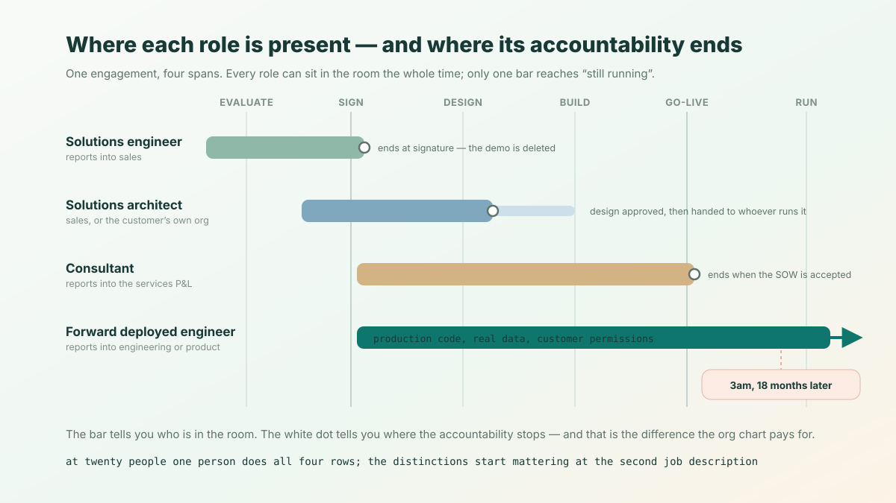

**The short answer.** A solutions engineer is paid to win the deal. A solutions architect is paid to be right about the design. A consultant is paid to deliver a scoped piece of work. A forward deployed engineer is paid for a workflow that still runs after everyone else has gone home. In the customer's conference room all four look identical — same laptop, same whiteboard, same questions about the data model. They diverge on the org chart, which is where the incentives, the compensation and the failure modes actually live.

The fastest way to tell which one you are looking at — in a job posting, or on your own org chart — is one question. Call it **the pager test**: *when this thing breaks at 3am, eighteen months from now, whose phone rings?* Only one of the four answers "mine."

## The four, one line each

**Solutions engineer (SE)** — also *sales engineer*, *pre-sales engineer*. Works before the signature. Owns the technical win: the demo, the proof of concept, the security questionnaire, the bake-off against the other vendor. Their code is demo code, and the demo is deleted the week the deal closes.

**Solutions architect (SA)** — also *cloud architect*, *enterprise architect*. Owns the design and hands it to someone else to run. This title splits by which side of the table it sits on: a vendor-side SA at a cloud provider is a pre-sales role attached to an account team, while a customer-side SA inside a bank is an internal design authority with no sales function at all. Same two words, two different jobs.

**Consultant** — also *delivery consultant*, *implementation consultant*. Works to a statement of work. Owns the scoped deliverable, and the meter is time: their firm's economics run on billable utilization, benchmarked by professional-services vendors at [70–80% for delivery roles](https://www.rocketlane.com/blogs/billable-utilization).

**Forward deployed engineer (FDE)** — also *FDSE*, *applied AI engineer*, *deployment engineer*. Embeds in the customer's environment after the contract, writes production code against their real data and their real permissions, and stays accountable until the customer's actual workflow runs on it. The role was named at Palantir, where the deployment organisation is framed as [a product-formation mechanism rather than a services arm](https://blog.palantir.com/a-day-in-the-life-of-a-palantir-forward-deployed-software-engineer-45ef2de257b1) — a distinction that turns out to be load-bearing, as the "consultant" section below argues.

## The comparison table

Every row below is a separate question you can ask about a specific person at a specific company, and get a specific answer.

| | Solutions engineer | Solutions architect | Consultant | Forward deployed engineer |
|---|---|---|---|---|
| **Phase** | Before the contract | Around the design decision | After the statement of work | After the contract, until it runs |
| **Owns** | The technical win | The design | The scoped deliverable | The outcome in production |
| **Done when** | The deal closes | The architecture is approved | The deliverable is accepted | The customer's workflow runs on it |
| **Commits code** | Demo code, later deleted | Reference patterns, rarely production | Yes, in the client's repo | Yes, in production, on real data |
| **Carries quota** | Yes, usually shared with the AE | Vendor-side sometimes; customer-side no | No — a utilization target instead | No |
| **Paid on** | Base plus variable, about 70/30 | Base, bonus, equity | Base plus utilization or margin bonus | Base plus equity, no commission line |
| **Reports into** | Sales | Sales, or the customer's own architecture org | The services P&amp;L | Engineering or product |
| **Gets paged** | Nobody — the demo is gone | The customer's operations team | Whoever the contract names | Them |
| **Scales by** | Repeatable demos | Reference architectures | Headcount | Product — the work ships to customer two |

The last row is the one worth arguing about, and the rest of this article is largely about it.



## Reporting line and compensation

Titles are cheap. Reporting lines and pay structures are expensive, so they are the honest signal.

**The SE reports into sales and is paid like sales.** Base plus a variable component tied to bookings, at a pre-sales standard of [70/30 base to variable](https://sales-engineering.org/presales-compensation-plans-101-creating-winning-plans-for-sales-engineers/) at 100% of quota — against roughly 50/50 for the account executive they are paired with. The quota is usually shared with that AE on the same accounts. **That 70/30 is the single most reliable tell in this comparison: of the four roles, the SE is the only one whose paycheck moves when a deal signs.**

**The SA is paid base plus bonus plus equity**, with base typically the [large majority of total compensation](https://www.kore1.com/solutions-architect-salary-guide/). A vendor-side SA may carry a soft consumption or pipeline-influence target; a customer-side SA carries none and is measured on whether the platform holds, the security reviews pass and the cloud bill stays predictable.

**The consultant carries a utilization target, not a quota.** The number that decides their year is what fraction of their hours were billable and at what rate. That is a different incentive from a quota, not a softer one: a quota rewards a closed deal, utilization rewards *hours consumed*, and the two disagree about whether a project should finish early.

**The FDE is paid like an engineer**: base plus equity, no commission and no utilization target. Be careful with the salary figures circulating for this role in 2026 — most come from job-posting scrapes and self-reported aggregators rather than payroll data, so any precise band deserves suspicion. The *structure* is the durable claim, and it is consistent: nothing in an FDE's compensation moves because a contract was signed or because a timesheet filled up.

So the four roles resolve into three pay mechanics — **commission, utilization, or neither** — and a company's choice among them is a public statement about what it thinks the role is for. It is much harder to fudge than a title on a careers page.

## Why FDEs resist "consultant" — and when the word is right

Call a forward deployed engineer a consultant and watch the temperature change. The reaction is usually read as status anxiety. Sometimes it is. But there are three real differences underneath it, and unlike the vibes, each one is checkable.

**1. Does the work ship to customer number two?** A consultant's output belongs to the engagement. An FDE's output is supposed to travel: the adapter, the entity-resolution rule, the permission mapping written for customer one becomes part of what the vendor ships. Palantir's own framing of the role is product discovery — the FDE finds out what the product should be by being the first person to need it. If nothing your FDE team wrote last quarter will ever run at a second customer, that mechanism is not operating.

**2. What is the meter?** Consulting revenue is time. FDE revenue is licence or consumption; the engineering is a cost of making that revenue stick. This is why a *utilization target on an FDE* is such a strong signal — the moment someone starts measuring an FDE on billable hours, the role has been converted, whatever the title still says.

**3. Is the role allowed to say no?** A consultant is paid to build what the statement of work says, and refusing scope is a commercial conversation, not an engineering one. An FDE is expected to push back on a bespoke request that will not generalise, and to propose the version that does. That refusal is not friction in the job; on the product-formation reading, it *is* the job.

**When the word is accurate.** When all three answers go the other way — nothing generalises, the meter is hours, and the backlog is simply whatever was sold — "consultant" is the correct word, and it is not an insult. Consulting is a real profession and the best firms are excellent, durable businesses with better cash conversion than most software companies. The problem is never the work. The problem is a label that hides the economics from the person doing it: an engineer who took the job because it was described as engineering, and discovers in year two that their promotion case is a utilization number.

**A test you can run this week.** Take the last ten pull requests your forward-deployed team merged. Count how many landed in a repository that more than one customer will ever run. Zero is not a scandal, but it is an answer, and it is the answer that decides which of these four words is honest.

## Where this table lies

The boundaries above are real, but they are not crisp, and any comparison that pretends otherwise will not match your experience.

- **Titles are marketing.** Several companies renamed pre-sales roles to "forward deployed engineer" in 2026 because it recruits better. The reporting line and the comp plan did not move. Check those, not the title.
- **"Solutions architect" is two jobs.** Vendor-side and customer-side SAs share a title and almost nothing else. Any article — including this one — that gives the title a single row in a table is compressing that.
- **Palantir's shape is two people, not one.** The deployment work there is split between the engineer and a domain-facing counterpart. Most companies copying the model collapse both into one hire and then wonder why the person is bad at half of it.
- **Small companies collapse all four.** At twenty people, one person does the demo, designs it, builds it and gets paged. That is normal and often correct. The distinctions start to matter at the point where you are writing the *second* job description.
- **People move between the four constantly**, and the SE-to-FDE path in particular is well worn. The roles are stages of a career at least as often as they are separate species.

## Which one your company actually needs

Diagnose from the symptom, not from the org chart you wish you had.

- **You are losing deals in technical evaluation** — prospects like the pitch and stall at the proof of concept. Hire a **solutions engineer**. An FDE will not help; the deals are dying before an FDE would ever be assigned.
- **You are winning deals and then not going live** — signatures, then six months of silence, then a churn. Hire a **forward deployed engineer**, and give them production access, not a slide deck.
- **Customers keep building the wrong thing on you** — the software works, the implementations do not. You have a design problem: hire a **solutions architect** and make reference architectures a shipped artifact.
- **You have a signed backlog of well-scoped work and need throughput.** Hire **consultants**, or a partner. This is the case where the honest word is the efficient one.

And one structural warning, which is the most common expensive mistake here: **do not hire an FDE into a sales reporting line and then measure them on bookings.** You will have paid engineering compensation for a solutions engineer, and lost the product feedback that was the entire reason to run a deployment organisation in the first place.

## What actually survives the engagement

Whichever of the four you hire, the thing that decides whether the work compounds is what is left in the customer's repository when that person rolls off — a question this comparison deliberately does not settle. Two neighbouring pieces do: [what forward deployed engineers actually build, and the tooling that makes it compound](/en/blog/forward-deployed-engineer-tools/), and [the conditions under which copying the forward-deployed model quietly turns a product company into a consultancy](/en/blog/forward-deployed-engineer-trap/).

ObjectStack is our answer to the narrow version of that question: an open, typed definition of a customer's objects, permissions and flows — an **open business ontology** the customer owns under Apache 2.0 — that a coding agent can write and a governed runtime enforces. Point your agent at it and see what the handover looks like:

```bash
npm create objectstack@latest client-app && cd client-app
npx os dev --ui   # Console, auth, permissions and audit already running
```
