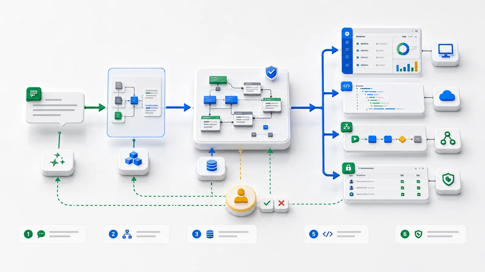

Vous dites à AI Builder :

> Crée un système de réparation d’équipements. Les employés déclarent les pannes, les tickets sont liés aux équipements, les ingénieurs sont assignés, le statut est suivi, le temps d’arrêt calculé, les urgences assignées automatiquement, et la résolution avec coût est obligatoire avant clôture.

Quelques minutes plus tard, une application fonctionne. Elle contient non seulement des pages, mais aussi objets, champs, relations, permissions, vues, workflows, actions, API et outils d’agent.

Ce n’est pas une histoire abstraite sur “l’AI qui génère des apps”. C’est une lecture concrète de ce que les métadonnées ObjectStack produisent.



## Partir du scénario métier

La réparation d’équipement contient un flux complet : déclaration, assignation, intervention, photos et notes, suivi des retards et coûts, validation des cas risqués, historique de maintenance.

Dans une approche classique, tout cela se disperse dans tables, API, pages, permissions, machines d’état, notifications, audit et reporting.

ObjectStack commence par décrire le système en métadonnées. AI Builder rédige la spécification métier avant de produire du code d’intégration.

| Question métier | Capacité de métadonnées |
| --- | --- |
| Que sont équipements, tickets, ingénieurs ? | Objets et relations |
| Quels champs sont requis ou énumérés ? | Types de champ et validation |
| Qui voit quoi ? | Permissions et sécurité de champ |
| Comment afficher files et tableaux ? | Métadonnées de vue |
| Comment assigner, escalader, clôturer ? | Actions et workflows |
| Que peut faire un agent ? | Outils gouvernés et audit |

## Les objets avant les pages

AI Builder identifie `device`, `repair_order`, `repair_comment`, `user` et `team`. L’application commence par les objets parce qu’ils alimentent API, UI, permissions, workflows et outils d’agent.

```ts
import { ObjectSchema, Field } from '@objectstack/spec/data';

export const Device = ObjectSchema.create({
  name: 'device',
  label: 'Device',
  fields: {
    name: Field.text({ label: 'Device name', required: true }),
    code: Field.text({ label: 'Device code', required: true, unique: true }),
    location: Field.text({ label: 'Location' }),
    team: Field.lookup('team', { label: 'Responsible team' }),
    status: Field.select({
      label: 'Device status',
      options: [
        { label: 'Running', value: 'running', default: true },
        { label: 'Maintenance', value: 'maintenance' },
        { label: 'Disabled', value: 'disabled' },
      ],
    }),
  },
});
```

`team` est une relation, `status` une énumération, `code` une contrainte d’unicité. API, pages, filtres, permissions et agents utilisent les mêmes informations.

## Le ticket porte les règles métier

```ts
export const RepairOrder = ObjectSchema.create({
  name: 'repair_order',
  label: 'Repair ticket',
  fields: {
    title: Field.text({ label: 'Failure description', required: true }),
    device: Field.lookup('device', { label: 'Device', required: true }),
    reporter: Field.lookup('user', { label: 'Reporter', required: true }),
    assignee: Field.lookup('user', { label: 'Engineer' }),
    priority: Field.select({
      label: 'Priority',
      options: [
        { label: 'Low', value: 'low' },
        { label: 'Medium', value: 'medium', default: true },
        { label: 'High', value: 'high' },
      ],
    }),
    status: Field.select({
      label: 'Status',
      options: [
        { label: 'Pending assignment', value: 'pending', default: true },
        { label: 'In repair', value: 'in_repair' },
        { label: 'Waiting acceptance', value: 'waiting_acceptance' },
        { label: 'Closed', value: 'closed' },
      ],
    }),
    reported_at: Field.datetime({ label: 'Reported at', required: true }),
    started_at: Field.datetime({ label: 'Started at' }),
    closed_at: Field.datetime({ label: 'Closed at' }),
    cost: Field.currency({ label: 'Repair cost' }),
    photos: Field.image({ label: 'On-site photos', multiple: true }),
  },
});
```

Les `lookup` relient équipements et utilisateurs, les `select` alimentent filtres et workflows, les dates permettent SLA et temps d’arrêt, les coûts servent aux permissions et validations.

## Formules, validation, vues et permissions

```ts
import { cel } from '@objectstack/spec';

downtime_hours: Field.formula({
  label: 'Downtime hours',
  expression: cel`
    closed_at == null || reported_at == null
      ? null
      : hours_between(reported_at, closed_at)
  `,
});
```

```ts
resolution: Field.textarea({
  label: 'Resolution',
  requiredWhen: cel`status == "closed"`,
});
```

Si ces règles n’existent que dans la page, API, agents et opérations de masse peuvent les contourner. En métadonnées, elles appartiennent au runtime.

```ts
export const EngineerQueueView = {
  object: 'repair_order',
  label: 'My repair queue',
  type: 'list',
  filter: cel`assignee == $currentUser && status != "closed"`,
  columns: ['title', 'device', 'priority', 'status', 'reported_at'],
};
```

```ts
export const EngineerPermission = {
  role: 'maintenance_engineer',
  object: 'repair_order',
  readable: cel`assignee == $currentUser`,
  editable: cel`assignee == $currentUser && status != "closed"`,
  fields: {
    cost: { readable: false, editable: false },
    resolution: { readable: true, editable: true },
    photos: { readable: true, editable: true },
  },
  actions: {
    start_repair: true,
    submit_acceptance: true,
    close_order: false,
  },
};
```

Un ingénieur ne voit pas le coût dans l’UI, via l’API ou via un agent agissant en son nom.

## Actions, workflows, API et outils

```ts
export const StartRepairAction = {
  name: 'start_repair',
  label: 'Start repair',
  object: 'repair_order',
  availableWhen: cel`status == "pending" && assignee == $currentUser`,
  input: {
    started_at: Field.datetime({ label: 'Start time', default: 'now' }),
  },
  changes: {
    status: 'in_repair',
    started_at: '$input.started_at',
  },
  audit: true,
};
```

```ts
export const AutoAssignHighPriorityRepair = {
  name: 'auto_assign_high_priority_repair',
  trigger: {
    object: 'repair_order',
    event: 'afterInsert',
    when: cel`priority == "high" && assignee == null`,
  },
  steps: [
    { action: 'find_on_duty_engineer', output: 'engineer' },
    { action: 'assign_repair_order', input: { assignee: '$engineer.id' } },
    { action: 'notify_user', input: { user: '$engineer.id' } },
  ],
};
```

```ts
export const HighCostCloseApproval = {
  object: 'repair_order',
  action: 'close_order',
  when: cel`cost > 5000`,
  approvers: ['maintenance_manager'],
  reason: 'High-cost repair requires manager approval',
};
```

La même métadonnée projette API et outils d’agent :

```bash
curl -X POST /api/v1/data/repair_order \
  -d '{ "title": "CNC-3 abnormal noise", "device": "dev_012", "priority": "high" }'
```

```ts
export const RepairAgentTools = [
  tool.queryRecords('repair_order'),
  tool.getRecord('repair_order'),
  tool.runAction('repair_order', 'start_repair'),
  tool.runAction('repair_order', 'submit_acceptance'),
];
```

L’agent interroge par des outils gouvernés, développe `device`, respecte les permissions et résume. S’il exécute, il appelle une action ; si le risque est élevé, la validation intervient.

## Différence avec la génération ponctuelle

La génération ponctuelle produit pages, API, logique de base, permissions et scripts. La première version semble rapide, mais les changements dérivent.

Les métadonnées ObjectStack donnent une source unique à la structure métier. Champs, permissions, actions et vues modifient ensemble API, UI, audit et outils d’agent.

AI Builder ne remplace pas l’ingénierie logicielle. Il rédige la structure essentielle pour que les humains la relisent, que la plateforme l’exécute et que les changements restent dans la même spécification.
