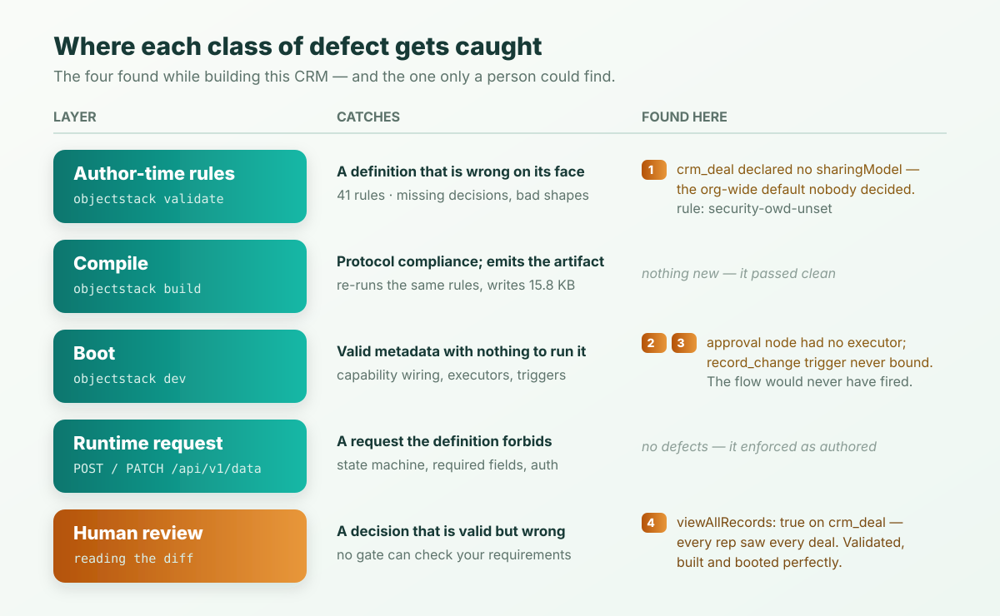

**The short version:** we built a working CRM — accounts, contacts, deals, a
discount approval flow, a sales-rep permission set — from a scaffold command and
a written spec. The finished definition is **2,406 tokens across 7 files and 308
lines**, measured with a real tokenizer. It projects **54 REST operations** the
agent never wrote. Four defects showed up on the way, and **not one of them was
caught by a human reading code**: three were refused by the validation gate and
the boot sequence, and the fourth was found by noticing a warning that had gone
missing.

That last one is the part worth your time.

## The spec, and the rules of the exercise

No conversational demo, no editing until it looked right. We wrote down what the
app had to do first, then built to it:

| # | Requirement |
|---|---|
| 1 | Accounts — companies we sell to, with industry and annual revenue |
| 2 | Contacts — people at an account, unique by email |
| 3 | Deals — amount, discount, expected close date, a stage that only moves forward |
| 4 | Discounts over 20% need a sales manager's sign-off before the deal closes |
| 5 | A sales rep sees the whole customer base but only their own pipeline |

Requirement 5 is the one that matters later. Hold onto it.

## Minute one: the scaffold

```bash
npx create-objectstack@latest crm
cd crm && pnpm run validate
```

The scaffold writes a project with one starter object and — this is the part
that changes how the rest of the build goes — an `AGENTS.md` plus eleven skill
bundles under `.agents/skills/`, in the layouts a dozen different coding agents
already look for. The agent that writes your metadata does not have to guess the
format; it reads the format's own rules first.

That is not free, and we will price it honestly at the end.

Baseline, before we wrote a line:

```text
✓ Validation passed (73ms)
  Data: 1 Objects  2 Fields
```

## The three objects

The data model is the part an agent gets right most easily, because the
decisions are the kind you can write down. Deals, trimmed:

```typescript
export const Deal = ObjectSchema.create({
  name: 'crm_deal',
  label: 'Deal',
  sharingModel: 'private',
  fields: {
    name: Field.text({ label: 'Deal Name', required: true, maxLength: 200 }),
    account: Field.lookup('crm_account', { label: 'Account', required: true }),
    amount: Field.currency({ label: 'Amount', scale: 2, min: 0 }),
    discount_percent: Field.number({ label: 'Discount %', min: 0, max: 100 }),
    stage: Field.select({ label: 'Stage', required: true, options: [ /* … */ ] }),
  },
  validations: [
    {
      name: 'stage_flow',
      type: 'state_machine',
      field: 'stage',
      transitions: {
        qualifying: ['proposal', 'closed_lost'],
        proposal: ['negotiation', 'closed_lost'],
        negotiation: ['closed_won', 'closed_lost'],
        closed_won: [],
        closed_lost: [],
      },
      message: 'A deal can only move forward one stage at a time, or to Closed Lost.',
    },
  ],
});
```

Requirement 3 — "a stage that only moves forward" — is a `state_machine` block,
not a comment and not a check buried in a save handler. It will hold against the
UI, the REST API, an import job and an agent equally, because none of them is
the place it is enforced.

## Break #1: a permission nobody decided

First run of the gate after adding all three objects:

```text
✗ Author-time rules failed (1 issue)
  • object "crm_deal": custom object "crm_deal" declares no sharingModel (OWD).
    The runtime fails CLOSED to 'private' (ADR-0090 D1), but the baseline must
    be an authored decision, not an accident — this is the exact shape of the
    leave_request incident (objectui#2348).
      Declare sharingModel explicitly: 'private' (owner + shares; recommended
      default), 'public_read', 'public_read_write', or 'controlled_by_parent'.
      rule: security-owd-unset  at objects[2].sharingModel
```

Read the second sentence again. The runtime was never going to leak anything —
an object with no declared visibility already defaults to owner-only. The build
fails anyway, because *the safe default is not the same thing as a decision*. On
an object called `crm_deal`, "who else can see this" is a question the business
has an answer to, and silence is not it.

This is the failure mode that makes AI-authored apps different from
hand-written ones. A human writing this object by hand pauses at the top of the
file and thinks about who owns a deal. An agent filling in a schema does not
pause anywhere; it produces plausible, complete-looking metadata with a hole in
it. Omissions are the characteristic AI defect, and they are invisible in review
precisely because there is nothing on the screen to look at.

One line fixed it. The gate went green.

## Break #2: the warning that wasn't there

Green, with four warnings:

```text
✓ Validation passed (172ms)

  ⚠ flow "crm_discount_approval": has status 'draft' … Draft flows DO still
    fire their triggers, so the intent is ambiguous.
  ⚠ flow "crm_discount_approval" · node "manager_review": every approver on
    this node routes to a group whose members are runtime data — if none is
    staffed, the request … waits forever …
  ⚠ permission set "crm_sales_rep": "crm_account" is private (OWD) and this set
    grants allowRead without a readScope — holders see ONLY records they own.
  ⚠ permission set "crm_sales_rep": "crm_contact" is private (OWD) and this set
    grants allowRead without a readScope — holders see ONLY records they own.
```

Three objects have the same `private` baseline and the same `allowRead` grant.
Two of them are named. `crm_deal` is not.

The reason was one line in the permission set:

```typescript
crm_deal: {
  allowRead: true,
  allowCreate: true,
  allowEdit: true,
  allowDelete: false,
  viewAllRecords: true,   // ← this
},
```

`viewAllRecords` is a sharing **bypass** — the super-user bit. Requirement 5
said reps see their own pipeline; this gave every rep every deal in the company,
including the amounts and discounts on deals they have nothing to do with. And
because the object was no longer subject to sharing at all, the lint had nothing
to warn about, so it stopped mentioning it. We confirmed the causation by
deleting the line and re-running: `crm_deal` immediately rejoined the warning
list, third of three.

Nothing in that diff looks wrong. `viewAllRecords: true` is spelled correctly,
sits among four other correct bits, and reads like exactly what "reps work
shared accounts" ought to mean. It validates. It builds. It boots. It is simply
the wrong policy, and no gate can know that, because the requirement it violates
lives in a sentence somebody wrote in a planning doc.

The correct tool was narrower:

```typescript
// Whole team works one shared customer base: widen READ to the org.
crm_account: { allowRead: true, readScope: 'org', allowCreate: true, allowEdit: true },
// Pipeline is NOT shared: a rep sees their own deals only.
crm_deal:    { allowRead: true, allowCreate: true, allowEdit: true },
```

`readScope: 'org'` widens the owner set declaratively and still resolves through
sharing; `viewAllRecords` steps around sharing entirely. Two bits that produce
the same result in a five-person demo tenant and wildly different results in a
real one.

**This is what reviewing AI-generated code actually consists of.** Not reading
for syntax — the gate does that better than you. Reading for the decision that
was made silently, on your behalf, in a line that looks like configuration. It
took three minutes here because the whole security surface is 47 lines in one
file. That is the entire argument for keeping applications context-sized.

## Break #3 and #4: it validated, it built, and it would never have run

The approval flow passed `validate`. It passed `objectstack build`, which
emitted a 15.8 KB artifact. Then we booted it:

```text
⚠ Flow 'crm_discount_approval' references node type(s) with no registered
  executor … {"unknownTypes":["approval"], …} — these nodes fail at execution
  time with NO_EXECUTOR.
⚠ flow 'crm_discount_approval' declares a 'record_change' trigger but is NOT
  bound — it will never auto-launch. add requires: ['triggers']
```

Two defects, both fatal to requirement 4, neither of them a metadata error. The
flow was *shaped* correctly — the gate had nothing to complain about. What was
missing was capability wiring: the `approval` node needs a plugin to execute it,
and record-change triggers need the trigger pack loaded. Structurally valid,
operationally dead.



The layering is the point. Author-time rules catch a definition that is wrong on
its face. The boot sequence catches a definition that is fine but has nothing to
run it. Runtime enforcement catches a request that the definition forbids. A
mistake that slips one layer is usually caught by the next — and the one that
slips *all* of them, break #2, is exactly the one a human is well suited to
find, because it is a business judgement rather than a fact about the system.

Fixed with one line in the stack config:

```typescript
requires: ['automation', 'triggers', 'approvals'],
```

Boot warnings went 6 → 3, plugins 35 → 40, and the flow bound:

```text
Flows:   1 flow(s) 1 bound to triggers (record_change, schedule, time_relative, api)
```

## The running app

Logged in as the seeded dev admin and drove the generated REST API. Creating an
account and a deal works, and every record comes back stamped with
`owner_id`, `organization_id`, `created_by` and `updated_by` that nobody
declared.

Then the stage rule, from requirement 3:

```text
PATCH /api/v1/data/crm_deal/{id}   { "stage": "closed_won" }

400 {
  "code": "VALIDATION_FAILED",
  "error": "A deal can only move forward one stage at a time, or to Closed Lost.",
  "fields": [{ "field": "stage", "code": "invalid_transition", "label": "Stage" }]
}
```

`qualifying → proposal` returns 200. A missing required lookup returns
`{"field":"account","code":"required"}`. An unauthenticated call returns
`401 UNAUTHENTICATED`. The error message is the one authored on the object, and
it arrives with a machine-readable code — because the API is a projection of the
same definition, not a second implementation of it.

How much projection? For three objects, the generated OpenAPI document carries
**42 paths and 54 operations** — CRUD, query, batch, `createMany`, import,
export, clone, per-record shares, and a UI view endpoint each. None of it was
written, and none of it can drift from the objects, because it is recomputed on
every boot.

## The number

| | Lines | Bytes | Tokens |
|---|---:|---:|---:|
| `objectstack.config.ts` | 58 | 2,611 | 622 |
| `src/objects/*.ts` (3 objects + barrel) | 162 | 4,417 | 1,141 |
| `src/security/index.ts` | 47 | 1,381 | 326 |
| `src/flows/discount-approval.flow.ts` | 41 | 1,192 | 317 |
| **Total (7 files)** | **308** | **9,601** | **2,406** |

Measured with `gpt-tokenizer@4.0.0` (`o200k_base`) over every `.ts` file in the
project, excluding `node_modules` and build output. About 19% of that is
comments, which we counted rather than stripped — a reviewer reads them, so they
are part of the artifact.

Two things worth noting. First, the cheap approximation holds: `ceil(bytes / 4)`
gives 2,401, within 0.2% of the tokenizer. Second, 2,406 tokens is **1.2% of a
200k context window** — this CRM is smaller than the diff of a medium pull
request. For where a *complete*, product-grade CRM lands, see
[How Many Tokens Is a Business App?](/en/blog/business-app-in-16k-tokens/); this
build is deliberately a small one, and its number is its own.

This is metadata-driven development with the author swapped out. The interesting
property was never that metadata is compact — it is that when the agent writes
the definitions and the human reviews them, the review is a thing a person can
actually finish.

## What this does not handle well

- **Business correctness.** Break #2 is the honest headline: a wrong policy that
  is structurally perfect passes every gate. Gates check that you decided.
  Whether you decided *right* is still yours.
- **The remaining warning is real.** Our approval routes to a `sales_manager`
  position. If nobody is ever assigned that position, the request resolves to an
  empty approver slate and — because the node locks the record — the deal sits
  locked with no in-product recovery. The gate warned us; we shipped it anyway,
  because staffing is runtime data it cannot see. That is a genuine unresolved
  edge, not a rhetorical one.
- **Agent context is not free.** Writing 2,406 tokens of app correctly meant the
  agent loading roughly 27k tokens of format rules (`AGENTS.md` plus the data
  and automation skills). The app is small; the *knowledge to author it* is not.
  That cost is paid per session, and it is the honest counterweight to every
  "look how small the app is" claim.
- **No UI was built here.** Three objects and no custom screens. The generated
  list and detail views are competent enterprise defaults; they are not a
  designed product surface, and a schema-driven renderer is the wrong tool for
  one.
- **Novel logic stays code.** A pricing engine or a lead-scoring model is not a
  select field. The format has ordinary TypeScript escape hatches for exactly
  this, and using them means giving up the reviewable-diff property for that
  part.

## Do it yourself

The whole build is five files of your own on top of a scaffold. The definitions
are an Apache-2.0 open business ontology in your own repository — plain files,
readable by a person, writable by any agent.

```bash
npx create-objectstack@latest crm
cd crm
pnpm run validate     # after every metadata edit
pnpm run dev          # the app, running
```

Then point your coding agent at the project and give it requirement 1. It starts
with the format's rules already loaded. Your job is the part it cannot do: read
the diff, and find the line that decided something you did not.

Reference material for the pieces used here lives in the docs —
[validation rules](https://docs.objectos.ai/docs/build/data/validation-rules),
[approvals](https://docs.objectos.ai/docs/build/automation/approvals),
[record access](https://docs.objectos.ai/docs/configure/permissions/record-access)
and [permission sets](https://docs.objectos.ai/docs/configure/permissions/permission-sets).
