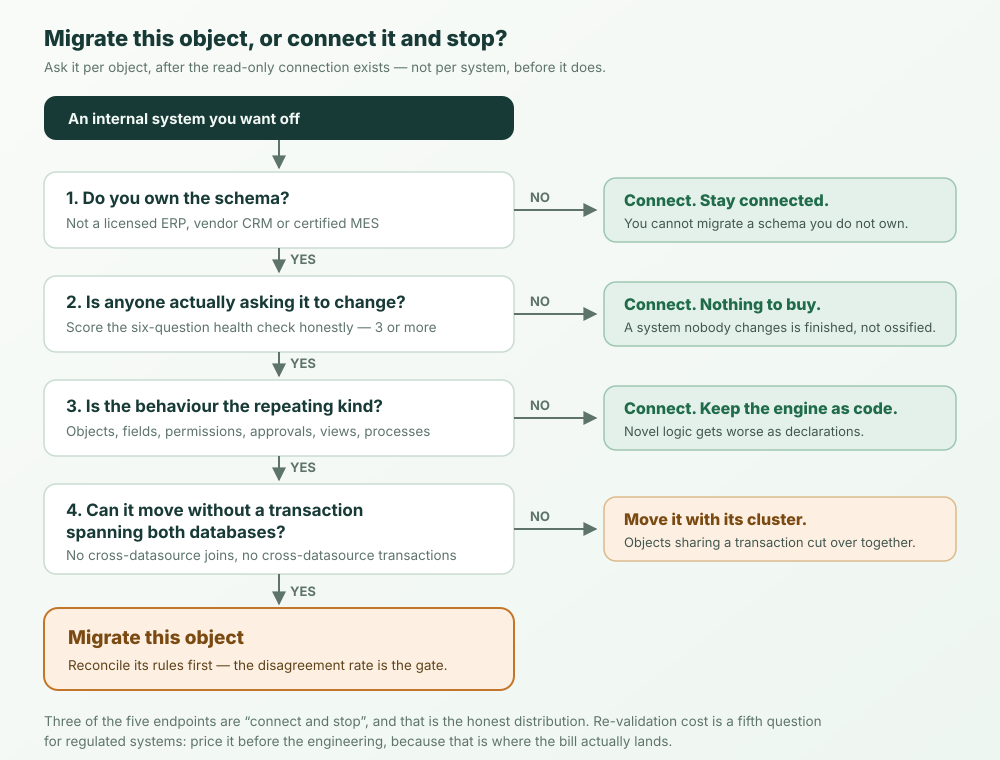

Move it in four stages, and make the first one reversible. Connect the existing
database read-only and declare the tables you care about as objects. Then measure
your declared rules against the history the old system already wrote, before you
trust them. Then enable writes one object at a time, behind two explicit gates.
Then cut over per object, never per system.

Most of the risk sits in stage two, which is the stage every migration guide
skips. And for a meaningful share of systems the honest answer is to stop after
stage one and never migrate at all.

## The shape of the move

| Stage | What you do | Reversible | What it actually buys |
| --- | --- | --- | --- |
| 1. Connect | Bind the existing database as a read-only external datasource; declare its tables as objects | Yes - disconnect and nothing happened | A readable model, and AI/query/reporting on live rows |
| 2. Reconcile | Declare the business rules you believe you have; check them against the rows the system already produced | Yes - still only reads | The rules nobody wrote down, found before they matter |
| 3. Move writes | Enable writes for one object at a time behind a double opt-in | Mostly - flip the gate back | A shrinking surface still owned by the old system |
| 4. Cut over | Move that object's data into a table the platform owns | No - this is the one-way door | The old system stops being the system of record for it |

Stage 1 is an afternoon. Stage 2 is the one that takes weeks, and it is the one
that decides whether stages 3 and 4 go well. Notice what is not in this table: a
date on which the old system is switched off. That date is an outcome, not an
input.

## The decision is per object, not per system

The usual framing is a fork in the road: migrate, or connect and leave it alone.
That framing is wrong, and the mistake is expensive in both directions.

**Connecting is not the alternative to migrating. It is stage one of migrating.**
The read-only connection you build to avoid a migration is the same connection a
migration starts with - so you do not have to make the call up front. Build the
connection, take the value immediately, then decide object by object, with the
model in front of you, which ones ever become yours.

For a lot of systems the answer is none of them, and that is a real outcome rather
than a failure to commit. [Connecting an existing database without
migrating](/en/blog/extend-existing-systems-with-ai/) is the full mechanics of
stopping there, and [the manufacturing
version](/en/blog/manufacturing-legacy-systems-ai/) covers plants where the ERP
and the MES are not moving this decade. Everything below assumes you have done
that part.



## When not to migrate

A migration guide that recommends migrating in every case is a brochure. Four
cases where the answer is to connect and stop, and they are common:

**You do not own the schema.** A licensed ERP, a vendor CRM, a certified MES. You
cannot migrate a schema you are contractually not allowed to own, and attempts to
mirror it into something you do own re-create the vendor's model with none of the
vendor's support. Connect it.

**Nobody is asking it to change.** Run the [six-question health
check](/en/blog/why-custom-systems-die/#a-six-question-health-check) honestly. A
system scoring one or two is not ossified; it is finished. Payroll exports that
have not changed in four years are not a modernization opportunity, they are a
solved problem. Migration cost is real and the return here is zero.

**The valuable part is genuinely novel logic.** A pricing engine, a scheduler, a
routing optimizer - the thing that is actually your edge. Declarations cover the
part of enterprise software that repeats: objects, fields, relationships, views,
permissions, approvals, processes. Novel algorithms are code, should stay code,
and get worse if you force them into metadata. Connect the data, leave the engine
alone.

**Re-validation costs more than the changes are worth.** Regulated systems - GxP,
medical device, anything where a certification is tied to the implementation you
are running - carry a re-qualification bill a staged migration does not avoid.
Sometimes it is still worth it. Price it first: this is the case where the
migration cost is not in the engineering.

The residue after those four is the set worth moving: systems whose rules change,
whose schema you own, and whose behaviour is mostly the repeating kind.

## Stage 1 - Connect it read-only, and let the platform forbid DDL

The first stage is a read, and the platform's job is to make it structurally
impossible for it to become anything else.

Declare the existing database as a datasource with `schemaMode: 'external'`. That
is not a naming convention; it is an ownership declaration the runtime enforces.
Under `external`, the platform will not run DDL against that database - no
migrations, no `alterTable`, no helpful auto-fixes - and writes are off by
default. A read-only database user is still worth having as the second layer, but
the first layer is now in the declaration where a reviewer can see it.

Two things then happen that are worth more than they sound:

**The schema is validated at boot.** You declare an object against a remote table,
and if your declaration disagrees with the real columns and types, the boot fails
with a diff instead of a clean start followed by runtime errors on page seven. Set
`validation: { onMismatch: 'fail' }` and a wrong declaration cannot reach
production. `validate-only` warns instead, for when you are still drafting.

**You do not hand-write the objects.** `os datasource list-tables legacy` enumerates
what is out there, and `os datasource introspect legacy --table orders` generates an
object draft from the real remote table - columns, types, keys. Point a coding agent
at the drafts to add labels, drop the columns you do not want exposed, and layer on
permissions. The output is ordinary source you commit and review.

The mechanics, the write gates and the failure modes are specified in
[ADR-0015](https://github.com/objectstack-ai/objectstack/blob/main/docs/adr/0015-external-datasource-federation.md)
and
[ADR-0062](https://github.com/objectstack-ai/objectstack/blob/main/docs/adr/0062-external-datasource-runtime.md);
the product walkthrough is [Extend Existing
Systems](https://docs.objectos.ai/docs/extend-existing-systems). One caveat before
you plan around it: an object bound explicitly to a datasource has no fallback, so
a datasource that cannot connect refuses the boot rather than silently writing to
the default database. That is the behaviour you want, and it means a broken
credential is an outage rather than a warning.

## Stage 2 - Measure the disagreement rate

Here is the part every migration guide skips, and it is the part that decides the
outcome.

You are about to re-declare the rules of a system whose rules were never written
down. The build documentation, if it exists, describes 2019, and the people who
knew the rest have left - that is question one of the health check, and it is why
you are migrating. So you will write down what you believe the rules are, you will
be wrong about some of them, and the ones you are wrong about are exactly the ones
that surface during cutover weekend.

The fix is not more interviews. It is that **the old system already wrote its own
specification, in the form of every row it ever produced.** Five years of orders
are five years of evidence about what the rules actually were, including the
clauses nobody remembers adding.

So: declare the rule as you believe it, run it over the history you connected in
stage one, and count the rows where the declaration and the recorded outcome
disagree. Call that number the **disagreement rate**. It measures how well you
understand the system you are replacing, and unlike a project plan it cannot be
optimistic.

Here is the arithmetic, continuing the composite distributor from [why custom
systems die](/en/blog/why-custom-systems-die/) - a worked example, not a customer
measurement, laid out so you can run the same shape against your own data.

The believed rule: *orders above $100,000 need the regional director's approval.*
Everyone agrees this is the rule. It is in the 2019 spec.

Five years of history hold 4,812 orders. 143 of them are above $100,000. Of those,
118 carry the director's approval and **25 do not**. A disagreement rate of 17%.

Seventeen percent is not a data quality problem. It is a missing clause. Chasing
the 25 finds it: 22 were placed against a standing contract, and somewhere around
2021 someone decided standing-contract orders skip the threshold. It was never
written down, and it is load-bearing - declare the rule without it and roughly
four or five orders a year that used to flow start stopping for an approval, which
will annoy a regional director into overriding the whole control.

Add the clause, re-run: 3 rows disagree, a rate of 2%. Two are data-entry errors
from 2020. One is a genuine breach that nobody ever caught, which is its own
finding and does not belong in the migration.

**The exit criterion for stage two is not zero.** It is that the rate stops
falling and the residue is explainable row by row. A rule you cannot get below 15%
is a rule you have not understood yet, and shipping it is choosing to find out in
production.

Be clear about what the platform does here. It gives you the read-only connection,
the object model, and a query surface over live rows - including natural-language
querying, useful when you are fishing for the shape of a rule you cannot yet state.
It does not compute a disagreement rate for you. `os datasource validate` diffs
your declarations against the remote *schema*, a narrower thing: it catches a wrong
column type, not a missing approval clause. Rule reconciliation is queries you
write. Budget for it as real work, because it is.

## Stage 3 - Move writes, one object at a time

Once a rule survives reconciliation, the object holding it can start accepting
writes. This is deliberately awkward to do by accident: it takes **two explicit
opt-ins**, in two different files.

The datasource must set `external.allowWrites: true`, and the individual object
must set `external.writable: true`. Either gate alone leaves the object read-only
and inserts, updates and deletes are rejected. One flag is a typo; two flags in two
places is a decision, and both show up in a diff a reviewer can read.

This is also where the declared model starts earning its keep, because the write
path you are enabling is not the old system's write path. It carries
[permissions](https://docs.objectos.ai/docs/configure/permissions) and, where the
rule you reconciled in stage two was an approval,
[an approval flow](https://docs.objectos.ai/docs/build/automation/approvals) - the
$100,000 threshold and its standing-contract clause as a declaration rather than a
condition spread across four files. The control that was invisible becomes a thing
someone signs off on.

Go one object at a time. The number that matters in stage three is how much of the
system the old application still owns, and you want it shrinking on a schedule you
chose.

## Stage 4 - Cut over, in an order two constraints choose for you

Cutover is per object: the object stops pointing at the remote table and becomes a
table the platform owns, with the rows imported into it. The import path is the
standard one - a named mapping projecting source columns onto fields, applied by
`POST /api/v1/data/:object/import` in upsert mode against a key you choose, so a
re-run is safe and a partial import is resumable.

Two platform constraints decide the order, and they are not negotiable:

**A single query cannot join across two datasources.** Federated objects are
queried per datasource. So an object still living in the old database and an object
already moved cannot be joined in one query - you get two queries and you correlate
in the application, or you move them together.

**A transaction cannot span two datasources.** A write that tries refuses loudly
rather than half-committing. This is the good outcome, and it is also a hard
sequencing rule: two objects that must be written atomically must live in the same
database, which means they cut over in the same step.

Together those give you the real unit of migration, and it is usually not one
object. It is the smallest cluster of objects that share a transaction. Find those
clusters before you plan the sequence, because discovering one mid-cutover is how a
weekend becomes a Monday.

Nothing here runs DDL against the old database, at any stage, including this one.
The old system is still standing and still holding its rows until you decide
otherwise, which is what makes a per-object cutover survivable: the rollback is
that you stop using the new table.

## What this costs, and what it does not fix

Stage one is cheap and stage two is not. If someone gives you a migration estimate
with no line for rule reconciliation, they have priced the part that is easy.

Order of magnitude: the connection and the object drafts are days. Reconciling the
rules of a system with five years of history is weeks, scaling with how many rules
are genuinely undocumented rather than with table count. Stages three and four are
boring if stage two was done, and are where all the drama lives if it was not.

What you hold at the end is a set of declarations - objects, fields, permissions,
approvals, processes - stating what the business does, executed by an open runtime,
rather than an implementation that has to be read to be understood. Stated in the
open instead of locked inside one vendor's product, they amount to an **open
business ontology**, and the rules outlive the shop that set them up. That is the
point: if the replacement is another artifact only its author can read, you have
bought a new system with the same shape and reset the clock to year one.

Two things this does not fix. It does not recover the toll already paid. And it
does not make the novel parts of your system declarative - the pricing engine stays
code, and should.

The AI part follows from the shape rather than the other way around. When the
definition is small and declarative, an agent proposes a change as a diff and the
accountable person can read the whole thing: field, permission, approval step, on
one screen. That is the useful form of metadata-driven development - the AI writes
the definition, not the implementation, and a human signs off on something small
enough to review. It is also why stage two matters: an agent writes a declaration
far faster than you can verify it, and the disagreement rate is the verification.

## Start with the read

The first stage commits you to nothing. Connect the database read-only, generate a
draft object from one table you care about, and pick the single rule you are most
confident about - the approval threshold is a good one, because everybody is sure
they know it.

```bash
npm i -g @objectstack/cli && os start
```

Then run that rule against the rows the old system has been quietly recording for
five years, and see what the disagreement rate is. If it comes back at zero, you
understand your system and the rest of this is scheduling. If it comes back at 17%,
you have just found the part of the migration that was going to hurt, four stages
before it could.
