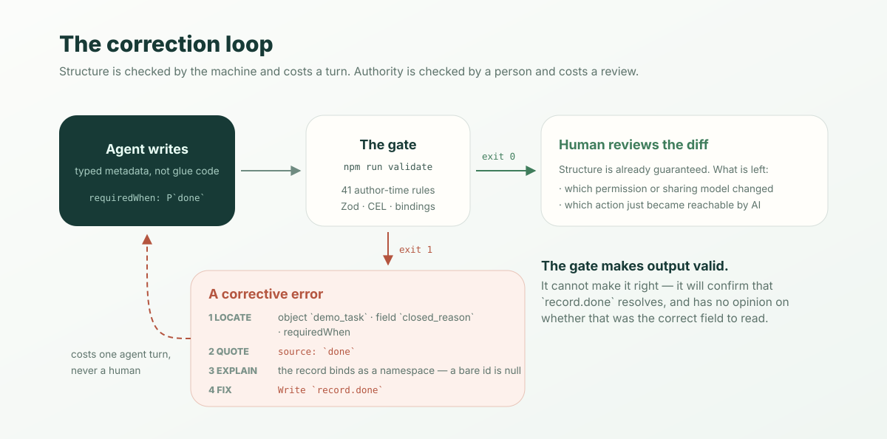

**Short answer.** Pointing a coding agent at ObjectStack is three commands, and
you do not need all three:

```bash
npm create objectstack@latest my-app     # writes AGENTS.md + .github/copilot-instructions.md
npx skills add objectstack-ai/objectstack/skills --all   # 11 domain skills
pnpm add @objectstack/mcp                # tool server, wired into your app's runtime
```

The first two work offline and take under a minute. The third is the only one
that needs a running deployment. But none of them is the part that decides
whether this works. That part is `npm run validate` — a gate that runs **41
author-time rules** and, when the agent gets something wrong, hands back a
message the agent can act on without asking you. Everything below is the
transcript of doing this on a clean machine against ObjectStack 17.2.0.

## Three wires, and they are not interchangeable

Wiring any agent to any typed target format means answering three separate
questions, and teams routinely conflate them:

| Wire | Question it answers | When it is read |
|:--|:--|:--|
| **Instructions** | What are the house rules here? | Every turn, in context |
| **Skills** | How do I author *this* domain correctly? | Loaded on demand, by task |
| **Tools** | What is true in the running system right now? | At call time, over a protocol |

Instructions are cheap and always present, so they must stay small. Skills are
big and specific, so they must be retrievable rather than resident. Tools are
neither — they are live state, and they carry permissions. A rule file cannot
tell your agent how many open orders exist; a tool call cannot tell it that
predicates are CEL. Wire the one that matches the question.

## Wire 1 — the rule file

`create-objectstack` writes it for you:

```bash
$ npm create objectstack@latest demo
  ✓ Template files written (12)

  Created files:
    + .github/copilot-instructions.md
    + AGENTS.md
    + objectstack.config.ts
    + objectstack.manifest.json
    + src/objects/note.object.ts
    ...
```

Two files, identical content, because agents disagree about where to look.
`AGENTS.md` is read by Claude Code, Cursor and Codex; GitHub Copilot reads
`.github/copilot-instructions.md`. The scaffolder writes both rather than
picking a side.

What is in it matters more than that it exists. The generated file is about
sixty lines and spends most of them on one thing — how to check your work:

> Metadata mistakes fail **silently at runtime**, not at edit time — a bare
> field reference in a predicate (`done` instead of `record.done`) evaluates to
> `null` and silently hides an action on every record.

Then it names the naming conventions (`camelCase` config keys, `snake_case`
machine names, singular metadata type names, `{name}.{type}.ts` files) and five
key rules. That is the whole rule file. It is deliberately not a tutorial,
because a rule file competes for context with the actual task.

## Wire 2 — the skills bundle

Instructions are always in context, so they cannot carry the field reference for
46 field types. That is what skills are for:

```bash
$ npx skills add objectstack-ai/objectstack/skills --all
  Found 11 skills
  Installing to all 77 agents

  ✓ ./.agents/skills/objectstack-data
    universal: Amp, Antigravity, Antigravity CLI, Cline, Codex +14 more
    symlinked: Claude Code, Eve
  ...
  Done!  Review skills before use; they run with full agent permissions.
```

Eleven skills, 920 KB on disk, one canonical copy in `.agents/skills/` with
per-agent symlinks (`.claude/skills/objectstack-data` points back at it). They
split by authoring domain — `objectstack-data` for objects and fields,
`objectstack-query` for ObjectQL, `objectstack-ui` for views, and so on — so the
agent loads the one the task needs instead of all of them.

The design decision worth stealing is what a skill *refuses* to contain. Each
one carries prose about shape and intent, then points at the truth:

> **Always read the spec source for exact field shapes.** Skills give shape and
> intent; the Zod schemas are the truth.

The pointers resolve to `node_modules/@objectstack/spec/src/**/*.zod.ts`,
because the published package ships its Zod sources, not just compiled types.
An agent that needs to know whether `requiredWhen` exists on a field reads the
schema that the runtime itself validates against — the same file, one hop away,
in the consumer's own `node_modules`. Nothing to keep in sync, so nothing that
can rot. The package also ships an `llms.txt` summarising the three-layer model
across 171 schemas, for the retrieval pass before that.

Note the `/skills` suffix in the command. It is the published catalog boundary:
pointing the CLI at the repository root would also sweep up repo-internal
skills that were never meant to ship.

## Wire 3 — tools, inside the runtime

The first two wires teach the agent to *write*. This one lets it *ask*. The
package is `@objectstack/mcp`, and the important thing about it is architectural:

```bash
$ npm view @objectstack/mcp bin
$                        # no output — there is no binary
```

It is not a standalone bridge you run beside your app. It is a plugin that
loads inside the runtime process, which is why every tool call lands on the same
permission and audit path as a click in the UI. There is no side door because
there is no side.

Scaffolding does not wire it — the blank template ships neither the dependency
nor the plugin, so this is two deliberate edits:

```ts
// objectstack.config.ts
import { MCPServerPlugin } from '@objectstack/mcp';

export default defineStack({
  plugins: [
    new ConnectorRestPlugin(),
    new MCPServerPlugin({ name: 'demo' }),
  ],
  objects: Object.values(objects),
});
```

A running deployment then serves Streamable HTTP at `/api/v1/mcp` by default,
and a client attaches to it:

```bash
claude mcp add --transport http objectstack https://your-deployment.example.com/api/v1/mcp
```

Each deployment acts as its own OAuth 2.1 authorization server, so you approve a
browser login on first use and every tool call runs under *your* identity — row
and field rules included. The tools are generated from the same metadata that
defines the app (`query_records`, `describe_object`, `run_action`, and the rest),
which means the agent sees business objects rather than a database dump. For the
full tool list and the API-key track for headless use, see the
[Tools and MCP page](/en/mcp/); this post is the wiring.



## The half that actually decides it

Everything above is setup. Here is the part that makes an agent useful on a
format it has never seen, and it is worth reproducing rather than describing.

Give the agent a task with a conditional rule in it. A reasonable first attempt
looks like this — a field required only when the task is done:

```ts
// src/objects/task.object.ts
import { ObjectSchema, Field } from '@objectstack/spec/data';
import { P } from '@objectstack/spec';

export const Task = ObjectSchema.create({
  name: 'demo_task',
  label: 'Task',
  pluralLabel: 'Tasks',
  fields: {
    subject: Field.text({ label: 'Subject', required: true, maxLength: 200 }),
    done: Field.boolean({ label: 'Done' }),
    closed_reason: Field.textarea({
      label: 'Closed reason',
      requiredWhen: P`record.done`,
    }),
  },
  sharingModel: 'private',
});
```

That passes:

```
$ npm run validate
  → Running author-time rules (41)...
  ✓ Validation passed (95ms)

  Data: 2 Objects  5 Fields
  Runtime: 3 plugins
```

Now make the one mistake the rule file warned about — drop the namespace:

```diff
-      requiredWhen: P`record.done`,
+      requiredWhen: P`done`,
```

That is what an agent trained mostly on JavaScript reaches for, because in most
template languages a bare identifier *is* the field:

```
$ npm run validate
  → Running author-time rules (41)...

  ✗ Author-time rules failed (1 issue)
  • object 'demo_task' · field 'closed_reason' requiredWhen: bare reference
    `done` — a formula/validation expression binds the record as the `record`
    namespace, not at top level, so `done` resolves to nothing and the
    expression silently evaluates to null. Write `record.done`.
      source: `done`
      rule: expression-invalid  at object 'demo_task' · field 'closed_reason' requiredWhen

$ echo $?
1
```

Read that message as an interface, not as an error. It does four things, and
each one is load-bearing:

1. **Locates it** — object, field, and which predicate slot, so nothing has to
   be searched for.
2. **Quotes the offending token** — `` `done` `` — so a find-and-replace is
   unambiguous.
3. **Explains the mechanism** — the record binds as a namespace, so a bare
   identifier resolves to nothing and the expression evaluates to `null`.
4. **Prints the fix** — `Write record.done.`

Call that a **corrective error**: a diagnostic that carries enough for the
writer to repair itself. Its opposite is the diagnostic every one of us has
shipped — `Invalid expression at line 14` — which is fine for a human with the
file open and useless to an agent, because it forces a search. An agent that
gets a corrective error closes the loop in one turn and never involves you. An
agent that gets a vague one guesses, and its second guess is often worse than
its first.

This generalises past ObjectStack, and it is the real lesson here: **if you want
an AI to write your format, the highest-leverage thing you own is not your
documentation, it is your error messages.** Docs are read probabilistically;
errors arrive exactly when the model is wrong and exactly where. A corpus of
corrective errors is a training signal your format emits at runtime, forever,
to every agent that touches it — and unlike a rule file, it does not compete for
context, because it only speaks when there is something to say.

The economics follow from that. Wrong output caught by a gate costs an agent
turn. Wrong output caught in review costs a human. Wrong output that reaches
production costs an incident. The gate here runs 41 rules in about 130
milliseconds, and it is the same gate `npm run build` runs — `validate` just
skips emitting `dist/`, so the inner loop and the shipping check cannot drift
apart.

## What does not work yet

Being specific about the edges, because a how-to that only lists successes is a
brochure:

- **The tool server is not scaffolded.** `npm create objectstack` gives you the
  rule file and (best-effort) the skills. `@objectstack/mcp` and its plugin line
  are yours to add. If the scaffolder's skills step fails — it shells out to a
  separate CLI — it tells you, and you run the command yourself.
- **There is no `npx @objectstack/mcp`.** The package publishes no binary. If
  you have seen a one-line "just npx it" config for ObjectStack, it does not
  match what ships; the server needs a runtime to live in.
- **The stdio transport refuses to start without an identity.** Both
  `OS_MCP_STDIO_ENABLED` and `OS_MCP_STDIO_API_KEY` are required, and a stdio
  server with no resolvable principal fails closed rather than serving data
  unscoped. Correct, but it means "just point it at a folder" is not a path.
- **Web connectors need public HTTPS.** Claude Code and Claude Desktop reach an
  intranet deployment fine; the claude.ai connector needs the endpoint publicly
  reachable.
- **"77 agents" is an installer catalogue, not a support matrix.** The skills
  CLI writes a universal copy plus per-agent symlinks for anything it knows
  about. Claude Code is the path verified end to end here; the AGENTS.md readers
  (Cursor, Codex) and Copilot get the same instructions by construction. The
  long tail is best-effort, and you should verify your own agent rather than
  trusting the count.
- **Business actions are gated at invoke time, not sandboxed.** An action
  exposed to AI runs its body as trusted application code — the gate decides
  *whether* it runs, not what it may touch. Expose an action only when its body
  is safe for anyone who can pass the gate.
- **The gate checks structure, not intent.** It will confirm that
  `record.done` resolves. It has no opinion on whether that was the right field.

## What is still yours

The gate makes the agent's output *valid*. It cannot make it *right*, and the
difference is where you come in. When you review AI generated code in this
shape, the diff is metadata rather than application logic, so the reading is
short and the questions are specific: which permission or sharing model changed,
which action became reachable by AI, which field names will still make sense to
someone reading them in a year. Structure is machine-checkable and cheap.
Authority is not, and it is the only part worth your attention.

## Wire it up

Pick the wire that matches your question. Instructions and skills, on any
existing project, cost you one command each and no running system:

```bash
npx skills add objectstack-ai/objectstack/skills --all
```

Then give your agent a real task and run `npm run validate` on what comes back.
The gate's answer will tell you more in ten seconds than any evaluation harness
will in a day — and if it fails, read the message it gives you before you fix
anything. That message is the product.

For the format the agent is writing into, see the
[agent developer guide](/en/agent-developer/); for the tool surface, the
[Tools and MCP page](/en/mcp/). Everything above is Apache-2.0 and lives at
[objectstack-ai/objectstack](https://github.com/objectstack-ai/objectstack) —
including the [skills](https://github.com/objectstack-ai/objectstack/tree/main/skills)
your agent just installed.

---

*Verified against ObjectStack 17.2.0 (`create-objectstack`, `@objectstack/cli`,
`@objectstack/spec`, `@objectstack/mcp`, all 17.2.0) on Node 22. Every command
and every block of output above was run, not reconstructed.*
