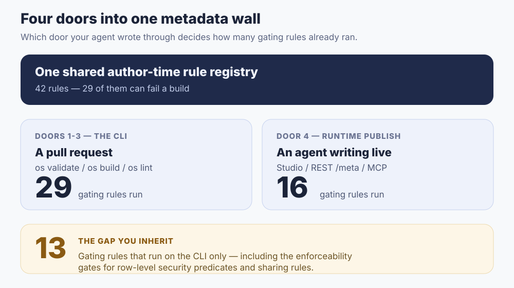

**Answer first.** Review an AI-written application change in four passes, in this order: **(1)** read the findings your build did *not* fail on; **(2)** check permission **values**, not permission keys; **(3)** check who decides and what happens when nobody does; **(4)** fields and views last, because their blast radius is bounded by passes 2 and 3. Underneath the order is one ladder — **declared → enforceable → correct**. A validation gate carries a change up two rungs and stops. The third rung is what review is *for*, and no gate has ever climbed it for you.

That the diff is small enough to review at all is a separate argument, made in [metadata, not code generation](/en/blog/metadata-not-code-generation/) and defined as [reviewable diff](/en/glossary/reviewable-diff/). That you *should* be asking this question rather than trusting green CI is argued in [AI wrote your app — dare you merge it?](/en/blog/ai-wrote-your-app-dare-to-merge/). This piece assumes both and does the next thing: it walks a real change, line by line, in the order that finds the most for the least reading.

## Before you open the diff: what the gate already did

ObjectStack ships one shared author-time rule registry — `packages/lint/src/authoring-rules.ts` in the open-source monorepo. Two numbers set your expectations for everything below:

- **42 rules** in that registry. **29 of them can emit `error`**, which means they fail a build.
- Those 29 run behind **four doors**, and the door your change came through decides how many of them ran.

The doors are `os validate`, `os build`, `os lint`, and the **runtime publish gate** — the path a Studio save, a REST `/meta` write, and an MCP/AI authoring call all funnel through. The registry's own invariant is that any rule which can emit `error` runs on all three CLI commands, so those three are one wall with three doors. The fourth is not equivalent: **16 of the 29 gating rules are wired to the runtime publish gate; the other 13 run only on the CLI.** Among the 13 are the two enforceability gates for row-level security and sharing rules.



So the first question of any review is not in the diff at all — it is **which door did this change enter through?**

- **A pull request in a git repository.** All three CLI doors are available. If CI runs any one of them, all 29 gating rules ran.
- **A Studio save, a REST `/meta` write, or an agent writing over MCP.** The publish gate ran 16, narrowed further per metadata type. Draft saves run none of it by design — a draft is allowed to be half-finished, and cannot execute until it is published.

If your agent authored through MCP and you are reviewing the result in the console, export the metadata and run `os lint` on it before you approve. That is not paranoia; it is 13 gating rules you have not yet run, including the one that catches a row-level security predicate the runtime would silently drop.

## The change your agent opened

Here is the change. The target is the CRM example app in the ObjectStack monorepo, which already carries a `crm_opportunity` object with a `discount_percent` field, a readonly `approval_status` field, and a `finance_approver` position described in its own source as "authorised to approve discounts above 30%". The prompt was: *"discounts over 30% need finance approval."*

```diff
+ // src/flows/discount-approval.flow.ts  (new file)
+ export const DiscountApprovalFlow = defineFlow({
+   name: 'crm_discount_approval',
+   label: 'Discount Approval',
+   type: 'autolaunched',
+   status: 'active',
+   nodes: [
+     { id: 'start', type: 'start', label: 'On Deep Discount',
+       config: { objectName: 'crm_opportunity',
+                 triggerType: 'record-after-update',
+                 condition: 'discount_percent > 30' } },
+     { id: 'finance_review', type: 'approval', label: 'Finance Review',
+       config: {
+         approvers: [{ type: 'position', value: 'finance_approver' }],
+         behavior: 'first_response',
+         lockRecord: true,
+         approvalStatusField: 'approval_status',
+         escalation: { timeoutHours: 24, action: 'reassign' },
+       } },
+     { id: 'approved', type: 'end', label: 'Approved' },
+     { id: 'rejected', type: 'end', label: 'Rejected' },
+   ],
+   edges: [
+     { id: 'e1', source: 'start',          target: 'finance_review' },
+     { id: 'e2', source: 'finance_review', target: 'approved', label: 'approve' },
+     { id: 'e3', source: 'finance_review', target: 'rejected', label: 'reject' },
+   ],
+ });

  // src/security/sales-positions.ts
  export const SalesUserPermissionSet = definePermissionSet({
    name: 'crm_sales_user',
    objects: {
-     crm_opportunity: { allowRead: true, allowCreate: true, allowEdit: true, allowDelete: false },
+     crm_opportunity: { allowRead: true, allowCreate: true, allowEdit: true, allowDelete: true },
```

Thirty-odd lines. Every key in it is real, every key parses, and `os build` is green. It carries three defects and inherits a fourth — and each one announces itself at a different volume: one warning, one info line, and two silences. That spread is exactly why the passes run in the order they do.

## Pass 1 — read the findings your build did not fail on

The instinct is to save "what the tooling already said" for last, on the theory that a green build means the tooling said nothing. That instinct is backwards, and this diff is why.

A gate has three severities. `error` fails the build, so you never merge one by accident. `warning` and `info` do not fail anything — and on a change that touches approvals, that is precisely where the sharpest findings live. Two fire here:

**`approval-escalation-reassign-no-target`** — severity `warning`. The escalation declares `action: 'reassign'` and no `escalateTo`. There is nobody to reassign *to*, so in the rule's own words the escalation "degrades to a notify and the request stays with the original approvers." The hand-off the author asked for never happens, and the build does not care.

**`approval-approvers-may-resolve-empty`** — severity `info`. Quoting the finding itself:

> every approver on this node routes to a group (position/team/department) whose members are runtime data — if none is staffed, the request resolves to an empty slate and waits forever, and (lockRecord) the record stays locked with no in-product recovery.

`finance_approver` is a position. Positions are staffed by rows in `sys_user_position` — *runtime data*, not metadata. Whether anyone holds that position on the day you deploy is not a fact the diff contains, and cannot be. The declared default for that case is `onEmptyApprovers: 'admin_rescue'`, which opens the request anyway and warns loudly, so it fails safe rather than waving the discount through. It still means a locked opportunity and a request only a platform admin can rescue.

Both findings are in the output of the build that passed. Read them first because they are free — someone already did the work, and the only reason they get missed is that the exit code was zero. Run `os lint --json` and read every finding, not just the ones that stopped you.

## Pass 2 — permissions: check the values, not the keys

Permissions come second because this is where the gate's help ends most sharply, and it helps to know exactly where the line falls.

What the gate does guarantee, so you can stop hand-checking it:

- **A baseline exists.** `security-owd-unset` is an `error`: a custom object that declares no `sharingModel` fails the build, with the reason stated in the finding — the runtime fails closed to `private`, "but the baseline must be an authored decision, not an accident."
- **The baseline is spelled canonically.** `security-owd-alias` is also an `error`, and its message is worth reading for the shape of the failure it prevents: a retired alias means the runtime falls back to `private`, "so this object is NOT readable org-wide." An author who wrote what they believed was a broad grant would have shipped a narrow one, and nothing at run time would have complained.
- **A row-level rule actually compiles.** `validateRlsPredicateEnforceability` calls the runtime's *own* decision procedure on the predicate rather than modelling it, so "rejected by the linter" and "dropped with no enforcement" are the same boolean and cannot drift apart. A predicate the runtime would drop is refused at authoring time instead of shipping as a policy that reads like an authorization and behaves like a blanket refusal. (This is the [declared vs. enforced](/en/glossary/declared-vs-enforced/) gap, closed mechanically — and it is one of the 13 rules that do not run at the publish door.)

What the gate does not, and structurally cannot, tell you:

**`allowDelete: false → true`.** No rule fires. Both values are valid; both are enforceable; the runtime will enforce whichever one you merge. Nothing in the metadata expresses whether sales representatives should be able to delete opportunities, because that is a business fact about your company. This one word is the entire third rung, and it is invisible to every one of the 42 rules.

The same holds for a value that is not even in the diff. The example object carries `sharingModel: 'public_read_write'` — in the spec's own words, "everyone reads+writes" — with a source comment saying the wide baseline is deliberate for a demo. Copy that object into a real CRM and you have org-wide read/write on every opportunity, and every gate stays green forever, because the gate's question was *did you declare a baseline*, not *is this the right one*. When a change touches an object, read its OWD even when the diff does not, and read the [record access](https://docs.objectos.ai/docs/configure/permissions/record-access) and [permission sets](https://docs.objectos.ai/docs/configure/permissions/permission-sets) reference if the semantics are not fresh.

One more asymmetry worth internalising: record-level access can be *derived*, and object-level CRUD never is. A master-detail child inherits its record scope from the master, but its object-level grant is a separate gate — and the rule that notices a missing one, `security-master-detail-ungranted`, is a `warning`, not an error, because it cannot adjudicate the per-permission-set nuance. Pass 1 again.

## Pass 3 — decisions: who approves, and what happens when nobody does

Approvals are third because they are where a plausible-looking declaration most often means something other than what it reads like.

`escalation: { timeoutHours: 24, action: 'reassign' }` has no `enabled` key. Is the escalation on? **Yes** — `enabled` defaults to `true`. The reasoning recorded in the schema is that the feature switch is whether an `escalation` block exists at all, so a block carrying `timeoutHours` is live unless someone explicitly writes `false`. That default was flipped from `false` in a recent major, which is exactly the kind of fact a model trained on older examples will get wrong in the confident direction. **Do not infer a switch's state from its absence.** Look it up, or write it out.

Then check the thing an approval node is actually for. Who can decide (`approvers`), how many must (`behavior`, `minApprovals`), what a rejection does (the `reject` out-edge), and what an empty slate does (`onEmptyApprovers`). Every one of those is a declared, reviewable line — see the [approvals reference](https://docs.objectos.ai/docs/build/automation/approvals) — and none of their *values* is checkable by a machine, for the same reason `allowDelete` is not.

There is one trap here that the gate does handle well, and it is worth knowing because it shows the mechanism working. Asked to "escalate if nobody answers", an agent may reach for a `wait` node with a timeout. **A `wait` node has no timeout.** The two keys that claimed one, `timeoutMs` and `onTimeout`, were retired: one had a single reader that used it as the timer duration, the other had no readers at all. They are now tombstones — writing either is a hard parse rejection carrying the prescription: use `timerDuration`, and quote the number, because the key is a string and a bare numeric string reads as milliseconds. That is the correction signal a typed metadata surface can give an agent and a pile of generated code cannot: the wrong key never gets in the door, and the message says what to write instead. Real timeout semantics for `wait` remain unimplemented, and the schema says so rather than pretending.

## Pass 4 — fields and views, last

Fields, layouts, list views and formulas go last, and this is a claim about blast radius rather than about importance.

A field cannot leak data the permission layer does not hand out, and a view cannot perform an action the action layer does not grant. Their failure modes are bounded by the two passes above — which is why a wrong column on a list view costs you a follow-up commit, while a wrong `allowDelete` costs you records. Reviewing in the other order is the most common way a real review runs out of attention before it reaches the part that mattered.

This is also the pass where the gate is densest and you can lean on it hardest: reference integrity, filter tokens, chart bindings, visibility predicates, formula compilability, autonumber formats. If a view references a field that does not exist, you will not be the one who finds out.

## What this review still cannot catch

Five honest limits. A how-to that implies review is now easy deserves to be disbelieved.

1. **Intent.** Nothing above tells you whether 30% was the right threshold, whether finance is the right approver, or whether this workflow should exist. The gate raises the *floor* on a change; it says nothing about the ceiling.
2. **Runtime data.** Positions, team membership, and territory assignments are rows, not metadata. A perfectly reviewed approval routed to an unstaffed position is a stuck request, and the diff cannot show you the staffing.
3. **Interaction between changes.** Each of two changes can be right and their composition wrong. Rules judge one stack; they do not judge your Tuesday against your Thursday.
4. **The escape hatches.** Real applications carry hand-written hooks, actions and custom code, and those are ordinary code review with all its ordinary costs. The metadata surface shrinks that part; it does not delete it.
5. **The runtime itself.** All of this stakes your trust on one shared runtime being correct. That is a genuinely better trade than auditing freshly generated implementation per application — review once rather than a thousand times — but it is a trade, and it should be named as one.

## The checklist

Paste this into your next pull request template.

```text
[ ] Which door? PR (all 29 gating rules) or Studio/REST/MCP (16)?
    If not a PR: export the metadata and run `os lint` before approving.
[ ] Pass 1 — read EVERY finding, including warning and info. Green != silent.
[ ] Pass 2 — permissions: for each changed grant, say out loud who gains what.
    [ ] allowDelete / allowEdit changes justified in the PR description
    [ ] sharingModel (OWD) of every touched object read, even if unchanged
    [ ] row-level rules: predicate present AND enforceable
[ ] Pass 3 — decisions:
    [ ] approvers resolve to someone who will actually be staffed
    [ ] escalation: switch state confirmed, not inferred from an absent key
    [ ] reassign targets exist; empty-slate behaviour is declared, not defaulted
    [ ] rejection path goes somewhere sensible
[ ] Pass 4 — fields, views, formulas. Lean on the gate here.
[ ] Named in the PR: one thing this change could break that no rule checks.
```

The last line is the one that does the work. If the author — human or agent — cannot name it, the change has not been reviewed; it has been read.

## Point your agent at a target that can be reviewed

None of this is available to you if the AI hands back an implementation. The four passes exist because the change arrived as typed metadata with a declared permission model and a declared approval, which is what makes "check the values, not the keys" a sentence that means anything. That is the practical case for metadata-driven development when the author is a model rather than a person: the gate rejects the invalid at the door, and what survives is small enough and high-level enough that a human can spend their whole attention on the only question a machine cannot answer.

So point your agent at that target — a rules file that says "model the domain as ObjectStack objects, route access through permission set declarations, declare approvals as flow nodes," or the spec and MCP surface directly. [Give your agent rules for governable apps](/en/blog/give-your-agent-rules-for-governable-apps/) is the input side of this piece; this is what the output side looks like when you sit down to sign for it.

```bash
npm i -g @objectstack/cli && os start
```

Then run the four passes on the next diff it opens, and see how far down the list you get before you find something no rule was ever going to catch.
