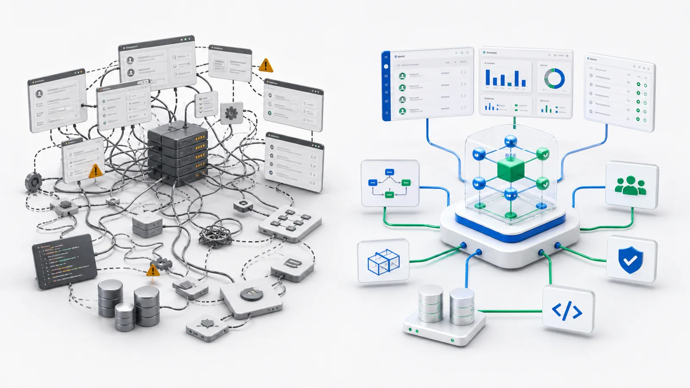

ローコードは企業に魅力的な約束をしました。あまりコードを書かずにアプリを作る。業務チームがドラッグ、設定、公開できる。

その約束は間違っていません。フォーム、一覧、承認フロー、簡単なレポートは速く作れます。多くの社内ツールや軽量ワークフローには合います。

問題は業務が複雑になったときに始まります。難しいのはボタンをドラッグすることではありません。複雑な業務システムは、主に画面の問題ではないからです。

## ローコードは始めるのが得意で、長期進化は弱い

簡単なアプリは順調に始まります。フィールドを追加し、フォームを置き、一覧を設定し、承認フローとロールを加える。1 週間で公開でき、皆が満足します。

本当の痛みは 2 か月目から始まります。このフィールドは特定部署だけに見せたい。10 万ドル以上の承認は別経路にしたい。顧客ランクで計算が変わる。ERP と連携したい。履歴データは触れない。地域ごとにレコードを分離したい。この操作は監査が必要。

一つ一つは正しい要求です。しかし積み重なると、プラットフォーム設定は隠れたコードになります。コードから逃げたつもりでも、複雑さは画面、条件、固有設定へ移動しただけです。

## 複雑な業務システムが本当に難しい場所

難所は少なくとも五つあります。

**オブジェクトモデル。** 顧客、注文、契約、ケース、設備、従業員、在庫は単独フォームではなく、関係、ライフサイクル、状態、権限を持つ業務オブジェクトです。

**権限モデル。** 誰が閲覧、編集、承認、エクスポートできるか。部門横断データや財務フィールドを見られるか。これはページ単位だけでは解けません。

**連携。** 企業には CRM、ERP、財務、サポート、契約、メッセージングがあります。ローコードが自分の境界内だけ速くても、連携点で全体は遅くなります。

**継続的変更。** ルール、組織、承認ポリシー、製品ラインは変わります。安全に理解し変更できなければ、システムは再び負債になります。

**保守性。** 6 か月後、なぜこの設定なのか誰が理解するのか。1 年後、安全に変更できるのか。新しい担当者は全体を理解できるのか。

ローコードの中心的な弱点は、最初の構築を速くしても、長期進化を常に簡単にするわけではない点です。

## AI が弱点を見えやすくする

かつてローコードの主な利用者は人間でした。人間は画面をクリックし、設定を見て理解できます。遅いが可能です。

AI が入ると要件が変わります。システムは AI にも理解可能でなければなりません。業務ルールが設定画面、隠れたスクリプト、条件式、独自ウィジェットに散らばっていると、AI は全体を理解しにくい。どのルールが本質で、どれが過去のパッチなのか分かりません。

ローコードは手書きコードを減らしましたが、AI にはかえって理解しにくいシステムを作った可能性があります。

## AI-native は「ローコードにチャットを足す」ことではない

AI-native アプリ基盤の核は、AI が画面部品を置く手伝いをすることではありません。アプリケーションそのものを AI が読め、変更でき、検証できる形にすることです。

そのためには、オブジェクト、フィールド、関係、権限、アクション、ワークフロー、UI、API、自動実行できるルール、人間確認が必要な操作が、明確なメタデータとソースレベル宣言として存在する必要があります。

構造が明示されると、AI は現行システムを理解し、変更を生成し、影響を説明し、テストを書き、権限リスクを指摘できます。

## 違い 1：ローコードはページから、AI-native はオブジェクトから始める

ローコードはフォームや一覧から始めがちです。AI-native 基盤はオブジェクトから始めるべきです。

設備修理アプリなら、中心は修理フォームではありません。設備、修理依頼、技術者、サービス記録、優先度、状態、割当アクション、クローズルールです。これらが定義されると、フォーム、一覧、API、権限、検索、レポート、AI ツールが同じモデルから生成できます。

## 違い 2：ルールを隠さず明示する

複雑なシステムでは、隠れたルールが危険です。なぜこのステータスだけフィールドが出るのか。なぜ追加承認が必要か。答えが設定 UI の片隅にあると、毎月変更しにくくなります。

AI-native システムではルールは明示的で読めるべきです。業務ユーザーは意図を理解し、開発者は詳細をレビューし、AI は構造を使って変更提案と影響分析を行えます。

## 違い 3：少ないコードではなく、レビュー可能な変更を最適化する

企業に必要なのは、すべての変更が理解可能、レビュー可能、ロールバック可能であることです。AI-native 基盤は AI の出力を、どのオブジェクト、フィールド、権限、ワークフロー、API が変わったのか分かる成果物にすべきです。

AI はエンジニアリングを迂回すべきではありません。エンジニアリングプロセスに入るべきです。

## 違い 4：既存システムを理解する

企業はゼロから始まりません。CRM、ERP、財務、古い独自システムがすでに動いています。現実的な AI-native の道は、既存システムを接続し、外部データをオブジェクトとしてモデル化し、新しいアプリ、AI エージェント、ワークフロー、API がその上で動くようにすることです。

## ローコードは無意味か

いいえ。仮設フォーム、単純承認、小さな社内ツール、一回限りのデータ収集、部門内の軽量アプリには有用です。

しかし長く使う業務システム、特に AI、権限、複数システム、継続的変更が必要なものでは、ローコードだけでは足りません。「速く作れる」だけでなく「後からも理解でき、統制できる」必要があります。

## 評価チェックリスト

1. 業務オブジェクトは一級市民か。
2. 権限はオブジェクト、レコード、フィールド、アクションまで届くか。
3. AI は UI だけでなくシステム構造を理解できるか。
4. すべての変更を versioning、review、rollback できるか。
5. 既存システムを移行なしに接続できるか。
6. 6 か月後に新しい担当者が理解できるか。

答えがほぼ no なら、それは速いビルダーかもしれませんが、AI 時代の複雑な業務基盤ではありません。

## ObjectOS の立場

ObjectOS は新しい名前を付けたローコードではありません。人と AI の両方が理解し、安全に変更し、時間とともに進化できる構造へ業務システムを変えることを重視します。

ページではなくオブジェクトから始める。最後に足すのではなく、権限と監査から始める。すべてを作り直すのではなく、既存システムを接続する。

AI-native アプリ基盤の仕事は、数行のコードを節約することではありません。業務がより速く変わり、AI が構築と保守に参加する時代に、システムを理解し、安全に変え、成長させ続けられるかを問うことです。
