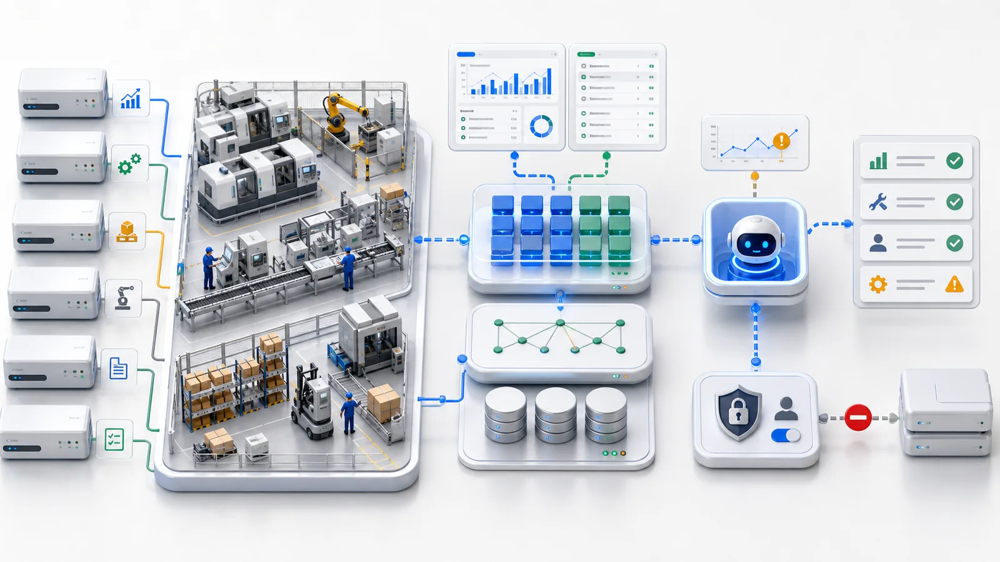

제조업에서 AI를 이야기하면 대화는 자주 한 문장에서 멈춥니다.

**“우리 시스템은 너무 오래됐습니다.”**

ERP는 10년째 운영 중이고, MES는 오래전에 커스터마이즈됐습니다. 창고 관리와 장비 기록은 별도 도구에 있고, 생산 보고서는 아직 Excel로 이어 붙입니다. AI를 어떻게 연결하느냐고 물으면 벤더는 새 플랫폼, 데이터 플랫폼, 대규모 재구축을 제안하곤 합니다.

맞는 말처럼 들릴 수 있지만 너무 무겁습니다.

대부분의 제조기업에 실용적인 첫 단계는 ERP 교체나 MES 재구축이 아닙니다. 빠르게 가치를 보일 두 진입점을 고르는 것입니다.

**보고서와 작업지시서입니다.**

## 제조업이 단순히 “AI를 추가”할 수 없는 이유

제조 IT 환경에는 보통 세 가지 특징이 있습니다.

**첫째, 시스템이 많습니다.** 판매 주문은 ERP, 생산 계획은 MES, 재고와 창고 이동은 WMS, 장비 수리는 작업지시 시스템, 품질 데이터는 스프레드시트나 별도 도구에 있습니다. 하나의 질문이 세네 시스템을 가로지릅니다.

**둘째, 오래된 시스템입니다.** 과거 프로세스에 맞게 커스터마이즈되어 여전히 동작하지만 크게 바꾸고 싶지 않습니다. 인터페이스는 불완전하고 필드명은 일관되지 않으며 문서는 오래됐습니다.

**셋째, 운영이 무겁습니다.** 모든 액션은 다운타임, 재작업, 재고 압박, 납기 지연, 장비 고장, 품질 문제 같은 실제 비용에 영향을 줍니다. AI가 개인 생산성 도구처럼 실험해서는 안 됩니다.

따라서 완전 자율 스마트 팩토리에서 시작하면 안 됩니다. 기존 데이터 위에서 더 빨리 보고, 더 정확히 질의하고, 예외를 더 일찍 잡게 하는 것이 더 좋은 길입니다.

## 첫 진입점: 보고서

제조기업은 매일 보고서를 만듭니다. 납기 상태, 재고 회전, 생산 계획 달성, 설비 downtime, 불량률, 작업지시 종료율, 공급업체 지연 예외 등입니다.

문제는 두 가지입니다. 첫째, 느립니다. 데이터를 내보내고 정리하고 합치고 pivot table에 넣습니다. 보고서가 준비될 때는 이슈가 이미 며칠 지난 경우가 많습니다.

둘째, 고정 질문에만 답합니다. 경영진이 “왜 이 고객 주문이 또 늦었나?”라고 물으면 보고서는 지연 사실을 보여주지만 주문, 재고, 생산, 구매의 사슬을 따라가게 해주지는 않습니다.

제조 reporting에서 AI의 첫 가치는 더 예쁜 차트가 아니라 자연어 follow-up입니다.

> “이번 주 늦은 주문 중 재고 때문에 막힌 것은?”

> “앞으로 2주 안에 필요한데 안전재고 아래인 자재는?”

> “최근 30일 downtime이 가장 많았던 기계와 이유는?”

AI는 권한 아래에서 ERP, MES, WMS, 작업지시 데이터를 질의하고 집계하고 설명해야 합니다. 이는 완전히 read-only로 시작할 수 있습니다.

## 두 번째 진입점: 작업지시서

작업지시서는 좋은 AI pilot 영역입니다. 이미 구조화되어 있습니다. 누가 이슈를 냈는지, 어떤 장비인지, 문제가 무엇인지, 심각도, 상태, owner, 수리 이력, 종료 사유, 생산 영향이 들어 있습니다.

초기 기능은 실용적입니다. 장비 고장 이력 요약, 반복 이슈 감지, 설명에서 카테고리 추천, overdue 작업지시 찾기, 라인별 빈번한 예외 요약, 정비 주간 보고서 생성, 유사 과거 사례 검색.

이는 predictive maintenance보다 훨씬 가깝습니다. 작업지시 데이터가 있다면 시작할 수 있습니다. 또한 핵심 ERP 거래보다 위험이 낮습니다.

## 자동화는 나중에

제조팀이 조심스러운 것은 옳습니다. 생산 시스템은 가볍게 수정하면 안 됩니다. AI 자동화는 계층화해야 합니다.

**1계층: read-only 분석.** AI가 보고서를 질의하고 작업지시를 요약하고 예외를 찾되 운영 시스템에 쓰지 않습니다.

**2계층: 제안된 액션.** AI가 작업지시 escalation, owner reminder, supplier review를 제안하고 사람이 확인합니다.

**3계층: 낮은 위험 자동화.** 4시간 동안 확인되지 않으면 supervisor에게 알리고, 같은 문제가 7일에 3번 나오면 recurring으로 표시하고, 예비부품이 threshold 아래면 구매 제안을 만듭니다.

**4계층: 높은 위험 승인.** 생산 계획, 구매 주문, 재고 lock, 고객 납기 약속, downtime 결정은 인간 확인과 감사가 필요합니다.

보수적으로 들릴 수 있지만 제조에서는 안정이 화려함보다 중요합니다.

## ERP를 교체하지 않고 AI가 이해하게 하기

가벼운 길은 기존 ERP나 DB를 연결하고 핵심 데이터를 비즈니스 객체로 모델링하는 것입니다.

- Sales order
- Production order
- Material
- Inventory
- Purchase order
- Supplier
- Equipment
- Work order
- Quality record

이 객체가 있으면 AI는 원시 테이블명과 필드명이 아니라 주문, 자재, 재고, 작업지시, 장비와 그 관계를 다룹니다.

권한도 중요합니다. 공장 supervisor는 자기 공장만 보고, 구매팀은 공급업체와 구매 데이터를 보고, 영업은 민감한 cost field를 보지 않고, 임원은 rollup을 봅니다. AI는 사용자의 권한을 넘을 수 없습니다.

## 30일 pilot

**1주차:** 시나리오를 고릅니다. 공장 전체가 아니라 보고서 하나와 작업지시 하나, 예를 들어 늦은 주문 분석과 장비 수리 작업지시 요약입니다.

**2주차:** 필요한 ERP, MES, WMS, 작업지시 테이블과 API를 read-only로 연결합니다.

**3주차:** 주문, 자재, 재고, 장비, 작업지시를 모델링하고 필드 의미, 관계, 권한을 추가합니다.

**4주차:** read-only AI assistant를 시작합니다. 매니저는 자연어로 reporting 질문을 하고, 정비 supervisor는 작업지시와 고장 이력을 질의합니다.

첫 달에 보고서 준비 시간이 줄거나, 예외 조사 시간이 짧아지거나, supervisor가 문제를 더 빨리 잡는다면 pilot은 가치가 있습니다.

## 핵심은 모델이 아니라 경계

제조기업에 필요한 것은 인상적으로 들리는 AI가 아닙니다. 무엇을 볼 수 있고 볼 수 없는지, 어떤 데이터를 질의할 수 있고 수정할 수 없는지, 모든 액션이 어떻게 감사되는지 아는 AI입니다.

read-only에서 시작하고, 기존 권한을 상속하고, 높은 위험 액션은 확인을 요구하고, 중요한 운영을 감사하고, 전체 migration을 요구하지 않으며, 핵심 거래 write가 아니라 보고서와 작업지시서에서 시작해야 합니다.

## ObjectOS의 접근

ObjectOS는 제조기업에 처음부터 다시 시작하라고 요구하지 않습니다. ERP, MES, WMS, 작업지시 시스템은 이미 동작하고 실제 프로세스와 데이터를 담고 있습니다. 더 실용적인 방법은 그 시스템들을 연결하고, 핵심 테이블과 API를 객체로 모델링하고, AI가 권한 아래에서 질의, 분석, 제안, 낮은 위험 workflow trigger를 하게 하는 것입니다.

기존 시스템은 계속 동작합니다. 데이터는 제자리에 남습니다. AI는 보고서와 작업지시서에서 시작해 점차 생산, supply chain, 장비 관리로 이동합니다.
