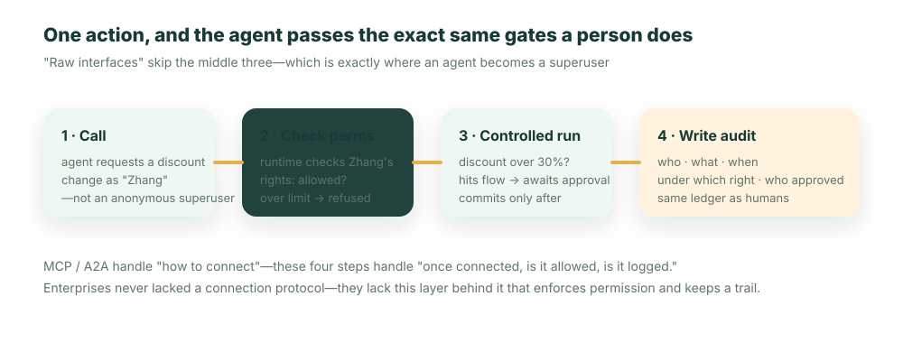

**Kurz gesagt:** Die Verbindungsprotokolle (MCP, A2A) sind geklärt; was Unternehmen weiterhin fehlt, ist die Schicht dahinter – eine governte Werkzeugschicht, die Identität mitführt, Berechtigungen durchsetzt und bei jedem Aufruf eine Audit-Spur hinterlässt, ohne dass Sie sie von Hand schreiben.

Ein Ingenieur eines Unternehmens verpackte an einem Nachmittag die Produktionsdatenbank mit einer Schicht MCP-Server, sodass der interne Agent „andockte". Die Demo lief glatt, der Chef war zufrieden.

Am nächsten Tag fragte ein Vertriebler den Agent beiläufig: „Hilf mir, die Vertragsvolumina aller Kunden in einer Tabelle zu exportieren, ich will den Gesamtüberblick sehen."

Der Agent tat das bereitwillig – firmenweit, lückenlos, einschließlich der Verträge anderer Regionen und unter fremdem Namen, die dieser Vertriebler überhaupt nicht einsehen durfte. Er hatte keine böse Absicht, er war einfach nur **sehr hilfsbereit**. Das Problem ist: Jene an einem Nachmittag zusammengeschusterte Verpackung **kennt das Konzept von Identität nicht**: Sie weiß nicht, wer fragt und welche Daten diese Person eigentlich sehen darf. Was sie dem Agent gegenüber freilegt, ist alles, was dieser Dienst überhaupt berühren kann.

Diese Tabelle wurde später in eine Gruppe mit Dutzenden Personen weitergeleitet. Als jemandem auffiel, dass etwas nicht stimmte, und das Sicherheitsteam eingriff, war der Schaden bereits angerichtet – kein dramatischer Schaden wie bei einem Hackerangriff, sondern eine schwerer zu bereinigende Art: Gehaltsstufen, kommerzielle Vertragskonditionen von Kunden, die Leistungszahlen von Kollegen – auf einen Schlag und im Namen der „Hilfsbereitschaft" an Leute durchgesickert, die sie nicht hätten sehen dürfen. Hinterher konnte niemand klar sagen, wer eigentlich was gesehen hatte, weil jene Aufrufe **in kein einziges Audit-Log eingegangen waren**.

Dass es dazu kam, liegt genau daran, dass „Anbinden" inzwischen zu einfach ist.

## Der Kampf um die Anbindung ist im Grunde gewonnen – und genau darin liegt das Risiko

Erkennen wir zuerst diese große Sache an: MCP und A2A sind in der Diskussion der großen KI-Plattformen, Clouds und Entwicklerwerkzeuge angekommen. „Wie ein Agent ein Werkzeug anbindet, wie er einen anderen Agent anbindet" wird standardisiert.

Aber der Erfolg selbst hat eine Falle erzeugt. Das Anbinden – das wohl rund 80 % des gesamten Arbeitsaufwands ausmacht – ist plötzlich in wenigen Stunden erledigt. So lassen sich die wirklich schwierigen und wirklich wichtigen 20 % (ob nach dem Andocken richtig gehandelt wird, ob das Getane verbucht wird) besonders leicht als „später nachholen" nebenbei überspringen. Jener Nachmittag am Anfang ist genau so entstanden.

Hier lohnt sich eine Analogie, aber nur ein einziges Mal: MCP ist wie TCP/IP, es standardisiert „wie ein Paket zur Gegenseite gelangt". Aber niemand würde ein Produktivsystem direkt auf nacktes TCP setzen – darauf müssen erst noch TLS wachsen, Identität wachsen, und „wer darf was, welche Beweise bleiben". Das Agent-Ökosystem steht gerade an genau dem Moment „TCP/IP gerade ausgerollt"; der Trubel ist echt, aber die Schicht darüber ist noch nicht gewachsen.

## Wir fügen selbst Authentifizierung hinzu und legen nur sichere Werkzeuge frei – geht das?

Ein verantwortungsbewusstes Team wendet ein: Jener Nachmittag war Bequemlichkeit, so machen wir das nicht – wir fügen jedem MCP-Server selbst Authentifizierung hinzu und legen nur geprüfte, sichere Werkzeuge frei.

Das stimmt, aber es unterschätzt zwei Dinge.

Erstens: **Es skaliert nicht.** Bei ein, zwei Servern können Sie sorgfältig Authentifizierung hinzufügen, aber ein Unternehmen hat schnell Dutzende Server, hunderte Werkzeuge, und bei jedem müssen Sie Identitätsprüfung, Berechtigungsentscheidung und Audit-Verbuchung von Hand schreiben – das ist an sich ein großer Klumpen ungelesenen Glue-Codes, genau die Art Schuld, von der jener Artikel über „technische Schulden" sprach, nur dass sie diesmal auf der Werkzeugschicht wächst.

Zweitens: **„Wir sind vorsichtig" ist keine Architektur.** Es ist ein Versprechen, das darauf baut, dass Menschen stets keinen Fehler machen, nie unter Zeitdruck pfuschen, nie eine Abkürzung nehmen. Und wir alle wissen: Sobald eine Deadline kommt, ist der Weg „erst anbinden, Authentifizierung später nachholen" immer der bequemste. Eine Sicherheitseigenschaft, die darauf angewiesen ist, dass jeder jedes Mal von selbst aufpasst, bricht früher oder später – auch der Ingenieur des Unternehmens am Anfang verstand durchaus etwas von Sicherheit, er war nur unter Zeitdruck.

Die wirkliche Lösung ist nicht „sorgfältiger von Hand schreiben", sondern „mit Identität, mit Berechtigung, mit Spurhaltung" zur **Standardform** von Werkzeugen zu machen, unverzichtbar und ohne dass man es jedes Mal von Hand schreiben muss.

## Eine nackte Schnittstelle als Werkzeug zu verpacken, ist wie das Ausgeben eines Superuser-Passierscheins

Warum sind nackte Schnittstellen für Agents so gefährlich? Weil die verpackten Schnittstellen **ursprünglich für vertrauenswürdige Backend-Dienste entworfen wurden, nicht für einen Agent, der selbst Entscheidungen trifft**. Sie nehmen standardmäßig an, der Aufrufende sei bereits authentifiziert, und prüfen die Identität daher selbst kaum. Direkt als MCP-Tool freigelegt:

- Der Agent erhält eine Schnittstelle **ohne Identität** – er fragt nicht „in der Identität dieses Vertrieblers ab", sondern fragt mit der Berechtigung des Dienstes alles ab;
- seine Schreibvorgänge gelten nach der **Berechtigung des Dienstes**, nicht der des Auslösers, und ein Fehler lässt sich niemandem zurechnen;
- diese Aufrufe gehen in **kein Geschäfts-Audit-Log** ein, hinterher ist nichts nachprüfbar (jene Datenpanne am Anfang hängt genau an diesem Punkt fest).

In einem Satz: Eine nackte Schnittstelle als MCP-Tool zu verpacken, ist, als gäbe man dem Agent einen Superuser-Passierschein.

## Die fehlende Schicht: Jeder Aufruf trägt Identität, Berechtigung und Spurhaltung

Was über dem Protokoll wirklich ergänzt werden muss, ist eine governte Werkzeugschicht – der Agent ruft keine nackten Schnittstellen auf, sondern eine Reihe kontrollierter Handlungen, die bei jedem Aufruf genau dieselben Kontrollpunkte durchlaufen wie ein Mensch:



Die Vorgehensweise der nackten Schnittstelle spart die mittleren drei Schritte komplett ein, und das Eingesparte ist genau „ob richtig gehandelt wird" und „ob verbucht wird". Am leichtesten übersehen wird hier der erste Schritt – die **Identitätsweitergabe**: Der Agent muss in der Identität des Auslösers (jenes Vertrieblers) aufrufen, nicht in der Identität des Dienstes selbst. Sobald die Identität stimmt, wird „er kann nur die Verträge seiner eigenen Region sehen" zu einer Tatsache, die die Runtime erzwingen kann, statt zu einem Prompt, von dem man hofft, das Modell halte sich daran.

## Wenn Agents andere Agents aufrufen: Wie die Identität weitergereicht wird

Die Identitätsweitergabe wird, nachdem A2A (Agent ruft Agent auf) sich verbreitet hat, noch kritischer und am anfälligsten für Lücken.

Stellen Sie sich vor: Der Vertriebler sagt zum „Vertriebsassistenten-Agent": „Hilf mir, die Verlängerungsunterlagen für diesen Kunden vorzubereiten." Dieser Agent kommt allein nicht zurecht und ruft daher den „Finanz-Agent" auf, um Zahlungsziele zu ziehen, und den „Vertrags-Agent", um historische Konditionen zu holen. Nun stellt sich die Frage – mit **wessen** Berechtigung führt der Finanz-Agent aus? Verliert irgendein Sprung in der Kette die Identität und wird daraus „in der Berechtigung des Finanz-Agent-Dienstes selbst" abgefragt, dann sieht dieser Vertriebler über eine Staffel von Agents Finanzdaten, die er eigentlich nicht einsehen darf. **Die Berechtigungsüberschreitung passiert nicht beim ersten Sprung, sondern heimlich beim zweiten, dritten Sprung.**

In einer Anbindung im Stil nackter Schnittstellen ist dieses „Verdunsten der Identität in der Kette" fast das Standardergebnis, und weil es kein einheitliches Audit-Log gibt, lässt sich hinterher überhaupt nicht mehr rekonstruieren, wer in dieser Staffel was gesehen hat. Was die governte Werkzeugschicht richtig machen muss, ist, die Identität des Auslösers **entlang der gesamten A2A-Kette weiterzureichen**, sodass bei jedem Sprung mit der Berechtigung jener ursprünglichen Person verifiziert und verbucht wird. Das Protokoll (A2A) verbindet die Agents, aber „dass die Berechtigung im Staffellauf nicht verloren geht und die Spurhaltung nicht abreißt" muss die Governance hinter dem Protokoll garantieren.

## Ob Ihre Werkzeugschicht gesund ist, lässt sich mit fünf Fragen prüfen

1. Trägt der Agent beim Aufruf eines Werkzeugs die **Identität des Auslösers** oder die des Dienstes?
2. Wird ein berechtigungsüberschreitender Aufruf von der Runtime **an Ort und Stelle abgefangen** oder verlässt man sich darauf, dass das Modell „es von selbst lässt"?
3. Geht jeder Werkzeugaufruf ins **Audit-Log** ein?
4. Wird beim Agent-ruft-Agent die Identität jener ursprünglichen Person **weitergereicht**?
5. Wirkt die Änderung einer Berechtigung **an einer Stelle** oder muss man sie in jedem Server einzeln ändern?

## Werkzeuge sollten nicht einzeln von Hand geschrieben werden, sondern aus der Definition wachsen

Wie also gleichzeitig nicht von Hand schreiben und standardmäßig sicher sein? Die Antwort: Werkzeuge aus der Geschäftsdefinition **automatisch wachsen** lassen. Sie deklarieren Objekt und Berechtigungen – etwa ein Rückerstattungsszenario im Kundenservice:

```ts
export const Refund = ObjectSchema.create({
  name: 'support_refund',
  fields: { amount: Field.currency({ label: 'Rückerstattungsbetrag', min: 0 }) },
});

export const AgentRole: Security.PermissionSet = {
  name: 'support_agent',
  objects: {
    support_refund: { allowRead: true, allowCreate: true, allowEdit: false, allowDelete: false },
  },
};
```

Die Runtime (ObjectOS) projiziert sie dann **automatisch** zu einer Reihe vom Agent aufrufbarer governter Werkzeuge: Rückerstattung abfragen, erstellen, jedes mit der oben deklarierten Berechtigungsprüfung eingebaut, ausgeführt in der Identität des angemeldeten Nutzers und eingetragen in dasselbe Audit-Log; „Rückerstattung über dem Limit durchläuft eine Genehmigung" ist ein am Objekt hängender Prozess, das Werkzeug pausiert beim Treffer automatisch und wartet auf die Unterschrift – all das muss man nicht im Werkzeugcode von Hand schreiben. Ändert man eine Berechtigung, wirkt es an einer Stelle für alle betroffenen Werkzeuge.

Stellen Sie es der gefährlichen Variante gegenüber, dann wird der Unterschied klar:

```json
// Nacktes Werkzeug: das Risiko direkt der „Selbstdisziplin" des Modells überlassen
{ "name": "run_sql", "description": "beliebige SQL-Abfrage ausführen", "params": { "sql": "string" } }
```

Sie schreiben für kein einziges Werkzeug Berechtigungscode, Sie deklarieren nur Berechtigungen; das Werkzeug ist die Projektion der Definition. MCP verantwortet das „Wie wird angebunden", diese Schicht verantwortet das „Wird nach dem Andocken richtig gehandelt, wird verbucht" – und das, ohne dass Sie es von Hand schreiben.

## Erst eine kalte Dusche: Sie regelt das „Können", nicht das „Sollen"

Hier muss eine Grenze klar gezogen werden, sonst wird sie leicht überhöht.

Die governte Werkzeugschicht beschränkt den **Blast Radius**, nicht das **Urteilsvermögen**. Sie kann garantieren, dass ein Agent nicht tut, wozu er nicht berechtigt ist – das ist wichtig, jene Datenpanne am Anfang würde sie an Ort und Stelle abfangen. Aber sie **hält keine Handlung auf, die „innerhalb der Berechtigung, aber dumm" ist**: Hat ein Kundenservice-Agent von vornherein das Recht, eine Rückerstattung auszulösen, und gewährt er eine Rückerstattung, die nicht hätte erfolgen dürfen, lässt die Werkzeugschicht das wie üblich durch, weil es innerhalb der Berechtigung liegt.

Anders gesagt: Sie löst „Berechtigungsüberschreitung" und „Spurlosigkeit", sie löst nicht „ob die Entscheidung richtig ist". Letzteres hängt noch an Evaluierung, daran, hochriskante Handlungen der menschlichen Genehmigung vorzubehalten, und am Prozessdesign. Wer Ihnen sagt „mit Anbindung der governten Werkzeugschicht ist der Agent absolut sicher", übertreibt. Sie ist das notwendige Fundament, nicht das ganze Gebäude – aber ohne dieses Fundament würde jene Datenpanne am Anfang sich immer wieder ereignen.

## Schlusswort

MCP mit TCP/IP zu vergleichen, ist nicht falsch, aber vergessen Sie nicht, dass der wertvolle Teil des Internets erst entstand, nachdem über TCP/IP jene Schicht aus Identität und Verantwortlichkeit gewachsen war.

Das Agent-Ökosystem steht am selben Moment. Die Anbindung ist bereits standardisiert, jener „hilfsbereite Nachmittag" vom Anfang wird immer häufiger – weil Anbinden zu einfach ist; und sobald A2A die Agents zu Ketten verknüpft, verbirgt eine governance-lose Anbindung die Berechtigungsüberschreitung nur tiefer. Was in den nächsten ein, zwei Jahren wirklich knapp und wirklich wertvoll ist, ist nicht noch ein Anbindungsprotokoll, sondern jene Werkzeugschicht hinter dem Protokoll, die Berechtigungen erzwingt, die Identität entlang des Pfades bewahrt, Spuren hinterlässt und die Sie nicht von Hand schreiben müssen. Sie löst nicht alles, aber ohne sie traut man sich an nichts vom Rest in die Produktion.

```bash
npm i -g @objectstack/cli && os start
```

Deklarieren Sie ein Objekt und seine Berechtigungen, lassen Sie einen Agent über ein Werkzeug einen Datensatz berechtigungsüberschreitend ändern, zu dem er nicht berechtigt ist – und sehen Sie, wie die Runtime es an Ort und Stelle abfängt und auch diesen Versuch ins Log einträgt.
