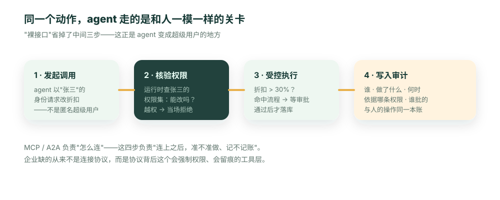

---
# @generated zh-Hant from zh-Hans (s2twp) — edit the zh-Hans file; delete this line to hand-maintain.
title: MCP 裝上一萬臺伺服器之後：企業 Agent 缺的不是協議，是受治理的工具層
description: 把資料庫包成 MCP 工具，一個下午就能讓 agent"連上"。然後它很樂意地把全公司客戶的合同金額匯出成表——因為那層包裝沒有身份。MCP 一年鋪到上萬臺伺服器，連線的仗打完了；真正稀缺的，是協議背後那個會強制許可權、會留痕、還不用你手寫的工具層。
author: ObjectStack Team
date: 2026-06-16T14:00:00+08:00
status: published
topic: ai-agents
audience: it
solutions: []
industries: []
cover: ./cover.svg
tags:
  - MCP
  - A2A
  - Agent 互操作
  - 工具層
  - AI 治理
  - 趨勢觀點
---

**先給結論**：連線協議（MCP、A2A）已經標準化，企業真正缺的是協議背後那一層——每次呼叫都帶身份、強制許可權、留痕，而且不用你手寫的受治理工具層。

一家公司的工程師，花了一個下午，把生產庫包了一層 MCP server，讓內部 agent"連上了"。演示很順，老闆很滿意。

第二天，一位銷售隨口問 agent："幫我把所有客戶的合同金額匯出成一張表，我想看看大盤。"

agent 很樂意地照做了——全公司的，一條不落，包括這位銷售根本無權檢視的其他大區、其他人名下的合同。它沒有惡意，它只是**很有幫助**。問題在於，那層下午趕出來的包裝**沒有身份的概念**：它不知道提問的是誰、那個人本來能看哪些資料。它對 agent 暴露的，是這個服務能碰的一切。

這張表後來被轉發進了一個幾十人的群。等有人意識到不對、安全團隊介入時，損失已經造成了——不是駭客攻擊那種戲劇性的損失，而是更難收場的一種：內部的薪酬級別、客戶商務條款、同事的業績，一次性地、在"樂於助人"的名義下，洩給了不該看的人。事後沒人能說清到底誰看到了什麼，因為那些呼叫**根本沒進任何審計賬**。

這件事之所以會發生，恰恰是因為"連線"這件事，現在太容易了。

## 連線的仗，基本打完了——這正是風險所在

先承認這件大事：MCP 在一年內鋪到了**上萬臺企業伺服器、9700 萬次 SDK 下載**，Anthropic、OpenAI、Google、微軟、AWS 全站了進來；A2A 跨過 150 家組織、歸了 Linux 基金會。agent"怎麼連工具、怎麼連別的 agent"，已經標準化了。

但成功本身製造了陷阱。連線這件事——大概佔整個工程量的 80%——突然幾小時就能搞定。於是真正難、也真正重要的那 20%（連上之後準不準做、做了記不記賬），就特別容易被當成"以後再補"的事順手略過。開頭那個下午，就是這麼來的。

這裡值得借一個類比，但只借一次：MCP 像 TCP/IP，把"包怎麼送到對面"標準化了。可沒人會把生產系統直接架在裸 TCP 上——它上面還得長出 TLS、長出身份、長出"誰能做什麼、留什麼證據"。agent 生態現在就停在"剛鋪好 TCP/IP"的時刻，熱鬧是真的，但上面那層還沒長出來。

## 我們會自己加鑑權、只暴露安全的工具——行不行？

負責任的團隊會反駁：那個下午是圖省事，我們不會這麼幹——我們會給每個 MCP server 自己加鑑權，只暴露經過審查的安全工具。

這話對，但它低估了兩件事。

第一，**它不擴充套件。** 一兩個 server 你能仔細加鑑權，可企業很快就是幾十個 server、上百個工具，每一個都要手寫一遍身份核驗、許可權判斷、審計落賬——這本身就是一大坨沒人讀的膠水程式碼，正是"技術債"那篇講的那種債，只是這次長在工具層。

第二，**"我們會小心"不是一種架構。** 它是一種依賴人始終不犯錯、不趕工、不走捷徑的承諾。而我們都知道，deadline 一來，"先連上、鑑權回頭補"的那條路，永遠是最好走的那條。一個安全屬性如果要靠每個人每次都自覺，它遲早會破——開頭那家公司的工程師，也並不是不懂安全，他只是趕時間。

真正的解法不是"更小心地手寫"，而是讓"帶身份、帶許可權、帶留痕"成為工具的**預設形態**，省不掉、也不用每次手寫。

## 把裸介面包成工具，等於發了張超級使用者通行證

為什麼裸介面對 agent 這麼危險？因為被包的那些介面，**當初是為可信的後端服務設計的，不是為一個會自己決策的 agent 設計的**。它們預設呼叫方已經鑑過權，所以自己不怎麼校驗身份。直接暴露成 MCP 工具時：

- agent 拿到的是一個**沒有身份**的介面——它不是"以這位銷售的身份查"，而是以服務的許可權查所有；
- 它的寫操作按**服務的許可權**算，不是發起人的，出錯無從歸責；
- 這些呼叫**不進任何業務審計賬**，事後查無可查（開頭那場洩露，正卡在這條上）。

一句話：把裸介面包成 MCP 工具，等於給 agent 發了一張超級使用者通行證。

## 缺的那一層：每次呼叫都帶身份、許可權和留痕

協議之上真正該補的，是一個受治理的工具層——agent 調的不是裸介面，而是一組每次呼叫都走完和人一模一樣關卡的受控動作：



裸介面的做法是把中間三步全省掉，而省掉的恰好是"準不準做"和"記不記賬"。這裡最容易被忽視的是第一步——**身份傳播**：agent 必須以發起人（那位銷售）的身份去呼叫，而不是以服務自己的身份。一旦身份對了，"他只能看自己大區的合同"就成了執行時能強制的事實，而不是一句但願模型會遵守的提示。

## 當 agent 開始調別的 agent：身份怎麼傳下去

身份傳播這件事，在 A2A（agent 調 agent）普及之後會變得更要命，也最容易出漏洞。

設想：銷售對"銷售助理 agent"說"幫我準備這個客戶的續約材料"。這個 agent 自己搞不定，於是去調"財務 agent"拉賬期、調"合同 agent"取歷史條款。現在問題來了——財務 agent 執行時，用的是**誰**的許可權？如果鏈條中間任何一跳把身份弄丟了，變成"以財務 agent 服務自己的許可權"去查，那這位銷售就藉著一串 agent 接力，看到了他本來無權看的賬務。**越權不是發生在第一跳，而是悄悄發生在第二、第三跳。**

裸介面式的連線裡，這種"身份在鏈條中蒸發"幾乎是預設結果，而且因為沒有統一審計賬，事後根本還原不出這串接力到底誰看了什麼。受治理的工具層要做對的，是讓發起人的身份**沿著整條 A2A 鏈一路傳下去**，每一跳都以最初那個人的許可權被核驗、被記賬。協議（A2A）負責把 agent 接起來，但"接力過程中許可權不丟、留痕不斷"，得靠協議背後那層治理來保證。

## 你的工具層健不健康，五個問題就能查

1. agent 調工具時，帶的是**發起人的身份**，還是服務的身份？
2. 一次越權呼叫，會被執行時**當場攔下**，還是靠模型"自覺不做"？
3. 每次工具呼叫，進**審計賬**了嗎？
4. agent 調 agent 時，最初那個人的身份**傳下去**了嗎？
5. 改一條許可權，是**一處生效**，還是要去每個 server 裡改一遍？

## 工具不該一個個手寫，而該從定義里長出來

那怎麼既不手寫、又預設安全？答案是：讓工具從業務定義裡**自動長出來**。你宣告物件和許可權——比如一個客服退款場景：

```ts
export const Refund = ObjectSchema.create({
  name: 'support_refund',
  fields: { amount: Field.currency({ label: '退款金額', min: 0 }) },
});

export const AgentRole: Security.PermissionSet = {
  name: 'support_agent',
  objects: {
    support_refund: { allowRead: true, allowCreate: true, allowEdit: false, allowDelete: false },
  },
};
```

執行時（ObjectOS）就**自動**把它投影成一組 agent 可呼叫的受治理工具：查詢、建立退款，每個都內建上面那條許可權的核驗、以登入使用者身份執行、落進統一審計賬；"退款超額走審批"是掛在物件上的流程，工具命中時自動暫停等簽字——這些都不用在工具程式碼裡手寫。改一條許可權，所有相關工具一處生效。

對照一下危險的版本，差別就清楚了：

```json
// 裸工具：把風險直接交給模型的"自覺"
{ "name": "run_sql", "description": "執行任意 SQL 查詢", "params": { "sql": "string" } }
```

你不為每個工具寫許可權程式碼，你只宣告許可權；工具是定義的投影。MCP 負責"怎麼連"，這層負責"連上之後準不準做、記不記賬"——而且不用你手寫。

## 先潑一盆冷水：它管的是"能不能"，不是"該不該"

這裡要劃清一條邊界，否則容易神化它。

受治理的工具層，約束的是**爆炸半徑**，不是**判斷力**。它能保證 agent 做不了它無權做的事——這很重要，開頭那次洩露就會被它當場攔下。但它**攔不住一個"許可權之內、卻很蠢"的動作**：如果一個客服 agent 本來就有權發起退款，它給了一筆不該退的退款，工具層會照常放行，因為這在許可權之內。

換句話說，它解決的是"越權"和"無痕"，不解決"決策對不對"。後者還得靠評測、靠把高風險動作留給人審批、靠流程設計。誰要是告訴你"接上受治理工具層，agent 就絕對安全了"，那是誇大。它是必要的地基，不是全部的樓——但沒有這層地基，開頭那場洩露就會一再發生。

## 結語

把 MCP 比作 TCP/IP 沒錯，但別忘了網際網路值錢的部分，是 TCP/IP 之上那層身份與問責長出來之後才有的。

agent 生態正處在同一個時刻。連線已經標準化，開頭那個"樂於助人的下午"會越來越多——因為連上太容易了；等 A2A 把 agent 串成鏈，沒有治理的連線只會把越權藏得更深。接下來一兩年真正稀缺、也真正值錢的，不是又一個連線協議，而是協議背後那個會強制許可權、會沿鏈路保住身份、會留痕、還不用你手寫的工具層。它不解決一切，但沒有它，剩下的都不敢上線。

```bash
npm i -g @objectstack/cli && os start
```

宣告一個物件和它的許可權，讓 agent 通過工具去越權改一條它無權改的資料——看執行時怎麼當場攔下，並把這次嘗試也記進賬裡。
