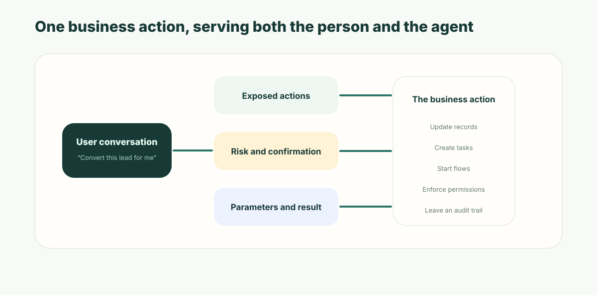

**Short answer:** an ontology that only answers questions is half a system. The moment an AI agent has to *change* state — convert the lead, approve the expense, close the ticket — the useful question is no longer "does the model understand our data?" but "which operations may it run, under whose permissions, with what confirmation, and where is the record?" ObjectOS answers that by making the **Action** — the same definition behind the button a human clicks — the only thing an agent is given to call. Exposure is opt-in and off by default.

## Most ontology work stops one step short

Read what has been published about enterprise ontologies and semantic layers and you find a well-covered map: model the business, connect the sources, ground the model, get better answers. Retrieval, grounding, Q&A. That work is real and it is necessary.

It also stops precisely where the risk starts. A retrieval-grade ontology is a **read model**. It makes the agent articulate. It says nothing about what happens when the agent has to write.

That shortfall was not corrected by the wave of "context" products that followed, and it is worth seeing how consistently it repeats: [every context fix solves only the read half](/en/blog/context-bottleneck-read-half/) takes the seven steps enumerated below and asks which layer in a modern context-plus-gateway stack can supply each one. The answer is neither of the two you bought.

And writing is where the value was. The assistant that summarizes a customer, explains a contract clause, or diagnoses a ticket is useful right up to the last step, where it hands the work back:

- "This lead looks ready to convert." The rep opens the CRM and clicks the button.
- "This expense violates the travel policy." The analyst changes the status, types the reason, notifies the employee.
- "This contract needs legal sign-off." Someone opens the approval system and starts the request.

The suggestion was never the bottleneck. If the agent can only answer, the business still moves at the speed of the human doing the clicking.

One vendor is a real exception here and deserves the credit: Palantir Foundry has funnelled writes through governed Actions for years, and AIP pointed that architecture at LLMs — the model never touches the database, only the actions the ontology exposes. That design is right, and [the open-versus-closed ontology piece](/en/blog/ai-ontology-open-protocol/) covers it. So the open question is not whether governed write operations are a good idea. It is what they look like when the definition is yours, in your repository, on infrastructure you run — and small enough that the person accountable for the agent can actually read it.

## One button, seven enforced steps

The tempting fix is to hand the agent an API and let it write. Convert a lead: create the opportunity, update the lead status, create the follow-up task. Three writes. It demos beautifully.

But "convert a lead" was never three writes. In a real system of record it is a sequence the platform enforces every time a human clicks:

| # | What the button enforces | What a hand-written `convert_lead` tool does |
| --- | --- | --- |
| 1 | Check the current user may convert this lead | — |
| 2 | Validate required fields are complete | — |
| 3 | Detect an existing duplicate account | — |
| 4 | Create the contact, account and opportunity | Creates records |
| 5 | Run downstream assignment rules | — |
| 6 | Write the audit entry | — |
| 7 | Require owner confirmation where policy says so | — |

**Seven enforced steps sit behind one button. The hand-written tool reproduces one of them — the record writes — and silently drops the other six.** Not because anyone decided those six were optional, but because nobody re-implemented them in the tool.

That is the whole problem in one row of a table, and it is not a CRM problem. Substitute "issue a refund", "close a ticket", "release a purchase order": the button is always the small visible end of an enforced sequence.

## The second write path

Call the failure mode by its name: **the second write path**.

A second write path opens the moment an agent's tools are written *beside* your business logic instead of *from* it. Now the same operation has two routes into your data — one a human takes through the UI, one an agent takes through a tool — and only one of them is governed. Internal tool builders have long had a smaller version of this problem, where one rule is re-expressed in a hidden button, a disabled input, and a query filter that do not quite agree ([the Retool comparison](/en/blog/retool-vs-ai-native-app-platform/) walks through that shape). Agents make it worse in a specific way: the second path is not a screen anyone can open and inspect. It is a tool definition in a repository, and its only user is a model.

It doesn't stay merely incomplete. It **drifts**, and it drifts in one direction:

- The UI adds a required field. The tool keeps posting the old payload.
- The permission model tightens. The tool still calls the service account.
- Finance adds an approval threshold. The tool doesn't know an approval exists.
- Someone changes a picklist. The tool sends a value that is no longer valid.
- Every human action is in the log. The agent's are not, or are attributed to nobody.

Each of these is a small, reasonable change made by someone who had no idea a second path existed. That is what makes it a structural problem rather than a discipline problem: the drift is invisible from both ends. The UI team sees a correct system. The agent team sees green tests.



## Operational parity: one definition, two callers

The alternative is to give the agent no new route at all — only the one that already exists.

In ObjectOS an **Action** is not a button. It is the declaration of what this application permits: a name, typed parameters, visibility and disabled predicates, a confirmation prompt, the capabilities required to invoke it, and an execution target — a script, an API endpoint, a flow, a form, a modal, or a URL. It can surface in a record header, a list row menu, a list toolbar, or a related section. It is the vocabulary the system already uses for "what can be done here".

Which makes it the natural place to stand:

| Who is looking | What they see |
| --- | --- |
| A person | A button, a menu item, a form |
| An agent | A callable tool with a typed schema |
| The platform | One action definition |
| An auditor | One execution record |

ObjectStack's own design note for this calls the goal **operational parity**: anything an admin can do, the agent can do, *by calling the same Action* — same permissions, same validation, same transaction, same audit. Not an equivalent action. The same one.

The payoff is what *doesn't* happen. When the UI's rule changes, the agent's tool changed with it, because there is only one of them. When permissions tighten, they tighten once. When a picklist gains an option, the parameter schema follows the field definition. Zero duplication is not an elegance argument here; it is the only version of this that stays correct after six months of ordinary maintenance.

It helps to see where this sits relative to the generic tools an agent already has. A governed platform gives an agent two different kinds of capability, and they are governed differently on purpose:

| Kind | Where it comes from | Governed by |
| --- | --- | --- |
| Generic operations — describe an object, query records | Projected automatically from your object and permission declarations | The permission model; the projection is safe because reads are filtered per user |
| Business operations — convert, approve, refund, close | An Action you already ship for humans | Per-action opt-in, plus everything the action already enforces |

The first row is the layer behind the connection protocol — the part [the MCP piece](/en/blog/mcp-governed-tool-layer/) is about, where the risk is a raw interface wrapped without identity. This article is the second row, where automatic projection would be the wrong answer: a business operation is exactly the kind of capability that must be *chosen*, one at a time, by someone accountable.

The platforms that project both rows automatically make that split visible in their tool counts — many object types collapse into one wide read tool while each action type expands into its own narrow write tool. [What Ontology MCP actually projects](/en/blog/ontology-mcp-agent-tools/) walks through that asymmetry on the two vendors that have shipped it.

## Not every action should be exposed

The mistake enterprises make next is to expose everything — every API, every button — and call it coverage.

Risk does not follow the name of an operation. "Send email" is trivial inside a team reminder and serious in a customer commitment, a contract notice, or a collections letter. "Update status" is routine on a task and load-bearing on an approval, a contract, or a payment, where it moves the accountability chain.

So exposure in ObjectOS is explicit. An action exists in the application; it becomes callable by an agent only when its metadata says so:

```ts
// crm/convert_lead.action.ts — one definition; the button and the tool both come from it
export const convertLead = {
  name: 'convert_lead',
  label: 'Convert Lead',
  objectName: 'lead',
  locations: ['record_header'],
  type: 'flow',
  target: 'lead_conversion',

  // Parameters resolve against the object's own field definitions,
  // so the tool schema the model sees follows the field, not a copy of it.
  params: [{ field: 'next_step', required: true }],
  visible: 'record.status != "converted"',

  // The entire AI surface. Without this block, no agent can call this action.
  ai: {
    exposed: true,
    description:
      'Convert a qualified lead into an account, contact and opportunity. Call only when budget and timeline are confirmed on the lead record.',
    requiresConfirmation: true,
  },
};
```

That block is the governance gate, and it is deliberately small:

| Key | What it decides |
| --- | --- |
| `exposed` | Whether an agent may call this at all. Defaults to **false** |
| `description` | The model-facing contract: when and why to call. Required when exposed, at least 40 characters, never derived from the UI label |
| `category` | Whether the tool reads or has side effects. Defaults to side-effecting |
| `paramHints` | Tightens the schema the model sees — an enum, an example — without touching the UI field |
| `outputSchema` | What the caller gets back, so one action's result can feed another |
| `requiresConfirmation` | Forces or waives a human-in-the-loop gate on the call |

Six keys. That is the complete surface, and the smallness is the point: every extra knob is one more thing an author can misconfigure and one more thing a reviewer has to check.

Two defaults deserve to be read slowly.

**Off by default.** There is no heuristic that scans your actions and exposes the ones that "look safe". In a world where actions are increasingly drafted by AI, the default-off flag is the physical boundary between "an AI wrote this action" and "the agent fleet may now run it". A half-finished draft must never be silently armed.

**No description, no exposure.** The description is written for the model, and it is required — the UI label is not reused. "Convert" tells a person everything and a model nothing. This used to be argued as author friction; it isn't anymore, because the author writing it is usually an AI, and it writes a good one for free.

## Confirmation belongs to the runtime, not the prompt

Nobody sane accepts an agent that can delete, approve, or email a customer on its own judgment. So risk gets tiered:

- **Low** — summarize, draft, add an internal note, create an ordinary task.
- **Medium** — update a status, assign an owner, start a flow, notify internally.
- **High** — delete a record, approve a cost, change a contract term, promise something to a customer, close an audit finding.

The tiering isn't the interesting part; every vendor has that slide. The interesting part is **who enforces it**. An instruction in a system prompt is a request. It is subject to the model's judgment on a bad day, and it evaporates on the next prompt revision.

In ObjectOS the confirmation decision is metadata the runtime reads:

| Action shape | What happens on an agent call |
| --- | --- |
| Looks destructive (a confirmation prompt, delete semantics, or a danger button) **and** human approval is wired | The call is queued as pending and returns `pending_approval`; an operator approves it in Studio before it runs |
| Looks destructive **and** approval is **not** wired | The action is **not registered as a tool at all** — it cannot run unattended |
| `requiresConfirmation: true` on an otherwise safe action | Gated anyway |
| `requiresConfirmation: false` on a destructive-looking action | Runs directly — the author has asserted it is safe, and the platform logs a warning about it |
| Not destructive | Runs directly |

Read the second row again, because it is the one that separates a governance story from a governance mechanism: an unsafe-looking action with nowhere to send an approval is **withheld from the agent**, not exposed with a warning in the docs. And in every row above, execution runs inside the same permission, validation, hook and audit machinery as a human click — attributed to the person in the conversation, or to a distinct agent principal when there is no person to attribute it to.

## What this does not fix

Be exact about the boundary, or the claim inflates into something you can't defend in a review.

**A correctly-invoked action can still be the wrong action.** Everything above constrains *which operations exist* and *what they enforce*. None of it judges whether this was the moment to run one. An agent that legitimately holds refund authority and issues a refund it should not have issued has done nothing the runtime can object to. That limit is general to governed tooling and [the MCP piece argues it in full](/en/blog/mcp-governed-tool-layer/); the short version is that this is a foundation, not a verdict, and the rest is evaluations, thresholds and process design.

**Exposure is not the whole permission story.** Setting `exposed: true` makes an action *eligible*. Which agent can reach it, and who is allowed to talk to that agent, are separate declarations — and the action's own permission requirements are enforced independently, refusing the call outright when the caller lacks them. Reviewers who read the `ai` block as the complete access control will get a nasty surprise; it is one gate of several, and [the piece on agent permission boundaries](/en/blog/ai-agent-business-data-security-boundaries/) covers the others.

**A multi-step business approval is not an action field.** `requiresConfirmation` is a human-in-the-loop pause on the call. A real approval — routed, delegated, escalating, with a record of who signed — is its own metadata, and it should stay that way.

**Discoverability degrades with scale.** Fifty exposed actions is a lot of tool descriptions competing for the model's attention, and the failure at that size is a plausible wrong choice, not a refused one. Scoping tools to the current object and curating them into task-shaped bundles helps. It is a real limit, not a solved one.

And the honest steelman: for a single narrow use case, a hand-written tool ships faster and can be deliberately narrower than the general-purpose action. That trade is defensible for one tool. It stops being defensible at the tenth, which is roughly where teams discover they are maintaining a parallel copy of their business rules with no owner.

## Where to start

The best first actions to expose are not the most valuable ones. They are the ones that are frequent, clearly ruled, and cheap to get wrong:

- **CRM** — create a follow-up task, update the next step, capture meeting notes, check a lead's data before conversion.
- **Support** — draft a reply, complete a ticket's classification, escalate, propose a knowledge-base entry.
- **Finance** — create a review task, flag an exception reason, attach an approval justification.
- **Procurement** — start a supplier qualification review, raise a risk alert, generate a price comparison record.
- **HR** — route an employee service request, propose a resolution, complete a document checklist.

Then move one notch at a time: let the agent *suggest*, then let it *execute with confirmation*, then automate only the low-risk, repetitive tail. Every step of that ladder is a metadata change, which means each one is reviewable and each one is reversible.

## Point your agent at the definition

The practical version of all this is not a platform migration. It is a question you can ask about the system you already have: **for a state-changing operation your agent performs today, can you name the single definition that both the UI and the agent go through?** If the answer is two files owned by two teams, you have a second write path, and it is already drifting.

If you want to see the governed version, don't start by writing code. Point your coding agent at the ObjectStack spec and have it add the `ai` block to one action you already ship for humans. What comes back is a few lines of metadata: an exposure flag, a description written for a model, a confirmation policy. That is the entire review surface, and being able to read it in under a minute is the point — arming an agent with a business operation should be a diff somebody signs, not a capability somebody discovers later.

```bash
npm i -g @objectstack/cli && os start
```

An ontology that only answers questions is a search index with better manners. The one worth building is the one your agent can act through — and that your auditor can read afterwards.
