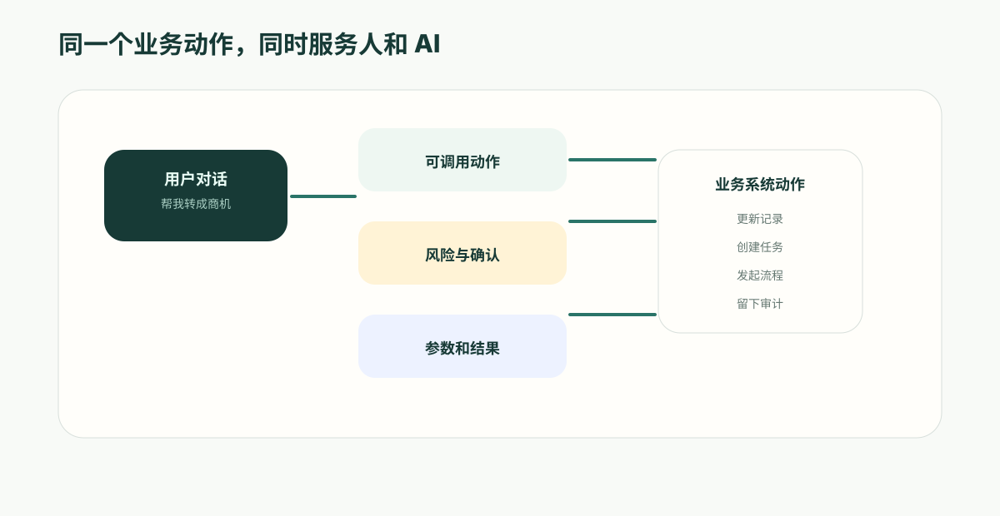

---
# @generated zh-Hant from zh-Hans (s2twp) — edit the zh-Hans file; delete this line to hand-maintain.
title: AI 不只給建議：怎樣讓對話真正觸發受控業務動作
description: AI Agent 的價值不只是回答問題，而是幫助使用者更新記錄、建立任務、發起審批和推動流程。ObjectOS 用 Action 後設資料把按鈕、流程和審批安全地開放給 AI。
author: ObjectStack Team
date: 2026-06-05T11:10:00+08:00
status: published
topic: app-building
audience: business
solutions: []
industries: []
cover: ./cover.svg
tags:
  - ObjectOS
  - AI Agent
  - 業務動作
  - 對話式應用
---

很多 AI 助手的問題不是“不聰明”，而是“說完就停了”。

它能總結客戶情況、解釋合同條款、分析工單原因、推薦下一步，但真正的工作往往卡在最後一步。

AI 說“建議把這個線索轉為商機”，銷售還要自己去 CRM 點按鈕；AI 說“建議發起高風險審批”，法務還要開啟流程系統；AI 說“這張報銷需要退回”，財務還要手動改狀態、寫原因、通知員工。

如果 AI 只能回答，業務還是停在原地。AI 原生應用必須讓 AI 能在許可權範圍內推進工作：建立記錄、更新狀態、發起審批、生成任務、呼叫流程。

但這件事不能靠給 Agent 隨便開 API。ObjectOS 的關鍵設計是：把業務系統裡已經存在的按鈕、流程和審批沉澱為 Action 後設資料，再有選擇地開放給 AI。

## AI 不應該繞開業務系統

假設銷售在對話裡說：

> 這個線索已經確認預算和時間表了，幫我轉成商機，並建立下週跟進任務。

一個看起來聰明、但不安全的做法，是讓 Agent 直接寫資料庫：新建商機，更新線索狀態，建立任務。

問題是，真實業務系統裡“轉換線索”從來不只是幾次資料寫入。它可能包含：

- 檢查當前使用者是否有許可權轉換；
- 校驗必填欄位是否完整；
- 判斷是否已有重複客戶；
- 建立聯絡人、客戶和商機；
- 觸發後續分配規則；
- 記錄操作日誌；
- 必要時要求負責人確認。

如果 Agent 繞開這些動作，AI 就會變成一條影子通道：人點按鈕要遵守規則，AI 調工具卻可以直接改資料。

ObjectOS 的方向是讓 AI 呼叫同一個業務動作，而不是另寫一套 AI 專用動作。人可以在介面上點按鈕，AI 可以在對話中建議併發起同一個動作，但最終都進入同一條執行路徑。

## Action 是業務能力的統一入口

在 ObjectOS 裡，Action 不只是一個按鈕。它描述的是“這個業務應用允許做什麼”。

一個 Action 可以出現在記錄詳情頁、列表行選單、批次操作區，也可以觸發 API、流程或後臺指令碼。它包含輸入引數、可見條件、停用條件、確認文案、執行目標和返回結果。

這讓 Action 成為連線人和 AI 的自然入口：

- 人看到的是按鈕、選單和表單；
- AI 看到的是可呼叫的業務動作；
- 平臺看到的是同一份動作後設資料；
- 審計看到的是同一條執行記錄。

當業務動作只有一份定義，系統就不容易漂移。UI 改了規則，AI 不會還在用舊工具；審批要求提高了，Agent 也不會繞過確認；欄位選項變化了，動作引數也能跟著物件後設資料更新。

## 不是所有動作都應該開放給 AI

企業最容易犯的錯誤，是把所有 API 或所有按鈕都自動交給 Agent。

這聽起來高效，但風險很大。一個動作能不能被 AI 呼叫，不能只看它的名字。比如“傳送郵件”在內部提醒裡風險很低，但在客戶承諾、合同通知、催款場景裡就很敏感；“更新狀態”在任務管理裡可能很普通，在審批、合同、付款裡卻可能影響責任鏈。

ObjectOS 採用顯式開放的方式：動作可以存在於業務系統中，但只有被明確標記為可供 AI 使用時，才會進入 Agent 的能力集合。

這給組織留下了治理空間：

- 哪些動作只能人點；
- 哪些動作可以由 AI 建議，但需要人確認；
- 哪些低風險動作可以讓 AI 直接執行；
- 哪些動作必須經過審批；
- 哪些動作暫時不對 AI 開放。

這比“模型自己判斷是否安全”可靠得多。

## 對話式業務應用的體驗應該是什麼樣

好的 AI 業務應用不是把使用者帶到另一個聊天框，而是在聊天中直接推進原來的業務流程。

銷售可以說：

> 查一下這個客戶過去 90 天的互動記錄，幫我準備續約計劃。如果風險高，就建立跟進任務。

客戶成功經理可以說：

> 把本週所有高風險客戶按原因分組，給每個負責人生成處理建議，金額超過 50 萬的先發給我確認。

財務可以說：

> 這批報銷裡哪些可能違反差旅政策？把證據列出來，低風險的通過，高風險的建立複核任務。

這些對話背後，不只是模型在“說話”。平臺需要把使用者意圖拆成查詢、判斷、動作和流程，並把每一步限制在當前使用者許可權內。

Action 後設資料的價值正在這裡：它讓 AI 知道哪些業務動作真實存在、需要哪些輸入、呼叫後會產生什麼結果、是否需要確認。

## 危險動作必須進入確認

企業不會接受一個可以隨便刪除、關閉、批准、傳送外部通知的 Agent。

因此，AI 執行業務動作時，需要按照風險分層：

- 低風險：生成摘要、建立草稿、補充內部備註、建立普通任務；
- 中風險：更新狀態、分配負責人、發起流程、傳送內部通知；
- 高風險：刪除記錄、批准費用、變更合同、對客戶傳送承諾、關閉審計問題。

低風險動作可以提高效率，中風險動作通常需要使用者確認，高風險動作應該進入審批或更嚴格的人工把關。

這裡的關鍵是：確認不能只寫在 prompt 裡。真正可靠的確認應該由平臺執行時執行。AI 可以提出動作，使用者確認後平臺再執行，並留下記錄。

## 業務動作統一後，AI 才能長期可靠

很多團隊早期會給 Agent 單獨寫工具：一個查客戶工具、一個改商機工具、一個發郵件工具。短期能跑，長期很容易出現問題：

- UI 裡的規則更新了，AI 工具沒更新；
- API 引數變了，工具還在傳舊欄位；
- 許可權策略變了，Agent 仍然能直接呼叫；
- 審批要求增加了，AI 工具沒有進入審批；
- 人工操作有日誌，AI 操作沒有完整記錄。

ObjectOS 用 Action 統一這些入口，就是為了避免“人走一套、AI 走一套”。

當按鈕、API、流程和 Agent 都回到同一份動作後設資料時，企業可以更放心地讓 AI 進入真實業務，而不是隻讓它停留在建議層。

## 適合先落地的場景

最適合先開放給 AI 的動作，通常不是最高風險動作，而是高頻、規則清楚、影響可控的動作：

- CRM：建立跟進任務、更新下一步、生成會議紀要、轉換線索前檢查資料；
- 客服：生成回覆草稿、補全工單分類、升級工單、建立知識庫候選條目；
- 財務：建立複核任務、標記異常原因、補充審批說明；
- 採購：發起供應商資質複核、建立風險提醒、生成比價記錄；
- HR：分派員工服務請求、生成處理建議、補齊材料清單。

這些動作足夠貼近日常工作，也容易設計確認邊界。團隊可以先讓 AI 建議，再讓使用者確認，逐步把低風險動作自動化。

## ObjectOS 的差異

ObjectOS 想解決的不是“給 Agent 多寫幾個工具”，而是讓 AI 成為業務系統裡受治理的執行者。

它通過 Action 後設資料把業務動作統一起來：同一個動作可以出現在介面上，可以被流程呼叫，也可以在明確開放後被 Agent 使用。動作引數來自物件和欄位定義，執行經過許可權、確認和審計，結果回到同一套業務資料。

這就是 AI 原生應用和普通聊天機器人的區別。

普通 AI 助手回答問題；AI 原生業務應用能在組織允許的邊界內推動工作。它不會取代業務系統，而是把業務系統裡的物件、流程和動作變成可以被自然語言呼叫的能力。
