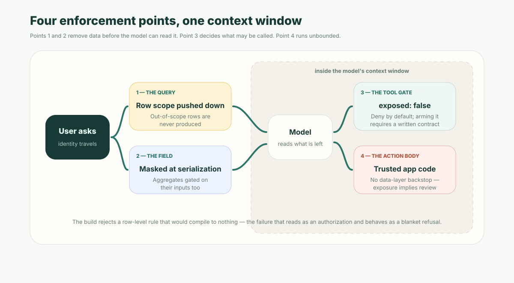

**The short version:** whether an agent *should* respect permissions is settled. *Where the check runs* is not — and that is the part that decides whether the guarantee is real. There are four enforcement points: the query, the field, the tool gate, and the action body. Only the first three sit before data reaches the model. Anything enforced after that is a **paper permission** — metadata that reads as access control and enforces nothing. The useful question for a platform is not "does it have a permission model." It is "can it prove a given permission is not made of paper."

If you want the case for agents inheriting user identity at all, we made it separately in [How AI Agents Stay Inside Enterprise Permission Boundaries](/en/blog/ai-agent-business-data-security-boundaries/). This piece assumes you agree and asks the harder question: at which line of code does the boundary actually hold?

## Paper permissions

A paper permission is any rule that a human reads as a restriction and that the runtime never applies. It is not a hypothetical category — it has at least four common species:

- **A prompt instruction.** "Only access data the current user is allowed to see." This is a request, not a boundary.
- **A hidden button.** UI state that greys out a control while the underlying endpoint stays open.
- **A post-filter.** Query broadly, then drop the rows or fields the user should not have seen — after they are already in the model's context.
- **A policy that does not compile.** A row-level security rule written in a form the engine cannot lower into a filter.

The fourth is the interesting one, because it is invisible. The first three are at least discoverable by reading the code. A predicate that silently fails to compile looks like governance in the metadata, passes review, and does nothing.

## Start here: a policy that reads as an authorization and behaves as a blanket refusal

In ObjectStack, row-level security is authorable metadata: `permissions[].rowLevelSecurity[].using` for reads and `.check` for writes. Each is an expression the engine lowers into a filter condition and pushes into the query.

Some expressions do not lower. The historical example is an equality written in a form the compiler did not accept — the author writes what looks like an ownership rule, and the compiler produces no filter at all. What happens next is the part worth knowing:

- The policy contributes **no filter**.
- If it was the only applicable policy for that object and operation, the read path substitutes a deny sentinel — a filter on a reserved impossible id — and ANDs it onto the where clause. Every `select`, `update`, and `delete` on that object then matches **zero rows**.
- On the write path, the same drop turns the post-image predicate into the deny sentinel, and the write raises a permission error.
- At request time the only signal is a single warning line: the policy "has an uncompilable predicate and was DROPPED (no enforcement)."

So the runtime fails **closed**, which is why this class of bug is survivable rather than catastrophic. But note the shape of the failure: you wrote a rule granting scoped access, and the system answers "no rows" to everything that rule governs. It reads as an authorization and behaves as a blanket refusal. Nothing at authoring time points at the line responsible.

ObjectStack's answer is a compile-time gate. `validateRlsPredicateEnforceability` runs over every declared `using` and `check` and rejects, as an error, any predicate that will never enforce. The design detail that makes it trustworthy is that the gate does not model the runtime's behaviour or pattern-match for it — it calls the runtime's **own decision procedure**, `isSupportedRlsExpression`, on the same input. The compiler consults that identical function when deciding whether a dropped policy is an authoring mistake or an intentional skip. "Rejected by the linter" and "dropped with no enforcement" are therefore the same boolean, and cannot drift apart.

That property is the whole point. A linter that re-implements the rule it is checking eventually disagrees with it, and the false-positive direction — rejecting policies the runtime executes correctly — is worse than the gap it was written to close. When the gate shipped, every `using` and `check` declared across the platform's own seeds, examples and fixtures passed: it turned nothing red that already worked.

**This is the artifact to ask other platforms for.** Not "do you support row-level security" — everyone says yes. Ask: *can your build reject a security rule that would silently do nothing?*

## Point 1 — the query

Record scope must be a predicate the database evaluates, not a filter applied to results.

The distinction sounds academic until you trace an agent request. If the tool queries broadly and filters afterwards, the out-of-scope rows existed in process memory, and — depending on where the filtering happens — may already have been serialized into the model's context. At that moment the permission decision is retroactive. You are no longer enforcing a boundary; you are hoping nothing downstream repeats what it already read.

Pushed into the query, the rows are never produced. There is nothing to leak, nothing to redact, and nothing that depends on the model behaving.

In ObjectStack the agent's data tools never touch the engine directly. They route through the same permission- and RLS-enforcing path the REST API uses, bound to the caller's principal — the tools cannot widen it. "The agent has its own service account" and "the agent queries as the signed-in user" are architecturally different products, and only the second one degrades safely.

## Point 2 — the field

Record access does not imply field access. A user may legitimately see a customer record and have no business seeing its internal risk score, and an agent summarizing that record is *more* dangerous than a UI rendering it, because summarization is exactly the operation that recombines fields into fluent prose.

Field-level security therefore has to run before the value is serialized toward the model, not as an instruction about what to omit. Three implementation details in ObjectStack's masker are worth copying regardless of what you build on:

- **Masking follows the value, not the declared type.** Numbers and bigints are masked through their decimal rendering, so a phone number stored numerically does not leak on a technicality.
- **Unrecognized shapes fail closed.** Booleans, objects and dates collapse to a fixed opaque token rather than a length-preserving mask — not even a length or a truthiness bit escapes from a shape the rule was never written for. An unknown masking preset masks entirely.
- **Aggregations are gated on their inputs.** Without this, an agent launders a masked field through an average and reads the secret back out as a statistic.

Masking is also idempotent, which is what makes it safe to detect and reject writes that echo a masked value back into storage.

## Point 3 — the tool gate

An action is not exposed to an agent because it exists. In ObjectStack, AI exposure is an explicit opt-in block on the action, and the flag is `exposed: z.boolean().default(false)` — **deny by default, in the schema**.

Two properties of that gate matter more than the default itself:

- Setting `exposed: true` **requires** an LLM-facing `description` of at least 40 characters. You cannot arm an action for the agent fleet without stating, in prose, when and why it should be called. The tool contract is authored, not derived from a UI label.
- The schema is strict, and keys that read as controls but are not are renamed onto the real one rather than silently dropped. This is the failure mode the platform kept hitting: an author sets a key they believe is a gate, and the key does not exist. Silently ignoring it means the action "still registered and still ran, without whatever the key was meant to gate."

The same principle governs the UI: `visible` and `disabled` hide or grey a button. **Hiding is not gating.** The gate is `requiredPermissions`, enforced with a 403 on the action route. A control that is invisible and un-gated is a paper permission with good manners.

## Point 4 — the action body, and the honest limit

Here is what this architecture does not solve.

Object reads and writes are bounded on every call — RLS on rows, field security on columns. An action body is not. Once invoked, it executes as **trusted application code**. There is no data-layer backstop inside it. An action that loads records directly and returns them can hand an agent whatever it likes, and no row filter will stop it.

This is why the tool gate exists as a separate flag at all. The earlier design was "no separate AI opt-in; rely on permission and RLS enforcement" — the reasoning being that if every read is bounded, exposure is harmless. That was revised, explicitly, because it is not true past the action boundary. The opt-in flag and the capability gate are what stand in for a data-layer check that cannot exist there.

The practical consequence: **an exposed action is a reviewed action.** Row-level security does not review it for you. If your platform tells you that permissions alone make tool exposure safe, it has not traced this path.

## The checklist

Ask a platform — or your own codebase — these six questions. They are answerable by reading code, which is the point.

1. Is record scope a predicate the database evaluates, or a filter applied to results?
2. Can the build **reject** a security rule that would compile to nothing?
3. Are fields masked before serialization toward the model, or described to the model as off-limits?
4. Are aggregations gated on their inputs, or only on their outputs?
5. Is agent tool exposure default-deny in the schema, or default-allow with an opt-out?
6. What runs unbounded once an action body starts, and who reviewed it?

A platform that answers the first five well and cannot answer the sixth has not thought about agents. A platform that cannot answer the second has row-level security on paper.

## Why this is a metadata problem

Every enforcement point above is declared, not coded: a predicate on a permission set, a masking rule on a field, an opt-in block on an action. That is what makes them reviewable as a diff and checkable by a build — and it is why the compile-time gate is possible at all. You cannot lint an authorization that only exists inside an imperative handler.

It is also what makes this tractable when the code is written by an agent rather than a person. The reviewer is not reading a pull request full of query construction to confirm the tenant filter is present in all seventeen paths. They are reading a permission set. The runtime supplies the rest, and the build refuses the permissions that are made of paper.

If you are pointing a coding agent at a backend this quarter, the property to select for is not how quickly it scaffolds CRUD. It is whether the resulting permissions can be proven to enforce — by a gate, before anything ships. Point your agent at the [ObjectStack spec](https://github.com/objectstack-ai/objectstack) and review what it declares.
