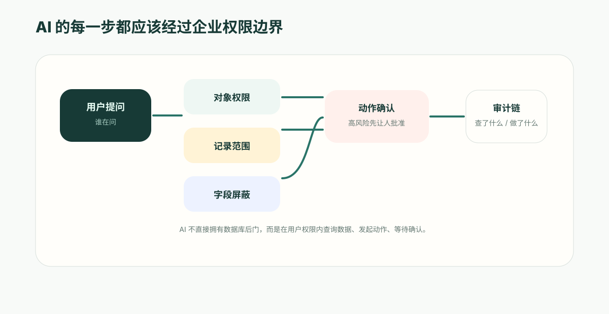

---
# @generated zh-Hant from zh-Hans (s2twp) — edit the zh-Hans file; delete this line to hand-maintain.
title: AI Agent 許可權檢查跑在哪一層：查詢下推、欄位脫敏與工具閘門
description: 該不該守許可權已經沒有爭議；決定這道邊界真假的是檢查跑在哪一層。資料進入模型上下文之後再過濾，等於沒過濾——那是紙面許可權。本文拆開查詢、欄位、工具閘門三個執行點，以及平臺明確不兜底的兩處。
author: ObjectStack Team
date: 2026-06-05T11:00:00+08:00
status: published
topic: governance
audience: business
solutions: []
industries: []
cover: ./cover.svg
tags:
  - AI 智慧體
  - 智慧體許可權
---

**先給結論**：agent 該不該受許可權約束，這件事已經不用爭了。真正決定這道邊界是真是假的，是**檢查跑在哪一層**——在資料進入模型上下文之前，還是之後。之後才補的過濾不是邊界，是**紙面許可權**：寫下來像訪問控制，執行時什麼都不做。所以採購和評審時該問的不是"你們有沒有許可權模型"，而是"你們能不能證明某一條許可權不是紙做的"。

"agent 到底該不該繼承使用者身份、該不該受審批和審計約束"，我們在 [AI Agent 資料安全邊界：如何在企業許可權內工作](/zh-Hans/blog/ai-agent-business-data-security-boundaries/) 裡單獨論證過。這篇預設你已經同意那一層，只問後面那個更難回答的問題：這道邊界具體落在哪一行程式碼上，以及它失效的時候，你能看見嗎？

## 一條紅線

把一次 agent 請求攤平來看，中間有一條線：**資料進入模型上下文的那一刻**。

線的左邊，許可權還能被強制執行——不該出現的行可以根本不產生，不該看的欄位可以在離開資料層時就被替換掉。線的右邊，一切都變成了"希望"：希望模型不要複述、希望它按提示詞自覺、希望摘要裡不會把幾個欄位拼成一句自然的話。

企業裡最貴的那類錯誤，不是這條線畫錯了，而是**沒人知道自己已經站線上的右邊**。因為紙面許可權從來不報錯。它在後設資料裡讀起來是治理，在評審裡能過，在執行時什麼都不做。

下面三種失效，都是真實存在的形態。共同點是：它們不會讓系統崩掉，只會讓你以為自己有邊界。

## 失效一：寫下來像授權，跑起來像"這條授權不存在"

行級許可權在 ObjectStack 裡是可宣告的後設資料：讀用 `permissions[].rowLevelSecurity[].using`，寫用 `.check`。每一條都是一個表示式，引擎把它降解成過濾條件，壓進查詢裡。

問題在於，**不是每個表示式都降得下去**。可下推的子集是有邊界的：比較運算子、`in`、`&&`/`||`/`!`、空值判斷，以及 `startsWith`/`endsWith`/`contains` 這幾個字串方法，作用在單列欄位路徑上，與一個字面量或 `current_user.*` 的值相比較。函式呼叫、算術、三元表示式、跨物件路徑（`record.account.region` 這種），都在子集之外。

一條降不下去的策略，接下來會發生什麼，值得完整看一遍：

- 這條策略**不貢獻任何過濾條件**。
- 讀路徑上，如果它是該物件該操作**唯一**適用的策略，執行時會換上一個拒絕哨兵——一個保留的、不可能命中的 id（`__rls_deny__:00000000-0000-0000-0000-000000000000`）——AND 進 where 子句。於是這個物件上的每一次查詢、更新、刪除都匹配**零行**。
- 但如果還有別的策略也適用，情況更隱蔽：這一條只是從 OR 裡**悄悄消失**，它寫著要授予的那部分訪問權，從來就不存在。沒有報錯，沒有零行，只是有一批人一直看不到他們本該看到的資料，而沒人把這件事和那行後設資料聯絡起來。
- 寫路徑上，`check` 變成同一個哨兵，任何記錄都無法滿足，寫入直接報許可權錯誤。
- 執行時唯一的訊號，是請求時的一行警告：這條策略"有無法編譯的謂詞，已被丟棄（不強制）"。

注意這個失效的形狀：**你寫下的是一條授權，系統的行為是全面拒絕**（或者更糟，是一次靜默的不授予）。而在你寫下它的那一刻，沒有任何東西指向那一行。

ObjectStack 的答案是把它變成**編譯期的紅燈**。構建時有一條規則會走遍每一條宣告出來的 `using` 和 `check`，把"永遠不會生效"的謂詞按 error 拒掉。

這條規則裡真正值得抄的設計，不是它拒了什麼，而是它**怎麼判斷**：它不去模仿執行時的行為，也不做模式匹配，而是直接呼叫執行時**自己的那個判定函式**，用同一個輸入。執行時決定"這條策略是作者寫錯了還是有意跳過"，呼叫的是同一個函式。於是"被 linter 拒掉"和"被執行時丟棄"是同一個布林值，不可能各自漂移。

這一點是關鍵。一個自己重新實現了被檢規則的 linter，早晚會和它要檢的東西意見不合，而**誤報方向比漏報更糟**——把執行時執行得好好的策略拒掉，會讓人開始繞過這條規則。這條規則上線時，平臺自己的種子資料、示例和 dogfood 夾具裡宣告過的每一條 `using` 和 `check` 都是通過的：它沒有把任何一件本來就正常的事情變紅。

它還把診斷拆成了三個不同的 id，因為**後果一樣，修法不一樣**：謂詞能解析但在可下推子集之外（改寫它，或者把值反規範化到本物件上）；連 CEL 都解析不了（把 SQL 式的 `AND`/`OR`/`LIKE` 改寫成 CEL）；語法完全正確但超出了平臺的解析預算上限（拆小它）。一個只會說"這條不行"的檢查，會把人引向錯誤的修法。

還有一個容易被漏掉的細節：`enabled: false` 的策略**照樣會被判**。今天它是關著的，後果只是休眠而不是活躍；但一條永遠無法生效的策略，會在某人把開關開啟的那天什麼都不授予——而那一刻恰恰不會有人重跑 linter。

**這才是該向平臺索要的東西。** 不是"你們支不支援行級許可權"——所有人都說支援。而是：*你們的構建能不能拒絕一條編譯後什麼都不做的安全規則？*

## 失效二：等你過濾的時候，模型已經讀到了

記錄範圍是一個**資料庫去求值的謂詞**，還是一個**對結果做的過濾**，聽起來像是實現細節，直到你跟著一次 agent 請求走一遍。

如果工具先寬查詢、再在結果上過濾，那些越界的行已經真實存在過：它們在程序記憶體裡，而且取決於過濾發生在哪一步，很可能已經被序列化進了模型的上下文。那一刻起，許可權決策變成了**追認**。你不是在守邊界，你是在指望後面沒人複述已經讀到的東西。

壓進查詢裡，這些行根本不會被產生。沒有東西可洩露，沒有東西需要事後補救，也不依賴模型的表現。

ObjectStack 裡 agent 的資料工具從不直接碰引擎。它們走的是和 REST API 同一條許可權與行級許可權強制路徑，繫結在呼叫者的主體身份上，**工具無法把它放寬**。"agent 有一個自己的服務賬號"和"agent 以當前登入使用者的身份查詢"是兩種架構不同的產品，只有後一種在出錯時是安全地退化。另外，系統物件（`sys_*`）預設不暴露給 agent 工具，這道守衛掛在每一個接受物件名的工具上，**獨立於橋接層**——也就是說，即使橋接層配置錯了，這一層也還在。

### 欄位：遮蔽跟著值走，不跟著宣告的型別走

能看到一條記錄，不等於能看到它的每個欄位。客戶記錄裡的內部風險評分、商機裡的底價和利潤率、合同裡的敏感條款——使用者在介面上看不到，agent 也不該拿到。而且 agent 比介面**更危險**：摘要恰恰是把多個欄位重新組合成流暢句子的那種操作。

所以欄位級安全必須發生在值被序列化、送往模型之前，而不是變成一句"不要說出來"的叮囑。ObjectStack 的實現裡有四個細節，不管你在什麼平臺上做，都值得照抄：

- **不可讀的欄位被刪掉，需要脫敏的欄位被替換掉**——都發生在結果離開資料層的時候。前者從結果裡消失，後者變成掩碼值（手機號保留前 3 後 4，身份證保留前 6 後 4，銀行賬號只保留後 4 位）。
- **掩碼跟著值走，不跟著宣告的型別走。** 數字和大整數按它們的十進位制文本脫敏——一個用數字型別存的手機號，不會因為"它是 number 不是 string"這種技術細節而漏出去。太短、保不住首尾的值，一律**整個**遮掉；不認識的脫敏預設，也是整個遮掉。
- **沒見過的形狀一律失敗關閉。** 布林、物件、日期這些規則本來沒為它們寫過的形狀，會塌縮成一個固定的、與值無關的遮蔽符號——連長度和"是不是真"這一個位元都不會漏出來。
- **聚合按輸入閘門。** 沒有這一條，agent 只要把一個被遮蔽的欄位拿去求個平均，就能把秘密當成統計量讀回來。

脫敏是冪等的（對已經脫敏的值再脫敏，結果不變），這一點讓另一件事成立：系統可以識別並拒絕"把掩碼值原樣寫回去"的寫入。一個整條記錄回填的客戶端，會把 `138****5678` 當成真實手機號提交，把庫裡的真值覆蓋掉——平臺在這裡返回 400 拒絕，而不是照寫。

### 拒絕要看得見

還有一個更像產品決策、但影響很大的細節：當寫入觸及一個使用者無權編輯的欄位時，平臺返回 **403，而不是把這些欄位悄悄丟掉**。

理由值得抄給任何做後臺的人：靜默丟棄會把安全邊界**藏起來**。誠實的客戶端只會看到"我的修改有一部分沒存上"，而且不知道為什麼；攻擊者則得不到任何否定訊號，也就無從判斷這個欄位是否存在。拋錯讓邊界在兩個方向上都可觀測。

這條原則對 agent 尤其重要。一個被靜默丟棄的寫入，在 agent 眼裡是一次**成功**——它會據此往下走，告訴使用者已經改好了。

## 失效三：作者以為自己設了一個開關

一個動作不會因為它存在就自動開放給 AI。在 ObjectStack 裡，AI 暴露是動作上一個顯式的選擇塊，而它的預設值寫死在 schema 裡：`exposed` 預設 `false`——**預設拒絕，寫在 schema 上，不是寫在文件裡**。

比預設值本身更值得注意的是這道閘門的兩個性質：

- 把 `exposed` 設為 `true`，**強制要求**一段面向大模型的 `description`，且至少 40 個字元。你沒法在不說明"什麼時候、為什麼該呼叫它"的前提下，把一個動作武裝給整個 agent 佇列。工具契約是被人寫下來的，不是從介面按鈕的標籤裡推匯出來的。
- 這個塊是**嚴格模式**的，而且那些"讀起來像開關、其實不是開關"的鍵，會被**重新命名到真正的那個鍵上**，而不是被靜默丟棄。這是平臺反覆撞到的失效形態：作者設了一個自己以為是閘門的鍵，而這個鍵根本不存在。有五種拼寫會落到 `exposed` 上——包括 `enabled`、`expose`，以及最像的那個 `visible`。在這個形狀被關嚴之前，它們是被靜默丟棄的：**動作照樣註冊、照樣執行，只是那個鍵本來要管的事情沒人管。**

同一個原則也管介面：`visible` 和 `disabled` 是 UI 謂詞，它們隱藏或置灰一個按鈕。**隱藏不是攔截**——按鈕沒了，路由還在。真正的閘門是 `requiredPermissions`，在平臺動作路由上以 403 強制執行。一個看不見、也沒被閘門管住的控制元件，是一條很有禮貌的紙面許可權。

這裡還有一個更常見的混淆：**三道閘門是三件事，不要指望在一個鍵上把它們都辦了。**

| 你想管的事 | 該用的東西 |
|---|---|
| 誰有資格呼叫這個動作 | 動作上的 `requiredPermissions`（403） |
| agent 手裡到底有沒有這個工具 | 由 skill 宣告；誰能跟這個 agent 說話，由 agent 自己的訪問與許可權設定管 |
| 這一次呼叫要不要人點頭 | `requiresConfirmation`——AI 呼叫上的人工介入 |
| 一條多步的業務審批 | 一個獨立的審批後設資料項，不是動作上的一個欄位 |

把審批塞進動作欄位裡，或者以為"AI 能不能調"是 `ai` 塊裡的某個許可權鍵，是同一類錯誤：**它們看起來是治理，實際上沒有落在任何一個執行點上。**

## 平臺沒有兜底的兩處

這套架構解決不了的事情，說清楚比說滿更有用。

**第一，動作體一旦開始執行，就是可信應用程式碼。** 物件的讀寫在每一次呼叫上都是有界的——行級許可權管行，欄位級安全管列。動作體不是。它裡面沒有資料層的兜底。一個直接載入記錄再返回的動作，可以把任何東西交給 agent，沒有任何行過濾會攔住它。

這恰恰是那個獨立的 AI 開關**為什麼要存在**。更早的設計是"不要單獨的 AI 開關，靠許可權和行級許可權強制就夠了"——理由是既然每一次讀都是有界的，暴露就是無害的。這個設計被明確推翻了，因為**過了動作邊界，它就不成立**。這個開關和能力閘門，替代的正是那裡不可能存在的資料層檢查。

現實的推論只有一句：**開放給 AI 的動作，是被評審過的動作。** 行級許可權不會替你評審它。如果一個平臺告訴你"有許可權就夠了，暴露動作是安全的"，它沒有走過這條路徑。

**第二，服務端的能力檢查只覆蓋平臺自己的呼叫路徑。** `requiredPermissions` 的 403，發生在平臺動作路由（`POST /api/v1/actions/{物件}/{動作}`）和 AI 呼叫路徑上——指令碼、流程、彈窗這三類動作都落在這裡。但一個 `type: 'api'` 的動作，如果它指向的是你自己寫的端點，那是**瀏覽器直連**的：平臺根本看不到這個請求，也就沒有任何東西在服務端檢查這條宣告。

所以在那種動作上，介面上的閘門只是一種禮貌，不是邊界——**那個端點必須自己再檢查一次能力**。這不是缺陷，是邊界的位置：平臺只能強制它自己經手的呼叫。但如果沒人把這句話說給你聽，你會以為那條 `requiredPermissions` 在保護你。

## 驗收清單：讓對方演示一次失敗

評估平臺（或者評審你自己的程式碼庫）的時候，是/否的問題沒什麼用，因為所有人的答案都是"是"。改成要求**演示一次失敗**，答案立刻會分層。

| 要求對方演示的 | 合格的樣子 | 該警惕的訊號 |
|---|---|---|
| 寫一條永遠不會生效的行級許可權規則 | 構建報錯，並指出是哪一行、該怎麼改 | 構建通過，"執行時會處理" |
| 讓 agent 查一批越權資料 | 資料庫層就返回不了這些行 | 能查出來，然後"在返回前過濾掉" |
| 讓 agent 摘要一個被遮蔽的欄位 | 值在進入上下文前已是掩碼 | 提示詞裡寫著"不要洩露該欄位" |
| 讓 agent 對被遮蔽欄位做一次平均 | 聚合在輸入側被拒 | 統計值算得出來 |
| 新建一個動作，什麼都不配就問 agent 能不能調 | 預設調不到 | 預設能調，需要顯式關掉 |
| 開啟一個動作的 AI 開關，但不寫說明 | 拒絕儲存 | 儲存成功 |
| 問"動作體裡跑的東西誰審的" | 有明確的評審約定 | "許可權已經管住了" |

前六項都答得好、第七項答不上來的平臺，是沒有想過 agent 的。第一項答不上來的平臺，它的行級許可權是紙做的。

## 為什麼這歸根到底是後設資料問題

上面每一個執行點都是**宣告出來的**，不是寫在程式碼裡的：許可權集上的一個謂詞、欄位上的一條脫敏規則、動作上的一個選擇塊。這才讓它們能作為 diff 被評審、被構建檢查——也正因如此，那條編譯期的紅燈才可能存在。你沒法給一個只存在於命令式處理函數里的授權做 lint。

當代碼是 agent 寫的而不是人寫的時候，這一點會變得更要緊。評審的人不是在讀一個滿是查詢拼裝的 PR，去確認十七條路徑裡都帶上了租戶過濾條件。他讀的是一個許可權集，剩下的由執行時供給，而構建會拒掉那些紙做的許可權。

如果你這個季度打算把編碼 agent 指向某個後端，要挑的屬性不是它搭 CRUD 有多快，而是**它產出的許可權能不能在上線之前被證明會生效**。把你的 agent 指向 [ObjectStack 規範](https://github.com/objectstack-ai/objectstack)，然後審它聲明瞭什麼。
