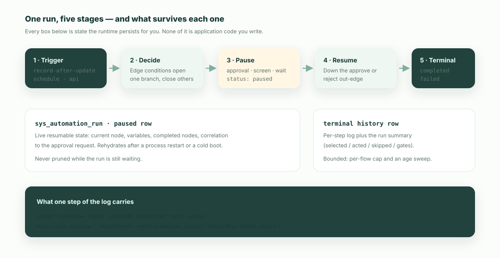

**The short version:** an automation that only fires and forgets is a notification, not a process. An enterprise automation engine owes you three answers on every run — which branch it decided, what it is waiting for, and what it actually changed. AI can now draft the flow in seconds; whether you can review it, pause it for a human, and audit it afterwards is what decides if it ever leaves the demo.

Here is the failure mode that motivates all of it, and almost nobody instruments for it.

## The green-but-idle run

A nightly flow sweeps stalled opportunities and nudges their owners. It has run every night for four months. Every run is green.

Then a rep asks why nobody chased the deal that went quiet in March, and someone opens the logs: the flow selected 30 opportunities every night and sent zero messages. A conditional edge inside the loop body had been evaluating false on every iteration since a field was renamed. The run status was `completed`, because nothing threw. Success and doing-the-work had quietly stopped being the same thing.

Call it the **green-but-idle run**: an automation that reports success while causing nothing. It is invisible to every signal most platforms expose, because "did it error?" and "did it do anything?" are different questions and only the first one is usually asked.

The fix is not a better alert. It is that the engine has to count. In ObjectStack, every run records two numbers — `selected` (records it read or matched) and `acted` (records it wrote or effects it dispatched) — and both sit on the run row itself, not one drill-down away. The broken-sweep query is then three clauses:

```sql
selected > 0 AND acted = 0 AND unmeasured = 0
```

The third clause matters and is the part a hand-rolled detector gets wrong. A step that calls an outside system may have caused an effect the platform cannot count; it reports `unmeasured` rather than pretending to be a zero. Without that clause the alert screams on every healthy connector-driven flow until operators learn to ignore it — which is the original bug wearing a hat.

## Three answers an automation engine owes you

Once you accept that "it ran" is not an outcome, the requirements fall out. A flow that carries a real business process has to decide, wait, and prove.



### 1. Decide — and record the gate that closed

Branching is table stakes. Recording *why* the other branch did not open is not.

In ObjectStack a decision is a node with conditions on its out-edges; one edge may be marked the default, taken only when no sibling condition matched. When a gate closes, the step it would have run is logged as `skipped` together with `skippedBy` — the node whose out-edge did not open, the edge id, and the branch label if the flow names its branches. The run summary then rolls those up into a `gates` list, most-skipped first.

That is the difference between "the flow ran" and "the flow ran, and the over-threshold branch never opened 30 times." The second sentence is a diagnosis. The first is a shrug.

### 2. Wait — durably, and for the right kind of thing

Most demoed automations are fully automatic. Most enterprise processes are not: they stop and wait for a discount to be approved, for a customer to send the missing document, for three days to pass, for an external system to call back.

An engine either models waiting as a first-class state or it doesn't. When an ObjectStack flow reaches a long-lived pause — an `approval` node, a `screen` node collecting input, a `wait` node — the run **suspends**: the engine writes a durable row holding the current node, the variables, the nodes already completed, and a correlation back to whatever it is waiting on. A process restart, a deploy, or a hibernating worker does not lose it; a cold-booted runtime rehydrates the run and continues at exactly that node. An approval that sits for three weeks is not an edge case, it is Tuesday.

Approval nodes carry the governance that people assume lives in a separate approvals product:

| Concern | Declared on the node | Effect at runtime |
| --- | --- | --- |
| Who may act | `approvers` (user, position, manager, team, department, expression) | Resolved at node entry |
| How votes combine | `behavior`: `first_response`, `unanimous`, `quorum`, `per_group` | One rejection always finalizes as rejected |
| Editing during review | `lockRecord` (default `true`) | The record is locked while pending |
| Nobody resolves as approver | `onEmptyApprovers` (default `admin_rescue`) | Opens anyway and warns; never silently waves it through |
| The SLA | `escalation`: `timeoutHours`, `action`, `escalateTo` | Reassign, notify, auto-approve, or auto-reject on breach |

Approve and reject are ordinary out-edges, so what happens next is drawn in the flow rather than buried in an approval product's settings screen.

### 3. Prove — the run record is the deliverable

When someone asks "why did I get this email," "why was my deal sent back," or "what did the AI change last night," the answer has to be a record, not a reconstruction.

Every ObjectStack run keeps an ordered step log. Each step carries its node id and type, its status, start time, duration in milliseconds, the input it received and the output it produced, any error as a `code` and `message`, and the retry attempt number. Loop iterations and parallel branches are tagged with their container and index, so a step that ran thirty times reads as thirty tagged executions instead of one opaque box. On top of that sits the per-run summary: totals for records selected, acted on and skipped, a per-node breakdown, and the gate list.

Two details are worth stealing even if you never use ObjectStack:

- **A run status vocabulary that admits reality.** `pending`, `running`, `paused`, `completed`, `failed`, `cancelled`, `timed_out`, `retrying`. Systems that collapse this to success/failure cannot express "waiting on a human since Tuesday," which is the state most business processes spend most of their life in.
- **Attribution for runs with no human behind them.** A scheduled sweep has no user. Rather than leave the audit row blank or borrow someone's identity, an elevated run stamps its data operations with the flow itself as the acting principal — `svc:flow:<flow_name>`. You can always answer "who changed this record" with something truthful.

By default a flow runs **as the user who triggered it**, so its reads and writes respect that user's row-level security. Elevation is a declared choice (`runAs: 'system'`), not an accident of where the code runs — and a run that declares `user` but resolves no triggering user has its data operations refused rather than quietly falling back to elevated.

## What this looks like as metadata your agent can write

Here is the renewal-risk process from the top of this article, as the definition an agent generates and a human reviews. It is not pseudo-code; it is the artifact the runtime executes.

```ts
import { defineFlow } from '@objectstack/spec';

export const RenewalRiskEscalation = defineFlow({
  name: 'renewal_risk_escalation',
  label: 'Escalate Renewal Risk',
  type: 'record_change',
  runAs: 'user',
  status: 'active',
  nodes: [
    {
      id: 'start',
      type: 'start',
      label: 'Renewal risk turns high',
      config: {
        objectName: 'account',
        triggerType: 'record-after-update',
        condition: 'renewal_risk == "high" && previous.renewal_risk != "high"',
      },
    },
    {
      id: 'notify_owner',
      type: 'notify',
      label: 'Tell the success manager',
      config: {
        topic: 'account.renewal_risk',
        recipients: ['{record.owner}'],
        channels: ['inbox'],
        severity: 'warning',
        title: 'Renewal risk is now high: {record.name}',
        actionUrl: '/account/{record.id}',
      },
    },
    { id: 'by_value', type: 'decision', label: 'Is this a major account?' },
    {
      id: 'regional_signoff',
      type: 'approval',
      label: 'Regional lead confirms the play',
      config: {
        approvers: [{ type: 'position', value: 'regional_sales_lead' }],
        behavior: 'first_response',
        lockRecord: true,
        escalation: { enabled: true, timeoutHours: 72, action: 'reassign', escalateTo: 'sales_director' },
      },
    },
    {
      id: 'grace_period',
      type: 'wait',
      label: 'Give them three days',
      waitEventConfig: { eventType: 'timer', timerDuration: 'PT72H' },
    },
    {
      id: 'escalate',
      type: 'update_record',
      label: 'Escalate to the manager',
      config: {
        objectName: 'account',
        filter: { id: '{record.id}' },
        fields: { escalation_state: 'manager_review' },
      },
    },
    { id: 'end', type: 'end', label: 'End' },
  ],
  edges: [
    { id: 'e1', source: 'start', target: 'notify_owner' },
    { id: 'e2', source: 'notify_owner', target: 'by_value' },
    { id: 'e3', source: 'by_value', target: 'regional_signoff', type: 'conditional',
      condition: 'record.annual_value > 500000', label: 'major account' },
    { id: 'e4', source: 'by_value', target: 'grace_period', isDefault: true, label: 'standard' },
    { id: 'e5', source: 'regional_signoff', target: 'grace_period', label: 'approve' },
    { id: 'e6', source: 'regional_signoff', target: 'end', label: 'reject' },
    { id: 'e7', source: 'grace_period', target: 'escalate' },
    { id: 'e8', source: 'escalate', target: 'end' },
  ],
});
```

Roughly eighty lines. A reviewer can read the entire policy — who gets told, what the threshold is, who signs off, how long the grace period runs, what happens on rejection — without opening a debugger. That is the property that makes AI-drafted automation reviewable: the diff a human approves is the same object the engine runs.

There are twenty built-in node types in the box (`start`, `end`, `decision`, `assignment`, `loop`, the four CRUD nodes, `http`, `notify`, `script`, `screen`, `wait`, `subflow`, `map`, `connector_action`, and the BPMN gateway and boundary nodes), plus types registered by plugins — `approval` is one of those. Structured `loop`, `parallel` and `try_catch` regions mean retries and error handling are drawn in the flow rather than implied by whoever wrote the worker.

## Why metadata beats a generated script

Ask an AI to "automate renewals" and it can produce working code in a minute. The reason that is the wrong output for an enterprise system has nothing to do with code quality:

1. **Nobody reviews it.** A business owner cannot tell from a script which fields it writes, which branch runs when, or who gets notified. They can tell from the definition above.
2. **The platform cannot govern it.** Permissions, approvals, run history, retries, versioning and rollback each have to be reimplemented inside the script, differently every time.
3. **The next change is riskier than the first.** "Raise the threshold to 800k and add a legal sign-off" is a two-line edit to a declaration. Against a script, the AI has to re-derive the author's intent before it can safely touch anything.

Generated code makes the first hour fast and every subsequent hour expensive. Generated *definitions* keep the artifact small enough to review, which is the only thing that makes AI-written automation safe to run against production data.

## What ObjectOS automation does not do

Being useful requires being honest about the edges.

- **A plain `wait` node has no timeout.** It resumes on its timer or on a named signal; there is no deadline that fails or advances it early. Deadline behaviour lives on the approval node's SLA escalation, or in a scheduled sweep that goes looking for stuck records. If your design says "if nothing happens in 48 hours, move on," put it behind one of those two — do not assume the wait will rescue you.
- **Terminal run history is bounded, not archival.** Completed and failed runs are retained under a per-flow cap and an age sweep (by default, the most recent hundred per flow and thirty days). Suspended runs are live state and are never pruned. If your regulator wants seven years of automation history, export it — the platform keeps an operations window, not an archive.
- **An engine does not fix a bad process.** Modelling a broken approval chain in metadata gives you a legible broken approval chain. That is genuinely better than an illegible one, but it is not the same as an improvement.

## How to evaluate an AI automation engine

Nine questions, in the order that has predicted the outcome in practice:

1. What does the natural-language request actually produce — a script, or a definition you can read?
2. Can the platform validate structure and conditions **before** anything is published?
3. Is waiting a first-class state, or an approval bolt-on living in another product?
4. Does a paused run survive a restart, a deploy, and a scale-to-zero?
5. Does every run record what it selected and what it acted on — not just whether it threw?
6. When a branch does not open, does anything anywhere say which condition closed?
7. Do flows run as the triggering user by default, with elevation a declared choice?
8. Are failure, timeout and rejection paths designable, or are they whatever the runtime happens to do?
9. When AI edits a flow, can a business reviewer see the change as a diff and roll it back?

A platform that answers the first five well is a real engine. One that only answers the first is a trigger builder with a marketing budget.

## Where this cluster goes next

This page is the hub for four narrower questions. Each of them is a decision point where teams pick the wrong shape and pay for it later.

### The trigger model — many entry points, one process

Record changes, schedules, manual buttons, webhooks and API calls are all legitimate ways to start a flow. The problem is never having several entry points; it is letting each one grow its own copy of the business rules. The engine's job is to converge them onto one governed process after the entry. [Which trigger types the engine actually resolves](/en/blog/automation-trigger-model/) takes that apart, starting with the flow that is published, active, and wired to nothing.

### Pause, resume, and approvals

Waiting for a person, a document, a clock, or an external callback are four flavours of the same capability. How an engine models them decides whether approvals are part of your process or a separate island your process has to be reconciled with. [What a long-running approval has to survive](/en/blog/automation-pause-resume-approvals/) makes the case that pausing is the easy half and the door out of the wait is the design decision.

### Cross-system flows

CRM, ERP, contracts and finance all show up in the same process. Reliability there is not "we connected more APIs" — it is whether outbound calls, retries, failure paths and compensation are governed nodes inside the flow, with delivery backed by a durable outbox rather than a fire-and-forget fetch. [Connector failure handling in a governed process](/en/blog/automation-cross-system-flows/) is about the half you cannot observe once a step leaves your runtime, and why an unmeasured effect must never be reported as a zero.

### Governed flow changes

Natural language lowers the cost of changing a process, which means the bottleneck moves to review. Every edit has to become reviewable, validatable, publishable and reversible metadata — including the question of what happens to the runs that are already in flight when the new version ships. Validation matters more than generation. [How to review an AI-edited flow before it ships](/en/blog/automation-governed-flow-changes/) follows one sentence through to the diff, the publish gate and the mixed-version run.

## Point your agent at it

If you want to test this rather than read about it: give your coding agent the ObjectStack rule file and the flow specification, describe a process from your own business in one paragraph, and read what comes back. You are not evaluating whether the AI can write automation — it can. You are evaluating whether the artifact it produced is one you would sign your name to, and whether the runtime underneath will tell you what it did afterwards.

That is the whole bet: AI writes the flow, a human reviews a small diff, and the engine decides, waits, and leaves the receipt.
