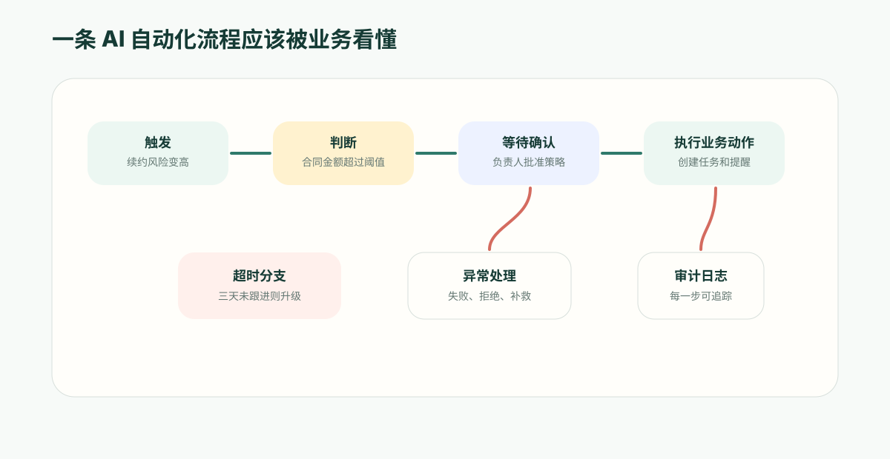

**先给结论**：企业要的自动化不是“发个通知”的触发器，而是能判断、能等人审批、能恢复、能留证据的流程。ObjectOS 用元数据让 AI 生成的流程也能被审查、发布、复盘。

如果自动化只能发提醒，它很快会从“效率工具”变成“消息噪音”。

很多团队第一次使用自动化时，想解决的是很小的事：客户状态变化后发一条提醒，报销金额超过阈值后发起审批，商机长时间没有跟进时创建任务。

这些功能有用，但它们还不是企业级 AI 自动化。

真正的业务流程会判断上下文、等待人工决策、处理异常分支、留下执行证据，还要允许业务人员用自然语言持续调整规则。否则自动化越多，系统越像一堆看不见的脚本：谁触发了它、为什么走这个分支、哪个节点改了数据，都很难说清楚。

ObjectOS 的 Automation 值得关注，不是因为它多了几个“自动发通知”的模板，而是因为它把流程做成了元数据。业务需求可以先变成流程结构，平台再负责校验、执行、暂停、恢复和审计。

## 从一句话到一条业务流程

一个业务负责人可能会这样描述需求：

> 当客户续约风险变高时，提醒客户成功经理跟进；如果年合同额超过 50 万，需要区域负责人确认；三天内没有动作就升级给主管。

在传统自动化工具里，这句话往往会被拆成多个规则：一个触发提醒，一个创建任务，一个延时检查，一个升级通知。规则之间的关系靠命名和约定维持，时间一长就很难管理。

在 ObjectOS 里，这类需求更适合变成一条完整流程：

- 触发条件：客户续约风险变为高；
- 数据读取：找到客户、合同、负责人和续约记录；
- 判断分支：根据合同额决定是否进入确认；
- 人工节点：区域负责人确认处理策略；
- 等待节点：三天后检查是否已跟进；
- 升级动作：没有跟进时通知主管；
- 执行记录：保留每一步的结果和时间。

业务人员看到的是一条流程，平台看到的是一组结构化元数据。AI 可以生成初稿，人可以审查和调整，运行时可以稳定执行。

## 为什么不能只靠触发器

简单触发器最大的问题，是它只能表达“发生了什么就做什么”，很难表达真实业务里的“如果、等待、确认、失败后怎么办”。

以折扣审批为例：

- 20% 以下折扣可以自动通过；
- 20% 到 30% 需要销售经理确认；
- 30% 以上还要财务参与；
- 任一环节拒绝，需要把商机退回并记录原因；
- 审批期间不能让销售绕过流程改最终报价；
- 审批通过后才可以生成正式报价。

这不是一条通知规则，而是一条有状态的业务流程。它必须能暂停等待人，也必须能在确认后从正确的位置继续执行。

这也是 AI 自动化的分水岭。AI 可以很快生成规则，但企业真正需要的是可治理的流程：规则能被看见，节点能被解释，审批能被追踪，失败能被处理。

## 元数据让 AI 生成的流程可以被治理

如果 AI 直接生成一段脚本，短期看很快，长期会带来三个问题。

第一，业务人员看不懂。脚本里到底有哪些分支、改了哪些字段、什么时候通知谁，不容易被审查。

第二，平台不好管。权限、审批、日志、版本和回滚都要靠脚本自己实现，越写越分散。

第三，AI 不好修改。业务人员说“把 50 万改成 80 万，并增加法务确认”，AI 需要先理解脚本，再改脚本，出错风险很高。

ObjectOS 的做法是让 AI 生成流程元数据，而不是临时代码。流程由节点、连接、条件、输入输出和运行策略组成。这样平台可以在发布前检查结构是否完整，运行时记录每一步，界面里展示流程图，后续还能继续用自然语言修改。

这对官网读者最重要的结论是：AI Builder 不是把需求翻译成一段隐藏代码，而是把需求翻译成企业能管理的业务资产。

## 等待人工确认，是企业流程的刚需

很多 AI 自动化演示都喜欢展示“全自动处理”，但企业应用里更常见的是半自动。

AI 可以判断风险、准备材料、推荐下一步；但在关键节点上，人仍然要确认。例如：

- 大额折扣是否批准；
- 高风险客户是否升级；
- 合同条款是否接受；
- 报销是否退回；
- 供应商是否进入黑名单。

ObjectOS 的流程支持“暂停并等待”。流程运行到审批、表单、等待时间或外部信号时，可以停在当前节点；当人批准、拒绝或补充信息后，流程再沿着对应分支继续。

这让 AI 自动化更符合真实组织的节奏。它不是用模型替代所有决策，而是把重复整理、判断和流转交给平台，把关键责任留给合适的人。

## 运行日志让业务能复盘

自动化最怕黑盒。

当客户问“为什么我收到这封邮件”，销售问“为什么商机被退回”，财务问“为什么这笔费用被拦截”，管理者问“AI 改了哪些记录”，平台必须给出答案。

因此，一条自动化流程不应该只是后台任务。它应该留下清楚的运行记录：

- 何时触发；
- 触发时读取了哪些业务对象；
- 哪个条件分支被命中；
- 哪个节点暂停等待了谁；
- 哪个动作修改了数据；
- 哪个通知被发送；
- 失败后有没有进入补救分支。

这些记录让 AI 自动化可以被审计，也让团队可以持续优化流程。没有日志，自动化越强，组织越不敢放心使用。

## 业务人员应该如何判断一个 AI 自动化平台

评估 AI 自动化能力时，不要只看能不能“用一句话创建规则”。更应该问：

- 这句话最终会生成什么？是脚本，还是可管理的流程元数据？
- 流程发布前能不能校验条件和结构？
- 审批、等待和人工确认是否是一等能力？
- AI 修改流程后，业务人员能不能看懂变化？
- 每次运行是否有日志和责任链？
- 失败、超时、拒绝这些异常路径是否可设计？
- 流程调用业务动作时，是否继承权限和审计？

这些问题决定了 AI 自动化能不能从演示走到日常运营。

## ObjectOS 的差异

ObjectOS 把对象、视图、权限、动作、Agent 和流程都放在元数据体系里。Automation 不是外接脚本工具，而是业务应用运行时的一部分。

这意味着业务人员可以先用自然语言提出目标，AI Builder 生成流程初稿；产品或运营人员检查流程图、条件和审批节点；管理员确认权限和风险；发布后，流程在同一套对象、动作和审计体系中运行。

对企业来说，这比“多一个自动化工具”更重要。

因为 AI 原生应用真正要解决的不是少点几下按钮，而是让业务规则可以被表达、被调整、被执行、被解释。自动化只有进入这个闭环，才会从辅助功能变成业务系统的核心能力。
