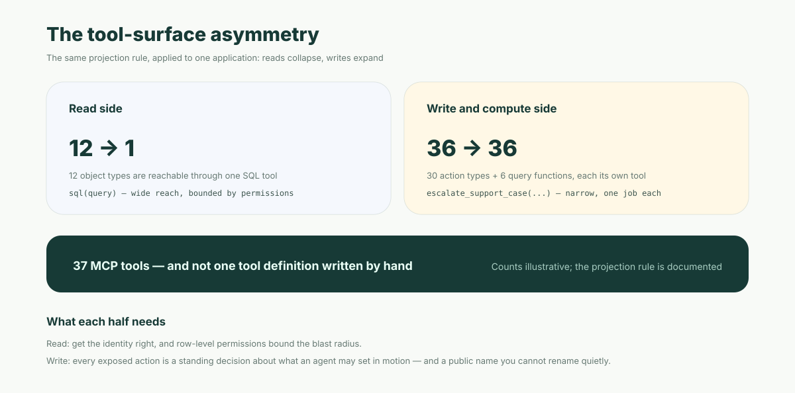

**Short answer:** Ontology MCP means exposing an enterprise ontology — its object types, action types and functions — as Model Context Protocol tools, so any MCP-compatible agent can read business objects and run business operations without integration code written per agent framework. Palantir's [Ontology MCP](https://www.palantir.com/docs/foundry/ontology-mcp/overview) became generally available across Foundry enrollments beginning the week of 16 June 2026; Microsoft is previewing the same idea in [Fabric IQ](https://learn.microsoft.com/en-us/fabric/iq/ontology/how-to-use-ontology-mcp-server). The ontology stops being something your applications query and becomes the tool surface your agents call.

One thing to carry away, because it decides how you plan: **the projection is asymmetric.** Many object types collapse into one wide read tool; each action type expands into its own narrow write tool. Call it the **tool-surface asymmetry** — it is why the read side and the write side of an ontology need different kinds of gate, and why only one of them is close to solved.

This post is about the ontology *as* the tool surface. The separate question of what has to sit behind any tool call — identity, permissions, a record — is covered in [MCP security for enterprise agents](/en/blog/mcp-governed-tool-layer/) and is not restated here.

## What actually shipped

Palantir's Ontology MCP (OMCP) is a [Developer Console](https://www.palantir.com/docs/foundry/developer-console/ontology-mcp) feature. You select an application, and the ontology resources inside it are projected into MCP tools by a documented rule:

| Ontology resource | What the agent gets | Ratio |
| --- | --- | --- |
| Object types | One SQL tool that reads across every object type in the application | many types, one tool |
| Action types | One MCP tool per action type, invoking that predefined action | one tool per type |
| Query functions | One MCP tool per exposed function, running logic you authored | one tool per function |

Source: [Ontology MCP overview](https://www.palantir.com/docs/foundry/ontology-mcp/overview) and the [June 2026 Foundry announcements](https://www.palantir.com/docs/foundry/announcements/2026-06).

Read that table twice, because the two halves behave differently. Apply the rule to an application containing 12 object types, 30 action types and 6 exposed query functions and you get **37 tools: one that can read all 12 object types, and 36 that each do exactly one thing** — with no tool definitions written by hand. (The counts are illustrative; the rule that produces them is documented.)

That is the asymmetry in one number. Reads collapse 12-to-1, writes expand 1-to-1. The consequence is not cosmetic:

- The wide read tool's blast radius is bounded by **the data the caller is allowed to see**. Get the identity right and the tool is as safe as the row-level permissions behind it.
- Each narrow write tool's blast radius is bounded by **what that specific action does**. There is no general "write" tool to secure — but there are now dozens of small ones, each of which is a decision about what an agent may set in motion.



## What it replaces: one adapter per agent framework

Before this, connecting an ontology to agents meant writing the connection yourself, once per framework you wanted to support. The same twenty business capabilities got re-described in each adapter — names, parameter lists, descriptions — and every copy was free to drift from the definition it was describing.

The fastest hand-written adapter is also the most dangerous one. It is a passthrough: a generic SQL tool, or a REST endpoint wrapped without narrowing. It ships in an afternoon and it hands the agent whatever the service can reach.

Projection changes the economics in a way that is easy to under-read as "less work":

- **The tool description is derived from the definition**, so it cannot drift from it by hand. The action's parameters *are* the tool's parameters.
- **Adding a framework becomes adding a client, not writing an adapter.** MCP is the interface; the surface is the same for all of them.
- **The narrowing is the default**, not the diligent path. You expose the actions you chose to expose, and each one arrives already named and typed.

## A worked example: ontology action vs. warehouse query

The difference between an ontology tool call and a warehouse query is not syntax. It is what the system knows when the call is over.

Here is the shape most teams built first — a warehouse tool:

```json
{
  "name": "run_sql",
  "description": "Query the analytics warehouse",
  "parameters": { "sql": "string" }
}
```

The agent composes SQL and gets rows back. Useful for answering. But when the answer is "this case needs escalating," the tool has nowhere to go — the warehouse is a read replica of decisions made elsewhere. So a second path gets hand-written for writes, and that second path is where the governance problems start.

Now the ontology path. Reads still go through a SQL tool, but one scoped to the object types in the application. Writes look like this instead:

```json
{
  "name": "escalate_support_case",
  "description": "Escalate a support case to tier 2 handling",
  "parameters": {
    "case_id": "string",
    "reason": "string",
    "priority": "high | urgent"
  }
}
```

(Shape illustrative; the documented rule is that each action type becomes its own MCP tool.)

Three things are true of the second call that are not true of the first:

1. **The operation was defined by the business, not composed by the model.** The agent selects from a list of predefined actions; it cannot invent a new one by writing a cleverer string.
2. **Validation is the ontology's**, not the prompt's. The parameters are the action's parameters, with the action's types.
3. **The call is authenticated.** Ontology MCP uses Foundry's OAuth 2.0 flows: with the [authorization code grant](https://www.palantir.com/docs/foundry/ontology-mcp/authentication-and-authorization), the token is scoped to that user's permissions, the scopes configured on the Developer Console application restrict it further, and the caller still needs permission on the underlying object, action or query.

That third point deserves its steelman: this is genuinely better than a wrapped raw interface. Two independent gates — application scopes and the caller's own permissions — have to agree before the action runs. Anyone comparing this to an afternoon's SQL passthrough is not comparing like with like.

## Bigger than Palantir

Microsoft is building the same interface into [Fabric IQ](https://learn.microsoft.com/en-us/fabric/iq/ontology/how-to-use-ontology-mcp-server). An ontology item exposes an MCP server endpoint of the form:

```text
https://api.fabric.microsoft.com/v1/mcp/dataPlane/workspaces/{workspace-id}/items/{ontology-item-id}/ontologyEndpoint
```

Its documented tools are `list_ontology_entity_types` and `search_ontology` — discovery and natural-language query over the ontology — and MCP is listed as one of the [agent integration options](https://learn.microsoft.com/en-us/fabric/iq/ontology/concepts-agent-integration) alongside Copilot Studio, Fabric data agents and Foundry agents.

Two honest qualifications. First, **Fabric IQ Ontology MCP is documented as preview**, not GA, and its docs state that tool names, parameters and behaviors may change before general availability. Second, **the two surfaces are not currently the same shape**: Palantir's projection includes writes through action types, while the documented Fabric IQ preview tools are discovery and query. Read that as a difference in schedule rather than philosophy — but if you are planning this quarter, plan against the surface that exists, not the one implied by the direction of travel.

What both moves have in common is the interesting part: **MCP is becoming the ontology's public interface.** The semantic layer was an internal asset that applications consumed. It is now an addressable endpoint that outside agents consume, which makes decisions about it — naming, exposure, versioning — visible in a way they were not before.

## What Ontology MCP does not solve

Three gaps, in increasing order of how unsolved they are.

**Permissions are gated, but the identity question is a configuration.** Palantir's docs offer two OAuth grants. The authorization code grant acts on behalf of an end user, and the token is scoped to that user's permissions. The client credentials grant is for non-interactive service-to-service use, where the client acts as a **service user rather than on behalf of a specific end user** — appropriate for its stated purpose, and also the exact configuration in which "who asked for this?" stops being answerable at the far end of the call. The protocol makes both shapes equally easy to configure. Which one a team picks under deadline is a governance decision, and the tool surface will not make it for you.

**Write-safety is not addressed by exposure.** Making an action callable does not make it confirmable, reversible, rate-limited, or subject to approval above a threshold. "The agent may call `escalate_support_case`" and "the agent should call it now, on this case, unattended, forty times in a minute" are different claims, and a tool list can only express the first. What a governed write actually needs is the argument in [Ontology actions and agent write operations](/en/blog/objectos-action-tools/).

**Schema drift is structural and nobody has solved it.** If tools are projected from the ontology, the tool surface *moves when the ontology moves*. Rename an action type and you have renamed a tool. Tighten a parameter and you have changed a tool's contract for every agent that learned it. Microsoft states this plainly for its own preview — names, parameters and behaviors subject to change — and it is not a preview-only problem: it is what "generated from the definition" implies once external clients depend on the output.

There is no widely adopted way to version an MCP tool surface the way you would version a public API. A model that learned your tool names has no way to discover they changed except by calling one and failing. The practical rule that follows: **treat every exposed action name as a public API.** Renaming one is a breaking change even though nothing in your own codebase references it.

That is also why the exposure decision deserves more care than it usually gets. Exposing an ontology over MCP is not a connectivity task; it is publishing an interface.

## If AI writes the application, the ontology is the contract

Here is why this matters beyond two vendors' release notes.

Increasingly the thing writing your business application is an AI agent, steered and reviewed by a person. That agent needs a target format it can generate correctly and a human can review as a small diff. When the ontology is also the tool surface, those two jobs collapse into one artifact: the same definition that describes an object to a reviewer is what an agent later calls at runtime.

That is the argument for an **open business ontology** — one whose object and action definitions are readable, diffable and portable, rather than living inside a console you cannot export. If the tool surface is a projection of the definition, then whoever owns the definition owns the tool surface. Closed ontologies make that ownership a licensing question. Open ones make it a file in your repository, which is also the only form an AI author and a human reviewer can both work with. The same trade-off, in more detail: [the enterprise ontology race](/en/blog/enterprise-ontology-race-open-vs-closed/).

The checklist worth keeping, whichever platform you land on:

1. Which object types are readable through the wide tool, and under whose identity?
2. Which action types are exposed, and which are deliberately withheld?
3. Which calls run as an end user, and which as a service user — and can you tell them apart afterwards?
4. What happens to agents in the field when an exposed action is renamed?
5. Where does an exposed write go for approval when it exceeds a threshold?

Ontology MCP answers the first two well, the third by configuration, and leaves the last two to you.

---

ObjectStack takes the same projection idea and starts from an open definition: declare your objects, actions and permissions as reviewable metadata, and the governed tool surface — permission checks, approval steps and audit included — is generated from it rather than hand-written per agent. It is Apache-2.0 and the spec is public.

Point your coding agent at [the ObjectStack spec](https://github.com/objectstack-ai/objectstack), ask it to declare one object and one action, and read the diff it hands back. The tools your agents will call are the same file.
