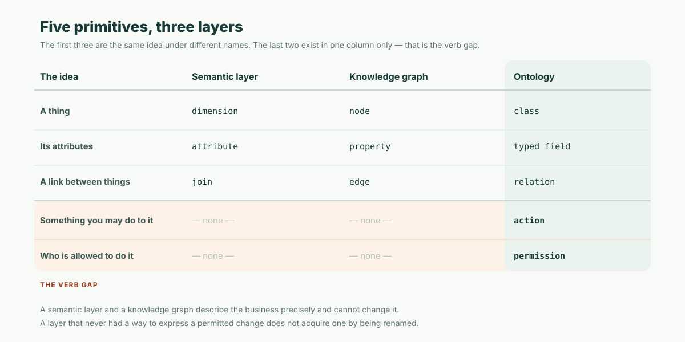

A semantic layer defines what a number means. A knowledge graph stores what connects to what. An ontology defines what things are, what may be done to them, and by whom.

Line up the three vocabularies and the overlap is real: a thing, its attributes, its links appear in all three under different names — class or dimension or node, property or attribute, relation or join or edge. Two primitives appear in exactly one of the three columns. **Actions** and **permissions** exist only in the ontology.

Call that the **verb gap**. A semantic layer and a knowledge graph are both, structurally, noun layers: they can describe a business with great precision and they cannot change it. An ontology is the only one of the three that carries verbs — and therefore the only one that can answer the question an agent reaches the moment it stops summarizing and starts working: *may I do this, as this user?*

This post is definitional. It does not score products, and it takes no position on who should own the layer. It gives you three precise definitions, a table of what each can and cannot answer, an honest defense of the semantic layer, and a three-question test you can run against anything sold to you under any of the three names.

## Definition 1: a semantic layer

**A semantic layer is a governed definition of measures: it fixes what a metric means, which dimensions it may be sliced by, and which physical tables it resolves to, so that every dashboard, query, and agent computes the same number.**

The unit of a semantic layer is the **metric**. `net_revenue` is not a column; it is a definition — gross bookings, minus refunds, minus credits, excluding internal test accounts, recognized on the invoice date. That definition is written once, in one file, and compiled down to SQL against whatever tables actually hold the data.

The problem it exists to solve is disagreement, not ignorance. Two teams both know how to query the warehouse; that is exactly why they produce two different revenue numbers. The semantic layer's contribution is to make one of those numbers impossible to compute by accident.

Its second contribution matters more for agents than for humans: it removes table selection from the caller. An agent asking a semantic layer for "net revenue by region, last quarter" does not choose a join path, and so cannot choose a wrong one. Text-to-SQL against raw tables is a guessing game with a plausible-looking wrong answer as its most common failure. Text-to-metric against a semantic layer is a lookup.

What it does not model: individual records as things with a lifecycle. A semantic layer knows `revenue` sliced by `customer`; it does not know that customer #4417 has an open dispute, and it has no opinion about whether you may write to it.

## Definition 2: a knowledge graph

**A knowledge graph is a store of entities and the typed relationships between them: facts live on nodes, connections live on edges, and the structure exists so you can traverse from one thing to another — including along paths nobody modeled in advance.**

The unit of a knowledge graph is the **edge**. Its distinctive power is multi-hop traversal: this component ships from that plant, which is supplied by this vendor, which also supplies a second component in an unrelated product line — therefore one factory fire threatens two product lines that no report has ever shown side by side.

That question shape is genuinely hard for the other two layers. A semantic layer cannot ask it, because the answer is not a measure. A relational schema can express it, but only by writing the specific join you already suspected; the graph's value is answering the traversal you had not thought to write.

Knowledge graphs are also where the *other* meaning of "ontology" lives, and this is the single most common source of confusion in the whole debate. In the semantic-web tradition, an **ontology** (typically OWL or RDFS) is the *schema* of a knowledge graph: it declares the classes, the property types, the hierarchies, and the logical constraints an automated reasoner can use to infer new triples. That is a real, precise, decades-old meaning of the word — and it is not the meaning enterprise platforms use when they sell "an ontology" today.

The difference is exactly the verb gap. A semantic-web ontology is a vocabulary for describing and inferring. A business ontology, in the sense the current wave means, is a vocabulary for describing *and acting*. Both are correctly called ontologies; only one of them has ever refused a write.

## Definition 3: an ontology (in the business sense)

**A business ontology is a typed model of a domain that declares the classes of thing that exist, the properties each carries, the relations between them, the actions that may be performed on them, and who is permitted to perform each action.**

The unit of a business ontology is the **object**. `Opportunity` is a class with typed fields, a lookup to `Account`, a set of valid state transitions, an action called `apply_discount`, and a permission rule saying a sales representative may apply up to 15% while anything beyond that routes to finance approval.

Notice that the last two clauses of the definition have no counterpart in the other two layers. `apply_discount` is not a metric and not an edge. "A sales rep may do this, a contractor may not" is not a dimension and not a relationship. They are a different kind of statement — a rule about permitted change — and a layer that never had a way to express them cannot acquire one by being renamed.

Here is the same claim in the concrete: an ontology is the only one of the three layers where the following is a well-formed request, rather than a category error.

```
Apply a 20% discount to opportunity OPP-8842, acting as user j.chen.
```

A semantic layer's honest answer is "I compute numbers." A knowledge graph's honest answer is "I store facts about relationships." Only the ontology has somewhere to put both the verb and the identity — and, crucially, somewhere to put **no**: 20% exceeds j.chen's limit, so the correct response is a refusal and an approval request, not a discount.

## The decision table

The fastest way to tell the three apart is to stop comparing architectures and start comparing questions. Each layer terminates a different question shape.

| Question | Semantic layer | Knowledge graph | Ontology |
| --- | --- | --- | --- |
| What was net revenue in EMEA last quarter? | Yes — core job | No | Only via a metric layer |
| Why do two dashboards disagree on "active customer"? | Yes — core job | No | Partly |
| Which suppliers indirectly depend on one plant? | No | Yes — core job | Only pre-modeled paths |
| What is the path between this person and that account? | No | Yes — core job | Only pre-modeled paths |
| What fields does an opportunity have, and which are required? | No | Partly | Yes — core job |
| Apply a 20% discount to this opportunity | No | No | Yes — core job |
| May this user perform that action? | No | No | Yes — core job |
| Who changed this record, when, and under whose approval? | No | Only if modeled as facts | Yes — core job |

Read the bottom three rows as one row. Actions, permissions, and audit are not three separate capabilities that an ontology happens to bundle; they are one capability seen from three sides. A layer that can express "this action exists" must express "who may run it" or the action is unsafe, and must record "who ran it" or the permission is unverifiable.



## The verb gap is the whole distinction

If you remember one thing, make it this: **the difference between the three layers is not how much they know, it is whether they can be held responsible for a change.**

A semantic layer with a superb metric catalogue and a knowledge graph with a hundred million high-quality edges are both, on the day your agent tries to update a record, exactly as useful as a very good encyclopedia. They will tell it everything about the account. They have no opinion whatsoever about whether it may touch it, because "may" was never in the vocabulary.

This is why "we already have a semantic layer, so we are ready for agents" is true for one class of agent and false for another. A read-only analytical agent is genuinely well served. An agent that writes — creates a case, moves a stage, issues a credit, sends a contract — needs a layer where the permitted verbs are declared, and there is no amount of additional metric definition that produces one.

The failure mode when that layer is missing is specific and worth naming, because teams keep rebuilding it: permissions end up in the prompt. "You are a helpful assistant. Do not approve discounts over 15%." That sentence is not an authorization system. It is a suggestion, evaluated by a probabilistic text model, with no record of whether it was followed. The reason the ontology's permission clause matters is not that prompts are bad at rules; it is that a prompt cannot produce an artifact an auditor can read six months later.

## In defense of the semantic layer

Now the correction, because the argument above is routinely overextended into something false.

**For a large class of real work, a semantic layer is the right tool and an ontology would be pure overhead.** This is not a concession; it is the more common case.

If what your organization needs is that finance, sales ops, the board deck, and the AI assistant all produce the same revenue figure, then the metric definition *is* the problem, and it is a hard one. Reconciling four definitions of "active customer" across a decade of accumulated reporting is months of genuine work, and completing it delivers most of the value people vaguely hope an "ontology project" will deliver. Doing it inside a mature semantic layer — with lineage, tests, version control, and a query engine that has been optimized for a decade — is a better engineering decision than modeling the same thing as business objects with actions nobody will ever call.

Three specific points in the semantic layer's favour:

1. **Analytics is most of the demand.** The majority of what enterprises actually ask agents to do today is read-only: summarize, compare, explain a movement, find the outlier. Every one of those is a measure question.
2. **Metric semantics are harder than object semantics.** Modeling `Opportunity` as a class is a morning's work. Defining `net_revenue` so that four departments accept it is a quarter's work, and the semantic-layer ecosystem has spent years building the lineage, testing, and governance tooling that work requires.
3. **An ontology should not re-implement it.** A business ontology that grows its own parallel metric engine is a worse metric engine. The correct architecture, when you have both, is delegation: objects and actions in the ontology, measures resolved by the semantic layer, one number either way.

The honest summary is that these two layers are complements with a clean seam, not rivals. The ontology owns nouns-with-verbs and the rules on them. The semantic layer owns the numbers derived from them. The mistake is not choosing the semantic layer; the mistake is believing that choosing it also answered the permission question.

## Why the 2026 wave blurred the words

The conflation is not simply marketing dishonesty. Four mechanisms produce it, and three of them are structural.

**First, all three name a layer, not a product.** "Semantic layer" describes a position in an architecture — above storage, below consumption. Any product occupying roughly that position can use the word without lying, and products at that position are numerous.

**Second, the overlap is genuine.** As the opening table showed, three of the five primitives really are shared. A vendor claiming "our knowledge graph is an ontology" is describing a partial truth, and partial truths are far more durable in a market than false ones. The claim only breaks at the two primitives nobody thinks to ask about.

**Third, renaming is instant and rebuilding is not.** Adding "for AI agents" to a metrics catalogue ships in an afternoon. Adding a permission model, an action framework, and an audit ledger to a system whose entire data path assumed read-only access is a multi-quarter rewrite. When demand spikes for a word, the supply that arrives first is always the supply that only required a word.

**Fourth — and this is the one buyers can fix — there is no conformance test.** No suite exists that you can run against a system to determine whether it is "an ontology." SQL has a standard. HTTP has one. This layer has none, so the label is a claim rather than a measurement, and every claim in the category is currently self-certified.

Which means you have to run the test yourself. It takes three questions.

## The three-question test

Ask these of any system, in any product category, that has been described to you with any of the three words. The answers are unambiguous and no vendor documentation is required to check them.

1. **Ask for a number without naming a table.** "What was net revenue in EMEA last quarter?" If it answers correctly and consistently without you specifying the join path, there is a real semantic layer underneath. If it generates SQL by guessing at table names, there is not.
2. **Ask for a relationship you did not pre-declare.** "Which of our customers are also suppliers to our suppliers?" If it can traverse a path that no report has ever contained, there is a real graph underneath. If it can only follow links someone specifically modeled for that purpose, there is a schema — which is fine, but it is not a knowledge graph.
3. **Ask it to do something the user is not allowed to do.** This is the decisive one. Sign in as a restricted user, request a privileged action, and then look at *where the refusal came from*. If the layer refused, you have an ontology. If the application in front of it refused, you have an application with permissions and a layer without them — and every other client of that layer, including the next agent someone connects, is unguarded. If nothing refused, the permission model is a prompt.

Question three separates the category. The first two check whether a layer is competent at its own job; the third checks whether it is the layer that can be held accountable.

## Which one your agent actually needs

Route by what the agent is allowed to do, not by what it is called.

- **An agent that answers questions about numbers** needs a semantic layer. An ontology adds nothing it will use. Build the metric definitions; you will need them regardless of what else you build.
- **An agent that investigates, discovers, or explains connections** needs a graph. Fraud rings, supply-chain exposure, entity resolution, "what else is this connected to" — these are traversal problems, and no amount of metric modeling produces a traversal.
- **An agent that changes anything** needs an ontology, and this is not negotiable in the way the first two are. The moment the agent's output is a write rather than a sentence, someone has to be accountable for that write, and accountability requires a layer that declared in advance which verbs exist, who may call them, and where the record goes.
- **Most production deployments need the first and the third.** Read-only assistants graduate into acting assistants, usually about a quarter after launch, and that transition is where projects stall. The pattern that works is an ontology for objects, actions, and permissions, delegating measures to the semantic layer you already built.

The order matters more than the labels. Metric definitions are useful the day you write them and stay useful under any architecture. Ontology modeling pays off only when something acts on it — which is precisely why so many ontology programs stall at the modeling phase and never reach production. If nothing calls the actions, the classes were an expensive way to write documentation.

## When the app is written by an AI

One thing has changed recently enough that most comparisons of these three layers predate it: increasingly, the application on top of this layer is not written by a person.

That shifts the requirement from "can a human model it" to "can an agent author it and a human review the diff." Whatever layer you choose has to be a text artifact — declarative, diffable, version-controlled — because an agent proposing a change to your business rules must produce something a reviewer can read in a pull request and approve or reject. A layer whose definitions live in a proprietary backend can still be excellent; it just cannot participate in that review loop, and the review loop is what makes AI-written business software signable.

This is the case for an **open business ontology**: the classes, relations, actions, and permission rules written as files in your own repository, in a format any model can read and any runtime can execute. ObjectStack is one implementation of that idea — object definitions, permission sets, and flows in version control; a runtime that derives the database, the API, the UI, and the agent tools from them and enforces permissions and audit on every call. The comparison in this post holds whether or not you ever use it.

The ownership question underneath — who should hold that definition, and what happens when it fragments across platforms — is a separate argument, made in [Open vs. Closed Enterprise Ontologies](/en/blog/enterprise-ontology-race-open-vs-closed/) and [Why the Definition and Runtime Should Be Open](/en/blog/ai-ontology-open-protocol/). This post deliberately stops before it, because the definitional question comes first: you cannot argue about who should own the layer until you can say which layer you mean.

## The short version, restated

- A **semantic layer** defines measures. Ask it what a number means.
- A **knowledge graph** stores entities and edges. Ask it what connects to what.
- An **ontology** defines classes, properties, relations, **actions**, and **permissions**. Ask it what may be done, and by whom.
- The first three primitives are shared. The last two are not, and that is the verb gap.
- A semantic layer is the right and sufficient answer for analytics — genuinely, and more often than the ontology conversation admits.
- The moment your agent writes rather than reads, only one of the three layers can refuse it.

If you want to check where the boundary falls in your own stack, run question three from the test above this week. It takes one restricted account and one privileged request, and the answer tells you which of the three layers you actually have — whatever the contract calls it.
