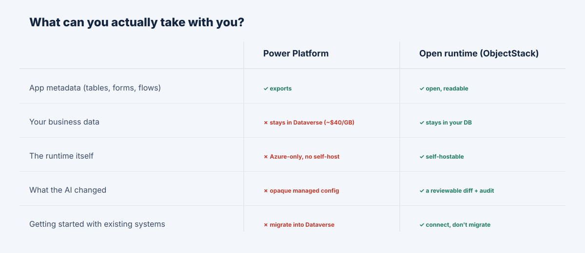

**TL;DR:** Power Platform's advantage is gravity: it is already in your Microsoft tenant, on one identity and one invoice. Two structural facts decide the hard cases anyway. First, cost can become a **success tax** because per-user, storage, and AI usage line items scale with adoption. Second, there is an **exit asymmetry**: it is easy to enter because everything is already there, and expensive to leave because a solution export carries the app's *shape* but not the full operational system, while the runtime remains Microsoft's cloud runtime. For a sovereignty or cost-at-scale buyer, those facts can decide the platform before any feature comparison.

The honest starting point is that the gravity is real and rational. If your company runs on Microsoft 365, the platform is *right there*: one Entra identity, native hooks into Teams, SharePoint, and Dynamics, one invoice, one support relationship. For a Microsoft-standardized organization, choosing it is often the correct call, and this article is not going to pretend otherwise.

It is going to do two things the demo rarely does: put a number on what "it is basically free, it is already in the tenant" becomes at scale, and show what happens the day you try to leave.

## The Success Tax: a Worked Model

Here is a concrete deployment, with every assumption stated so you can rerun it with your own. Five hundred users, a handful of apps, and one customer-facing agent. List prices, no enterprise discount:

| Line item | Assumption | Annual cost (list) |
| --- | --- | --- |
| Power Apps Premium | 500 users × $20/user/mo | $120,000 |
| Dataverse storage | 50 GB beyond included × ~$40/GB/mo | $24,000 |
| Copilot Studio agent | 2,000 grounded msgs/day × ~10 credits × $0.01 | ~$72,000 |
| **Total** | | **~$216,000 / yr** |

Now read the *shape* of that table, which matters more than the exact total. Every line is **per-unit and scales with success**: more people using the apps, more records accumulating, more questions asked of the agent. Double the adoption and you roughly double the bill. The platform that was cheap as a pilot can become most expensive precisely when it is working. That is the **success tax**, and it is structural.

Two caveats in both directions. Your real number may be lower per unit because volume and Enterprise Agreement discounts are real. It may also be higher in ways the table omits: premium-connector scenarios, additional capacity, Power Automate flows, and AI usage above the assumed volume. The point is not the exact dollar figure; it is that a self-hosted runtime's marginal cost for one more user, one more GB, or one more agent call is *your own infrastructure*, while Power Platform pricing is metered across several dimensions.

## The Exit Asymmetry

The second fact is the one that turns a cost problem into a migration problem. Power Platform "solutions" export, which sounds like portability. Read precisely what crosses the boundary:

> A solution export carries your **metadata** — tables, forms, flows, app definitions — but **not the data in your tables.**

So you can take much of the *shape* of your apps, but the *contents* are a separate data migration. Your business data lives in **Dataverse** if you adopted Dataverse as the system of record, and you pay ongoing storage to keep it there. The runtime itself, the thing that executes the apps, is a Microsoft cloud runtime rather than a self-hosted runtime you can move into your own environment. Leaving is therefore not a download; it is a re-platforming project: rebuild the app logic somewhere that can run it, export and reload Dataverse data, and reconstruct the integrations.

That is the asymmetry, stated plainly: **easy in, because everything is already there; hard out, because everything is now in there.** The same gravity that makes adoption frictionless is what makes exit a project, and you do not feel it until the day you have a reason to leave.

## The Trigger With No Easy Workaround: Sovereignty

For one class of buyer, the cost model and the exit asymmetry are beside the point, because deployment requirements decide the evaluation: **Power Platform is a Microsoft cloud platform, not a self-hosted runtime you can run anywhere.** If you are a bank under residency rules, a defense or government workload that must be air-gapped, or a healthcare system with sovereignty requirements, you may not be able to put the *runtime* where your regulators require it. Everything else in this article is a trade-off; this one may be a hard requirement.

## The Rebuttal, Met Honestly: "The Gravity Is Worth It"

The strongest case for Power Platform is real and should be stated at full strength: *it is already in our tenant, it shares our identity and our invoice, it integrates natively with the Microsoft tools our people already live in, and consolidating on one vendor is worth a lot.* For many organizations that is simply true, and the lock-in is a trade they are rational to accept.

That case fails only on three triggers — and the discipline is to check whether any apply to *you*, not to argue the general case:

1. **Sovereignty** — you must self-host. No workaround exists; this alone decides it.
2. **Cost at scale** — your usage is large or growing fast enough that the success tax compounds past what owning a runtime would cost.
3. **Governing AI changes** — you need the changes Copilot makes to your apps to be reviewable diffs on a runtime you control, not opaque managed-solution config you can only inspect after the fact.

If none of the three apply, Microsoft's gravity is hard to beat and you should probably let it win. If even one applies, no amount of in-tenant convenience addresses it, because each is a property of *where the runtime lives and what it costs to grow*, not a feature Power Platform can ship.

## Where Power Platform Is the Right Call

To keep this honest: if you are all-in on Microsoft, your data already lives in the Microsoft cloud, you have no sovereignty requirement, and you value vendor consolidation, Power Platform is an excellent, rational choice. The lock-in may never cost you anything you care about. Plenty of internal apps never need to leave the tenant.

And the alternative is not free. Self-hosting a runtime means *you* run it: patching, scaling, backups, and the operational weight Microsoft otherwise carries for you. That is a real cost, and for a small team with no sovereignty need it can outweigh the success tax entirely. We will not pretend owning the runtime is strictly better. It is better *for the buyer who has one of the three triggers*, and overhead for the one who has none.

## ObjectStack's Position

ObjectStack is built for the buyer with a trigger. It is **self-hostable**, so the runtime can live where your data and regulators require. It **connects to the CRM, ERP, and databases you already run** instead of making you migrate your business into Dataverse first. The app core is **open, readable metadata**, so a Copilot-style AI change is a **reviewable diff a human approves before it ships**, not opaque managed configuration. And because you own the runtime, AI productivity is tied to your infrastructure rather than only to a per-message meter.

We will not match Microsoft's in-tenant convenience for an organization that is already all-in; that gravity is real. The claim is narrow and only for the buyer it fits: when sovereignty, cost at scale, or governing what the AI changed is on the line, your apps, your data, and the runtime that enforces their rules should be things you *own and can read*, not things you rent and cannot take with you.
