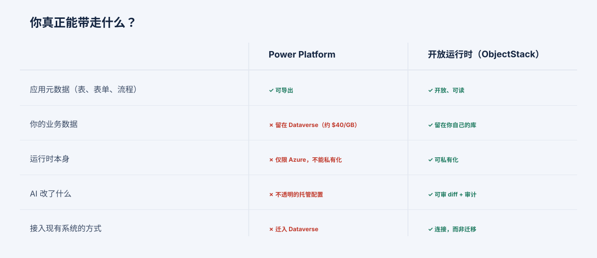

---
# @generated zh-Hant from zh-Hans (s2twp) — edit the zh-Hans file; delete this line to hand-maintain.
title: "Power Platform 的鎖定：僅限 Azure、無法自託管、你的資料被扣在 Dataverse"
description: "Power Platform 的引力是真實的——它早已在你的租戶裡。但你無法自託管它，一次匯出帶走的是後設資料而非你的資料，AI 生成的應用變成不透明的託管配置。對追求主權的買家來說，這就足以定論。"
author: ObjectStack Team
date: 2026-06-24
status: published
topic: governance
audience: it
solutions: []
industries: []
cover: ./cover.svg
tags:
  - Power Platform
  - Power Apps
  - Dataverse
  - 自託管
  - 資料主權
---

**TL;DR：** Power Platform 的優勢是引力——它早已在你的 Microsoft 租戶裡，共用一套身份、一張賬單。但無論如何，有兩個結構性事實會決定那些棘手的場景。第一，成本是一種**成功稅**：每個費用項（按使用者、按 Dataverse 的 GB、按 AI 訊息）都隨採用而擴張，因此賬單恰恰在應用奏效時增長得最快。一個現實的 500 使用者部署、配一個落地（grounded）智慧體，按定價建模約為**每年 21.6 萬美元**，並隨使用上升。第二，存在一種**退出的不對稱性**：進入毫無摩擦，因為一切都已就位；退出卻昂貴，因為一次解決方案匯出帶走的是應用的*形狀*而非你的*資料*，而執行時根本無法離開 Azure。對一個追求主權或在意規模化成本的買家來說，這兩個事實在任何功能比較之前就已決定了平臺。

誠實的起點是：這種引力真實且合理。Power Platform 報告約 5,600 萬月活躍使用者；Microsoft 稱財富 500 強中 80% 以上已用 Copilot Studio 構建了智慧體。如果你的公司執行在 Microsoft 365 上，平臺*就在那兒*——一個 Entra 身份、與 Teams、SharePoint 和 Dynamics 的原生掛鉤、一張賬單、一份支援關係。對一個以 Microsoft 為標準的機構來說，選它往往是正確的決定，本文也不會假裝並非如此。

本文要做兩件演示從不做的事：給"它基本免費、它早已在租戶裡"在規模化後會變成什麼標上一個數字，並展示你試圖離開那天會發生什麼。

## 成功稅：一個詳盡的測算模型

這裡有一個具體的部署，每條假設都已寫明，方便你用自己的數字重新測算。五百名使用者、若干應用，以及一個面向客戶的智慧體。定價，無企業折扣：

| 費用項 | 假設 | 年成本（定價） |
| --- | --- | --- |
| Power Apps Premium | 500 使用者 × $20/user/mo | $120,000 |
| Dataverse 儲存 | 超出包含量的 50 GB × ~$40/GB/mo | $24,000 |
| Copilot Studio 智慧體 | 每天 2,000 條落地訊息 × ~10 credits × $0.01 | ~$72,000 |
| **合計** | | **~$216,000 / 年** |

現在請讀這張表的*形狀*，它比合計數更重要。每一行都是**按單位計費、隨成功而擴張**：用應用的人更多（按使用者）、累積的記錄更多（按 GB）、向智慧體提的問題更多（按訊息，而且 RAG 落地每次約 10 個積分，是貴的那種）。採用翻倍，賬單大致翻倍。在試點階段便宜的平臺，恰恰在它奏效時變得最貴——這就是**成功稅**，它是結構性的，不是一個你能退訂的價格檔位。

兩個方向上各有兩點補充。你的實際數字按單位會更低（批次折扣和企業協議折扣都真實存在）——在表所省略之處也會更高（高階聯結器場景、額外容量、Power Automate 流，以及那個**已於 2026 年 1 月 2 日對新客戶停售**、把他們推向 $20 檔或按量付費的每應用 $5 套餐）。要點不在於精確的美元數字；而在於：一個自託管執行時多服務一名使用者、多一個 GB、多一次智慧體呼叫的邊際成本，是*你自己的基礎設施*——大致持平——而 Power Platform 的邊際成本是一塊隨每一單位成功而跳動的計價表。

## 退出的不對稱性

第二個事實，正是把成本問題變成陷阱的那一個。Power Platform 的"解決方案"可以匯出，這聽起來像可移植性。請精確地讀清楚什麼越過了邊界：

> 一次解決方案匯出帶走的是你的**後設資料**——表、表單、流、應用定義——但**不包括你表中的資料。**

所以你能帶走應用的*形狀*，卻必須把*內容*留下。你的業務資料存在 **Dataverse** 裡；你一開始把它遷入，併為把它留在那裡持續支付儲存費。而執行時本身——執行應用的那個東西——是**僅限 Azure、沒有自託管選項，且 Microsoft 已表明不會提供。** 因此離開不是一次下載；它是一個重新平臺化專案：在一個能執行它的地方重建應用邏輯、匯出並重新載入每一張 Dataverse 表、重新搭建整合。

這就是那種不對稱性，直白地說：**進來容易，因為一切都已在那裡；出去難，因為一切如今都在裡頭了。** 讓採用毫無摩擦的同一種引力，正是把退出變成專案的那種引力——而你感覺不到它，直到你有理由離開的那天，到那時應用已是 200 人在用的系統。

## 沒有變通辦法的觸發條件：主權

對某一類買家來說，成本模型和退出的不對稱性都不在重點，因為單一一個事實就終結了評估：**不存在自託管、本地部署或氣隙隔離的 Power Platform。** 如果你是受居留規則約束的銀行、必須氣隙隔離的國防或政府工作負載，或有主權要求的醫療系統，你無法把*執行時*放到監管機構要求的地方——出多少錢都不行，路線圖上也沒有。本文其餘的一切都是權衡取捨；這一條是一堵牆。

## 誠實回應的反駁：“引力值得”

支援 Power Platform 的最強論點是真實的，你應當以其全部分量陳述它：*它早已在我們的租戶裡，共用我們的身份和賬單，與我們的人本就生活其中的 Microsoft 工具原生整合，集約到單一供應商價值不菲。* 對極多組織而言這就是事實，而鎖定是一樁它們接受得合情合理的交易。

這個論點只在三個觸發條件下失效——而紀律在於核查是否有任何一條適用於*你*，而非去爭論一般情形：

1. **主權**——你必須自託管。不存在變通辦法；僅此一條就足以定論。
2. **規模化成本**——你的用量很大或增長足夠快，以至於成功稅累積到超過自有一個執行時的成本。
3. **治理 AI 的改動**——你需要 Copilot 對你應用所做的改動，是你所控制的執行時上可審閱的差異，而不是隻能事後檢查的不透明託管解決方案配置。

如果三條都不適用，Microsoft 的引力難以匹敵，你大概應該讓它贏。如果哪怕一條適用，再多的租戶內便利也無法解決它，因為每一條都是關於*執行時棲身何處、增長要付出什麼*的屬性，而不是 Power Platform 能交付的某項功能。

## Power Platform 是正確選擇之處——以及替代方案的代價

為保持誠實：如果你全面押注 Microsoft、資料已存於 Microsoft 雲中、沒有主權要求，且看重"一個供應商一併擔責"的集約，那麼 Power Platform 是一個出色而合理的選擇，鎖定也許永遠不會讓你付出任何你在意的代價。許多內部應用從不需要離開租戶。

而替代方案並非免費。自託管一個執行時意味著*由你*來運維它——打補丁、擴縮容、備份，這些 Microsoft 本來替你承擔的運維重量。那是真實的成本，對一個沒有主權需求的小團隊來說，它可能完全蓋過成功稅。我們不會假裝擁有執行時一概更好；它對*有三個觸發條件之一的買家*更好，而對一個都沒有的人則是額外負擔。

## ObjectStack 的立場

ObjectStack 是為有觸發條件的買家而構建的。它**可自託管**——執行時棲身於你的資料和監管機構要求的地方，而這正是 Power Platform 在結構上無法提供的那一件事。它**連線你已在執行的 CRM/ERP/資料庫**，而不是逼你把業務遷入 Dataverse、再按 GB 租回，因此沒有人質，也沒有為了離開而做的重新平臺化專案。應用核心是**開放、可讀的後設資料**，因此一次 Copilot 式的 AI 改動是**一份在上線前由人類批准的可審閱差異**，而非不透明的託管配置。而且因為你擁有執行時，AI 生產力不再是一塊按訊息計價的表——更多成功的邊際成本是你的基礎設施，而不是一項稅。

對於一個已經全面押注的機構，我們不會去匹敵 Microsoft 的租戶內便利；那種引力是真實的，揮手將其抹去就是在說謊。這個主張是狹窄的，只面向與之契合的買家：當主權、規模化成本，或治理 AI 改動了什麼這件事處於關鍵位置時，你的應用、你的資料，以及執行其規則的執行時，應當是你*擁有且能讀*的東西——而不是你租來、帶不走的東西。
