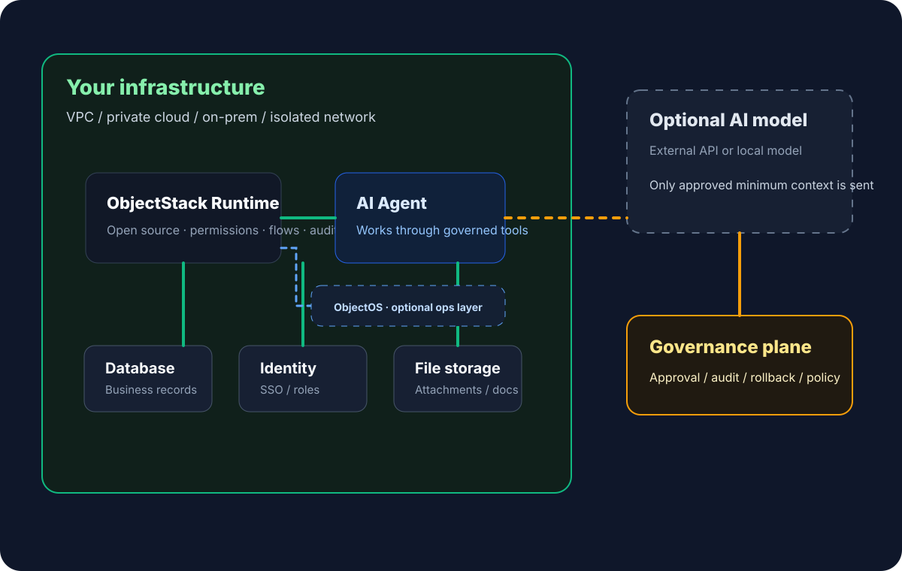

**En resumen:** lo primero que deberías alojar tú mismo no es necesariamente el modelo, sino el runtime que contiene objetos, permisos, herramientas, aprobaciones y auditoría. Los modelos pueden venir de fuera; la capa que decide quién puede leer qué, hacer qué y qué evidencia se conserva pertenece a tu propia infraestructura.

Al adoptar AI, es fácil mirar primero el modelo: ventana de contexto, razonamiento, latencia y velocidad.

Pero cuando la AI empieza a leer clientes, pedidos, contratos, tickets, aprobaciones y archivos internos, importan más otras preguntas:

> ¿Dónde corren esos datos? ¿Quién accede? ¿Dónde quedan los logs? ¿Quién controla las claves? ¿Quién puede detener el sistema?

Por eso importan las plataformas de aplicaciones AI self-hosted.

Lo primero que debe alojarse bajo control propio no siempre es el modelo. Es el runtime de aplicaciones AI.

Los modelos pueden ser externos o locales. El runtime que contiene objetos de negocio, permisos, workflows, herramientas de agente y auditoría debería ejecutarse en infraestructura controlada por la empresa. El modelo razona; el runtime decide qué se lee, qué se ejecuta, qué requiere aprobación y qué evidencia se conserva.

## Self-hosted es más que instalar software

Lo importante no es solo tener un instalador o despliegue privado. Es el límite de responsabilidad:

- los registros de negocio permanecen en tu base de datos;
- los archivos permanecen en tu almacenamiento;
- identidad y permisos vienen de tu SSO, organización y roles;
- los logs de auditoría van a tus sistemas de compliance;
- claves, red, copias y políticas de acceso quedan bajo tu control;
- las conexiones a modelos externos se configuran y aprueban explícitamente.

Si una plataforma exige subir todo contexto de negocio a la nube del proveedor, IT tendrá dificultades para explicar residencia de datos, auditoría, cumplimiento y coste de salida.

Self-hosted no significa rechazar la nube ni los modelos externos. Significa conservar el control final.

## Runtime, modelo local y SaaS privado no son lo mismo

**Runtime self-hosted**: objetos, permisos, workflows, herramientas, aprobaciones y auditoría corren en infraestructura empresarial.

**Modelo local**: pesos o inferencia corren dentro de la empresa por aislamiento, coste, latencia o cumplimiento.

**SaaS privado**: el proveedor crea un entorno dedicado, pero operación, logs, actualizaciones y procesamiento siguen bajo su control.

Lo primero es verificar el límite del runtime: ¿los datos entran primero en tu capa de objetos?, ¿los agentes heredan tus permisos?, ¿la auditoría cae en tus logs?

Si el runtime está fuera de tu control, incluso un modelo local puede saltarse permisos de negocio. Si el runtime está bajo tu control, incluso una API externa puede recibir solo contexto mínimo aprobado.

## Las aplicaciones AI necesitan límites más fuertes que SaaS normal

Un SaaS normal gestiona datos de una aplicación. Una plataforma AI conecta muchos sistemas: CRM, ERP, tickets, contratos, archivos e identidad.

Cuando los agentes consultan y actúan entre sistemas, la plataforma se vuelve una capa operativa del negocio.

Si esa capa corre completamente fuera de la empresa, es difícil explicar flujos de datos, heredar permisos, auditar agentes, cumplir aislamiento o mantener continuidad si cambia el proveedor.

La pregunta real no es si la AI puede conectarse a sistemas de negocio. Es si el límite operativo sigue bajo control empresarial después de conectarla.

## Qué debe controlar el runtime

| Capacidad | Por qué debe estar en el runtime |
| --- | --- |
| Capa de objetos | Modelar clientes, pedidos, tickets, contratos y equipos como objetos gobernados. |
| Capa de permisos | Heredar identidad, roles, acceso a registros y permisos de campo. |
| Capa de herramientas | Exponer consultas, acciones y workflows como herramientas controladas. |
| Capa de aprobación | Enviar acciones riesgosas a revisión humana. |
| Capa de auditoría | Registrar lecturas, recomendaciones, llamadas, aprobaciones y cambios. |
| Capa de integración | Conectar bases, ERP, CRM, identidad y archivos sin perder control de red y claves. |

Así la AI se acerca a sistemas reales sin saltarse la gobernanza.

## Los modelos externos siguen siendo posibles

Self-hosted no significa “solo modelos locales”. Se pueden usar APIs externas, modelos en nube privada, modelos locales o combinaciones.

Lo clave es que el modelo no conecte directamente a la base de datos ni tenga credenciales de sistemas de negocio. Debe recibir solo el contexto mínimo aprobado a través del ObjectStack Runtime open source. ObjectOS es la plataforma comercial de producción y experiencia operativa opcional para la misma aplicación ObjectStack; no sustituye ese límite del runtime.

Si un usuario pide resumir tickets abiertos de un cliente en los últimos 90 días, el runtime verifica permisos, consulta objetos y campos permitidos, oculta datos sensibles y envía solo lo necesario al modelo. La ejecución vuelve por permisos, aprobación y auditoría.

## Self-hosted también implica responsabilidad operativa

La empresa debe operar despliegues, actualizaciones, aislamiento de red, copias, identidad, claves, disponibilidad, capacidad, seguridad, vulnerabilidades y auditoría interna.

Por eso una plataforma self-hosted debe ser clara. No debe trasladar complejidad sin estructura; debe hacer explícitos objetos, permisos, flujos, logs e integraciones.

Self-hosted no compra comodidad. Compra control.

## Cuándo se vuelve necesario

Suele ser necesario cuando los datos no pueden salir de una región, VPC o red local; contratos limitan alojamiento o uso por terceros; se conectan ERP, bases o archivos internos; se exige auditoría completa; se reutiliza identidad interna; se requieren modelos locales o redes aisladas; o la AI ejecuta acciones reales de negocio.

Cuanto más cerca esté la AI de la operación, más claro debe ser el límite de despliegue.

## Preguntas para proveedores

1. ¿Dónde se guardan los datos por defecto?
2. ¿El agente hereda identidad y permisos empresariales?
3. ¿Hay permisos de objeto, registro, campo y acción?
4. ¿El modelo accede directo a bases o solo a herramientas gobernadas?
5. ¿Qué contexto se envía a APIs externas y puede minimizarse?
6. ¿Las acciones riesgosas tienen aprobación, reversión y parada automática?
7. ¿Lecturas, recomendaciones, llamadas y escrituras entran en auditoría empresarial?
8. ¿Las apps centrales siguen funcionando con red aislada o caída del proveedor?

Si las respuestas son vagas, quizá sea una capa de demo AI, no una capa empresarial de producción.

## ObjectStack Runtime y la capa operativa ObjectOS opcional

El ObjectStack Runtime open source no empieza moviendo datos empresariales a una nueva nube.

Funciona como una capa operativa autoalojada en infraestructura empresarial: conecta sistemas existentes, los modela como objetos y unifica permisos, workflows, API, auditoría y herramientas de agente.

ObjectOS es la plataforma comercial de producción y experiencia operativa opcional para la misma aplicación ObjectStack. Añade construcción AI en el navegador, despliegue, soporte y operación sin cambiar la definición abierta ni el ObjectStack Runtime subyacentes.

Datos, identidad, archivos y evidencia de auditoría siguen bajo control empresarial. La AI puede consultar y actuar mediante herramientas gobernadas, pero no saltarse el límite del runtime.
