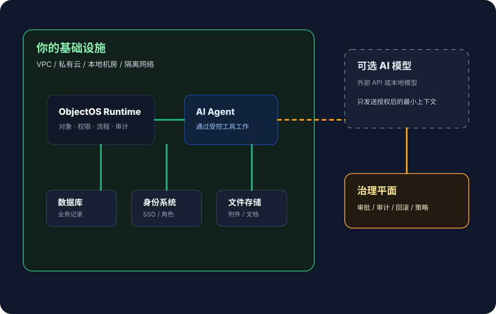

Lorsqu’une entreprise adopte l’AI, elle regarde souvent d’abord le modèle : contexte, raisonnement, latence, vitesse.

Mais quand l’AI lit clients, commandes, contrats, tickets, validations et fichiers internes, d’autres questions deviennent plus importantes :

> Où tournent ces données ? Qui y accède ? Où vont les logs ? Qui contrôle les clés ? Qui peut arrêter le système ?

C’est pourquoi les plateformes d’applications AI auto-hébergées comptent.

Le premier élément à auto-héberger n’est pas toujours le modèle. C’est le runtime applicatif AI.

Les modèles peuvent être externes ou locaux. Le runtime qui porte objets métier, permissions, workflows, outils d’agent et preuves d’audit doit tourner dans l’infrastructure contrôlée par l’entreprise. Le modèle raisonne ; le runtime décide ce qui peut être lu, exécuté, validé et conservé.

## Auto-hébergé ne veut pas seulement dire installé

L’important n’est pas seulement l’installation ou le déploiement privé. C’est la limite de responsabilité :

- les données métier restent dans vos bases ;
- les fichiers restent dans votre stockage ;
- identité et permissions viennent de votre SSO, organisation et rôles ;
- les logs d’audit vont dans vos systèmes ;
- clés, réseau, sauvegardes et politiques d’accès restent sous votre contrôle ;
- les connexions aux modèles externes sont configurées et validées explicitement.

Si une plateforme oblige à envoyer tout le contexte métier vers le cloud fournisseur, il devient difficile d’expliquer résidence des données, audit, conformité et coût de sortie.

L’auto-hébergement ne rejette pas le cloud ou les modèles externes. Il conserve le contrôle final.

## Runtime, modèle local et SaaS privé sont différents

**Runtime auto-hébergé** : objets, permissions, workflows, outils, validations et audit tournent dans l’infrastructure de l’entreprise.

**Modèle local** : le modèle ou l’inférence tourne en interne pour isolation, coût, latence ou conformité.

**SaaS privé** : le fournisseur crée un environnement dédié, mais garde opération, logs, mises à jour et traitement des données.

La première vérification porte sur le runtime : les données passent-elles par votre couche d’objets, les agents héritent-ils de vos permissions, l’audit arrive-t-il dans vos logs ?

Si le runtime est hors de votre contrôle, même un modèle local peut contourner les permissions métier. Si le runtime est sous votre contrôle, une API de modèle externe peut recevoir seulement un contexte minimal approuvé.

## Les applications AI exigent des limites plus fortes que le SaaS classique

Un SaaS classique gère souvent les données d’une seule application. Une plateforme AI relie CRM, ERP, tickets, contrats, fichiers et identité.

Quand les agents lisent et agissent entre systèmes, la plateforme devient une couche opérationnelle métier.

Si cette couche est entièrement externe, il devient difficile d’expliquer les flux de données, d’hériter des permissions, d’auditer les agents, de respecter l’isolation réseau ou d’assurer la continuité.

La vraie question n’est pas de savoir si l’AI peut se connecter aux systèmes métier. C’est de savoir si la frontière opérationnelle reste contrôlée par l’entreprise.

## Ce que le runtime doit porter

| Capacité | Pourquoi elle appartient au runtime |
| --- | --- |
| Couche d’objets métier | Modéliser clients, commandes, tickets, contrats et équipements comme objets gouvernés. |
| Couche de permissions | Hériter identité, rôles, accès aux enregistrements et permissions de champ. |
| Couche d’outils | Exposer requêtes, actions et workflows comme outils contrôlés. |
| Couche de validation | Envoyer les actions risquées à validation humaine. |
| Couche d’audit | Journaliser lectures, recommandations, appels, validations et changements. |
| Couche d’intégration | Connecter bases, ERP, CRM, identité et fichiers en gardant le contrôle réseau et clés. |

Ainsi l’AI peut approcher les systèmes réels sans contourner la gouvernance.

## Les modèles externes restent possibles

Auto-hébergé ne signifie pas “modèles locaux seulement”. On peut utiliser API externes, modèles privés cloud, modèles locaux ou combinaisons.

L’essentiel est que le modèle ne se connecte pas directement aux bases et ne possède pas les identifiants métier. Il reçoit seulement le contexte minimal approuvé via un runtime comme ObjectOS.

Si un utilisateur demande un résumé des tickets ouverts d’un client sur 90 jours, le runtime vérifie l’accès, applique permissions d’objet et de champ, masque les données sensibles et envoie seulement le nécessaire au modèle. L’exécution revient ensuite par permissions, validation et audit.

## Auto-hébergé signifie aussi responsabilité opérationnelle

L’entreprise gère déploiements, mises à jour, isolation réseau, sauvegardes, identité, clés, disponibilité, capacité, sécurité, vulnérabilités et audits internes.

Une plateforme auto-hébergée doit donc être claire. Elle ne doit pas transférer de la complexité sans structure ; elle doit expliciter objets, permissions, workflows, logs et intégrations.

L’auto-hébergement n’achète pas la facilité. Il achète le contrôle.

## Quand cela devient nécessaire

C’est souvent nécessaire lorsque les données ne peuvent pas quitter une région, un VPC ou un réseau local ; les contrats limitent l’hébergement tiers ; des ERP, bases ou fichiers internes doivent être connectés ; l’audit complet est exigé ; l’identité interne doit être réutilisée ; des modèles locaux ou réseaux isolés sont requis ; ou l’AI déclenche de vraies actions métier.

Plus l’AI se rapproche des opérations, plus la limite de déploiement doit être claire.

## Questions à poser aux fournisseurs

1. Où les données métier sont-elles stockées par défaut ?
2. L’agent hérite-t-il identité et permissions d’entreprise ?
3. Les permissions objet, enregistrement, champ et action existent-elles ?
4. Le modèle accède-t-il directement aux bases ou seulement aux outils gouvernés ?
5. Quel contexte part vers les API de modèles externes et peut-il être minimisé ?
6. Les actions risquées ont-elles validation, retour arrière et arrêt automatique ?
7. Les lectures, recommandations, appels et écritures entrent-ils dans l’audit interne ?
8. Les applications métier continuent-elles en réseau isolé ou en indisponibilité fournisseur ?

Si les réponses sont floues, la plateforme est peut-être encore une couche de démonstration AI.

## La direction d’ObjectOS

ObjectOS ne commence pas par déplacer les données vers un nouveau cloud.

Il agit comme une couche opérationnelle dans l’infrastructure de l’entreprise : connecter les systèmes existants, les modéliser comme objets, unifier permissions, workflows, API, audit et outils d’agent.

Données, identité, fichiers et preuves d’audit restent sous contrôle de l’entreprise. L’AI peut lire et agir via des outils gouvernés, mais ne peut pas contourner la frontière du runtime.
