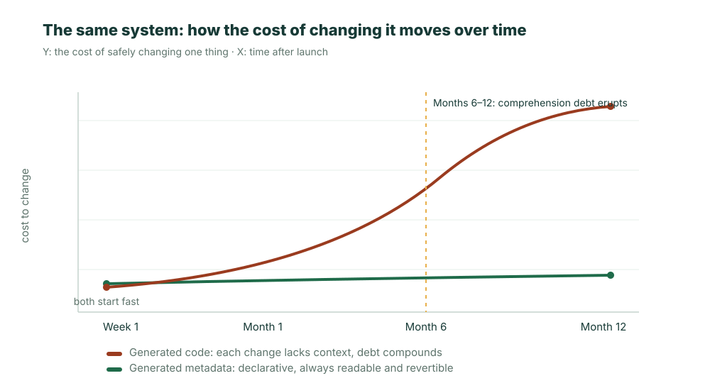

이야기는 일곱 번째 달에서 시작한다.

밍샹(明享)은 점포 수백 개를 둔 체인 리테일 회사다. 작년에 이 회사의 재무 팀(50여 명)은 IT 일정 대기에 진절머리가 나, AI에게 '한마디로' 경비 정산 시스템을 만들게 했다. 입력 양식, 결재, 총계정원장 연동까지 이틀 만에 돌아갔고 전원이 환호했다. 이후 반년 넘게 그것은 줄곧 잘 돌아갔다.

일곱 번째 달, 세무 규칙이 바뀌었다. 어떤 종류의 영수증의 공제 비율이 조정되어, 정산 로직도 따라 바꿔야 했다. 사소한 일이었다.

그러자 팀은 아무도 그것을 건드리지 못한다는 사실을 깨달았다. 그 '한마디' 뒤에는 AI가 생성한 1만 2천 줄 넘는 코드가 있었고, **그것을 통째로 읽어 본 사람은 단 한 명도 없었다.** 공제 로직은 어느 파일들에 흩어져 있나? 고치면 결재와 월말 대사에도 연쇄적으로 영향을 주지 않을까? 누구도 분명히 말하지 못했다. 더 난처한 것은 — 이 코드를 써낸 AI조차 도움이 되지 못한다는 점이었다. 그것은 무상태(stateless)다. 당시 생성하던 순간 머릿속에 있던 판단, 트레이드오프, 왜 이렇게 썼는지가 하나도 남아 있지 않다. 당신은 1만 2천 줄을 새 세션에 다시 먹여 넣고, 당시의 자신을 '추측'하게 만드는 수밖에 없다.

이 사소한 일은 결국 3주가 걸렸다. 그리고 진짜 대가는 3주에 그치지 않았다. 출시 전 리뷰에서, 누군가 AI가 슬쩍 공제와 무관한 대사 로직 한 군데를 건드렸음을 발견했다 — 하마터면 한 무더기의 정산이 금액을 잘못 계산해 총계정원장으로 흘러들 뻔했다. 이번에는 운 좋게 막혔지만, 그것은 한 가지를 말해 준다. **이 시스템은 이미 'A를 고쳐도 B는 건드리지 않는다'를 보장할 사람이 아무도 없다.**

이것이 많은 사람이 일찌감치 '**기술 부채의 해**'라고 이름 붙인 2026년이, 평범한 한 팀에게 떨어질 때의 모습이다.

## 이것은 특수한 부채다: 빚을 졌는데 채권자를 찾을 수 없다

기술 부채는 새 단어가 아니다. 하지만 AI가 생성한 코드가 진 빚은 이전에 없던 종류다.

사람이 쓴 코드도 엉성할 수 있고 문서가 없을 수 있다. 하지만 적어도 **저자가 아직 있다.** 그것을 쓴 사람을 불러와 "여기를 당시에 왜 이렇게 처리했나"라고 물어볼 수 있다. 코드가 아무리 나빠도 그 뒤에는 그것을 설명할 수 있는 사람의 두뇌가 늘 있다.

AI가 생성한 코드는 이 마지막 안전망마저 빼앗아 갔다. 그 '저자'는 무상태 모델이며, 생성을 마친 그 순간 더는 존재하지 않는다. 그것은 추론 과정을 남기지 않았다. 남길 '과정'이라는 것이 애초에 없기 때문이다. 그래서 당신 손에 들린 것은 **돌아가지만, 누구도 설명할 수 없고, 물어볼 사람도 없는** 한 덩어리의 구현이다. 밍샹의 그 1만 2천 줄이 바로 이런 부채다. 그것은 코드 품질에 진 빚이 아니라 '더 이상 아무도 그것을 진짜로 이해하지 못한다'에 진 빚이다.

업계의 데이터는 바로 이 메커니즘의 거시적 투영이다. 2026년 초까지 개발자의 85%가 이미 AI로 큰 덩어리의 코드를 생성하고 있다. Veracode는 100여 개 모델에 대한 테스트에서 **생성 코드의 45%가 OWASP Top 10에 적중**한다는 결과를 냈고, 여러 연구가 **손으로 쓴 것의 약 2.74배 취약점 비율**을 제시한다. 어떤 팀은 AI 보조 도입 후 커밋 속도가 3~4배로 뛰고, 월간 보안 경보가 반년 만에 약 1,000건에서 1만 건 이상으로 폭증한 것을 기록했다. 속도는 진짜다. 부채도 진짜다. 다만 부채는 인도하는 날 결산되지 않고, 일곱 번째 달에 찾아온다.

## 그런데 코드 생성은 빠르게 좋아지고 있지 않나?

여기서 반론 하나를 진지하게 받아야 공정하다. 모델은 계속 강해지고 있고, 읽을 수 있는 코드도 점점 길어지며, AI 코드 리뷰와 '자가 치유' 파이프라인도 있다 — 한 해만 더 지나면 이런 부채는 더 강한 도구가 자동으로 갚아 주지 않을까?

이 기대에는 그 나름의 일리가 있지만, 병목이 어디인지를 잘못 짚었다.

코드 생성의 진보가 푸는 것은 '**더 빨리 쓰기**'다. 그런데 밍샹의 문제는 애초에 충분히 빨리 쓰지 못한 것이 아니었다 — 오히려 정반대로, 너무 빨리 썼다. 이틀에 시스템 한 세트, 사람의 3~4배 속도로 변경이 쏟아져 나왔다. 병목은 '**읽어 낼 수 있고, 책임질 수 있다**'는 쪽에 있고, 그것은 생성 능력에 선형으로 좋아지지 않는다. 더 강한 모델은 더 많은 코드를 더 빨리 생성한다 — 즉 **아무도 읽어 본 적 없는 구현을 더 빨리 쌓는다**는 뜻이다. 1,000에서 1만으로 치솟은 그 보안 경보 곡선이 바로 '생성은 가속되는데 이해와 리뷰가 못 따라가는' 데서 찢어진 틈이다. AI 리뷰는 한 번 훑어 주는 데는 도움이 되지만, '이 비즈니스 로직이 *마땅히* 무엇이어야 하는가' 같은 판단에는 확정적인 답을 줄 수 없다. 옳고 그름이 코드가 아니라 비즈니스 맥락 안에만 존재하기 때문이다.

다른 말로 하면, '모델이 조금만 더 강해지면'에 희망을 거는 것은 가속 페달로 고장 난 브레이크를 고치려는 것과 같다.

## 복리: 한 번 고칠 때마다 조금씩 더 이해하지 못하게 된다

왜 첫 번째 달이 아니라 일곱 번째 달인가? 이런 부채가 **복리**이기 때문이다.

첫 번째 변경에서 AI는 옛 코드를 이해하지 못한 채 '옆에 한 토막을 더 붙인다'. 두 번째 변경에서 그것이 마주하는 것은 '옛 코드 + 지난번에 이해 못 한 새 코드'이고, 그래서 또 한 토막을 더 붙인다. 매 층이 아무도 이해하지 못하는 이전 층 위에 겹쳐지고, 이해 비용은 지수적으로 오른다. 그래서 리스크 곡선은 완만하게 오르는 직선이 아니라, 초반에는 잠잠하다가 중반에 급격히 솟는 지수 곡선이다 — 잠잠해서 별일 없다고 착각하게 만들다가, 어느 평범하기 그지없는 변경이 그것에 불을 붙인다.



간단한 자가 점검 하나면 곡선의 어느 지점에 있는지 미리 볼 수 있다. 아래 다섯 항목 중 셋이 들어맞으면, 당신은 이미 AI 기술 부채를 지고 있다.

1. 시스템 안에 팀의 누구도 '왜 이렇게 썼는지' 설명하지 못하는 코드 한 토막이 있다.
2. 한 군데를 고치려 할 때 첫 반응이 곧장 고치는 것이 아니라 "다른 데가 깨지지 않을까"다.
3. 보안 / 경보 수가 매달 늘고 있고, 대부분 새로 추가된 코드에서 나온다.
4. 고칠 때마다 코드 전체 덩어리를 AI에게 다시 먹여 넣고 '다시 읽게' 해야 한다.
5. PR이 점점 커져서, 아무도 한 줄씩 진짜로 보지 못하고 '테스트는 통과했나'만 본다.

## 이 부채의 청구서는 결국 누가 지불하나

복리 곡선은 결국 구체적인 청구서 한 장이 되고, 네 사람이 나눠 지불한다.

- **비즈니스**가 지불하는 것은 속도다. 밍샹의 그 '사소한 변경'은 3주가 걸렸다. 고칠 때마다 다른 데를 망칠까 두려워지면, 반복 속도는 눈에 띄게 무너진다 — AI가 더 빠르게 해 준 줄 알았는데, 반년 뒤에는 오히려 더 느려진다.
- **리스크 관리**가 지불하는 것은 사고다. 하마터면 총계정원장에 흘러들 뻔한 그 오산은 막혔지만, 다음번에는 막힌다는 보장이 없다. 취약점 비율 2.74배, 경보 10배 증가 — 언젠가는 막히지 않는 것이 하나 나온다.
- **팀**이 지불하는 것은 사람이다. 자기가 읽어 내지 못하고 고치면 흔들리는 시스템 덩어리를 아무도 장기간 유지보수하려 하지 않는다. 그것을 가장 잘 아는 사람이 떠나면 이 시스템은 완전히 블랙박스가 된다 — 그리고 AI 코드에는 애초에 '그것을 가장 잘 아는 사람'이 없다.
- **회사**가 지불하는 것은 재작성이다. 이해 부채가 어느 지점까지 쌓이면 '고치기'가 이미 '재작성'보다 비싸고 위험해져, 프로젝트는 갈아엎고 다시 한다. 첫 버전에서 아낀 그 약간의 시간을 원금에 이자까지 붙여 갚게 된다.

이 네 가지 중 어느 하나도 '이틀에 시스템 한 세트 완성'이라는 그 놀라움 속에는 나타나지 않았다. 그것들은 모두 일곱 번째 달 이후의 장부에 기록된다.

## 먼저 분명히 하자: 메타데이터로 바꾸는 것도 대가가 없지 않다

여기서 정직하게 멈춰야 한다. 그러지 않으면 또 만병통치약을 파는 꼴이 된다.

AI에게 코드가 아니라 정의를 생성하게 하는 데에는 트레이드오프가 있다. 선언형 메타데이터가 커버하는 것은 기업 애플리케이션에서 **거듭 등장하는 그 90%** — 객체, 필드, 관계, 뷰, 권한, 프로세스, 결재 — 다. 그것이 가져다주는 통제 가능성의 대가는, '쓰고 싶은 대로 쓰는' 자유도의 일부를 포기하는 것이다. 당신이 만들려는 것이 완전히 새로운 실시간 협업 엔진이나 독특한 그래픽 알고리즘이라면, 거기에는 진짜 코드가 필요하다. 메타데이터는 거기서 도움이 안 되고, 억지로 끼워 맞추면 오히려 일을 망친다. **ObjectStack이 푸는 것은 기업에서 몇 번이고 다시 짓는 비즈니스 시스템이지, 다음 Figma가 아니다.**

또 한 겹의 정직함이 있다. 메타데이터 런타임을 택한다는 것은 구현의 일부를 이 런타임에 맡긴다는 뜻이며, 당신은 그것의 품질과 장기 가용성에 거는 것이다. 이것은 실제 의존이다 — 다만 '아무도 읽지 않은 1만 2천 줄의 코드'에 거는 것에 비하면, 거듭 감사되고 버전 관리되고 이전 가능한 런타임에 거는 것이 훨씬 나은 베팅이다.

## 생성하는 대상을 바꾼다: 구현이 아니라 정의를

밍샹의 그 경비 정산 시스템으로 돌아가자. 같은 요구사항이라도, 애초에 AI가 생성한 것이 1만 2천 줄의 구현이 아니라 이런 한 벌의 정의였다면 어땠을까.

```ts
export const ExpenseReport = ObjectSchema.create({
  name: 'fin_expense_report',
  label: '경비 정산서',
  fields: {
    amount: Field.currency({ label: '금액', min: 0 }),
    invoice_type: Field.select({ label: '영수증 유형', options: ['일반 영수증', '세금계산서'] }),
    deductible_rate: Field.percent({ label: '공제 비율' }),
  },
});
```

이 수십 줄은 '아직 구현해야 할 인터페이스'가 아니라, **그 자체가 시스템이다.** 런타임(ObjectOS)이 그것을 읽어 데이터 테이블, API, 화면, 그리고 agent가 호출할 수 있는 거버넌스되는 도구를 자동으로 파생한다. 권한과 결재 흐름도 마찬가지로 그 위에 걸린 선언이지, 손으로 쓴 판단이 아니다.

그렇다면 일곱 번째 달의 그 세무 규칙 변경은 어떤 모습일까? 더 이상 고고학 발굴이 아니라, 읽어 낼 수 있는 한 줄의 변경이다.

```diff
- deductible_rate: Field.percent({ label: '공제 비율' }),
+ deductible_rate: Field.percent({ label: '공제 비율', defaultValue: 70 }),
+ // 세금계산서는 신규 규정에 따라 70% 공제, 규칙을 정의로 내려, 결재와 대사가 자동으로 따라옴
```

이것은 5분 안에 리뷰할 수 있고 원클릭으로 롤백할 수 있는 diff이지, 아무도 '머지'를 누르려 하지 않는 400줄짜리 PR이 아니다. '슬쩍 대사를 망친다' 같은 일도 일어나지 않는다. 대사 로직이 이 정의 안에 없어서 애초에 건드릴 수가 없기 때문이다. 차이는 어느 쪽이 더 '고급'이냐가 아니라 **반년 뒤 누가 여전히 읽어 내고, 고칠 수 있고, 오류가 나면 추적할 수 있느냐**에 있다.

## 복리 메커니즘이 왜 끊겼나

정의로 바꾼 뒤 그 곡선이 왜 평탄해지는가? 세 가지인데, 모두 밍샹의 그 이야기를 정면으로 가리킨다.

1. **'아무도 읽어 본 적 없는 구현'이 없다.** 구현은 거듭 감사되고 모든 애플리케이션이 공유하는 같은 한 벌의 런타임에 속하지, 애플리케이션마다 따로 생성되지 않는다. 당신의 애플리케이션에는 정의만 남고, 정의는 사람이 읽으라고 있는 것이다.
2. **'물어볼 사람이 없다'가 없다.** 정의는 선언형이라 의도를 얼굴에 드러낸다 — `deductible_rate`가 무엇인지, 누가 관리하는지, 그것을 고치면 어떤 프로세스에 영향을 주는지가 한눈에 보인다. 이미 사라진 그 생성 세션에 물어볼 필요가 없다.
3. **취약점 표면이 붕괴한다.** OWASP에 적중하는 그 45%의 리스크는 대부분 손으로 쓴 인증, 쿼리 조립, 입력 처리에서 나온다. 이것들을 통일된 런타임이 떠맡고 나면, 애플리케이션 계층이 끌어들일 수 있는 취약점 종류가 절반 넘게 줄어든다.

## 맺으며

2026년이 기술 부채의 해가 되는 것은 AI가 코드를 쓴 것이 잘못이어서가 아니라, 너무 많은 팀이 '빠르게 프로토타입을 생성하는' 도구를 곧장 '장기 시스템을 구축하는' 방식으로 써 버렸기 때문이다. 프로토타입은 아무도 읽지 않는 코드 더미여도 되지만, 3년을 쓸 시스템은 그래서는 안 된다.

다음번에 AI로 진짜 장기간 쓸 비즈니스 시스템을 만들려 한다면, '얼마나 빨리 생성하나'를 먼저 묻지 말고, 밍샹이 일곱 번째 달에야 마주해야 했던 그 질문을 물어라. **반년 뒤 규칙이 바뀌면, 나는 그것을 감히 고칠 수 있고, 추적할 수 있는가.** AI에게 코드가 아니라 정의를 생성하게 하는 것이, 그 답을 '감히'로 만들 수 있는 현재 유일한 경로다.

```bash
npm i -g @objectstack/cli && os start
```

객체 하나를 정의하고, 필드를 한 번 고친 다음, 그 변경이 `git diff`에서 얼마나 깔끔한지 보라 — 그것이 복리가 붙지 않는 부채다.
