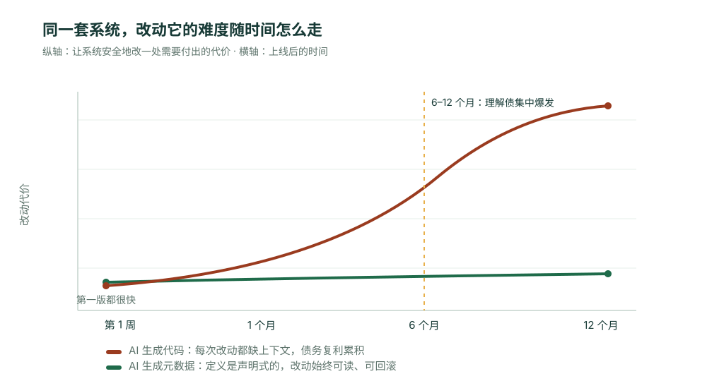

---
# @generated zh-Hant from zh-Hans (s2twp) — edit the zh-Hans file; delete this line to hand-maintain.
title: 2026 是技術債之年：為什麼"一句話生成程式碼"的應用，半年後沒人敢動
description: 一個團隊用 AI 搭的報銷系統，跑了大半年都好好的——直到稅務規則一變，沒人敢碰那一萬多行沒人讀過的程式碼，連當初生成它的 AI 都幫不上忙。這篇文章拆解 AI 程式碼技術債為什麼是一種特殊的、幾乎還不掉的債，以及為什麼讓 AI 生成定義而不是程式碼，才是企業應用的出路。
author: ObjectStack Team
date: 2026-06-16T16:00:00+08:00
status: published
topic: app-building
audience: it
solutions: []
industries: []
cover: ./cover.svg
tags:
  - Vibe Coding
  - 技術債
  - 程式碼生成
  - 後設資料
  - AI 治理
  - 趨勢觀點
---

故事從第七個月開始。

一個五十多人的團隊，去年用 AI"一句話"搭了套報銷系統。表單、審批、對接財務，兩天就跑起來了，全員叫好——終於不用再等 IT 排期。接下來大半年，它一直好好的。

第七個月，稅務規則變了：某類發票的抵扣比例調整，報銷邏輯得跟著改。一件小事。

然後團隊發現，沒人敢動它。當初那"一句話"背後，是 AI 生成的一萬兩千多行程式碼，**沒有一個人完整讀過**。抵扣邏輯散在哪幾個檔案裡？改了會不會連帶影響審批和對賬？沒人說得清。更尷尬的是——連寫出這套程式碼的 AI 也幫不上忙：它是無狀態的，那次生成時腦子裡的判斷、權衡、為什麼這麼寫，一點都沒留下。你只能把一萬兩千行重新餵給一個新的會話，讓它"猜"一遍當初的自己。

這件小事，最後排了三週，還心驚膽戰地上線。

這就是 2026 年被很多人提前命名為"**技術債之年**"的那個東西，落到一個普通團隊身上的樣子。

## 這是一種特殊的債：欠了，但找不到債主

技術債不是新詞。但 AI 生成的程式碼，欠的是一種以前沒有的債。

人寫的程式碼也會爛、也會沒文件。但至少**作者還在**——你能把寫它的人拉來問一句"這裡當初為什麼這麼處理"。程式碼再差，背後總有一個能解釋它的人腦。

AI 生成的程式碼把這個最後的兜底也抽走了。它的"作者"是一個無狀態的模型，生成完那一刻就不存在了。它沒有把推理過程留下來，因為它根本沒有"過程"可留。於是你手上是一坨**能跑、但誰都無法解釋、也無人可問**的實現。

行業的資料正是這個機制的宏觀投影：到 2026 年初 85% 的開發者已在用 AI 生成大段程式碼；Veracode 在上百個模型上測出 **45% 的生成程式碼命中 OWASP Top 10**；多份研究給出**約 2.74 倍於手寫的漏洞率**。有團隊記錄到引入 AI 輔助後提交速度漲三到四倍，月度安全告警半年從約 1000 條飆到 10000 條以上。速度是真的，債也是真的——只是債不在交付那天結賬，它在第七個月找上門。

## 複利：每改一次，就更看不懂一點

為什麼是第七個月，而不是第一個月？因為這種債是**複利**的。

第一次改，AI 在沒讀懂舊程式碼的情況下"在旁邊再加一段"；第二次改，它面對的是"舊程式碼 + 上次沒讀懂的新程式碼"，於是再加一段。每一層都疊在沒人理解的上一層之上，理解成本指數上漲。所以風險曲線不是緩緩上升的直線，是一條前期平靜、中段陡起的指數曲線——平靜得讓你以為沒事，直到某次再普通不過的改動點燃它。



## 先說清楚：換成後設資料，不是沒有代價

到這裡得誠實停一下，否則又成了賣靈藥。

讓 AI 生成定義而不是程式碼，是有取捨的。宣告式的後設資料，覆蓋的是企業應用裡**反覆出現的那 90%**——物件、欄位、關係、檢視、許可權、流程、審批。它換來的可控性，代價是你放棄了一部分"想怎麼寫就怎麼寫"的自由度。

如果你要做的是一個全新的即時協作引擎、一套獨特的圖形演算法、一個沒有先例的互動——那確實需要真正的程式碼，後設資料幫不了你，也不該硬套。**ObjectStack 解決的是企業裡那些一遍遍重建的業務系統，不是下一個 Figma。** 把它當萬能錘，一樣會出問題。

清楚了邊界，再看它在自己的地盤上有多強。

## 把生成的東西換掉：不是實現，是定義

回到那套報銷系統。同樣的需求，如果當初 AI 生成的不是一萬兩千行實現，而是這樣一份定義：

```ts
export const ExpenseReport = ObjectSchema.create({
  name: 'fin_expense_report',
  label: '報銷單',
  fields: {
    amount: Field.currency({ label: '金額', min: 0 }),
    invoice_type: Field.select({ label: '發票型別', options: ['普票', '專票'] }),
    deductible_rate: Field.percent({ label: '抵扣比例' }),
  },
});
```

這幾十行不是"還要去實現的介面"，**它本身就是系統**。執行時（ObjectOS）讀取它，自動派生資料表、API、介面，以及 agent 可呼叫的受治理工具；許可權、審批流同樣是掛在它上面的宣告，而不是手寫的 `if`。

那麼第七個月那次稅務規則變更，長什麼樣？不再是一場考古，而是一行能看懂的改動：

```diff
- deductible_rate: Field.percent({ label: '抵扣比例' }),
+ deductible_rate: Field.percent({ label: '抵扣比例', defaultValue: 70 }),
+ // 專票按新規抵扣 70%，規則下沉到定義，審批與對賬自動跟隨
```

這是一個能在五分鐘內評審、能一鍵回滾的 diff，而不是一個沒人敢點"合併"的四百行 PR。差別不在於哪種更"高階"，而在於**半年後，誰還看得懂、改得動**。

## 複利機制為什麼被掐斷了

換成定義之後，那條曲線為什麼能壓平？三點，都直指上面那個故事：

1. **沒有"沒人讀過的實現"。** 實現屬於被反覆審計、所有應用共用的同一套執行時，不是每個應用各生成一份。你的應用裡只剩定義，而定義是給人讀的。
2. **沒有"無人可問"。** 定義是宣告式的，它自己就把意圖寫在臉上——`deductible_rate` 是什麼、歸誰管，一目瞭然，不需要去問那個早已消失的生成會話。
3. **漏洞面塌縮。** 那 45% 命中 OWASP 的風險，絕大多數來自手寫的認證、查詢拼接、輸入處理。這些都由統一執行時承擔後，應用層能引入的漏洞類別少了一大半。

## 結語

2026 會是技術債之年，不是因為 AI 寫程式碼錯了，而是因為太多團隊把"快速生成原型"的工具，直接當成了"建設長期系統"的方式。原型可以是一堆沒人讀的程式碼，用三年的系統不該是。

下次要用 AI 搭一套真要長期用的業務系統，先別問"它生成得多快"，問那個第七個月的問題：**半年後規則一變，我還敢不敢改它。** 讓 AI 生成定義而不是程式碼，是目前唯一能讓這個答案是"敢"的路徑。

```bash
npm i -g @objectstack/cli && os start
```

定義一個物件，改一次欄位，看看那次改動在 `git diff` 裡有多幹淨——那就是一筆不會複利的債。
