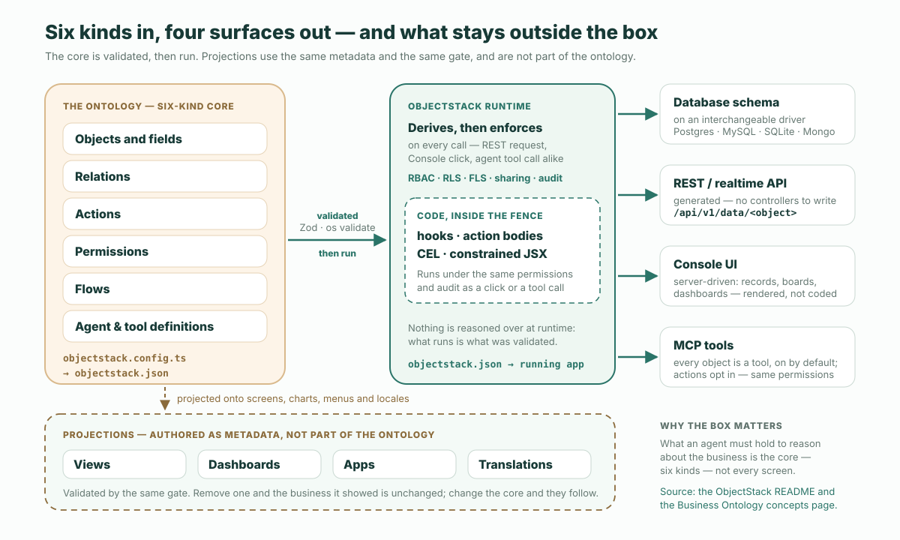

**짧은 버전.** 「온톨로지가 곧 소프트웨어다.」는 ObjectStack README의 첫 문장이고, 그 아래 줄이 정의다: 「실행 가능한 비즈니스 온톨로지 하나. AI가 쓰고, 런타임이 실행하고, 에이전트가 운영하고, 당신이 소유합니다.」 실행 가능한 비즈니스 온톨로지란 런타임이 직접 실행하는, 당신의 비즈니스에 대한 정의다. 그 핵심은 여섯 종류의 것 — 객체와 필드, 관계, 액션, 권한, 플로우, 에이전트와 도구 정의 — 이며, 하나의 아티팩트로 컴파일되어 거기서 데이터베이스, API, UI, 에이전트 도구가 도출된다. 뷰, 대시보드, 앱, 번역은 그것의 투영이지 그것의 일부가 아니다. 지식 표현 온톨로지가 아니고, 기존 시스템 위에 얹는 시맨틱 레이어가 아니며, 철학적 의미의 형식 온톨로지도 아니다. 코드는 사라지지 않는다. 훅, 액션 본문, CEL, 제한된 JSX로서 런타임 안으로 옮겨 간다.

주장은 이것이 전부다. 이 글의 나머지는 그것을 분해한다: 왜 문장이 *기술한다*가 아니라 *이다*라고 말하는지, 여섯 종류, 투영과 둘을 가르는 테스트, 세 가지 부정, 코드가 가는 곳, 그리고 이 한 줄이 귀결되는 네 가지 약속. 출처는 README와 거기서 링크하는 개념 페이지이며, 바꿔 말하지 않고 인용한다. 같은 저장소에 함께 실린 CRM 예제는 설명하는 대신 측정한다.

## 왜 문장이 「이다」라고 말하는가

대부분의 기업 온톨로지는 소프트웨어를 기술한다. 실제로 비즈니스를 돌리는 시스템 옆에 놓여 있고 — 고객의 모델, 무엇이 무엇과 연결되는지의 그래프, 매출이 무엇을 뜻하는지에 대한 통제된 정의 — 그 아래의 시스템은 아무것도 모른 채 계속 돈다. 그 기술은 유용하고, 동시에 선택 사항이다. 지워도 아무것도 멈추지 않는다.

ObjectStack의 문장이 동일성의 형태로 쓰인 것은 관계가 정반대이기 때문이다. 정의가 곧 실행되는 그것이다. 온톨로지를 지우면 애플리케이션이 남지 않는다. 테이블도, 엔드포인트도, 화면도, 에이전트가 호출할 도구도 없다. 개념 페이지는 파이프라인을 한 줄로 적는다:

```text
objectstack.config.ts -> objectstack.json -> ObjectStack runtime -> database · REST / realtime API · UI · MCP server
```

타입이 있는 메타데이터를 `objectstack.config.ts`에 작성한다. 그것이 `objectstack.json` 아티팩트로 컴파일된다. 런타임이 아티팩트를 읽고 나머지를 도출한다. 같은 그림에 대한 README의 캡션은 더 짧다: 「타입이 있는 정의 하나 → 데이터베이스 · REST API · 클라이언트 SDK · UI · MCP 도구.」 온톨로지는 말만 하고 다른 아티팩트가 소프트웨어*인* 경우는 없다. 여기서 「이다」는 그런 뜻이고, 아래의 모든 것은 거기서 따라 나온다.

## 여섯 종류의 핵심

개념 페이지는 핵심을 여섯 종류의 것으로 정의한다. 아래 표는 가운데 열에 그 문구를 그대로 두고, 오른쪽 열에서 각 종류가 함께 실린 CRM 예제(ObjectStack 저장소의 `examples/app-crm`) 어디에 있는지 가리킨다. 정의를 구호가 아니라 실제 정의에 대조해 확인할 수 있도록 하기 위해서다.

| 핵심 | 무엇을 선언하는가 | 함께 실린 CRM 예제에서 |
| :--- | :--- | :--- |
| **객체와 필드** | 비즈니스의 엔티티와 그 타입이 있는 속성 — 검증, 수식, 기본값, 파일 | `src/objects/`: 계정, 연락처, 리드, 기회, 기회 라인 아이템, 활동 |
| **관계** | 객체 사이의 lookup과 master-detail 연결 | 기회의 `Field.lookup('crm_account', …)`; 라인 아이템은 그것의 master-detail 자식 |
| **액션** | 사용자나 에이전트가 레코드에 대해 호출할 수 있는 작업과, 그것이 표시되는 조건 | `src/actions/convert-lead.action.ts`, 리드가 아직 전환되지 않은 동안에만 표시 |
| **권한** | 누가 무엇을 읽고, 만들고, 고치고, 지울 수 있는가 — RBAC, 행 수준·필드 수준 보안, 공유 | `src/security/sales-positions.ts`: `crm_sales_user` 세트와, 리드 삽입만 가능한 게스트 프로필 |
| **플로우** | 비즈니스 프로세스 — DAG 플로우, 레코드 트리거, 예약 작업, 승인, 워크플로우 | `src/flows/convert-lead.flow.ts`, 계정과 기회를 만든 뒤 리드를 전환됨으로 표시하는 화면 플로우 |
| **에이전트와 도구 정의** | 앱에 함께 실리는 AI 에이전트, 그들이 호출할 수 있는 도구, 그들을 빚는 스킬 | 이 예제에는 선언된 것이 없음. 모든 객체는 이미 MCP 도구이고, 액션은 `ai: { exposed: true }`로 옵트인 |

측정 하나. README가 「직접 재 보라」 아래에 스스로 인쇄한 명령으로 쟀다. 커밋 `9f9510f2`에서 CRM 예제의 정의는 **31개 파일, TypeScript 1,917줄**이다. 그 파일들에는 객체 여섯 개, 뷰 세 개, 대시보드 하나, 앱 하나, 리드 전환 플로우 하나, 액션 하나, 훅 하나, 권한 세트 두 개, 포지션 세 개, 번역 번들 하나, 페이지 하나, 그리고 시드 데이터가 들어 있다 — 애플리케이션 전체가, 읽을 수 있는 diff로. 이 숫자의 요점은 추상적으로 작다는 것이 아니다. 에이전트가 정의 전체를 한 번에 붙들고, 「여기를 바꾸면 무엇이 깨지는가?」에 정의 자체로부터 답할 수 있다는 것이다. README는 이를 AI가 통째로 붙들 수 있을 만큼 작은 앱이라고 부른다.

핵심은 또한, 구조적으로, 당신의 것인 부분이다. 개념 페이지: 「그것은 하나의 정의이며, 열려 있고 버전이 관리된다. 평범한 TypeScript로 당신의 저장소에 살고, diff로 검토할 수 있으며, Apache-2.0으로 명세되고 라이선스된다 — 벤더의 시스템 안에 보관되어 그 벤더의 콘솔로만 닿을 수 있는 그래프가 아니다.」

## 투영, 그리고 제거 테스트

뷰, 대시보드, 앱, 번역은 같은 메타데이터로 작성되고 같은 게이트로 검증되지만, 온톨로지의 일부가 아니다. 개념 페이지는 이를 투영이라 부르고 각각을 한 절로 설명한다: 「리스트 뷰는 객체의 필드와 권한을 그리드에 투영하고, 대시보드는 객체에 대한 쿼리를 차트에 투영하며, 앱은 객체·뷰·액션을 탐색 가능한 제품으로 묶고, 번역은 모든 레이블을 하나의 로케일에 투영한다.」



이 구분을 작동하게 만드는 문장은 이것이다: 「핵심을 바꾸면 투영이 따라온다. 투영을 제거해도 그것이 보여 주던 비즈니스는 바뀌지 않는다.」 이를 테스트로 바꾸면 프로젝트 안의 어떤 정의든 한 번에 분류할 수 있다. **제거 테스트**라 부르자:

> 그 정의를 지워라. 데이터베이스 스키마, API, 또는 사용자나 에이전트가 할 수 있는 일이 바뀌었다면 그것은 핵심이었다. 화면, 차트, 메뉴, 레이블만 사라졌다면 그것은 투영이었다.

CRM 예제에 대조해 읽어 보자. `src/views/opportunity.view.ts`를 지워도 기회 객체, 그 필드, lookup, 권한 세트는 모두 그대로다. REST 엔드포인트는 여전히 응답하고, MCP 도구도 여전히 존재한다. `src/objects/opportunity.object.ts`를 지우면 뷰는 투영할 것이 없고, 플로우는 만들 것이 없으며, 권한 세트는 더 이상 존재하지 않는 객체를 가리킨다. 하나는 투영이었고, 다른 하나는 소프트웨어였다.

이 구분에 이름을 붙일 가치가 있는 이유도 같은 페이지에 적혀 있다: 「이 구분은 에이전트가 비즈니스에 대해 추론하기 위해 붙들어야 할 범위를 한정한다: 모든 화면이 아니라 핵심이다.」 승인 임계값 변경을 검토하는 에이전트는 객체, 권한, 플로우를 눈앞에 두어야 한다. 결과를 우연히 차트로 그리는 대시보드 전부가 필요하지는 않다.

## 그것이 아닌 세 가지

*온톨로지*라는 말은 다른 분야에서 수십 년의 의미를 짊어지고 왔고, README는 정의의 상당 부분을 그 의미 중 어느 것이 여기에 해당하지 않는지 말하는 데 쓴다. 부정은 세 가지이고, 서로 다르다.

| 그것이 아닌 것 | 그것은 무엇인가 | 왜 여기서는 다른가 |
| :--- | :--- | :--- |
| **지식 표현 온톨로지** | OWL, RDF, 지식 그래프는 도메인을 *기술*하고, 클래스 상속과 공리를 지니며, 추론 엔진이 그 위에서 *추론*한다 | 객체 상속 없음, 공리 없음, 추론기 없음. 정의는 검증되고 — Zod 스키마와 `os validate`로 — 그다음 실행된다. `abstract` 키는 바로 그 이유로 명세에서 제거되었다 (ADR-0049) |
| **기존 시스템 위의 시맨틱 레이어** | 이미 운영 중인 시스템 위의 읽기 전용 매핑: 비즈니스를 기술하지만 실행하지는 않는다 | 온톨로지가 곧 시스템*이다*: 데이터베이스, API, UI, 에이전트 도구가 거기서 도출된다. 외부 데이터소스 페더레이션은 가능하고, 기본값은 읽기 전용이며, 아직 초기 단계다 |
| **철학적 의미의 형식 온톨로지** | 일반적으로 무엇이 존재하는가에 대한 주장 | 그런 주장을 하지 않는다. 한 비즈니스의 애플리케이션을, 실행될 만큼 정확하게 정의한 것이다 |


첫 번째 부정이 가장 자주 놓친다. 제약이 아니라 설계상의 선택이기 때문이다. 추론 엔진은 두 번째 진실의 원천이다. 그것이 런타임에 도출하는 사실은 검토자가 읽을 수 있는 어디에도 적힌 적이 없다. 개념 페이지에 있는 ObjectStack의 규칙은 그 반대다: 「런타임에서는 아무것도 추론되지 않는다. 실행되는 것은 검증된 것이다.」 권한이 diff에 없다면 시스템에도 없다.

두 번째 부정은 플랫폼을 평가하는 모든 사람에게 중요하다. *시맨틱 레이어*라는 용어가 같은 대화 안에서 서로 다른 두 가지를 가리키는 데 쓰이고 있기 때문이다. 시맨틱 레이어는 어떤 숫자가 무엇을 뜻하는지에 대한 훌륭한 정의일 수 있다 — [지식 그래프와의 비교](/en/blog/ontology-vs-semantic-layer-vs-knowledge-graph/)는 그것을 공정하게 변호한다. 그것은 명사의 레이어다. 실행 가능한 비즈니스 온톨로지는 동사를 지닌다: 무엇을 해도 되는지, 누가, 그다음 무엇이 일어나는지를 결정하는 액션, 권한, 플로우다. 문서는 또한 보고서와 대시보드가 바인딩하는 분석 데이터셋 레이어를 가리켜 *시맨틱 레이어*를 더 좁은 의미로도 쓴다고 적는다. 그 좁은 의미는 보고에 관한 것이고, 이 문장이 뜻하는 바가 아니다.

세 번째 부정은 가장 짧고 가장 정직하다. 이 형식은 세계에 대해 아무 주장도 하지 않는다. 한 비즈니스의 애플리케이션을 런타임이 실행할 수 있고 검토자가 통째로 읽을 수 있을 만큼 정확하게 서술할 수 있다고 주장할 뿐이다.

## 코드는 어디로 가는가

추론되는 대신 실행되는 정의라도 스키마로는 표현할 수 없는 것을 여전히 표현해야 한다. 거래가 성사되면 100%로 고정되는 확률, 리드가 전환되면 사라지는 버튼, 레이아웃이 있는 랜딩 페이지. README의 문장은 「코드는 사라지지 않는다: 훅, 액션 본문, CEL, 제한된 JSX로서 런타임 안으로 옮겨 간다」이고, 개념 페이지가 그 이유를 든다. 네 가지 모두 「런타임의 권한과 감사 울타리 안에서 실행」되며, 「그중 어느 것도 온톨로지가 나중에 기술해야 할 코드베이스에 흩어져 있지 않다.」

CRM 예제의 훅은 객체의 생명주기에 붙은 함수다:

```ts
export const OpportunityStageHook = defineHook({
  name: 'opportunity_stage_probability',
  object: 'crm_opportunity',
  events: ['beforeInsert', 'beforeUpdate'],
  priority: 100,
  handler: async (ctx: HookContext) => {
    const input = ctx.input as { stage?: string; probability?: number };
    if (input.stage === 'closed_won') input.probability = 100;
    if (input.stage === 'closed_lost') input.probability = 0;
  },
});
```

CEL은 수식, 술어, 정책을 위한 표현식 언어다. 같은 예제는 계산 필드와 액션의 표시 조건 양쪽에 그것을 쓴다:

```ts
expected_revenue: Field.formula({
  label: 'Expected Revenue',
  expression: cel`(record.amount == null ? 0 : record.amount) * (record.probability == null ? 0 : record.probability) / 100`,
}),
```

```ts
visible: 'has(record.status) && record.status != "converted"',
```

제한된 JSX는 사용자 정의 페이지를 쓰는 방법이고, 제한이 바로 요점이다. 그것은 「서버 주도 UI 트리로 파싱되며, 결코 코드로 실행되지 않는다.」 이를 수행하는 패키지는 README에 파싱만 하고 결코 실행하지 않는 컴파일러로 등재되어 있다. 액션 본문은 네 번째 자리로, 액션이 호출될 때 서버 측에서 수행하는 작업을 맡는다.

네 가지에 걸친 패턴은 같다. 코드는 허용된다. 그러나 코드는 비즈니스가 사는 곳이 아니다. 비즈니스는 여섯 종류의 핵심에 살고, 코드는 그 여섯 종류가 정하는 울타리 안에서, 클릭이나 도구 호출과 같은 권한과 감사 아래 실행된다.

## 검증하고, 그다음 실행한다

런타임이 아티팩트로 하는 일은 두 동사로 설명되며, 개념 페이지는 둘 다 의도적으로 쓴다. 그것은 **도출한다**: 「교체 가능한 드라이버 위의 데이터베이스 스키마, 생성된 REST와 실시간 API, Console을 위한 서버 주도 UI, 그리고 MCP 서버」. 그리고 **강제한다**: 「RBAC, 행 수준·필드 수준 보안, 공유, 감사는 REST 요청에도, Console 클릭에도, 에이전트의 도구 호출에도 똑같이 적용된다.」

README는 첫 번째 동사를 객체 하나로 보여 준다. 티켓을 선언한다:

```ts
import { ObjectSchema, Field } from '@objectstack/spec/data';

export const Ticket = ObjectSchema.create({
  name: 'support_desk_ticket',
  label: 'Ticket',
  sharingModel: 'private',            // org-wide default — the security gate requires it
  fields: {
    subject: Field.text({ label: 'Subject', required: true, searchable: true }),
    status: Field.select({
      label: 'Status',
      required: true,
      options: [
        { label: 'Open', value: 'open', color: '#3B82F6', default: true },
        { label: 'Resolved', value: 'resolved', color: '#10B981' },
      ],
    }),
    due_date: Field.date({ label: 'Due Date' }),
  },
});
```

그러면 「REST API는 객체가 존재하는 순간 존재한다 — 작성할 컨트롤러가 없다」:

```bash
curl http://localhost:3000/api/v1/data/support_desk_ticket
```

주석이 달린 `sharingModel: 'private'`에 주목하라. 보안 태세는 객체의 일부이고, 게이트는 그것을 요구한다. `os validate`는 「타입 검사는 통과하지만 런타임에서 조용히 실패할 메타데이터를 거부한다: 매달린 바인딩, 잘못된 CEL 술어, 빠진 보안 태세」. 이것이 검증의 절반이다. 실행의 절반은, 이 객체에서 도출된 모든 표면 — 테이블, 엔드포인트, Console 그리드, MCP 도구 — 이 호출할 때마다 같은 권한에 대조해 검사된다는 것이다. 그래서 MCP로 티켓에 닿은 에이전트는 같은 권한을 가진 사람이 보는 것과 정확히 같은 것을 본다.

## 네 가지 약속, 「실행 가능」이 앞장선다

README는 이 줄을 네 단어로 줄인다: 「실행 가능 · AI가 작성 · 에이전트가 운영 · 당신이 소유」. 각각은 메커니즘이 뒷받침하는 주장이고, 순서는 장식이 아니다. 첫 번째가 나머지 셋이 딛고 선 것이다.

**실행 가능.** 정의가 곧 실행되는 그것이다. 위의 두 절에 있는 모든 것이 이 약속이다. 아티팩트 하나, 도출된 표면들, 호출마다의 강제, 런타임에서 추론되는 것은 없음. 이것이 없으면 「AI가 작성」은 AI가 문서를 쓴다는 뜻이 될 것이다.

**AI가 작성.** 「에이전트는 타입이 있는 메타데이터를 쓴다 — 코드베이스가 아니다. 게이트는 런타임에서 조용히 실패할 것을 거부하고, 에이전트는 당신이 보기도 전에 그것을 고친다.」 스캐폴더는 「AI 스킬 번들을 설치하고 `AGENTS.md`를 써 주므로, 당신의 에이전트는 프로토콜의 규칙이 이미 로드된 채로 시작한다」. README의 네 게이트 — 타입 검사, 검증, 검토, 거버넌스 — 가 에이전트의 실수가 출시되지 않는 이유이고, 이것이 애초에 작동하는 이유로 적힌 것은 「에이전트의 오류가 위치가 특정된, 교정용 텍스트가 되어 에이전트 스스로 읽고 고칠 수 있다」는 것이다.

**에이전트가 운영.** 「객체는 도구이고, 액션은 도구이며, 권한이 에이전트가 무엇을 호출할 수 있는지 결정하고, 감사가 무엇을 했는지 기록한다.」 실행 중인 앱은 「`/api/v1/mcp`에서 MCP 서버로 제공된다 — 기본으로 켜져 있다」, 그리고 에이전트는 「사람과 같은 권한과 RLS 아래」 그것을 운영한다. 에이전트가 쓴 같은 온톨로지를, 같은 울타리를 통해, 다음에는 에이전트가 쓴다.

**당신이 소유.** 「이 저장소의 모든 것은 열린 스택이다 — 프로토콜, 마이크로커널, SDK, CLI, 그리고 프로덕션 런타임, Apache-2.0에 오픈코어 별표 없음.」 그리고 정의 자체는 「평범한 TypeScript로 당신의 저장소에 살고, 당신의 VCS에서 버전이 관리되며, diff로 검토할 수 있다 — 벤더의 시스템 안에 보관된 그래프가 아니다.」 온톨로지는 당신이 손에 쥔 파일이지, 빌려 쓰는 테넌시가 아니다.

## 이것이 해결하지 않는 것

정의를 다루는 글은 정의가 어디서 멈추는지 말해야 한다.

모델링을 쉽게 만들지 않는다. 기회가 무엇인지, 누가 그것을 종결할 수 있는지, 30%를 넘는 할인에 무엇이 필요한지 정하는 일은 여전히 늘 그랬듯 느리고, 다툼이 있고, 사람이 하는 일이다. 형식이 정하는 것은 결과가 통째로 읽을 만큼 작은지, 작성 시점에 실수를 거부할 만큼 엄격한지뿐이다.

추론하지 않는다. 당신의 문제가 정말로 도메인 모델 위의 추론 — 클래스 계층, 도출된 사실, 결과를 발견하는 엔진 — 을 필요로 한다면, 그것은 이 글이 명시적으로 아니라고 말한 지식 표현 온톨로지다. 그 도구를 고르고, 이쪽에 추론기가 자라나기를 기대하지 말라.

이미 운영 중인 것 위의 레이어가 아니다. 외부 데이터소스 페더레이션은 기본값이 읽기 전용이고 초기 단계로 기술되어 있으므로, 레거시 데이터베이스 위의 실행 가능한 온톨로지는 읽기 모델로 시작해 객체 하나씩 쓰기를 얻어 간다. [내부 시스템을 메타데이터로 옮기기](/en/blog/how-to-move-an-internal-system-to-metadata/)는 그 길의 정직한 버전이며, 아예 옮기지 않는 것이 답인 경우까지 포함한다.

그리고 새로운 로직은 코드로 남는다. 훅과 액션 본문이 그것이 가는 자리이고, 울타리 안에 있으며, 여전히 사람이 검토해야 하는 코드다. 온톨로지는 그 코드를 더 작고 경계가 있게 만든다. 사라지게 하지는 않으며, README도 꼭 그 말로 그렇게 적는다.

## 호스팅으로, 또는 자체 인프라에서

README는 위의 루프 — 코딩 에이전트가 당신의 저장소에 메타데이터를 쓰고, 실행 중인 앱을 MCP로 운영한다 — 를 설명한 뒤 이렇게 말한다: 「같은 루프를 호스팅으로, 브라우저에서, 아무것도 설치하지 않고 쓰고 싶다면? 그것이 ObjectOS, ObjectStack 위에 구축된 상용 런타임 환경입니다.」 ObjectOS는 설치 없이 브라우저에서 호스팅되는 ObjectOS Cloud로도, 자체 인프라에서 직접 운영하는 ObjectOS Enterprise로도 실행되며, 어느 에디션에서든 온톨로지를 내보내 오픈소스 ObjectStack 런타임에서 실행할 수 있습니다. 이것은 네 번째 약속을 제품의 경계로 말한 것이다. 어느 호스트에서 돌든, 온톨로지는 당신의 것이다.

## 에이전트 경로로 시작하라

위의 어느 것도 정의를 믿음으로 받아들이라고 요구하지 않는다. README 자신의 5분 경로가 읽을 수 있는 정의 하나를 만들어 준다.

```bash
npm create objectstack@latest my-app && cd my-app
```

프로젝트를 코딩 에이전트에서 열고 요구사항을 설명하라. README의 예제는 지원 데스크다. 제목, 설명, 우선순위 선택, 상태 선택이 있는 `ticket` 객체; 아직 해결되지 않은 티켓에만 표시되는 Resolve 액션; 「미해결 티켓」 리스트 뷰와 Support 내비게이션 그룹; 끝나면 `npm run validate`. 그다음 결과를 미리 보라:

```bash
npx os dev --ui   # → http://localhost:3000/_console/
```

Console을 보기 전에 에이전트가 만든 diff를 보라. 객체, 액션과 그 표시 술어, 뷰 — 제거 테스트로 모든 줄을 핵심 또는 투영으로 분류할 수 있을 것이고, 실행되지 않을 줄은 게이트가 이미 거부했을 것이다. 에이전트에게 방향 잡기가 필요하다면, [ObjectStack용으로 설정하는 방법](/en/blog/how-to-point-your-agent-at-objectstack/)이 규칙 파일, 스킬 번들, 도구 서버를 다룬다. 에이전트가 쓰는 그 정의가 소프트웨어이고, 그것은 당신의 저장소에 있다.
