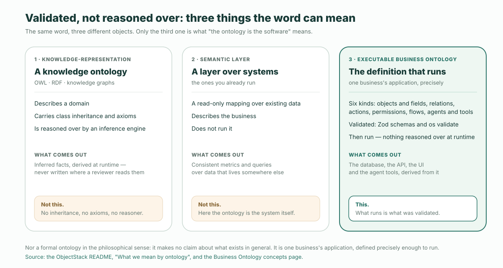

**The short version.** "The ontology is the software." is the first sentence of the ObjectStack README, and the line under it is the definition: "One executable business ontology. AI writes it, the runtime runs it, agents operate it, you own it." An executable business ontology is the definition of your business that a runtime executes directly. Its core is six kinds of thing — objects and fields, relations, actions, permissions, flows, and agent and tool definitions — compiled into one artifact, from which the database, the API, the UI and the agent tools are derived. Views, dashboards, apps and translations are projections of it, not part of it. It is not a knowledge-representation ontology, not a semantic layer over your existing systems, and not a formal ontology in the philosophical sense. Code does not disappear; it moves into the runtime, as hooks, action bodies, CEL and constrained JSX.

That is the whole claim. The rest of this post takes it apart: why the sentence says *is* and not *describes*, the six kinds, the projections and a test for telling the two apart, the three negations, where code goes, and the four promises the line reduces to. The sources are the README and the concepts page it links to, quoted rather than paraphrased, plus the CRM example that ships in the same repository, measured rather than described.

## Why the sentence says "is"

Most enterprise ontologies describe software. They sit beside the systems that actually run the business — a model of the customer, a graph of what connects to what, a governed definition of what revenue means — and the systems carry on underneath, unaware. The description is useful, and it is also optional: delete it and nothing stops.

The ObjectStack sentence is phrased as an identity because the relationship is the other way round. The definition is the thing that runs. Delete the ontology and there is no application left: no tables, no endpoints, no screens, no tools for an agent to call. The concepts page puts the pipeline in one line:

```text
objectstack.config.ts -> objectstack.json -> ObjectStack runtime -> database · REST / realtime API · UI · MCP server
```

You author typed metadata in `objectstack.config.ts`; it compiles into the `objectstack.json` artifact; the runtime reads the artifact and derives the rest. The README's caption for the same picture is shorter still: "One typed definition → database · REST API · client SDK · UI · MCP tools." There is no second artifact that *is* the software while the ontology merely talks about it. That is what "is" means here, and everything below follows from it.

## The six-kind core

The concepts page defines the core as six kinds of thing. The table below keeps its wording in the middle column and, in the right column, points at where each kind lives in the bundled CRM example (`examples/app-crm` in the ObjectStack repository), so the definition can be checked against a real definition rather than against a slogan.

| Core | What it declares | In the bundled CRM example |
| :--- | :--- | :--- |
| **Objects and fields** | The entities of the business and their typed attributes — validation, formulas, defaults, files | `src/objects/`: account, contact, lead, opportunity, opportunity line item, activity |
| **Relations** | Lookups and master-detail links between objects | `Field.lookup('crm_account', …)` on the opportunity; the line item is a master-detail child of it |
| **Actions** | The operations a user or an agent may invoke on a record, and the conditions under which they show | `src/actions/convert-lead.action.ts`, visible only while the lead is not yet converted |
| **Permissions** | Who may read, create, edit and delete what — RBAC, row-level and field-level security, sharing | `src/security/sales-positions.ts`: a `crm_sales_user` set, and a guest profile that may only insert leads |
| **Flows** | The business processes — DAG flows, record triggers, scheduled jobs, approvals, workflows | `src/flows/convert-lead.flow.ts`, a screen flow that creates the account and opportunity, then marks the lead converted |
| **Agent and tool definitions** | The AI agents the app ships with, the tools they may call, and the skills that shape them | None declared in this example. Every object is already an MCP tool; actions opt in with `ai: { exposed: true }` |

One measurement, taken with the command the README itself prints under "measure it yourself": at commit `9f9510f2`, the CRM example's definition is **1,917 lines of TypeScript across 31 files**. Those files hold six objects, three views, a dashboard, an app, a lead-conversion flow, an action, a hook, two permission sets, three positions, a translation bundle, a page and the seed data — the whole application, as a diff you can read. The point of the number is not that it is small in the abstract. It is that an agent can hold the whole definition at once and answer "what breaks if I change this?" from the definition itself, which the README calls apps small enough for AI to hold whole.

The core is also, by construction, the part that is yours. The concepts page: "It is one definition, open and versioned. It lives in your repository as ordinary TypeScript, is reviewable as a diff, and is specified and licensed Apache-2.0 — not a graph held inside a vendor's system and reachable only through that vendor's console."

## Projections, and the removal test

Views, dashboards, apps and translations are authored in the same metadata and validated by the same gate, but they are not part of the ontology. The concepts page calls them projections and explains each in a clause: "A list view projects an object's fields and permissions onto a grid; a dashboard projects queries over objects onto charts; an app groups objects, views and actions into a navigable product; a translation projects every label into a locale."


The sentence that makes the distinction operational is this one: "Change the core and the projections follow; remove a projection and the business it showed is unchanged." Turn it into a test and you can classify any definition in a project in one move. Call it the **removal test**:

> Delete the definition. If the database schema, the API, or what a user or agent may do has changed, it was core. If only a screen, a chart, a menu or a label has gone, it was a projection.

Read it against the CRM example. Delete `src/views/opportunity.view.ts` and the opportunity object, its fields, its lookups and its permission set are all still there; the REST endpoint still answers; the MCP tool still exists. Delete `src/objects/opportunity.object.ts` and the view has nothing to project, the flow has nothing to create, and the permission set names an object that no longer exists. One was a projection; the other was the software.

Why the distinction is worth a name is stated on the same page: "The distinction bounds what an agent must hold to reason about the business: the core, not every screen." An agent reviewing a change to an approval threshold needs the objects, the permissions and the flow in front of it. It does not need every dashboard that happens to chart the result.

## Three things it is not

The word *ontology* carries decades of meaning from other fields, and the README spends a good part of its definition saying which of those meanings do not apply. There are three negations, and they are different.

| It is not | What that thing is | Why this is different |
| :--- | :--- | :--- |
| **A knowledge-representation ontology** | OWL, RDF and knowledge graphs *describe* a domain, carry class inheritance and axioms, and are *reasoned over* by an inference engine | No object inheritance, no axioms, no reasoner. The definition is validated — by Zod schemas and `os validate` — and then run. The `abstract` key was removed from the spec for exactly that reason (ADR-0049) |
| **A semantic layer over your existing systems** | A read-only mapping over systems you already run: it describes the business but does not run it | The ontology *is* the system: the database, API, UI and agent tools are derived from it. Federating an external datasource is possible, read-only by default, and early |
| **A formal ontology in the philosophical sense** | A claim about what exists in general | It makes no such claim. It is one business's application, defined precisely enough to run |



The first negation is the one most often missed, because it is a design choice and not a limitation. An inference engine is a second source of truth: the facts it derives at runtime were never written down anywhere a reviewer could read them. ObjectStack's rule, from the concepts page, is the opposite: "Nothing is reasoned over at runtime: what runs is what was validated." If a permission is not in the diff, it is not in the system.

The second negation matters for anyone evaluating platforms, because the term *semantic layer* is being used for two different things in the same conversations. A semantic layer can be an excellent definition of what a number means — the [comparison with knowledge graphs](/en/blog/ontology-vs-semantic-layer-vs-knowledge-graph/) gives it a fair defence. It is a noun layer. An executable business ontology carries the verbs: actions, permissions and flows that decide what may be done, by whom, and what happens next. The docs also note that they use *semantic layer* in a narrower sense, for the analytics dataset layer that reports and dashboards bind to; that narrower sense is about reporting, and it is not what the sentence means.

The third negation is the shortest and the most honest. The format makes no claim about the world. It claims that one business's application can be stated precisely enough for a runtime to execute it and for a reviewer to read it whole.

## Where code goes

A definition that is executed rather than reasoned over still has to express things no schema expresses: a probability that snaps to 100% when a deal closes, a button that disappears once a lead is converted, a landing page with a layout. The README's sentence is "code does not disappear: it moves into the runtime, as hooks, action bodies, CEL, and constrained JSX", and the concepts page gives the reason: all four "run inside the runtime's permission and audit fence", and "none of it is scattered across a codebase the ontology would then have to describe."

A hook, from the CRM example, is a function attached to an object's lifecycle:

```ts
export const OpportunityStageHook = defineHook({
  name: 'opportunity_stage_probability',
  object: 'crm_opportunity',
  events: ['beforeInsert', 'beforeUpdate'],
  priority: 100,
  handler: async (ctx: HookContext) => {
    const input = ctx.input as { stage?: string; probability?: number };
    if (input.stage === 'closed_won') input.probability = 100;
    if (input.stage === 'closed_lost') input.probability = 0;
  },
});
```

CEL is the expression language for formulas, predicates and policies. The same example uses it for a computed field and for the visibility of an action:

```ts
expected_revenue: Field.formula({
  label: 'Expected Revenue',
  expression: cel`(record.amount == null ? 0 : record.amount) * (record.probability == null ? 0 : record.probability) / 100`,
}),
```

```ts
visible: 'has(record.status) && record.status != "converted"',
```

Constrained JSX is how a custom page is written, and the constraint is the point: it "is parsed into a server-driven UI tree, never executed as code." The package that does it is listed in the README as a compiler that parses and never executes. Action bodies are the fourth place, for the server-side work an action performs when invoked.

The pattern across all four is the same. Code is allowed; code is not where the business lives. The business lives in the six kinds, and the code runs inside the fence those six kinds define, under the same permissions and audit as a click or a tool call.

## Validated, then run

Two verbs describe what the runtime does with the artifact, and the concepts page uses both deliberately. It **derives**: "the database schema on an interchangeable driver, a generated REST and realtime API, server-driven UI for the Console, and an MCP server". And it **enforces**: "RBAC, row-level and field-level security, sharing, and audit apply to a REST request, a Console click and an agent's tool call alike."

The README shows the first verb with one object. Declare a ticket:

```ts
import { ObjectSchema, Field } from '@objectstack/spec/data';

export const Ticket = ObjectSchema.create({
  name: 'support_desk_ticket',
  label: 'Ticket',
  sharingModel: 'private',            // org-wide default — the security gate requires it
  fields: {
    subject: Field.text({ label: 'Subject', required: true, searchable: true }),
    status: Field.select({
      label: 'Status',
      required: true,
      options: [
        { label: 'Open', value: 'open', color: '#3B82F6', default: true },
        { label: 'Resolved', value: 'resolved', color: '#10B981' },
      ],
    }),
    due_date: Field.date({ label: 'Due Date' }),
  },
});
```

and "the REST API exists the moment the object does — no controllers to write":

```bash
curl http://localhost:3000/api/v1/data/support_desk_ticket
```

Notice `sharingModel: 'private'` with its comment. The security posture is part of the object, and the gate requires it: `os validate` "rejects metadata that type-checks but would fail silently at runtime: dangling bindings, bad CEL predicates, missing security posture." That is the validated half. The run half is that every surface derived from the object — the table, the endpoint, the Console grid, the MCP tool — is checked against the same permissions on every call, so an agent that reaches the ticket through MCP sees exactly what a human with the same permissions would see.

## The four promises, led by Executable

The README reduces the line to four words: "Executable · AI-writable · Agent-operable · You own it". Each is a claim with a mechanism behind it, and the order is not decorative — the first one is what the other three stand on.

**Executable.** The definition is the thing that runs. Everything in the two sections above is this promise: one artifact, derived surfaces, enforcement on every call, nothing reasoned over at runtime. Without it, "AI-writable" would mean an AI writing documentation.

**AI-writable.** "The agent writes typed metadata — not a codebase. The gate rejects what would fail silently at runtime, and the agent fixes it before you ever see it." The scaffolder "installs the AI skills bundle and writes an `AGENTS.md`, so your agent starts with the protocol's rules already loaded". The README's four gates — typed, validated, reviewed, governed — are the reason the agent's mistakes do not ship, and the stated reason it works at all: "an agent's errors become located, corrective text it can read and fix itself".

**Agent-operable.** "Objects are tools, actions are tools, permissions decide what an agent may call, and audit records what it did." The running app "serves it as an MCP server at `/api/v1/mcp` — on by default", and an agent operates it "under the same permissions and RLS as a human". The same ontology that was written by an agent is then used by one, through the same fence.

**You own it.** "Everything in this repo is the open stack — protocol, microkernel, SDK, CLI, and the production runtime, Apache-2.0 with no open-core asterisks." And the definition itself "lives in your repository as ordinary TypeScript, versioned in your VCS and reviewable as a diff — not a graph held inside a vendor's system." The ontology is a file you hold, not a tenancy you rent.

## What this does not solve

A definition post should say where the definition stops.

It does not make modelling easy. Deciding what an opportunity is, who may close one and what a discount above 30% needs is still the slow, contested, human work it always was; the format decides only whether the result is small enough to read whole and strict enough to reject mistakes at authoring time.

It does not reason. If your problem genuinely needs inference over a domain model — class hierarchies, derived facts, an engine that discovers consequences — that is the knowledge-representation ontology this one is explicitly not. Pick that tool, and do not expect this one to grow a reasoner.

It is not a layer over what you already run. Federating an external datasource is read-only by default and described as early, so an executable ontology over a legacy database starts as a read model and earns writes one object at a time. [Moving an internal system to metadata](/en/blog/how-to-move-an-internal-system-to-metadata/) is the honest version of that path, including the cases where the answer is not to move at all.

And novel logic stays code. Hooks and action bodies are where it goes, inside the fence, and they are still code a human has to review. The ontology makes that code smaller and bounded; it does not make it disappear, and the README says so in as many words.

## Hosted, or on your own infrastructure

The README describes the loop above — a coding agent writes the metadata in your repo and operates the running app over MCP — and then says: "Want the same loop hosted, in the browser, nothing to install? That's ObjectOS, the commercial runtime environment built on ObjectStack." ObjectOS runs hosted in the browser with nothing to install (ObjectOS Cloud) or self-managed on your own infrastructure (ObjectOS Enterprise), and on either edition you can export your ontology and run it on the open-source ObjectStack runtime. Which is the fourth promise, stated as a product boundary: the ontology is yours on every host it runs on.

## Start with the agent path

Nothing above requires you to take the definition on faith; the README's own five-minute path produces one you can read.

```bash
npm create objectstack@latest my-app && cd my-app
```

Open the project in your coding agent and describe the requirement. The README's example is a support desk: a `ticket` object with subject, description, a priority select and a status select; a Resolve action that only shows on tickets that are not already resolved; an "Open tickets" list view and a Support nav group; `npm run validate` when it is done. Then preview the result:

```bash
npx os dev --ui   # → http://localhost:3000/_console/
```

Look at the diff the agent produced before you look at the Console. The object, the action and its visibility predicate, the view — you will be able to sort every line into core or projection with the removal test, and the gate will already have refused the lines that would not run. If the agent needs steering, [how to configure it for ObjectStack](/en/blog/how-to-point-your-agent-at-objectstack/) covers the rule file, the skills bundle and the tool server. The definition it writes is the software, and it is in your repository.
