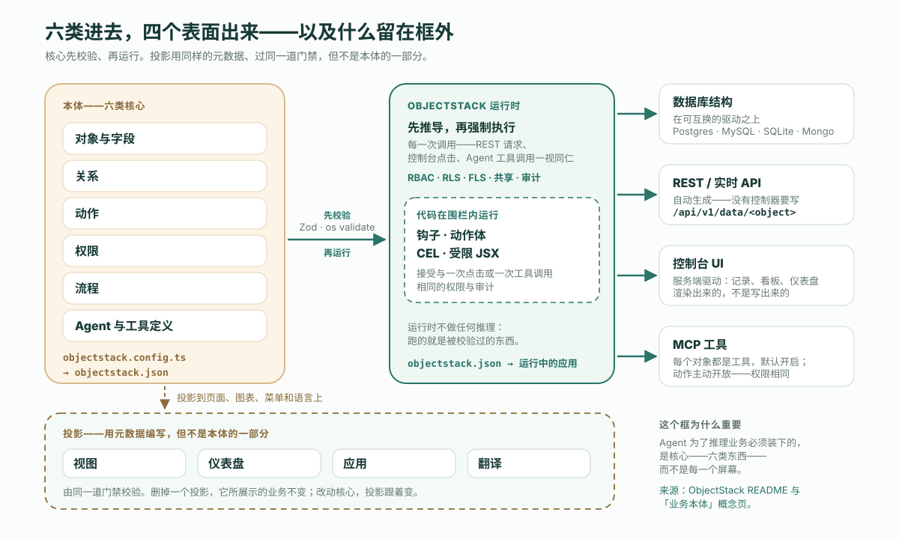
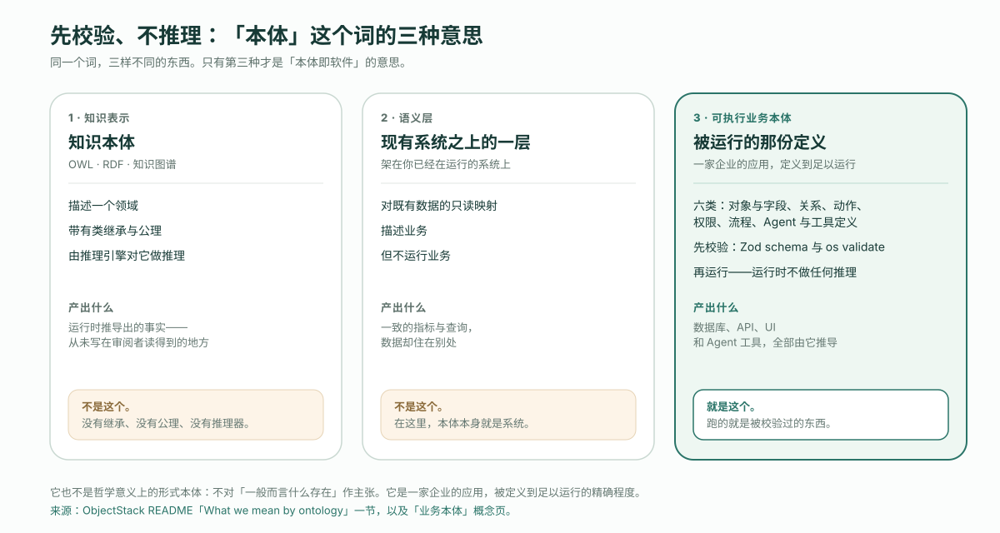

---
# @generated zh-Hant from zh-Hans (s2twp) — edit the zh-Hans file; delete this line to hand-maintain.
title: 「本體即軟體」到底是什麼意思？可執行業務本體的完整定義
description: 這句話是 ObjectStack 的定位，這篇是它的定義：可執行業務本體由六類核心構成，有四種投影、三個「不是」，還有一條分辨核心與投影的測試。
author: ObjectStack Team
date: 2026-10-08
status: published
topic: app-building
audience: developer
solutions: []
industries: []
cover: ./cover.svg
tags:
  - 本體
  - 可執行業務本體
---

**先給結論**：「本體即軟體。」是 ObjectStack README 的第一句話，緊跟其後的那一行就是定義：「一份可執行的業務本體。AI 編寫它，執行時執行它，Agent 操作它，你擁有它。」可執行業務本體，是你的業務裡那份由執行時直接執行的定義。它的核心是六類東西——物件與欄位、關係、動作、權限、流程、Agent 與工具定義——編譯成一個工件，資料庫、API、UI 和 Agent 工具都從這個工件推匯出來。檢視、儀表盤、應用和翻譯是它的投影，不是它的一部分。它不是知識表示意義上的本體，不是架在你現有系統之上的語義層，也不是哲學意義上的形式本體。程式碼不會消失，它搬進了執行時：鉤子、動作體、CEL 和受限 JSX。

這就是全部主張。本文接下來把它拆開：這句話為什麼說「即」而不說「描述」；六類核心；投影，以及一條區分二者的測試；三個「不是」；程式碼去了哪裡；以及這句話最終歸結成的四個承諾。來源是 README 和它連結的概念頁，引用而非轉述；再加上同一倉庫裡自帶的 CRM 示例，測量而非描述。

## 這句話為什麼說「即」

大多數企業本體是在描述軟體。它們挨著真正跑業務的系統——一個客戶模型、一張「什麼連著什麼」的圖、一份對「營收」的受控定義——而底下的系統照常運轉，毫不知情。這種描述有用，但也是可選的：刪掉它，什麼都不會停。

ObjectStack 這句話寫成一個等式，是因為關係正好反過來：定義本身就是在跑的那個東西。刪掉本體，應用就沒有了——沒有表、沒有介面、沒有介面、沒有可供 Agent 呼叫的工具。概念頁用一行寫出整條流水線：

```text
objectstack.config.ts -> objectstack.json -> ObjectStack runtime -> database · REST / realtime API · UI · MCP server
```

你在 `objectstack.config.ts` 裡編寫型別化後設資料；它編譯成 `objectstack.json` 工件；執行時讀取工件，推匯出其餘一切。README 給同一張圖的說明更短：「一份型別化定義 → 資料庫 · REST API · 客戶端 SDK · UI · MCP 工具。」這裡沒有第二個工件在「當」軟體、而本體只是談論它。這就是「即」的含義，下面的一切都由此推出。

## 六類核心

概念頁把核心定義為六類東西。下表中間一列保留它的原話，右邊一列指向每一類在自帶 CRM 示例（ObjectStack 倉庫裡的 `examples/app-crm`）中的位置，這樣定義可以對照一份真實的定義來核驗，而不是對照一句口號。

| 核心 | 它宣告什麼 | 在自帶 CRM 示例中 |
| :--- | :--- | :--- |
| **物件與欄位** | 業務中的實體及其型別化屬性——校驗、公式、預設值、檔案 | `src/objects/`：客戶、聯絡人、線索、商機、商機明細、活動 |
| **關係** | 物件之間的查詢（lookup）與主從（master-detail）連結 | 商機上的 `Field.lookup('crm_account', …)`；商機明細是它的主從子物件 |
| **動作** | 使用者或 Agent 可以對一條記錄發起的操作，以及它們顯示的條件 | `src/actions/convert-lead.action.ts`，只在線索尚未轉化時可見 |
| **權限** | 誰可以讀、建、改、刪什麼——RBAC、行級與欄位級安全、共享 | `src/security/sales-positions.ts`：一個 `crm_sales_user` 權限集，以及一個只能新增線索的訪客檔案 |
| **流程** | 業務過程——DAG 流程、記錄觸發器、定時任務、審批、工作流 | `src/flows/convert-lead.flow.ts`，一個螢幕流程：建立客戶與商機，再把線索標記為已轉化 |
| **Agent 與工具定義** | 應用自帶的 AI Agent、它們可以呼叫的工具，以及塑造它們的技能 | 本示例未宣告。每個物件本來就是一個 MCP 工具；動作用 `ai: { exposed: true }` 主動開放 |

一個測量，用的是 README 自己在「自己量一量」下面印出來的那條命令：在提交 `9f9510f2`，CRM 示例的定義是 **31 個檔案、1,917 行 TypeScript**。這些檔案裝著六個物件、三個檢視、一個儀表盤、一個應用、一條線索轉化流程、一個動作、一個鉤子、兩個權限集、三個崗位、一個翻譯包、一個頁面和種子資料——整個應用，是一份你讀得完的 diff。這個數字的意義不在於它抽象地「小」，而在於一個 Agent 能把整份定義一次裝下，並從定義本身回答「我改了這裡會弄壞什麼？」——README 把這叫作「小到 AI 能整個裝下的應用」。

核心同時也是——按構造就是——屬於你的那部分。概念頁寫道：「它是一份定義，開放且有版本。它以普通 TypeScript 的形式住在你的倉庫裡，可以作為 diff 審閱，按 Apache-2.0 規範並授權——不是一張鎖在廠商系統裡、只能通過該廠商控制台觸達的圖。」

## 投影，以及「刪除測試」

檢視、儀表盤、應用和翻譯用同樣的後設資料編寫、由同一道門禁校驗，但它們不是本體的一部分。概念頁稱之為投影，並逐一用一個分句解釋：「列表檢視把一個物件的欄位和權限投影到一張網格上；儀表盤把物件上的查詢投影到圖表上；應用把物件、檢視和動作組合成一個可導航的產品；翻譯把每一個標籤投影到一種語言。」



讓這個區分可操作的是這一句：「改動核心，投影跟著變；刪掉一個投影，它所展示的業務不變。」把它變成一條測試，你就能一步給專案裡任何一份定義歸類。姑且叫它**刪除測試**：

> 刪掉這份定義。如果資料庫結構、API，或者使用者與 Agent 能做的事變了，它就是核心。如果消失的只是一個頁面、一張圖、一個選單或一個標籤，它就是投影。

拿 CRM 示例來對照。刪掉 `src/views/opportunity.view.ts`，商機物件、它的欄位、它的查詢關係和它的權限集都還在；REST 介面照常應答；MCP 工具照樣存在。刪掉 `src/objects/opportunity.object.ts`，檢視沒了可投影的東西，流程沒了可建立的東西，權限集點名的物件也不復存在。前者是投影，後者才是軟體。

這個區分為什麼值得起個名字，同一頁也說了：「這個區分劃定了 Agent 為了推理業務必須裝下的範圍：是核心，而不是每一個螢幕。」一個在審閱審批閾值改動的 Agent，需要把物件、權限和流程擺在眼前；它不需要恰好把結果畫成圖表的每一個儀表盤。

## 它不是的三樣東西

「本體」這個詞從其他領域帶來了幾十年的含義，README 的定義有相當一部分篇幅是在說哪些含義在這裡不適用。否定有三個，而且各不相同。

| 它不是 | 那樣東西是什麼 | 為什麼這裡不同 |
| :--- | :--- | :--- |
| **知識表示意義上的本體** | OWL、RDF 和知識圖譜*描述*一個領域，帶有類繼承和公理，並由推理引擎*推理* | 沒有物件繼承、沒有公理、沒有推理器。定義先被校驗——由 Zod schema 和 `os validate`——然後被執行。`abstract` 這個鍵正是因此從規範中移除（ADR-0049） |
| **架在你現有系統之上的語義層** | 在你已經執行的系統之上的一層只讀對映：它描述業務，但不執行業務 | 本體*就是*系統：資料庫、API、UI 和 Agent 工具都從它推匯出來。聯邦接入外部資料來源是可以的，預設只讀，而且還處於早期 |
| **哲學意義上的形式本體** | 對「一般而言什麼存在」的主張 | 它不作此類主張。它是一家企業的應用，被定義到足以執行的精確程度 |



第一個否定最容易被忽略，因為它是一個設計選擇，不是一個侷限。推理引擎是第二個真相來源：它在執行時推匯出的事實，從未寫在任何審閱者讀得到的地方。ObjectStack 的規則來自概念頁，正好相反：「執行時不做任何推理：跑的就是被校驗過的東西。」如果一條權限不在 diff 裡，它就不在系統裡。

第二個否定對任何在評估平臺的人都重要，因為「語義層」這個詞正在同一場對話裡被用來指兩件不同的事。語義層可以是對「一個數字意味著什麼」的出色定義——[與知識圖譜的比較](/en/blog/ontology-vs-semantic-layer-vs-knowledge-graph/)給了它公允的辯護。它是一個名詞層。可執行業務本體帶著動詞：動作、權限和流程決定什麼可以被做、由誰來做、接下來發生什麼。文件也註明，他們在一個更窄的意義上使用「語義層」，指報表與儀表盤繫結的分析資料集層；那個窄義講的是報表，不是這句話的意思。

第三個否定最短，也最誠實。這個格式不對世界作主張。它主張的是：一家企業的應用可以被陳述到足夠精確，讓執行時能執行它、讓審閱者能整個讀完它。

## 程式碼去了哪裡

一份被執行而非被推理的定義，仍然要表達 schema 表達不了的東西：成交時自動跳到 100% 的機率，線索轉化後消失的按鈕，帶版式的落地頁。README 的句子是「程式碼不會消失：它搬進了執行時，成為鉤子、動作體、CEL 和受限 JSX」，概念頁給出了理由：這四樣都「在執行時的權限與審計圍欄內執行」，而且「沒有一樣散落在一個本體隨後還得去描述的程式碼庫裡」。

CRM 示例裡的一個鉤子，是掛在物件生命週期上的一個函式：

```ts
export const OpportunityStageHook = defineHook({
  name: 'opportunity_stage_probability',
  object: 'crm_opportunity',
  events: ['beforeInsert', 'beforeUpdate'],
  priority: 100,
  handler: async (ctx: HookContext) => {
    const input = ctx.input as { stage?: string; probability?: number };
    if (input.stage === 'closed_won') input.probability = 100;
    if (input.stage === 'closed_lost') input.probability = 0;
  },
});
```

CEL 是公式、謂詞和策略的表示式語言。同一個示例用它寫一個計算欄位，也用它寫一個動作的可見性：

```ts
expected_revenue: Field.formula({
  label: 'Expected Revenue',
  expression: cel`(record.amount == null ? 0 : record.amount) * (record.probability == null ? 0 : record.probability) / 100`,
}),
```

```ts
visible: 'has(record.status) && record.status != "converted"',
```

受限 JSX 是自定義頁面的寫法，而「受限」正是重點：它「被解析成一棵服務端驅動的 UI 樹，永遠不會作為程式碼執行」。做這件事的包在 README 裡被列為一個只解析、從不執行的編譯器。動作體是第四個去處，承載一個動作被呼叫時在服務端做的工作。

四處的模式是同一個：允許程式碼，但程式碼不是業務所在的地方。業務住在六類核心裡，程式碼在這六類所劃定的圍欄內執行，接受與一次點選或一次工具呼叫相同的權限和審計。

## 先校驗，再執行

執行時對工件做的事可以用兩個動詞描述，概念頁是有意同時使用它們的。它**推導**：「可互換驅動之上的資料庫結構、一套生成的 REST 與即時 API、控制台的服務端驅動 UI，以及一個 MCP 伺服器」。它也**強制執行**：「RBAC、行級與欄位級安全、共享和審計，對一次 REST 請求、一次控制台點選和一次 Agent 工具呼叫一視同仁。」

README 用一個物件演示第一個動詞。宣告一張工單：

```ts
import { ObjectSchema, Field } from '@objectstack/spec/data';

export const Ticket = ObjectSchema.create({
  name: 'support_desk_ticket',
  label: 'Ticket',
  sharingModel: 'private',            // org-wide default — the security gate requires it
  fields: {
    subject: Field.text({ label: 'Subject', required: true, searchable: true }),
    status: Field.select({
      label: 'Status',
      required: true,
      options: [
        { label: 'Open', value: 'open', color: '#3B82F6', default: true },
        { label: 'Resolved', value: 'resolved', color: '#10B981' },
      ],
    }),
    due_date: Field.date({ label: 'Due Date' }),
  },
});
```

然後「REST API 在物件存在的那一刻就存在了——沒有控制器要寫」：

```bash
curl http://localhost:3000/api/v1/data/support_desk_ticket
```

注意帶註釋的那行 `sharingModel: 'private'`。安全姿態是物件的一部分，門禁要求它必須在：`os validate`「拒絕那些能通過型別檢查、卻會在執行時靜默失敗的後設資料：懸空繫結、錯誤的 CEL 謂詞、缺失的安全姿態」。這是校驗的那一半。執行的那一半是，從這個物件推匯出的每一個表面——表、介面、控制台網格、MCP 工具——在每一次呼叫時都對照同一套權限檢查，所以一個通過 MCP 觸達這張工單的 Agent，看到的正是擁有相同權限的人會看到的東西。

## 四個承諾，以「可執行」領頭

README 把這句話壓縮成四個詞：「可執行 · AI 可編寫 · Agent 可操作 · 歸你所有」。每一個都是一個有機制支撐的主張，順序也不是裝飾——第一個是其餘三個的立足點。

**可執行。** 定義就是在跑的那個東西。上面兩節的全部內容都是這個承諾：一個工件、推匯出的表面、每次呼叫都強制執行、執行時不做推理。沒有它，「AI 可編寫」就只是 AI 在寫文件。

**AI 可編寫。**「Agent 寫的是型別化後設資料——不是一個程式碼庫。門禁拒絕那些會在執行時靜默失敗的東西，Agent 在你看到之前就把它改好了。」腳手架「安裝 AI 技能包並寫入一份 `AGENTS.md`，所以你的 Agent 一開始就裝載了協議規則」。README 的四道門——型別化、已校驗、已審閱、受治理——是 Agent 的錯誤到不了生產的原因，也是它說明這件事能成立的理由：「Agent 的錯誤變成了有定位的、可糾正的文本，它自己能讀、能改」。

**Agent 可操作。**「物件是工具，動作是工具，權限決定 Agent 可以呼叫什麼，審計記錄它做了什麼。」執行中的應用「以 MCP 伺服器的形式在 `/api/v1/mcp` 提供它——預設開啟」，Agent「在與人相同的權限和 RLS 之下」操作它。由 Agent 寫出的同一份本體，隨後由 Agent 使用，經過同一道圍欄。

**歸你所有。**「這個倉庫裡的一切都是開放棧——協議、微核心、SDK、CLI 和生產執行時，Apache-2.0，沒有開放核心的小字。」而定義本身「以普通 TypeScript 的形式住在你的倉庫裡，在你的版本控制裡有版本，可以作為 diff 審閱——不是一張鎖在廠商系統裡的圖」。本體是你握著的一個檔案，不是你租來的一個租戶。

## 它解決不了什麼

一篇定義文章應該說清定義在哪裡止步。

它不會讓建模變容易。決定商機是什麼、誰可以關閉一個商機、超過 30% 的折扣需要什麼，仍然是一如既往緩慢、有爭議、靠人的工作；格式只決定結果是否小到能整個讀完、是否嚴到能在編寫時就拒絕錯誤。

它不推理。如果你的問題確實需要對領域模型做推斷——類層級、推匯出的事實、一個能發現後果的引擎——那是本文明確說「不是」的那種知識表示本體。去選那個工具，別指望這一個長出推理器來。

它不是架在你現有系統之上的一層。聯邦接入外部資料來源預設只讀，並被描述為早期階段，所以一份架在遺留資料庫之上的可執行本體，從只讀模型開始，然後一個物件一個物件地爭取寫入。[把內部系統遷到後設資料](/en/blog/how-to-move-an-internal-system-to-metadata/)是這條路的誠實版本，包括那些答案是「根本不要遷」的情形。

還有，新穎的邏輯仍然是程式碼。鉤子和動作體是它的去處，在圍欄之內，而它們仍然是需要人審閱的程式碼。本體讓這些程式碼更小、有邊界；它不會讓程式碼消失，README 也原話這麼說。

## 託管，或在你自己的基礎設施上

README 描述了上面的迴圈——編碼 Agent 在你的倉庫裡寫後設資料，並通過 MCP 操作執行中的應用——然後說：「想把同一個迴圈託管起來、在瀏覽器裡用、什麼都不用安裝？那就是 ObjectOS——建立在 ObjectStack 之上的商業執行環境。」ObjectOS 既可託管在瀏覽器中、無需安裝（ObjectOS Cloud），也可自管部署在你自己的基礎設施上（ObjectOS Enterprise）；無論哪個版本，你都可以匯出本體，拿到開源的 ObjectStack 執行時上執行。這正是第四個承諾以產品邊界的形式說出來：無論本體跑在哪個宿主上，它都是你的。

## 從 Agent 路徑開始

上面沒有一件事需要你憑信仰接受定義；README 自己的五分鐘路徑就能產出一份你讀得懂的定義。

```bash
npm create objectstack@latest my-app && cd my-app
```

在你的編碼 Agent 裡開啟專案，描述需求。README 的例子是一個支援臺：一個 `ticket` 物件，帶主題、描述、一個優先順序選擇和一個狀態選擇；一個只在尚未解決的工單上顯示的 Resolve 動作；一個「未解決工單」列表檢視和一個 Support 導航組；做完以後跑 `npm run validate`。然後預覽結果：

```bash
npx os dev --ui   # → http://localhost:3000/_console/
```

先看 Agent 產出的 diff，再看控制台。物件、動作和它的可見性謂詞、檢視——你可以用刪除測試把每一行歸入核心或投影，而門禁已經拒掉了那些跑不起來的行。如果 Agent 需要引導，[如何為 ObjectStack 配置它](/en/blog/how-to-point-your-agent-at-objectstack/)覆蓋了規則檔案、技能包和工具伺服器。它寫出的那份定義就是軟體，而且就在你的倉庫裡。
